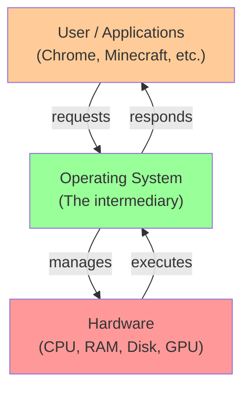
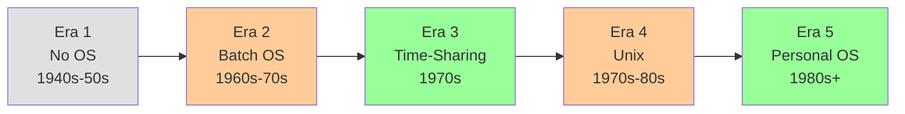
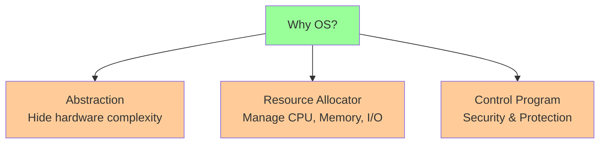
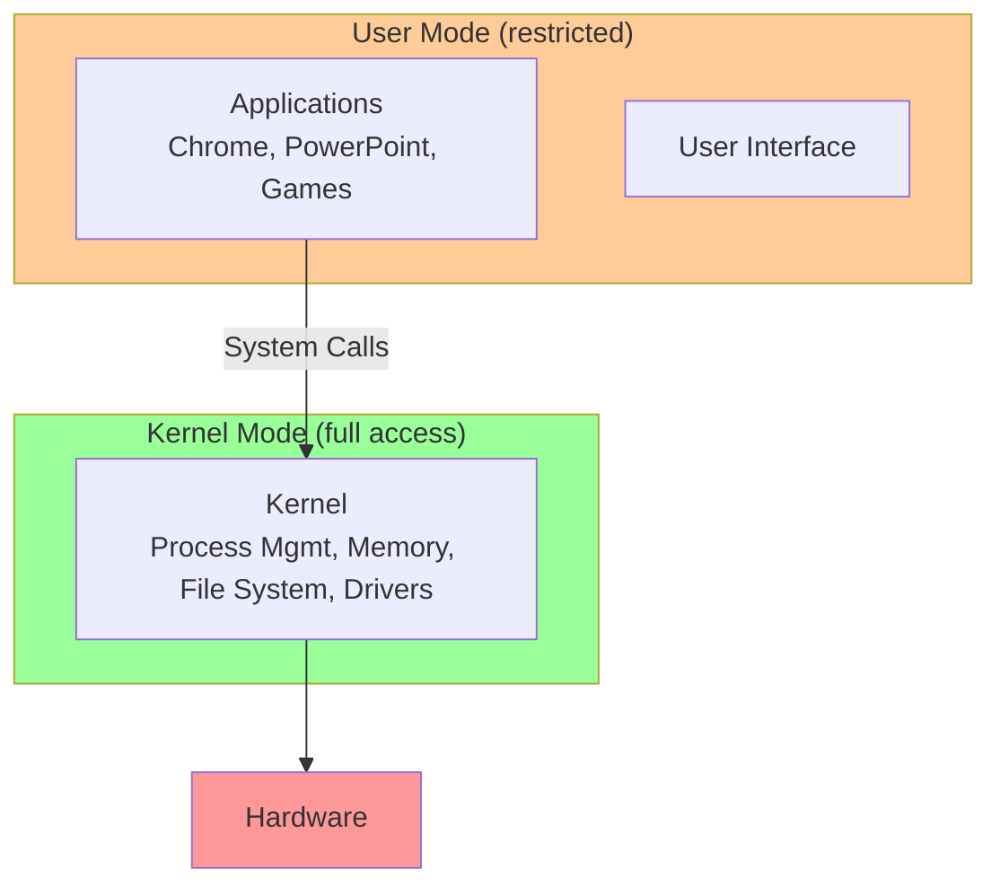
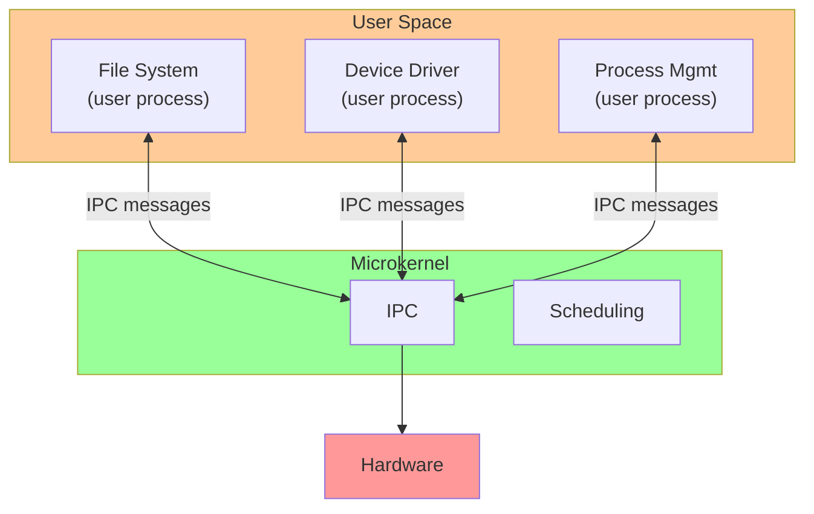
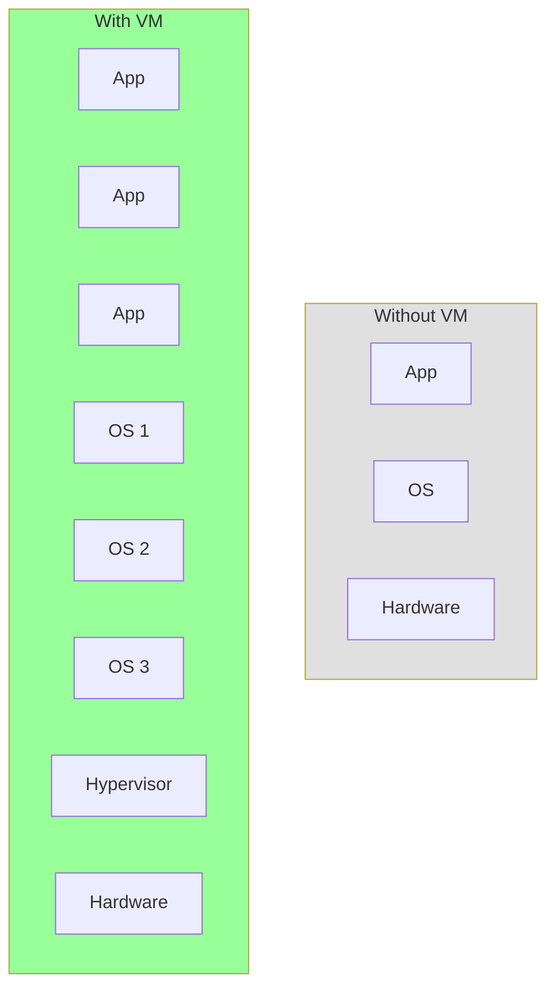
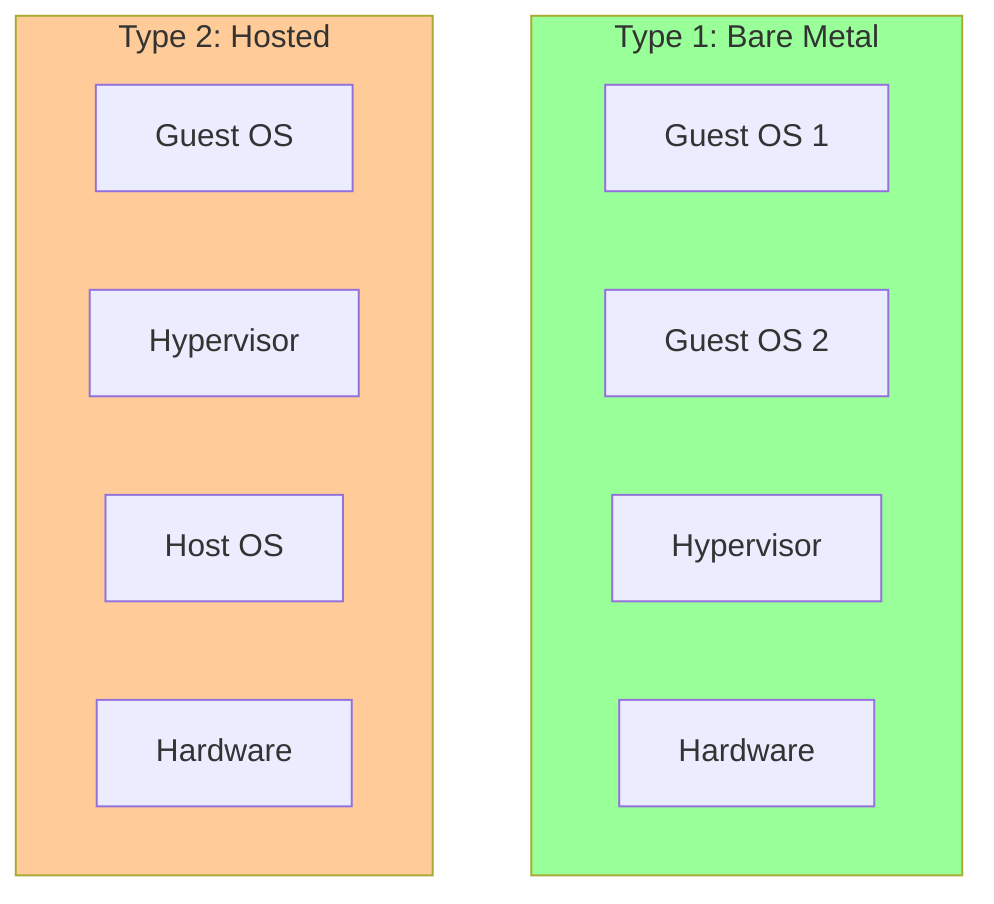
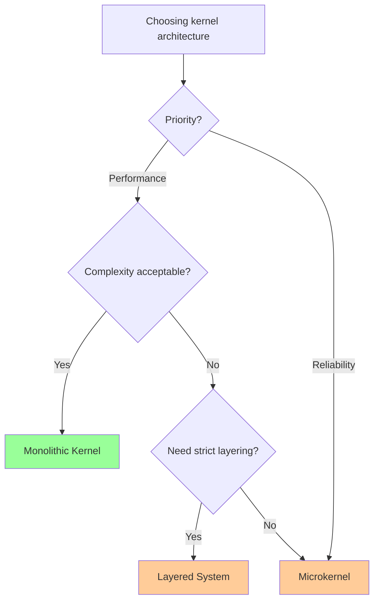

# 📘 L1: Introduction to Operating Systems

> [!abstract] Lecture Goal
> Understand what an Operating System is, why it exists, how it evolved, and the different structures it can take (monolithic, microkernel, etc.). Grasp the motivations: abstraction, resource allocation, and control.

> [!tip] The Big Picture
> The OS is the intermediary between users/applications and hardware. Everything we do on a computer — running programs, reading files, browsing the web — goes through the OS. It's the foundation of all software.

---

## 1. What is an Operating System?

### 🧠 Core Concept

An **Operating System (OS)** is a program that acts as an **intermediary** between the computer user (or application programs) and the computer hardware.

> _An OS is system software that manages computer hardware and software resources, and provides common services for computer programs._

Think of the OS as the **"manager"** of a restaurant:

| Restaurant Analogy | Computing Reality |
| :--- | :--- |
| **Kitchen** | Hardware (CPU, memory, disk) |
| **Waiters** | OS (serves requests, manages resources) |
| **Customers** | Users / Application programs |



| Platform | Examples |
| :--- | :--- |
| **PC** | Windows 11/10, macOS, Ubuntu, Debian |
| **Smartphone** | iOS, Android |
| **Game Consoles** | PS5, Xbox, Nintendo Switch |
| **Smart Appliances** | Smart TV OS, WatchOS |

---

### ⚠️ Common Pitfalls

> [!danger] Pitfall: OS ≠ Desktop/GUI
> The GUI (desktop) is just _one component_ on top of the OS. The OS itself is much deeper — it includes the kernel, device drivers, system calls, and more.

> [!danger] Pitfall: "Windows" is a product, not just the OS
> Windows is a _product_ that _contains_ an OS. The actual OS is the kernel (e.g., Windows NT kernel).

---

### ❓ Mock Exam Questions

> [!question] Q1: OS Definition
> Define an Operating System in your own words. Why is "the desktop you see when you boot up" an incomplete definition?
> <details><summary>Answer</summary>
>
> **Answer:**
> An OS is system software that manages hardware and software resources, and provides common services for programs. The desktop/GUI is just one visible component — the OS also includes the kernel, device drivers, system libraries, and system calls that operate invisibly beneath.
> </details>

> [!question] Q2: Layered Model
> In the three-layer model (User / OS / Hardware), what does each layer represent?
> <details><summary>Answer</summary>
>
> **Answer:**
> - **User**: Humans or application programs (Chrome, games)
> - **OS**: The intermediary that manages resources and provides services
> - **Hardware**: Physical components (CPU, RAM, disk, GPU)
> </details>

---

## 2. Brief History of OS

### 🧠 Core Concept

The OS co-evolved with **hardware capabilities** and **user needs**:



#### Era 1 — No OS (1940s–1950s)

- Machines: ENIAC, Harvard Mark I
- Programs controlled by **physical cables, switches, or punched paper tape**
- **No OS layer** — programs interact directly with hardware

| ✅ Advantage | ❌ Disadvantage |
| :--- | :--- |
| Minimal overhead | Not portable |
| | Inefficient use of computer |

#### Era 2 — Batch OS (1960s–70s, Mainframes)

- Machines: IBM 360
- Programs submitted on **punch cards / magnetic tape**
- OS runs one job at a time (load → execute → collect result)

**Problem:** CPU sits **idle** during I/O — massive waste!

**Solution:** **Multiprogramming** — load multiple jobs, switch when one does I/O.

#### Era 3 — Time-Sharing OS (1970s)

- Allow **multiple users** to interact via terminals simultaneously
- Key concept: **Illusion of Concurrency** — CPU switches so fast each user feels they have the whole machine

$$T_{switch} \ll T_{perception}$$

#### Era 4 — Minicomputer + Unix (1970s–80s)

- Smaller, cheaper machines (DEC PDP-11)
- **Unix** created by Ken Thompson, Dennis Ritchie, et al. at AT&T
- Same team invented **C** — the language used to write most OSes!

#### Era 5 — Personal Computer (1980s–present)

- **Apple II**: First mass-market home computer
- **IBM PC**: Generic PC → standardized hardware → MS-DOS then Windows dominates

---

### ⚠️ Common Pitfalls

> [!danger] Pitfall: Multiprogramming ≠ Multitasking
> **Multiprogramming** = keeping CPU busy by switching when I/O occurs. **Multitasking** = rapid switching based on time slices even without I/O.

> [!danger] Pitfall: Time-sharing ≠ Simultaneous execution
> Programs _appear_ to run simultaneously but only one uses the CPU at any instant (on a single-core machine).

---

### ❓ Mock Exam Questions

> [!question] Q3: Batch Processing Inefficiency
> Why was simple batch processing considered inefficient? What improvement addressed this?
> <details><summary>Answer</summary>
>
> **Answer:**
> In batch processing, the CPU sits idle during I/O operations — wasted time. **Multiprogramming** addressed this by loading multiple jobs; when one waits for I/O, another runs.
> </details>

> [!question] Q4: Illusion of Concurrency
> What is the "illusion of concurrency" in a time-sharing OS? How is it achieved?
> <details><summary>Answer</summary>
>
> **Answer:**
> The OS switches between programs so rapidly that each user perceives instant, uninterrupted access. Achieved by giving each program tiny time slices (e.g., 10ms) — far below human perception (~200ms).
> </details>

> [!question] Q5: Unix Significance
> Who created Unix, and what other major computing invention did the same team produce?
> <details><summary>Answer</summary>
>
> **Answer:**
> Ken Thompson, Dennis Ritchie, and team at AT&T created Unix. They also invented **C**, the language used to write most operating systems.
> </details>

---

## 3. Motivations for OS

### 🧠 Core Concept

Why do we need an OS? Three core motivations:

| Motivation | OS Role | Key Benefit |
| :--- | :--- | :--- |
| **Abstraction** | Hides hardware complexity | Portability, programmability |
| **Resource Allocation** | Manages CPU/memory/I/O | Efficiency, fairness |
| **Control Program** | Enforces usage policies | Security, protection |

#### Motivation 1 — Abstraction

Hardware varies wildly. The OS:

- **Hides** low-level, messy hardware details
- **Exposes** clean, uniform high-level interfaces

```
Without OS:  App → talks to specific Seagate HDD directly 😰
With OS:     App → calls read(file) → OS handles the rest ✅
```

**Benefits:** Efficiency, Programmability, Portability

#### Motivation 2 — Resource Allocator

Programs need CPU time, memory, I/O. Without coordination, chaos ensues.

The OS:
- Manages: CPU, Memory, I/O devices
- Arbitrates conflicting requests
- Goal: **Efficient and fair** use of resources

#### Motivation 3 — Control Program

Programs can misuse the computer — accidentally (bugs) or maliciously (malware).

The OS:
- Controls execution of programs
- Prevents errors and improper use
- Provides **security and protection**



---

### ⚠️ Common Pitfalls

> [!danger] Pitfall: Abstraction doesn't mean hiding everything
> Advanced programmers can still access lower-level features. The OS _provides the option_ to use abstraction.

> [!danger] Pitfall: Resource allocation ≠ just sharing
> It also involves **scheduling** (who gets CPU next?) and **isolation** (preventing one program from using another's memory).

---

### ❓ Mock Exam Questions

> [!question] Q6: OS as Abstraction Layer
> Explain how the OS serves as an "abstraction layer." Use a hard disk as your example.
> <details><summary>Answer</summary>
>
> **Answer:**
> Different disks have different interfaces, speeds, and geometries. The OS hides these details behind a uniform interface — `read()` and `write()` work the same regardless of whether the disk is a Seagate HDD, Samsung SSD, or NVMe drive. Programmers don't need to know disk-specific commands.
> </details>

> [!question] Q7: Resource Arbitration
> Why is it necessary for the OS to arbitrate resource requests? What could go wrong without it?
> <details><summary>Answer</summary>
>
> **Answer:**
> Without arbitration, multiple programs could simultaneously try to access the same resource (e.g., write to the same memory location or disk block), causing data corruption, crashes, or security violations. The OS ensures orderly, safe access.
> </details>

---

## 4. Overview of Modern OSes

### 🧠 Core Concept

| Family | Examples | Key Characteristics |
| :--- | :--- | :--- |
| **PC OS** | Windows 11, macOS, Ubuntu | Multitasking, multi-user capable, GUI |
| **Mobile OS** | iOS, Android | Touch-optimized, cellular, battery-aware |
| **Real-Time OS** | freeRTOS | Hard timing guarantees, critical systems |
| **Embedded OS** | Raspberry Pi OS | Limited resources, often stored in ROM |

#### Real-Time OS — Hard vs. Soft

| Type | Definition | Example |
| :--- | :--- | :--- |
| **Hard real-time** | Deadlines **must** be met | Aircraft autopilot, nuclear plant control |
| **Soft real-time** | Deadlines preferred, but missing some is tolerable | Video streaming (dropped frames) |

#### Modern OS Families

| Family | Kernel Type | Characteristics |
| :--- | :--- | :--- |
| **Windows** | Proprietary (NT kernel) | ~40M lines of code, mostly Intel/AMD |
| **Unix/Linux** | Open-source | POSIX-compliant, runs on almost any architecture |
| **macOS** | BSD + Mach microkernel | Apple proprietary layers on Unix base |

---

### ⚠️ Common Pitfalls

> [!danger] Pitfall: Linux ≠ Ubuntu
> **Linux** is a **kernel**. **Ubuntu** is a **distribution** — a bundle of the Linux kernel + software + tools. Android is also built on the Linux kernel.

> [!danger] Pitfall: Real-time ≠ fast
> A real-time OS guarantees **timing predictability**, not necessarily fastest execution. A slow but guaranteed response is more valuable than a fast but unpredictable one.

---

### ❓ Mock Exam Questions

> [!question] Q8: Hard vs Soft Real-Time
> What is the difference between a "hard" real-time OS and a "soft" real-time OS? Give a concrete example of each.
> <details><summary>Answer</summary>
>
> **Answer:**
> - **Hard real-time**: Missing a deadline = catastrophic failure (e.g., aircraft autopilot, medical ventilator)
> - **Soft real-time**: Missing a deadline is annoying but tolerable (e.g., video streaming, audio playback)
> </details>

> [!question] Q9: Linux vs Ubuntu
> What is the relationship between Linux and Ubuntu? Are they the same thing?
> <details><summary>Answer</summary>
>
> **Answer:**
> No. **Linux** is just the kernel. **Ubuntu** is a distribution — a complete package including the Linux kernel, system utilities, desktop environment, and package manager. Multiple distributions (Ubuntu, Fedora, Debian) all use the Linux kernel.
> </details>

---

## 5. OS Structures & Kernel Types

### 🧠 Core Concept

The **kernel** is the core of the OS — the part that runs in **kernel mode** with full hardware access. Everything else runs in **user mode** with restricted access.



#### Kernel Architecture Types

| Structure | Where Services Live | Performance | Robustness |
| :--- | :--- | :--- | :--- |
| **Monolithic** | All in kernel | 🟢 High | 🔴 Lower (bug = crash) |
| **Microkernel** | Mostly in user space | 🔴 Lower (IPC cost) | 🟢 Higher (isolation) |
| **Layered** | Layers in kernel | 🟡 Medium | 🟡 Medium |
| **Client-Server** | User-space servers | 🔴 Lower | 🟢 High |

#### Monolithic Kernel

All OS services run together in one large kernel program in kernel mode.

| ✅ Advantages | ❌ Disadvantages |
| :--- | :--- |
| Well understood | Highly coupled components |
| Good performance | Can become very complex |
| | Bug in one component crashes whole OS |

**Examples:** Most Unix variants, Windows NT/XP/10

#### Microkernel

Only **essential functions** live in the kernel. Everything else runs as user-space server processes.

- **Kernel provides:** IPC, basic scheduling, address space management
- **User-space services:** File system, device drivers, etc.



| ✅ Advantages | ❌ Disadvantages |
| :--- | :--- |
| More robust (isolated components) | Lower performance (IPC overhead) |
| More extensible | More complex communication |
| Better security isolation | |

---

### ⚠️ Common Pitfalls

> [!danger] Pitfall: Kernel ≠ OS
> The kernel is the _core_ of the OS, not the whole thing. The OS includes the kernel plus system libraries, user interfaces, etc.

> [!danger] Pitfall: Monolithic ≠ unorganized
> A monolithic kernel can have good internal structure — it just all runs in kernel mode.

> [!danger] Pitfall: Microkernel performance cost
> The main cost is **IPC (message passing)** between services. Every file system call goes through the kernel's IPC mechanism — extra overhead.

---

### ❓ Mock Exam Questions

> [!question] Q10: Kernel Mode vs User Mode
> What is the difference between kernel mode and user mode? Why is this distinction important?
> <details><summary>Answer</summary>
>
> **Answer:**
> - **Kernel mode**: Full access to hardware and all memory. Used by the OS kernel.
> - **User mode**: Restricted access. Used by applications.
>
> This distinction is crucial for **security and stability** — a buggy or malicious application cannot directly crash the system or access another program's memory.
> </details>

> [!question] Q11: Monolithic vs Microkernel
> Compare monolithic and microkernel architectures. When would you prefer each?
> <details><summary>Answer</summary>
>
> **Answer:**
> - **Monolithic**: Better performance. Use when speed is critical and reliability can be managed (desktop OS, servers).
> - **Microkernel**: Better robustness and isolation. Use when reliability is critical (embedded systems, medical devices, safety-critical applications).
> </details>

> [!question] Q12: Driver Bug Scenario
> A device driver has a memory corruption bug. Compare consequences in monolithic vs. microkernel architectures.
> <details><summary>Answer</summary>
>
> **Answer:**
> - **Monolithic**: Driver runs in kernel space. Memory corruption can overwrite any OS memory → **kernel panic / system crash** (Blue Screen of Death).
> - **Microkernel**: Driver runs in user space. Corruption is contained within that process. The kernel can kill and restart the driver → **system survives**.
> </details>

---

## 6. Virtual Machines

### 🧠 Core Concept

**Problem:** An OS assumes total control of hardware. What if you want to run **multiple OSes simultaneously**?

**Solution:** **Virtual Machines (VMs)** — software emulation of hardware that provides the illusion of a complete physical machine to a guest OS.



#### Hypervisor Types

| Type | Runs Where | Performance | Use Case |
| :--- | :--- | :--- | :--- |
| **Type 1 (Bare Metal)** | Directly on hardware | 🟢 Higher | Enterprise/cloud (VMware ESXi) |
| **Type 2 (Hosted)** | Inside a host OS | 🔴 Lower | Development (VirtualBox, VMware Workstation) |



#### Why VMs are Useful

| Use Case | Explanation |
| :--- | :--- |
| **Cloud Computing (IaaS)** | Run multiple isolated OSes on one physical server |
| **OS Development** | Test destructive code without harming the real machine |
| **Sandboxing** | Run untrusted software in isolation |
| **Legacy Software** | Run old OSes on modern hardware |
| **Cross-platform Testing** | Test Linux apps while running Windows |

---

### ⚠️ Common Pitfalls

> [!danger] Pitfall: Type 1 vs Type 2 confusion
> Type 1 sits directly on hardware (no host OS). Type 2 sits on top of an existing OS. This is a common exam trap!

> [!danger] Pitfall: VM ≠ Container
> **Docker containers** share the host OS kernel. **VMs** have their own full OS. VMs are heavier but provide stronger isolation.

> [!danger] Pitfall: VM overhead
> Hardware access must be mediated by the hypervisor. Type 1 has less overhead than Type 2 (which has two OS layers).

---

### ❓ Mock Exam Questions

> [!question] Q13: Virtual Machine Purpose
> What is a Virtual Machine, and what problem does it solve?
> <details><summary>Answer</summary>
>
> **Answer:**
> A VM is a software emulation of hardware that lets a guest OS run as if it had its own physical machine. It solves the problem of running multiple OSes simultaneously on a single physical machine, providing isolation between them.
> </details>

> [!question] Q14: Hypervisor Types
> Describe the difference between Type 1 and Type 2 hypervisors.
> <details><summary>Answer</summary>
>
> **Answer:**
> - **Type 1 (Bare Metal)**: Runs directly on hardware with no host OS. Higher performance. Used in cloud/enterprise.
> - **Type 2 (Hosted)**: Runs as an application inside a host OS. Lower performance but easier to set up. Used for development.
> </details>

> [!question] Q15: OS Development Safety
> You are writing a kernel that may corrupt all memory. Compare running on bare metal vs. in a Type 2 VM.
> <details><summary>Answer</summary>
>
> **Answer:**
> - **Bare metal**: Memory corruption crashes the physical machine, potentially corrupts disk. Recovery requires reboot or reinstall.
> - **Type 2 VM**: Corruption is contained within the VM's allocated memory. The host OS and real files are protected. Just reset the VM and try again.
> </details>

---

## 7. Summary

### 📊 Key Concepts

| Concept | Definition |
| :--- | :--- |
| **Operating System** | Intermediary between users/applications and hardware |
| **Kernel** | Core of OS; runs in kernel mode with full hardware access |
| **System Call** | Mechanism for user programs to request OS services |
| **Abstraction** | Hiding hardware complexity behind uniform interfaces |
| **Resource Allocation** | Managing CPU, memory, I/O among competing programs |
| **Control Program** | Enforcing security and protection policies |
| **Virtual Machine** | Software emulation of hardware for running multiple OSes |

---

### 🎯 Kernel Architecture Decision Guide



---

## 🔗 Connections

| 📚 Lecture | 🔗 Connection |
| :--- | :--- |
| [[L2]] | Process abstraction — the OS's main unit of execution |
| [[L3]] | Process scheduling — how the OS decides which process runs |
| [[L4]] | IPC — how processes communicate |
| [[L5]] | Threads — lightweight processes sharing memory context |

> [!quote] The Key Insight
> The OS exists to make computers **usable**, **efficient**, and **secure**. By abstracting hardware, allocating resources fairly, and controlling program execution, the OS transforms raw hardware into a platform for applications — and the kernel is the trusted core that makes it all possible.