# 📁 L10: File System Management

> [!abstract] Lecture Goal
> Understand how the file system provides persistent storage abstraction, how files are organized and accessed, and the mechanisms for directory structures and file sharing.

> [!tip] The Big Picture
> The file system is the **interface between users and persistent storage**. It abstracts away the complexity of raw disk I/O, providing a logical view of data as files organized in directories. The FS must be **self-contained**, **persistent**, and **efficient** — ensuring data survives reboots, works across machines, and minimizes wasted space.

---

## 1. File System: Motivation & Criteria

### 🤔 The Core Problem

Physical memory (RAM) is **volatile** — it loses all data when power is cut. We need a way to store information permanently on external storage (e.g., hard disks, SSDs).

A **File System (FS)** is an abstraction layer that sits between your programs and the raw physical storage hardware. It provides a standardized way to store, retrieve, and manage data persistently.

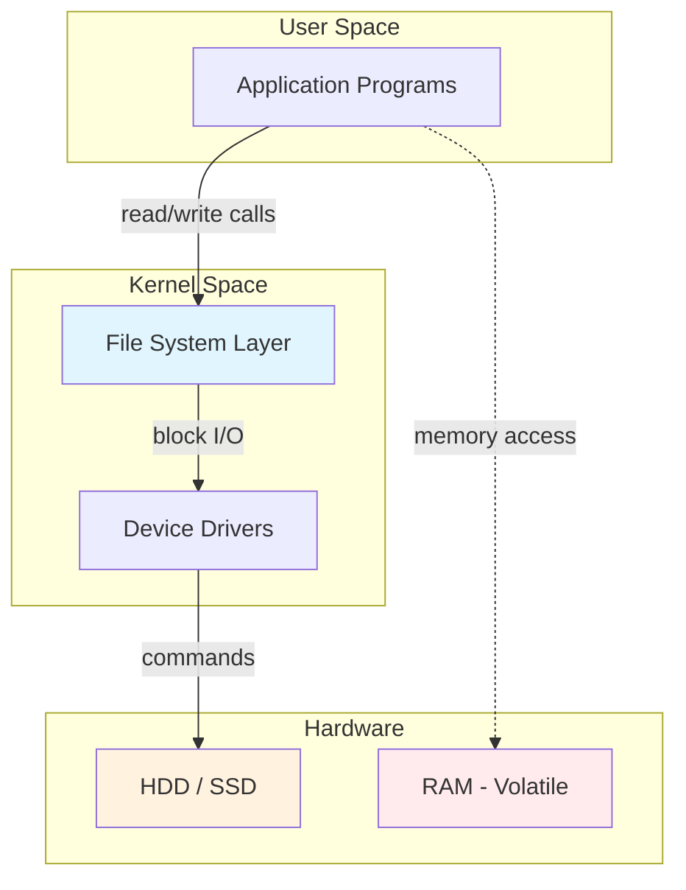

### ✅ Three General Criteria

A well-designed file system must satisfy:

| Criterion | Meaning |
| :--- | :--- |
| **Self-Contained** | The storage medium carries enough information to fully describe itself — plug it into any machine and it works |
| **Persistent** | Data survives beyond OS reboots and process termination |
| **Efficient** | Minimizes wasted space and overhead for bookkeeping; manages free vs. used space well |

**Additional FS responsibilities:**

- **Abstraction** over hardware specifics (you don't care if it's HDD or SSD)
- **Resource management** (tracking disk space usage)
- **Protection** (preventing unauthorized access)
- **Sharing** (allowing multiple processes/users to access files)

---

### 📚 Key Terminology

| Term | Definition |
| :--- | :--- |
| **File System (FS)** | OS component that manages persistent storage |
| **Self-Contained** | FS metadata is stored on the media itself, not in the OS |
| **Persistent Storage** | Storage that retains data without power (disk, SSD, tape) |
| **Volatile Storage** | Storage that loses data without power (RAM) |

---

### ⚠️ Common Pitfalls

> [!danger] Pitfall 1: Confusing "persistent" with "backed up"
> Persistence means data survives power-off. It does **not** protect against deletion, corruption, or hardware failure. Backups are separate.

> [!danger] Pitfall 2: Thinking FS info is in the OS
> The FS being "self-contained" means the **media itself** holds the structural info. This is why a USB drive works on any computer with the same FS type.

---

### ❓ Mock Exam Questions

> [!question] Q1: FS Criteria
> Which of the following is NOT a general criterion of a file system?
> <details><summary>Answer</summary>
>
> **Answer: Real-Time**
>
> The three general criteria are Self-Contained, Persistent, and Efficient. File I/O times are variable and generally not guaranteed to be real-time.
> </details>

> [!question] Q2: Self-Contained Meaning
> What does it mean for a file system to be "self-contained"?
> <details><summary>Answer</summary>
>
> **Answer: The storage medium carries enough metadata to fully describe itself**
>
> A self-contained FS can be plugged into any compatible machine and work without needing external configuration.
> </details>

---

## 2. Memory Management vs File Management

### 📊 The Comparison

These two systems both manage storage, but are fundamentally different:

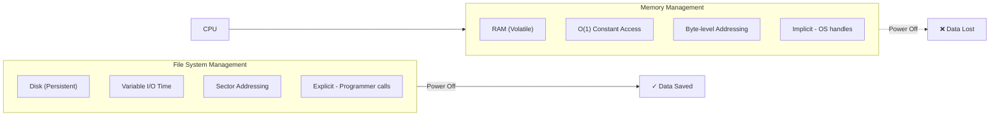

| Property | Memory Management | File System Management |
| :--- | :--- | :--- |
| **Underlying Storage** | RAM | Disk |
| **Access Speed** | Constant $O(1)$ | Variable disk I/O time |
| **Unit of Addressing** | Physical memory address (byte-level) | Disk sector |
| **Usage** | Address space for running processes (implicit) | Non-volatile data (explicit access) |
| **Organization** | Paging / Segmentation (HW & OS) | Many formats: ext4, FAT32, HFS+ |

> [!example] Key Formula Insight
> **Paging:** $\text{Physical Address} = \text{Frame Number} \times \text{Page Size} + \text{Offset}$
>
> **Fixed Records:** $\text{Record Offset} = \text{Record Size} \times (N - 1)$

---

### 📚 Key Terminology

| Term | Definition |
| :--- | :--- |
| **Implicit Access** | OS handles memory management automatically when process runs |
| **Explicit Access** | Programmer must call `open()`, `read()`, `write()` for file access |
| **Sector** | Minimum disk I/O unit (typically 512 bytes or 4 KiB) |

---

### ⚠️ Common Pitfalls

> [!danger] Pitfall 1: Confusing access models
> Memory management is **implicit** — the OS handles it when a process runs. File access is **explicit** — your program must call specific functions.

> [!danger] Pitfall 2: Mixing up addressing units
> RAM uses **byte-level** addresses; disks use **sectors** (typically 512 bytes or 4 KiB). The unit of addressing differs.

---

## 3. File: Basic Description & Metadata

### 📄 What is a File?

A **file** is a logical unit of information created by a process. It is an **Abstract Data Type (ADT)** — it defines operations while hiding implementation details.

Every file has two components:

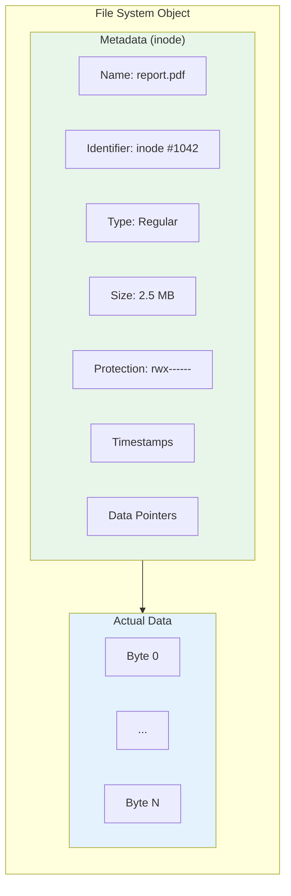

### 📋 Key Metadata Fields

| Field | Description |
| :--- | :--- |
| **Name** | Human-readable label (e.g., `report.pdf`) |
| **Identifier** | Internal unique ID used by the FS (inode number) |
| **Type** | e.g., executable, text, directory |
| **Size** | In bytes, words, or blocks |
| **Protection** | Read/Write/Execute permissions per user class |
| **Time/Date/Owner** | Creation time, last modified, owner ID |
| **Table of Contents** | Info the FS needs to locate actual data on disk |

### 📝 File Naming Rules (vary by FS)

- Maximum length of name
- Case sensitivity (Linux: `File.txt` ≠ `file.txt`; Windows: same)
- Allowed special characters
- Extension rules (e.g., `.txt`, `.exe`)

---

### 📚 Key Terminology

| Term | Definition |
| :--- | :--- |
| **File** | Logical unit of information; an ADT for persistent storage |
| **Metadata** | "Data about data" — attributes describing a file |
| **Inode** | Unix data structure holding file metadata (except name) |
| **File Identifier** | Unique internal number used by the FS |

---

### ⚠️ Common Pitfalls

> [!danger] Pitfall 1: Confusing name with identifier
> The **name** is for humans; the **identifier** (inode) is for the FS. Changing the name does NOT change the identifier.

> [!danger] Pitfall 2: Metadata is not file data
> Metadata **describes** the file. It's stored separately from the file's actual content.

> [!danger] Pitfall 3: Extension changing file type (Windows)
> On Windows, changing the **file extension** tells the OS to treat the file as a different type — even if the actual content hasn't changed!

---

### ❓ Mock Exam Questions

> [!question] Q1: Inode vs Name
> What happens to a file's inode number when you rename the file?
> <details><summary>Answer</summary>
>
> **Answer: It stays the same**
>
> The inode is the internal identifier; renaming only changes the human-readable name in the directory entry.
> </details>

---

## 4. File Types & Protection

### 📂 File Types

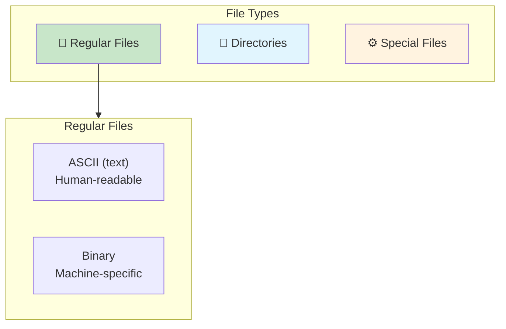

| Type | Description | Examples |
| :--- | :--- | :--- |
| **Regular files** | User data | `.txt`, `.mp3`, `.jpg`, `.exe` |
| **Directories** | FS structure files | Folders |
| **Special files** | Character/block device files | `/dev/sda` in Unix |

### 🔍 How OS Knows File Type

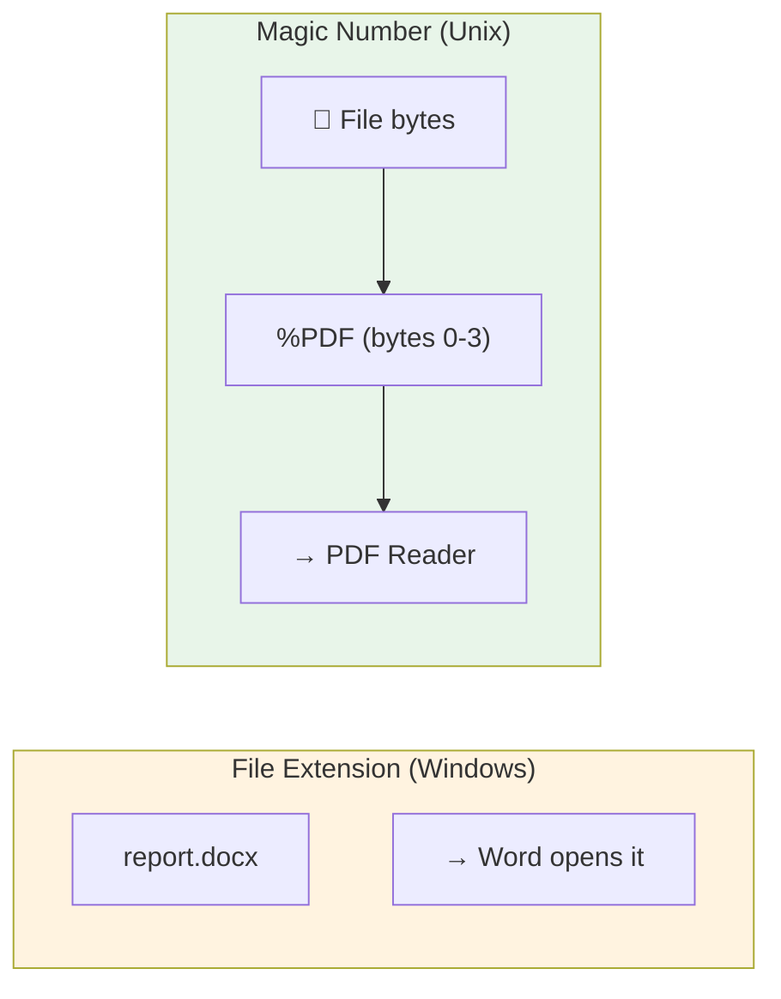

- **File Extension** (Windows): `report.docx` → Word document. ⚠️ Renaming extension changes how OS treats it!
- **Magic Number** (Unix): Special bytes at file beginning identify type. Example: PDF files start with `%PDF`.

### 🔐 Unix Permission Model

Users are classified into 3 classes:

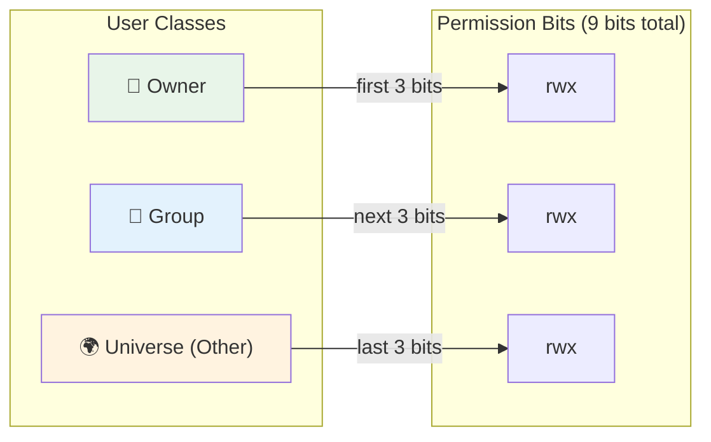

| Access Type | Meaning |
| :--- | :--- |
| **Read** | Retrieve file content |
| **Write** | Modify file content |
| **Execute** | Load into memory and run |
| **Append** | Add to the end |
| **Delete** | Remove from FS |
| **List** | Read file metadata |

> [!example] `ls -l` Output
> ```
> -rw------- 1 axgopala axgopala 14 Mar 13 19:00 test
> ```
> Owner: Read+Write, Group: no access, Universe: no access

### 📋 Access Control List (ACL)

- **Minimal ACL**: Same as the 9 permission bits above
- **Extended ACL**: Adds named individual users or groups (granular control)

---

### 📚 Key Terminology

| Term | Definition |
| :--- | :--- |
| **Magic Number** | Special bytes at file start identifying type (Unix) |
| **File Extension** | Suffix indicating file type (Windows) |
| **ACL** | Access Control List — fine-grained permission specification |

---

### ⚠️ Common Pitfalls

> [!danger] Pitfall 1: Magic numbers beat extensions (Unix)
> Unix determines type from the file's internal bytes, not the name. You can name a shell script `.txt` and it will still be identified correctly.

> [!danger] Pitfall 2: Execute bit on directories
> The **execute** bit on a **directory** means "can traverse/enter this directory" — NOT run it as a program!

> [!danger] Pitfall 3: Permission checking order
> Permissions are checked in order: Owner → Group → Universe. If you're the owner, **only owner bits apply**, even if universe has more permissions.

---

### ❓ Mock Exam Questions

> [!question] Q1: Execute on Directory
> What does execute permission mean on a directory?
> <details><summary>Answer</summary>
>
> **Answer: Can traverse/enter the directory**
>
> Execute on a directory allows you to pass through it, not run it as a program.
> </details>

> [!question] Q2: Permission Checking
> If owner has `r--` and universe has `rwx`, what can the owner do?
> <details><summary>Answer</summary>
>
> **Answer: Read only**
>
> Permission is checked in order (Owner → Group → Universe). As owner, only owner permissions apply.
> </details>

---

## 5. File Data: Structure & Access Methods

### 📦 File Data Structures

| Structure | Description | Pros/Cons |
| :--- | :--- | :--- |
| **Array of bytes** | Each byte has unique offset from file start | Simple, flexible; used by Unix/Windows |
| **Fixed-length records** | Array of equal-size records | Fast random access via formula |
| **Variable-length records** | Records differ in size | Flexible, but hard to locate specific record |

For fixed-length records: $\text{Offset of Record } N = \text{Record Size} \times (N - 1)$

### 🎯 File Access Methods

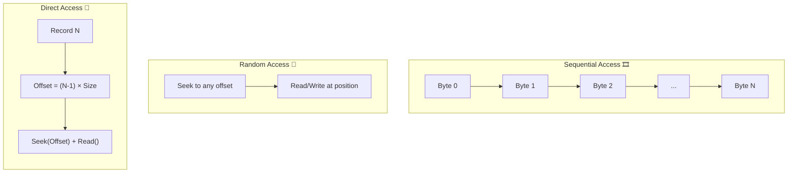

| Method | Description | Use Case |
| :--- | :--- | :--- |
| **Sequential** | Read in order from beginning | Playing a podcast, processing logs |
| **Random** | Read at any position via seek | Jumping to any song in playlist |
| **Direct** | Jump to fixed-length record N | Database accessing employee record #5000 |

---

### 📚 Key Terminology

| Term | Definition |
| :--- | :--- |
| **Sequential Access** | Must read data in order |
| **Random Access** | Can read at any position |
| **Direct Access** | Random access for fixed-length records using formula |
| **File Pointer** | Current position in file for next read/write |

---

### ⚠️ Common Pitfalls

> [!danger] Pitfall 1: Sequential ≠ Slow
> Sequential access means you must access data **in order** — it's a constraint, not a speed characteristic.

> [!danger] Pitfall 2: Direct access needs fixed records
> Direct access requires **fixed-length records**. Variable-length records can't use the offset formula.

> [!danger] Pitfall 3: Seek doesn't read/write
> The `seek()` operation only moves the file pointer. Many students forget this.

---

### ❓ Mock Exam Questions

> [!question] Q1: Direct Access Requirement
> What is required for direct access to work?
> <details><summary>Answer</summary>
>
> **Answer: Fixed-length records**
>
> Only with fixed-length records can you compute the byte offset using a formula.
> </details>

> [!question] Q2: Seek Operation
> What does `seek()` do?
> <details><summary>Answer</summary>
>
> **Answer: Moves the file pointer to a specified position**
>
> `seek()` does NOT read or write — it only repositions for subsequent operations.
> </details>

---

## 6. File Operations as System Calls

### 🔄 System Call Flow

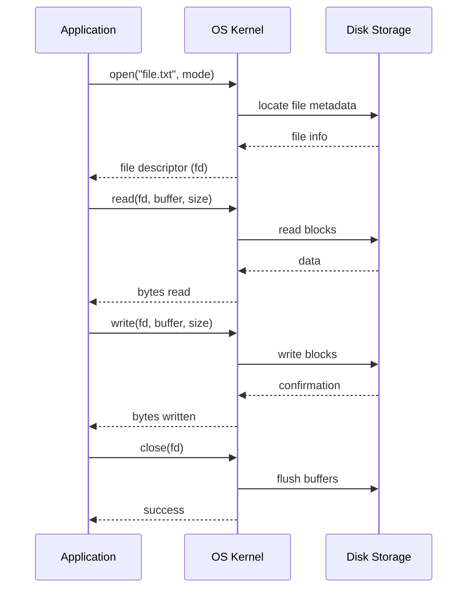

### 📋 Basic File Operations

| Operation | Description |
| :--- | :--- |
| **Create** | Allocates space, creates metadata entry |
| **Open** | Prepares file for operations; returns file descriptor |
| **Read** | Reads data from current file pointer position |
| **Write** | Writes data at current file pointer position |
| **Seek (Reposition)** | Moves file pointer; no actual I/O |
| **Truncate** | Removes data from position to end of file |
| **Close** | Releases file descriptor and data structures |

### 🗂️ Open-File Table Architecture

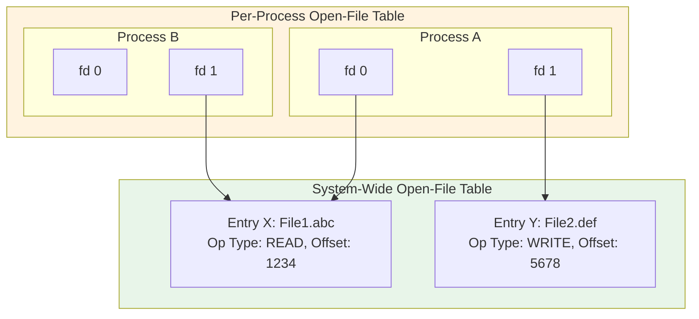

When a file is opened, the OS maintains:

- **File Pointer**: Current read/write position
- **Disk Location**: Where actual data lives
- **Open Count**: Number of processes with file open

### 🔗 File Sharing Cases

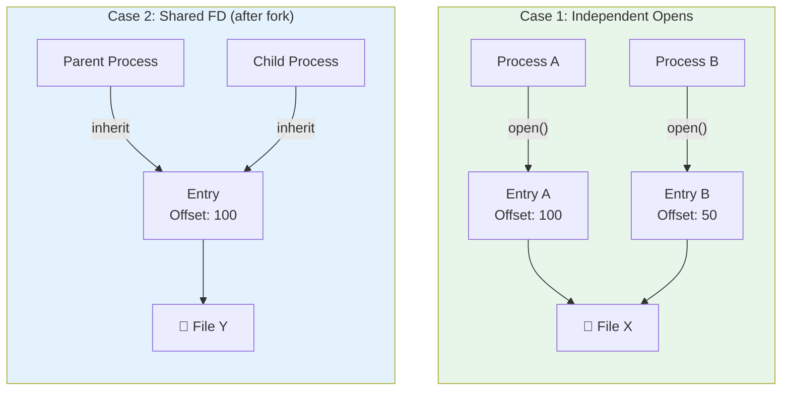

| Case | Description | Offset Sharing |
| :--- | :--- | :--- |
| **Case 1** | Two independent `open()` calls | Each has own offset |
| **Case 2** | Shared FD (e.g., after `fork()`) | Single shared offset |

---

### 📚 Key Terminology

| Term | Definition |
| :--- | :--- |
| **File Descriptor** | Integer returned by `open()`; used for subsequent operations |
| **Open-File Table** | OS data structure tracking open files |
| **lseek()** | Unix system call to move file pointer |

---

### ⚠️ Common Pitfalls

> [!danger] Pitfall 1: Forgetting to close
> Always `close()` when done. Leaking file descriptors can exhaust the OS limit on open files per process.

> [!danger] Pitfall 2: read() returning less than n
> `read()` returning fewer bytes doesn't mean error — it often means end-of-file was reached.

> [!danger] Pitfall 3: write() extends file
> `write()` can extend a file beyond its current size — it's not capped at existing length.

> [!danger] Pitfall 4: Fork sharing
> After `fork()`, parent and child share file offset. I/O by one moves the pointer for both!

---

### ❓ Mock Exam Questions

> [!question] Q1: Independent Opens
> In Unix, P1 and P2 both open the same file independently. P1 reads 100 bytes. What happens to P2's pointer?
> <details><summary>Answer</summary>
>
> **Answer: P2's pointer is unaffected**
>
> Independent `open()` calls create separate entries with independent offsets (Case 1).
> </details>

> [!question] Q2: Default File Descriptors
> What are the default file descriptors 0, 1, and 2?
> <details><summary>Answer</summary>
>
> **Answer: 0 = STDIN, 1 = STDOUT, 2 = STDERR**
>
> These are opened by convention for every process.
> </details>

---

## 7. Directory Structures

### 📁 Directory Purpose

A **directory** serves two purposes:

1. **Logical grouping** of files (user's perspective)
2. **File tracking** — mapping names to metadata (system's perspective)

### 🏗️ Directory Structure Types

#### 1. Single-Level Directory

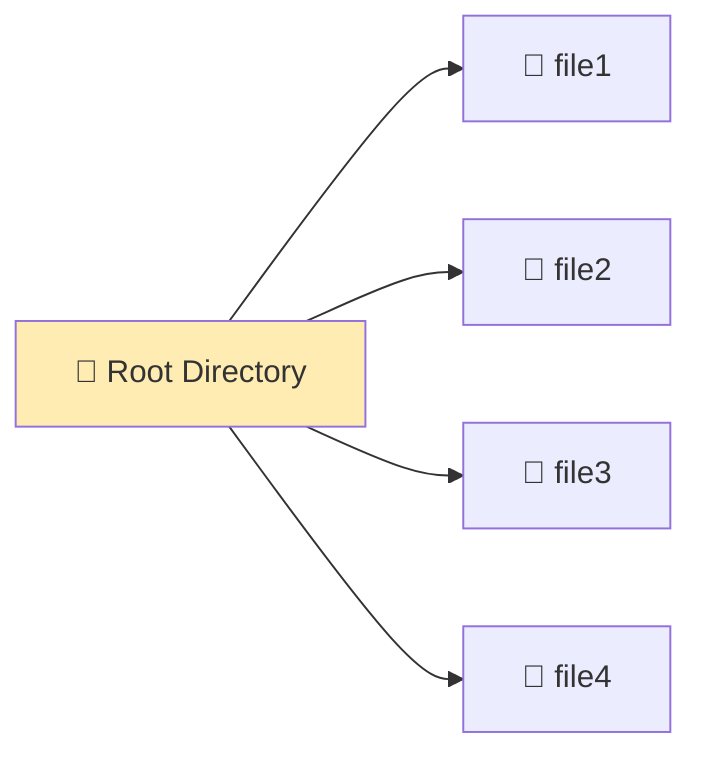

All files in **one flat directory**. Simple but problematic: name conflicts across users.

#### 2. Tree-Structured Directory 🌲

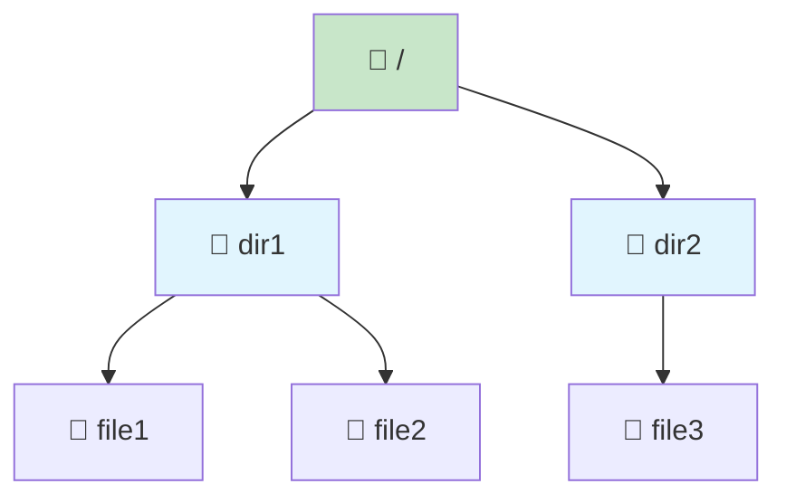

Directories can contain subdirectories forming a **hierarchy**.

- **Absolute pathname**: Full path from root `/ → dir1 → file1`
- **Relative pathname**: Path from Current Working Directory (CWD)

#### 3. DAG (Directed Acyclic Graph) 🔗

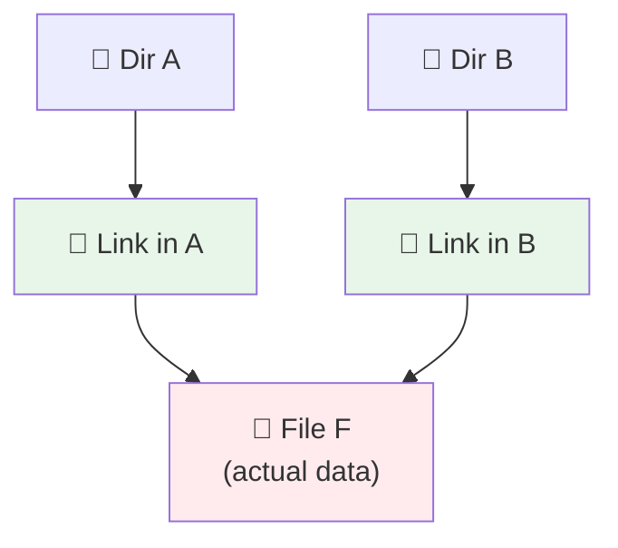

A file can appear in **multiple directories** (shared) with **only one copy** of actual data.

#### 4. General Graph 🔄

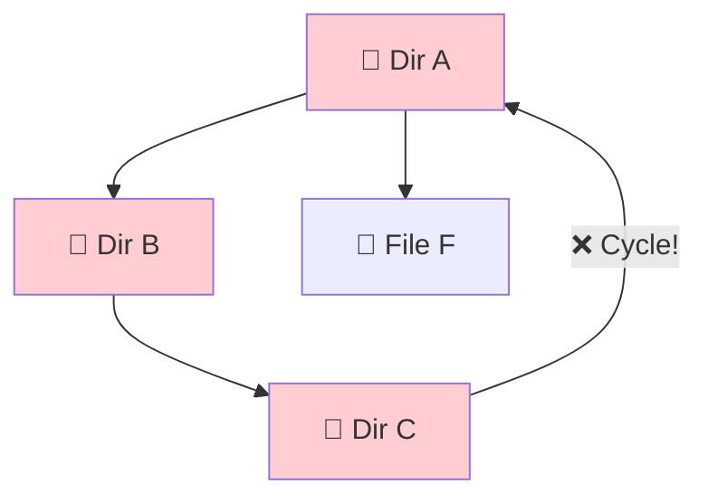

Allows **cycles** but is **not desirable**: infinite traversal loops, hard to know when files can be deleted.

### 🔗 Hard Link vs Symbolic Link

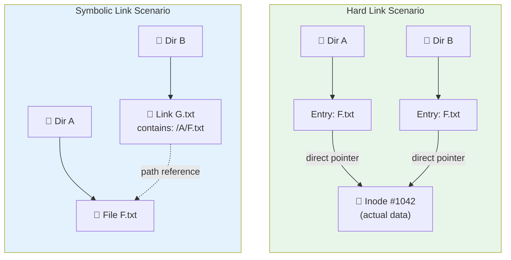

| Property | Hard Link | Symbolic Link |
| :--- | :--- | :--- |
| **What it is** | Direct pointer to inode | File containing path to target |
| **Works for** | Files only | Files AND directories |
| **If target deleted** | Data persists (other links valid) | Link becomes **dangling** |
| **Cross filesystem?** | ❌ No | ✅ Yes |
| **Unix command** | `ln` | `ln -s` |

---

### 📚 Key Terminology

| Term | Definition |
| :--- | :--- |
| **Hard Link** | Directory entry pointing directly to inode |
| **Symbolic Link** | Special file containing path to target |
| **Dangling Symlink** | Symbolic link pointing to non-existent file |
| **Link Count** | Number of hard links to an inode |

---

### ⚠️ Common Pitfalls

> [!danger] Pitfall 1: Hard links can't cross filesystems
> Hard links point to **inode numbers**, which are unique only within a filesystem. Symbolic links store paths, so they work across filesystems.

> [!danger] Pitfall 2: Hard links to directories
> Generally not allowed (except `.` and `..`) because they create cycles too easily.

> [!danger] Pitfall 3: Forgetting link count
> File data is only deleted when **link count reaches 0**. With hard links, deleting one link doesn't delete the data.

> [!danger] Pitfall 4: Counting hard-linked files
> When traversing directories, track **visited inodes** to avoid counting hard-linked files multiple times.

---

### ❓ Mock Exam Questions

> [!question] Q1: Hard Link After Deletion
> If a hard-linked file's original entry is deleted, what happens to the hard link?
> <details><summary>Answer</summary>
>
> **Answer: Hard link still works; data persists**
>
> Hard links point directly to the inode. As long as link count > 0, data remains.
> </details>

> [!question] Q2: Symbolic Link After Deletion
> If a symbolic link's target is deleted, what happens?
> <details><summary>Answer</summary>
>
> **Answer: Link becomes dangling (broken)**
>
> The symlink file still exists but points to a non-existent path.
> </details>

> [!question] Q3: Cross-Filesystem Links
> Why can't hard links cross filesystems?
> <details><summary>Answer</summary>
>
> **Answer: Inode numbers are unique only within a filesystem**
>
> Different filesystems have independent inode numbering, so inode #1042 on filesystem A is unrelated to #1042 on filesystem B.
> </details>

---

## 8. Practice Problems

### 📝 Problem 1: Record Offset Calculation

A file uses **fixed-length records** of size **256 bytes**. A program needs to read records 1, 5, and 10 (1-indexed).

**(a)** Calculate the byte offset for each record.

**(b)** Write `lseek()` and `read()` calls (pseudocode) to read each record.

**(c)** What problem arises with **variable-length records**?

<details><summary>Solution</summary>

**(a) Byte Offsets:**

Using $\text{Offset} = \text{Record Size} \times (N - 1)$:

| Record N | Calculation | Offset |
| :--- | :--- | :--- |
| 1 | $256 \times 0$ | **0 bytes** |
| 5 | $256 \times 4$ | **1024 bytes** |
| 10 | $256 \times 9$ | **2304 bytes** |

**(b) Pseudocode:**

```c
int fd = open("myfile.dat", O_RDONLY);
char buf[256];

lseek(fd, 0, SEEK_SET);
read(fd, buf, 256);    // Record 1

lseek(fd, 1024, SEEK_SET);
read(fd, buf, 256);    // Record 5

lseek(fd, 2304, SEEK_SET);
read(fd, buf, 256);    // Record 10

close(fd);
```

**(c) Variable-Length Problem:**

No formula exists to compute byte offset directly. You must **sequentially scan** through records 1-9 to find where record 10 begins. Direct access is impossible without additional indexing.
</details>

---

### 📝 Problem 2: Directory Sharing

- Alice owns `/home/alice/project/data.csv`
- Bob wants to share access from `/home/bob/shared/`

**(a)** How would Bob create a **hard link**? Effect on link count?

**(b)** Alice deletes her file. What happens to Bob's hard link?

**(c)** Instead, Bob creates a **symbolic link**. Alice deletes her file. What happens?

**(d)** Why can't Bob create a hard link if Alice's home is on a **different filesystem**?

<details><summary>Solution</summary>

**(a) Hard Link:**

```bash
ln /home/alice/project/data.csv /home/bob/shared/data.csv
```

Link count increments from 1 to **2**.

**(b) Alice Deletes (Hard Link):**

- Alice's directory entry removed
- Link count decrements to 1
- **File data persists** — Bob's link still works
- Data only deleted when link count = 0

**(c) Symbolic Link Scenario:**

- Bob's symlink is a **separate file** containing the path `/home/alice/project/data.csv`
- When Alice deletes, inode and data are removed
- Bob's symlink becomes a **dangling symlink**
- Accessing it returns "No such file or directory"

**(d) Different Filesystem:**

Hard links point to inode numbers, which are unique **only within a filesystem**. Different filesystems have independent inode numbering. The OS cannot resolve which inode on which device the link refers to. Symbolic links work because they store full paths that the OS can resolve.
</details>

---

## 🔗 Connections

| 📚 Lecture | 🔗 Connection |
| :--- | :--- |
| [[L6]] | File systems use locks/semaphores for concurrent access control |
| [[L7]] | Memory management provides the abstraction that file systems build upon |
| [[L9]] | Virtual memory page replacement algorithms inform file buffer cache policies |

> [!quote] The Key Insight
> A file system is the **contract between users and persistent storage**. It provides a logical view (files in directories) over physical reality (blocks on disk). The genius is making this abstraction **self-contained** (plug-and-play), **persistent** (survives reboots), and **efficient** (minimal overhead). When you understand that a file is just metadata pointing to data, and a directory is just a special file listing names → inodes, the whole system clicks into place. 💾