# 📚 L11: File System Implementations

> [!abstract] Lecture Goal
> Understand how file systems are implemented at the disk level, including block allocation schemes, free space management, and directory structures.

> [!tip] The Big Picture
> A file system bridges the **logical view** (files and folders) with the **physical reality** (disk blocks). The key challenge is mapping files to disk blocks efficiently — balancing speed, space utilization, and flexibility. Different allocation schemes (contiguous, linked, FAT, indexed) make different trade-offs, and understanding these is essential for systems programming.

---

## 1. Disk Organization

### 🤔 The Layered View

A disk is viewed differently at each layer:

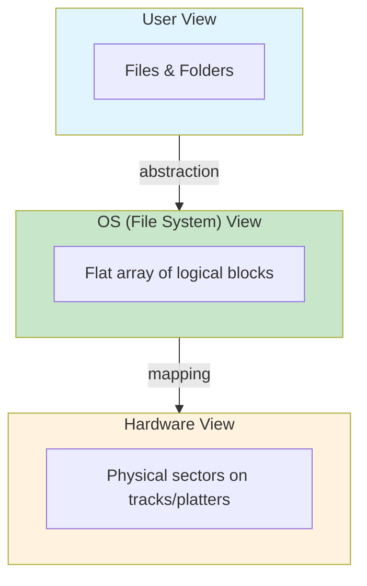

The disk is organized as a **1-D array of logical blocks**, where the block is the smallest accessible unit (typically 512 bytes to 4 KB).

### 📀 Disk Layout

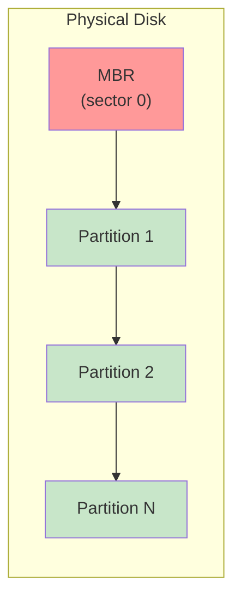

Each **partition** contains:

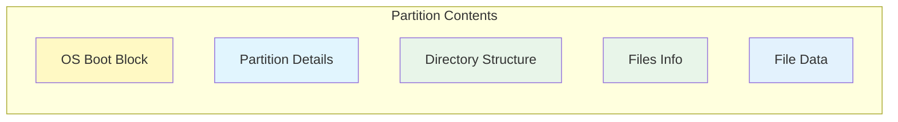

| Region | Purpose |
| :--- | :--- |
| **MBR (sector 0)** | Master Boot Record; partition table + boot code |
| **OS Boot Block** | Instructions to boot the OS on this partition |
| **Partition Details** | Total blocks, number/location of free blocks |
| **Directory Structure** | Maps file names to their information |
| **Files Info** | Metadata and block locations for each file |
| **File Data** | The actual file contents |

---

### 📚 Key Terminology

| Term | Definition |
| :--- | :--- |
| **Logical Block** | OS abstraction; smallest addressable unit in the FS |
| **Physical Sector** | Hardware-level storage unit on disk |
| **MBR** | Master Boot Record; first sector with partition table |
| **Partition** | Logical subdivision of a disk with its own FS |

---

### ⚠️ Common Pitfalls

> [!danger] Pitfall 1: Confusing logical blocks with physical sectors
> **Logical blocks** are an OS abstraction; **physical sectors** are hardware reality. The mapping between them is hardware-dependent.

> [!danger] Pitfall 2: MBR is global
> The **MBR** is global to the disk, while each **partition** has its own independent file system.

> [!danger] Pitfall 3: Internal fragmentation
> The last block of a file may be partially filled, wasting space (internal fragmentation).

---

### ❓ Mock Exam Questions

> [!question] Q1: Logical vs Physical
> What is the difference between a logical block and a disk sector?
> <details><summary>Answer</summary>
>
> **Answer: Logical blocks are OS abstractions; disk sectors are hardware units**
>
> A logical block is how the OS views storage (e.g., 4 KB blocks). A disk sector is the physical hardware unit (e.g., 512 bytes). Multiple sectors may map to one logical block.
> </details>

> [!question] Q2: Partition Contents
> What information is stored in the Partition Details region?
> <details><summary>Answer</summary>
>
> **Answer: Total blocks, number and location of free blocks**
>
> Partition Details contains metadata about the partition itself, not file contents.
> </details>

---

## 2. File Block Allocation Schemes

### 🎯 The Core Problem

Since a file is logically a collection of blocks, the OS must decide **how to allocate disk blocks to files**.

### 2a. Contiguous Allocation

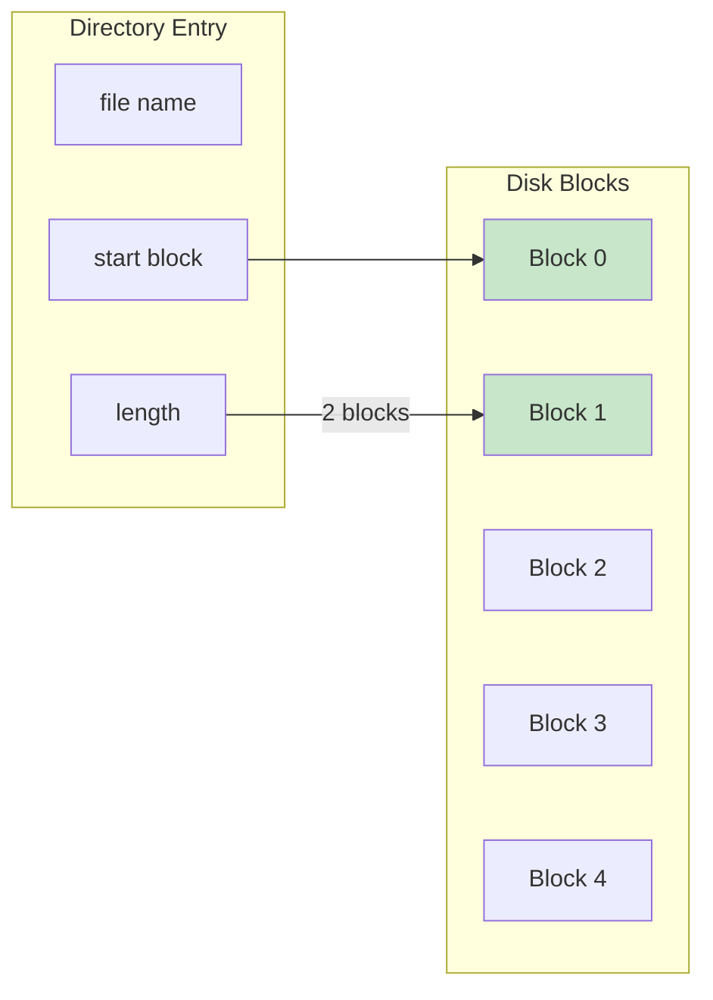

Every file occupies **consecutive disk blocks**. Directory entry stores **start block** and **length**.

| Pros | Cons |
| :--- | :--- |
| Simple implementation | **External fragmentation** — free space scattered |
| Fast sequential and random access | File size must be declared **in advance** |

---

### 2b. Linked List Allocation

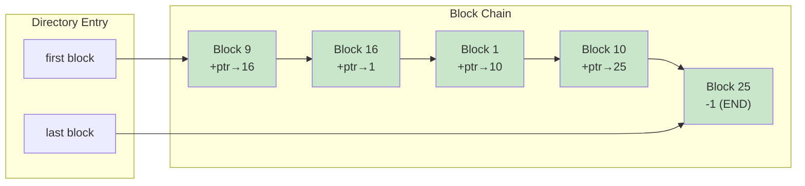

Each block stores **file data + pointer to next block**. Directory stores first and last block numbers.

| Pros | Cons |
| :--- | :--- |
| No external fragmentation | **Slow random access** — must follow N pointers |
| File can grow dynamically | Pointer wastes part of each block |
| | Single corrupted pointer breaks chain |

---

### 2c. FAT (File Allocation Table)

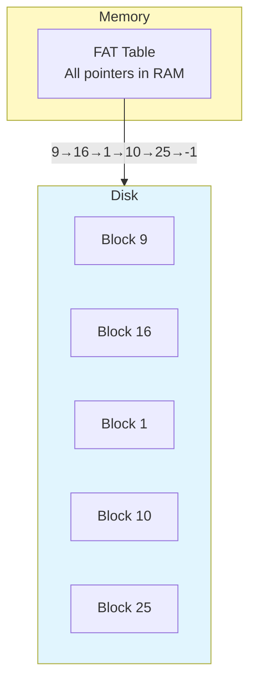

All pointers moved to an **in-memory table**. `FAT[i]` holds the index of the next block after block `i`. `-1` marks the end.

> [!example] FAT Example: File "jeep" starts at block 9
> ```
> FAT index | value (next block)
> ----------|-------------------
>     1     |   10
>     9     |   16
>    10     |   25
>    16     |    1
>    25     |   -1   ← end of file
> ```
> Block chain: **9 → 16 → 1 → 10 → 25 → END**

| Pros | Cons |
| :--- | :--- |
| Fast random access (traversal in memory) | FAT must track **every** disk block |
| No external fragmentation | Large memory consumption for big disks |

---

### 2d. Indexed Allocation

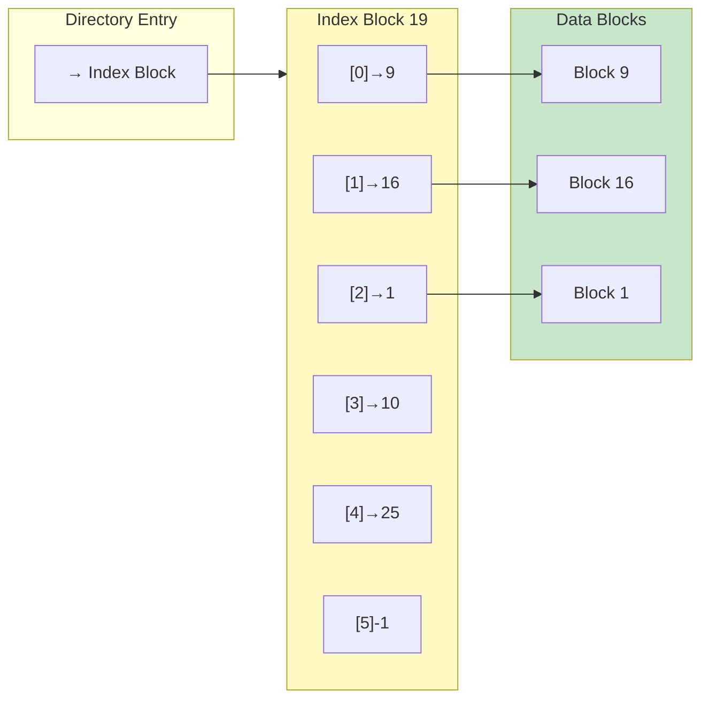

Each file has a dedicated **index block** storing an array of data block addresses.

| Pros | Cons |
| :--- | :--- |
| Fast direct access: jump to `IndexBlock[N]` | Max file size limited by index block capacity |
| Only index blocks of **open** files in memory | Index block overhead even for small files |

---

### 2e. Indexed Allocation Variations (Large Files)

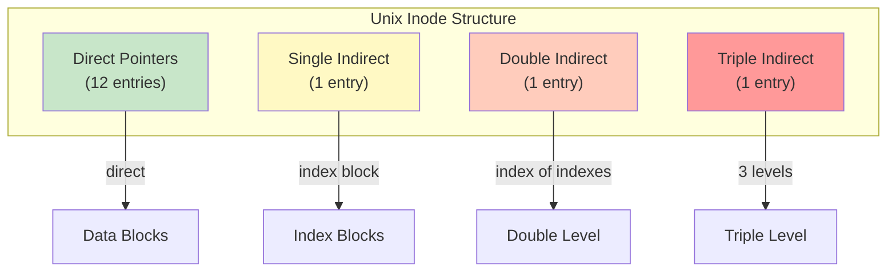

| Scheme | How It Works |
| :--- | :--- |
| **Linked index blocks** | Index blocks form a linked list |
| **Multilevel index** | Index block points to other index blocks |
| **Combined (Unix inode)** | Mix of direct, single, double, triple indirect pointers |

**Unix inode structure:**

- **Direct block pointers** → point directly to data blocks (fast for small files)
- **Single indirect** → points to a block of direct pointers
- **Double indirect** → points to a block of single-indirect pointers
- **Triple indirect** → one more level deeper

---

### 📊 Allocation Scheme Comparison

| Property | Contiguous | Linked List | FAT | Indexed |
| :--- | :--- | :--- | :--- | :--- |
| **Sequential access** | ✅ Fast | ✅ OK | ✅ OK | ✅ OK |
| **Random access** | ✅ Fast | ❌ Slow | ✅ Fast | ✅ Fast |
| **External fragmentation** | ❌ Yes | ✅ No | ✅ No | ✅ No |
| **Memory usage** | ✅ Low | ✅ Low | ❌ High | ✅ Low |
| **File size limit** | ❌ Fixed upfront | ✅ Flexible | ✅ Flexible | ❌ Limited |

---

### 📚 Key Terminology

| Term | Definition |
| :--- | :--- |
| **Contiguous Allocation** | File occupies consecutive disk blocks |
| **External Fragmentation** | Free space scattered across disk |
| **FAT** | File Allocation Table; in-memory table of block pointers |
| **Index Block** | Block storing array of data block addresses |
| **Inode** | Unix data structure with direct/indirect block pointers |

---

### ⚠️ Common Pitfalls

> [!danger] Pitfall 1: FAT vs Linked List random access
> In linked list, random access to block N requires **N disk reads**. In FAT, traversal is in **memory** — only 1 disk read for the final block.

> [!danger] Pitfall 2: Indexed allocation file size limit
> Max file size = `(block size / pointer size) × block size`. E.g., 4 KB block with 4-byte pointers = 1024 pointers → max ~4 MB with single-level index.

> [!danger] Pitfall 3: Unix inode efficiency
> The **direct blocks** in Unix inodes let small files (the common case!) be accessed extremely quickly without traversing indirect pointers.

---

### ❓ Mock Exam Questions

> [!question] Q1: Random Access Speed
> Why is random access slow in plain linked list allocation but faster with FAT?
> <details><summary>Answer</summary>
>
> **Answer: FAT keeps all pointers in memory**
>
> In linked list, following pointers requires disk reads. In FAT, the chain is traversed entirely in memory — only the final data block needs a disk read.
> </details>

> [!question] Q2: Sentinel Value
> What is the purpose of the `-1` sentinel value in FAT and indexed allocation?
> <details><summary>Answer</summary>
>
> **Answer: Marks the end of the file's block chain**
>
> `-1` indicates no more blocks follow — the file ends at this block.
> </details>

> [!question] Q3: Inode Design
> Why does the Unix inode use a combination of direct, single-indirect, double-indirect, and triple-indirect pointers?
> <details><summary>Answer</summary>
>
> **Answer: Optimizes for common case (small files) while supporting large files**
>
> Direct pointers give instant access for small files. Indirect pointers scale to handle very large files when needed.
> </details>

---

## 3. Free Space Management

### 🎯 The Problem

The OS needs to track which disk blocks are free for allocation.

### 3a. Bitmap (Bit Vector)

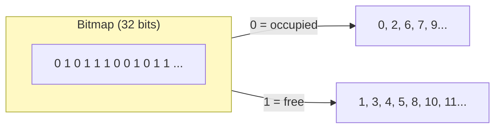

Every disk block is represented by **1 bit**: `1` = free, `0` = occupied.

**Size calculation:**
$$\text{Bitmap size (bits)} = \text{Total number of disk blocks}$$
$$\text{Bitmap size (bytes)} = \left\lceil \frac{\text{Total disk blocks}}{8} \right\rceil$$

| Pros | Cons |
| :--- | :--- |
| Efficient bit operations (AND, OR, scan) | Must be kept in memory for performance |
| Easy to find contiguous free blocks | Large for big disks |

---

### 3b. Linked List of Free Blocks

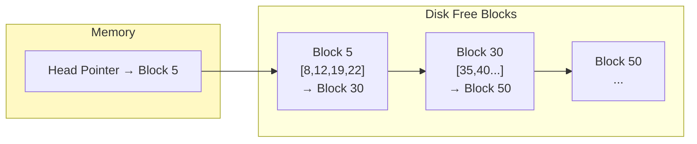

Free blocks are chained. Each free block stores several free block numbers + pointer to next group.

| Pros | Cons |
| :--- | :--- |
| Only head pointer needs to be in memory | High overhead if many free block lookups needed |
| Easy to allocate (take from head) | Fetching next group requires disk I/O |

---

### 📚 Key Terminology

| Term | Definition |
| :--- | :--- |
| **Bitmap** | Array of bits, one per disk block, tracking free/used status |
| **Free Block List** | Linked structure tracking free disk blocks |

---

### ⚠️ Common Pitfalls

> [!danger] Pitfall 1: Forgetting to update free space
> When a file is deleted, you **must** add its blocks to the free space structure. Skipping this causes leaked (permanently lost) disk blocks.

> [!danger] Pitfall 2: Bitmap persistence
> The bitmap must be **written back to disk** periodically. A crash before this causes free space inconsistency.

> [!danger] Pitfall 3: Linked list I/O cost
> Only the first group is in memory. Fetching the next group requires a disk read — which is slow.

---

### ❓ Mock Exam Questions

> [!question] Q1: Bitmap Size
> A 1 TB disk uses 4 KB blocks. How large is the bitmap?
> <details><summary>Answer</summary>
>
> **Answer: 32 MB**
>
> Total blocks = $2^{40} / 2^{12} = 2^{28}$ blocks.
> Bitmap size = $2^{28} / 8 = 2^{25}$ bytes = 32 MB.
> </details>

> [!question] Q2: Free Space Update
> What operation does the OS perform on the free space list when a file is deleted?
> <details><summary>Answer</summary>
>
> **Answer: Add the file's blocks to the free space structure**
>
> All blocks previously used by the file are marked as free in the bitmap or added to the free list.
> </details>

---

## 4. Directory Structure Implementation

### 🎯 Directory Purpose

A directory has two jobs:

1. **Track** the files it contains (with metadata)
2. **Map** file names to their file information

### 4a. Linear List

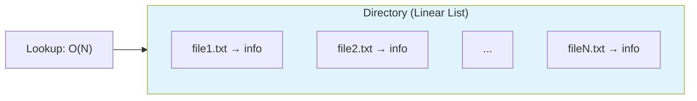

Directory stored as sequential list. Search requires **linear scan** — O(N).

| Pros | Cons |
| :--- | :--- |
| Simple implementation | Slow for large directories |

---

### 4b. Hash Table

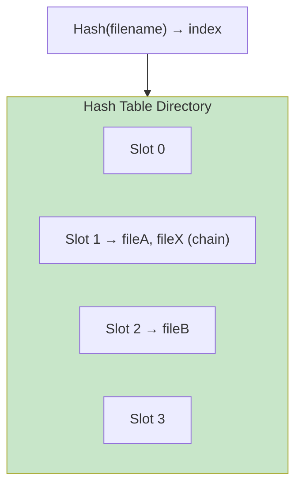

Hash the file name → index K. Check `HashTable[K]` for matching entry.

| Pros | Cons |
| :--- | :--- |
| O(1) average lookup | Fixed maximum size |
| | Depends on hash function quality |

---

### 4c. Storing File Information

| Approach | What's in the Entry |
| :--- | :--- |
| **All-in-one** | File name + all metadata + disk block info |
| **Pointer-based** | File name + pointer to separate structure (e.g., inode) |

**Pointer-based** (Unix) is more flexible — multiple directory entries can point to the same inode (hard links).

---

### 📚 Key Terminology

| Term | Definition |
| :--- | :--- |
| **Linear List Directory** | Sequential list of directory entries |
| **Hash Table Directory** | Hash-indexed directory for O(1) lookup |

---

### ⚠️ Common Pitfalls

> [!danger] Pitfall 1: Directory doesn't contain file data
> A directory stores **metadata and pointers**, not actual file contents.

> [!danger] Pitfall 2: Name duplicate check
> When creating a file, the OS must first check for name duplicates in the parent directory.

> [!danger] Pitfall 3: Hash collisions
> Two filenames may hash to the same slot. Chaining (linked list at each slot) handles this.

---

### ❓ Mock Exam Questions

> [!question] Q1: Hash vs Linear
> Why is a hash table preferred over a linear list for large directories?
> <details><summary>Answer</summary>
>
> **Answer: O(1) average lookup vs O(N) scan**
>
> Hash tables provide constant-time lookup regardless of directory size, while linear lists require scanning all entries.
> </details>

> [!question] Q2: Pointer-based Entries
> What is the advantage of storing only a pointer to file information in the directory entry?
> <details><summary>Answer</summary>
>
> **Answer: Enables hard links and flexible metadata management**
>
> Multiple directory entries can point to the same file structure (inode), allowing hard links.
> </details>

---

## 5. File System in Action

### 🔄 Runtime Data Structures

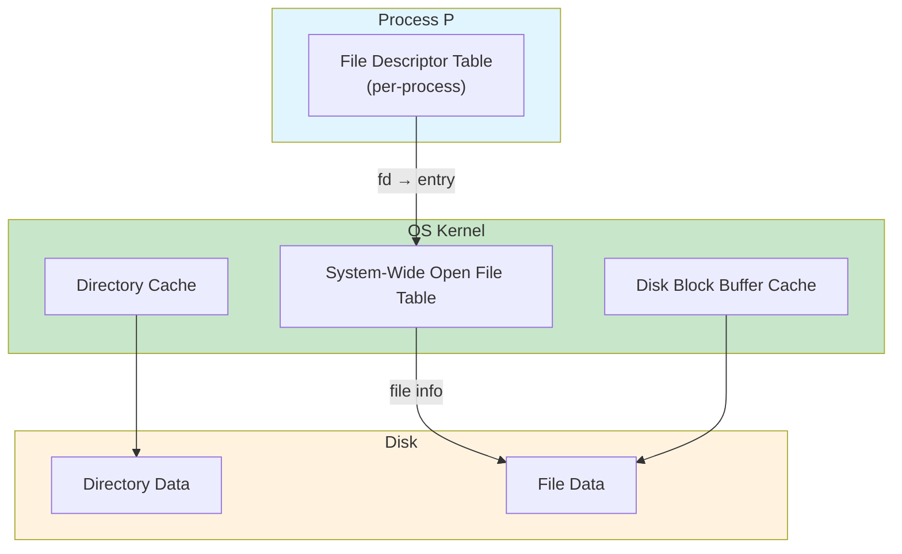

| Structure | Scope | Purpose |
| :--- | :--- | :--- |
| **Per-process FD table** | Per process | Maps fd numbers to open file table entries |
| **System-wide open file table** | Global | Stores file info, offset, for all open files |
| **Directory cache** | Global | Caches recently accessed directory entries |
| **Buffer cache** | Global | Caches recently read/written disk blocks |

---

### 5a. File Create

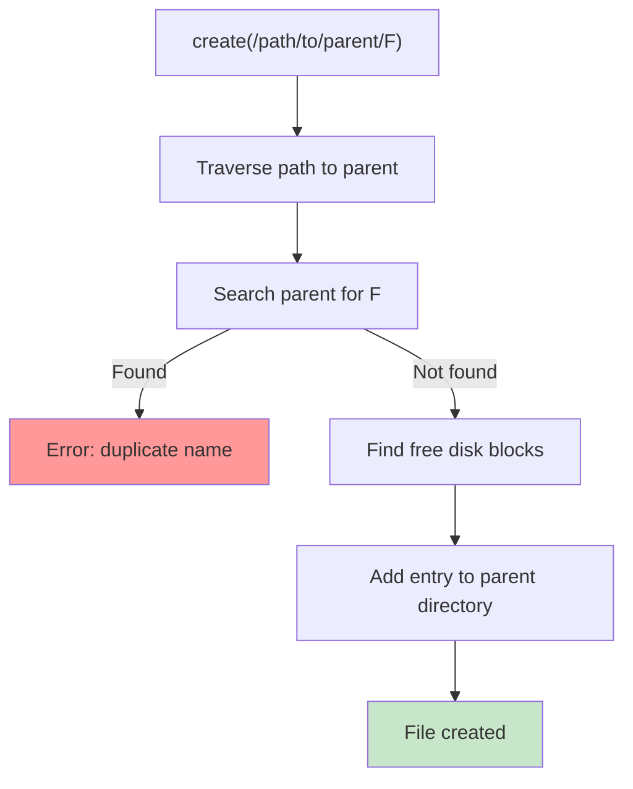

---

### 5b. File Open

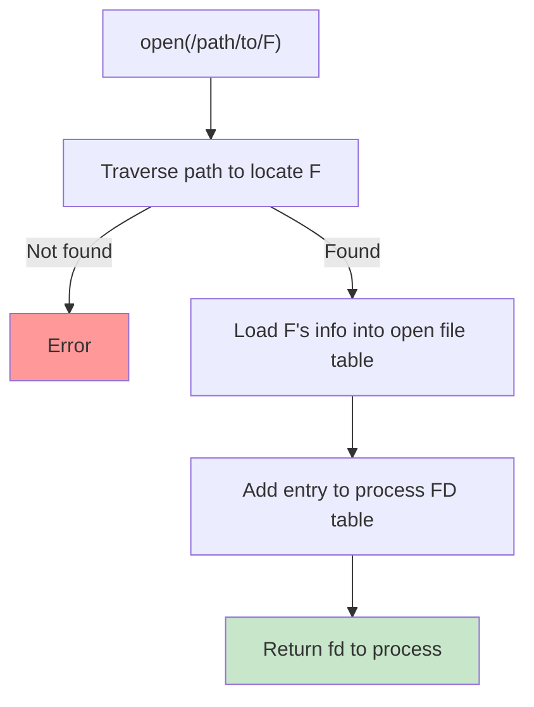

---

### 📚 Key Terminology

| Term | Definition |
| :--- | :--- |
| **File Descriptor Table** | Per-process table mapping fd numbers to open files |
| **Open File Table** | System-wide table tracking all open files |
| **Buffer Cache** | In-memory cache of disk blocks |

---

### ⚠️ Common Pitfalls

> [!danger] Pitfall 1: FD numbers are per-process
> Different processes can have the same fd number pointing to different files. FD is just an index into the process's own table.

> [!danger] Pitfall 2: Open file table is global
> Two processes opening the same file get **separate entries** (independent offsets), unless sharing via `fork()`.

> [!danger] Pitfall 3: Disk vs Memory structures
> Inode is **on disk**. It's read into the open file table at `open()` time. Don't confuse the two.

---

### ❓ Mock Exam Questions

> [!question] Q1: Independent Opens
> Two processes both open the same file independently. Do they share a file offset?
> <details><summary>Answer</summary>
>
> **Answer: No — each has independent offset**
>
> Independent `open()` calls create separate entries in the system-wide open file table with separate offsets.
> </details>

> [!question] Q2: FD Scope
> What does a file descriptor number refer to?
> <details><summary>Answer</summary>
>
> **Answer: Index into the process's own file descriptor table**
>
> FD numbers are meaningful only within a process. Different processes can have the same FD number for different files.
> </details>

---

## 6. Disk I/O Scheduling

### ⏱️ Disk Access Time

$$T_{\text{total}} = T_{\text{seek}} + T_{\text{rotational latency}} + T_{\text{transfer}}$$

| Stage | Description | Typical Range |
| :--- | :--- | :--- |
| **Seek time** | Move head to correct track | 2–10 ms |
| **Rotational latency** | Wait for sector under head | 2–6.25 ms |
| **Transfer time** | Read/write data | Very fast (µs) |

Seek and rotational latency dominate — the OS **schedules** requests to minimize head movement.

---

### 6a. FCFS (First Come First Served)

Requests served in arrival order. Simple but can cause large head movements.

> [!example] FCFS Example
> Requests: [13, 14, 2, 18, 17, 21, 15], starting at track 13
> Path: 13→14→2→18→17→21→15
> Total movement = 1+12+16+1+4+6 = **40 tracks**

---

### 6b. SSF (Shortest Seek First)

Always serve the request **closest** to current head position.

> [!example] SSF Example
> Requests: [13, 14, 2, 18, 17, 21, 15], starting at track 13
> Order: 13→14→15→17→18→21→2
> Total movement = 1+1+2+1+3+19 = **27 tracks**

| Pros | Cons |
| :--- | :--- |
| Minimizes total head movement | Can **starve** far-away requests |

---

### 📚 Key Terminology

| Term | Definition |
| :--- | :--- |
| **Seek Time** | Time to move disk head to correct track |
| **Rotational Latency** | Time for correct sector to rotate under head |
| **FCFS** | First Come First Served scheduling |
| **SSF** | Shortest Seek First scheduling |

---

### ⚠️ Common Pitfalls

> [!danger] Pitfall 1: FCFS fairness
> FCFS is **fair** but inefficient — requests served in order regardless of head position.

> [!danger] Pitfall 2: SSF starvation
> SSF can **starve** requests far from the busy area if nearby requests keep arriving.

> [!danger] Pitfall 3: Transfer time
> Transfer time is negligible compared to seek + latency for small reads. Don't overweight it.

---

### ❓ Mock Exam Questions

> [!question] Q1: Seek vs Transfer
> Why does seek time dominate transfer time in magnetic disk performance?
> <details><summary>Answer</summary>
>
> **Answer: Mechanical movement is slow; electronic transfer is fast**
>
> Moving the disk head (mechanical) takes milliseconds. Transferring data (electronic) takes microseconds — 1000× faster.
> </details>

> [!question] Q2: SSF Disadvantage
> What is the main disadvantage of SSF compared to FCFS?
> <details><summary>Answer</summary>
>
> **Answer: Starvation of far-away requests**
>
> If requests near the current head position keep arriving, far-away requests may never be served.
> </details>

---

## 7. Practice Problems

### 📝 Problem 1: Indexed Allocation

A disk uses indexed allocation with 512-byte blocks and 4-byte block addresses.

**(a)** How many pointers fit in one index block?

**(b)** What is the maximum file size with single-level index?

**(c)** What is the maximum file size with double-indirect pointer?

<details><summary>Solution</summary>

**(a)** Pointers per index block:
$$\frac{512 \text{ bytes}}{4 \text{ bytes/pointer}} = 128 \text{ pointers}$$

**(b)** Max file size (single-level):
$$128 \times 512 \text{ B} = 65{,}536 \text{ bytes} = 64 \text{ KB}$$

**(c)** Max file size (double-indirect):
- First level: 128 index blocks
- Each second-level: 128 data blocks
$$128 \times 128 \times 512 \text{ B} = 8{,}388{,}608 \text{ bytes} = 8 \text{ MB}$$
</details>

---

### 📝 Problem 2: FAT Traversal

File "alpha" starts at block 3. The FAT contains:

| Index | Value |
| :--- | :--- |
| 3 | 7 |
| 7 | 12 |
| 12 | 20 |
| 20 | -1 |

**(a)** List all blocks belonging to "alpha" in order.

**(b)** How many disk reads to access the 3rd block with plain linked list?

**(c)** How many disk reads with FAT (FAT in memory)?

<details><summary>Solution</summary>

**(a)** Block chain: 3 → 7 → 12 → 20

**(b)** Plain linked list: Must read blocks 3, 7, then 12.
**Answer: 3 disk reads**

**(c)** FAT in memory: Chain traversal is free. Only need to read block 12.
**Answer: 1 disk read**
</details>

---

### 📝 Problem 3: Disk Scheduling

Disk head at track 10. Requests: [3, 20, 5, 18, 8, 25, 12]

**(a)** Calculate total head movement using FCFS.

**(b)** Calculate total head movement using SSF.

<details><summary>Solution</summary>

**(a) FCFS:** Serve in arrival order.
```
10 → 3 → 20 → 5 → 18 → 8 → 25 → 12
    7  + 17 + 15 + 13 + 10 + 17 + 13 = 92 tracks
```
**Answer: 92 tracks**

**(b) SSF:** Always pick closest.
```
10 → 12 (2) → 8 (4) → 5 (3) → 3 (2) → 18 (15) → 20 (2) → 25 (5)
Total: 2+4+3+2+15+2+5 = 33 tracks
```
**Answer: 33 tracks**

SSF is better: 33 vs 92 tracks.
</details>

---

## 🔗 Connections

| 📚 Lecture | 🔗 Connection |
| :--- | :--- |
| [[L10]] | File system implementation builds on file concepts from L10 |
| [[L9]] | Virtual memory paging concepts apply to file buffer cache |
| [[L7]] | Memory allocation concepts parallel disk block allocation |

> [!quote] The Key Insight
> A file system is all about **mapping** — mapping logical files to physical blocks, mapping names to metadata, mapping free blocks to allocation requests. The genius of different allocation schemes is in their trade-offs: contiguous for speed, linked for flexibility, indexed for balance. The Unix inode's multi-level design is particularly elegant — optimizing for the common case (small files) while scaling to handle the uncommon case (huge files). 💾