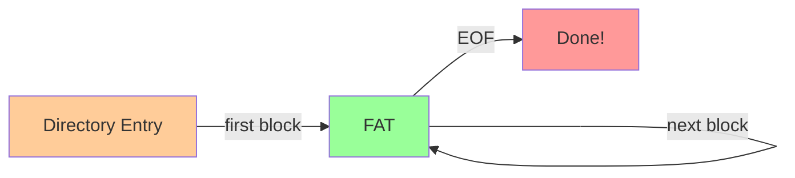
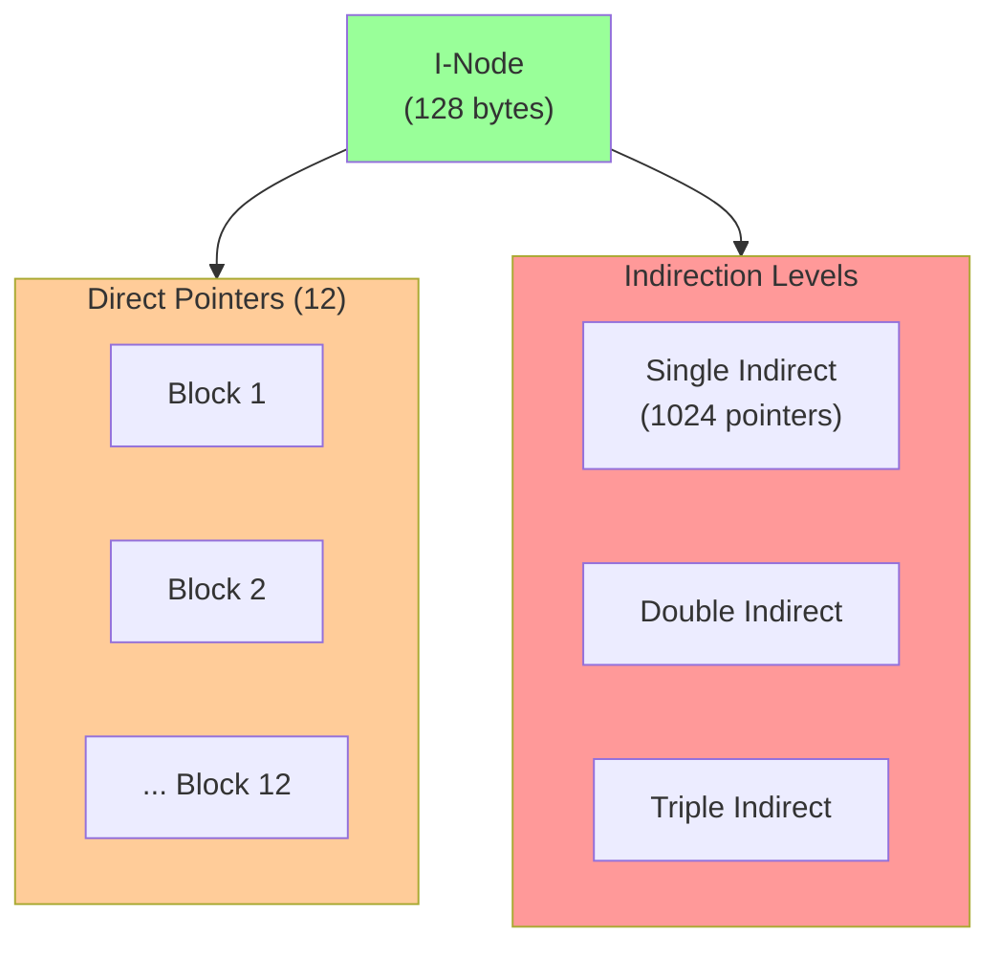
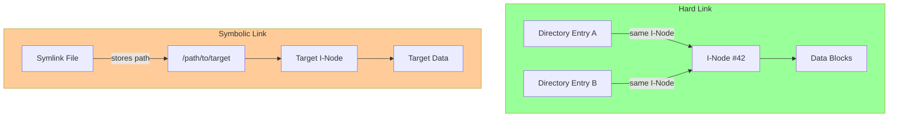

# 📁 L12: File System Case Studies

> [!abstract] Lecture Goal
> Understand how real-world file systems organize data on disk. Compare the simple FAT design with the more sophisticated Ext2 approach using I-Nodes and indirect pointers. Know the trade-offs between hard links and symbolic links.

> [!tip] The Big Picture
> File systems bridge the gap between "files and folders" users see and the raw blocks on a physical disk. FAT uses a simple linked-list approach, while Ext2 uses I-Nodes with a hierarchy of pointers. Both systems exist because they solve different trade-offs — simplicity vs. scalability.

---

## 1. Microsoft FAT File System

### 🧠 Core Concept

FAT (File Allocation Table) is one of the oldest and simplest file systems, originally used in MS-DOS. A disk partition using FAT is organized as follows:

```
[ Boot | FAT | FAT Duplicate (optional) | Root Directory | Data Blocks ]
```

| Component | Purpose |
| :--- | :--- |
| **Boot sector** | Contains metadata about the partition and bootloader info |
| **FAT** | A flat table where each entry corresponds to one data block (or cluster). Acts as the linked list of file blocks |
| **FAT Duplicate** | An optional backup copy of the FAT for redundancy |
| **Root Directory** | A special fixed-location area containing directory entries for the top-level folder |
| **Data Blocks** | Where actual file and subdirectory data lives |

#### The File Allocation Table (FAT)

Think of the FAT as a giant array. Each index in the array corresponds to a data block on disk. The value stored at each index tells you:

| Value | Meaning |
| :--- | :--- |
| `FREE` | Block is unoccupied |
| `BAD` | Block is damaged, don't use |
| `EOF` | This is the last block of a file |
| Block number N | File continues at block N |

So to read a file, you:

1. Find its **first block** from the directory entry.
2. Look up that block index in the FAT → get next block.
3. Repeat until you hit `EOF`.

This is essentially a **linked list stored externally** (outside the data blocks themselves), which is why the OS caches the FAT in RAM for speed.



#### Directory Entry Structure

Each file or folder in a directory is represented by a **32-byte directory entry**:

| Field | Size | Notes |
| :--- | :--- | :--- |
| File Name | 8 bytes | Max 8 characters |
| File Extension | 3 bytes | Max 3 characters |
| Attributes | 1 byte | Read-only, hidden, etc. |
| Reserved | 10 bytes | Timestamps, etc. |
| Creation Date + Time | 2+2 bytes | Year limited to 1980–2107 |
| First Disk Block | 2 bytes | Starting point in FAT |
| File Size | 4 bytes | In bytes |

> [!warning] Year Timestamps
> Year timestamps are stored as an offset from 1980, and time accuracy is only **±2 seconds**.

#### Variants: FAT12, FAT16, FAT32

The number after "FAT" indicates **how many bits are used to index disk blocks**. More bits = more addressable clusters = larger maximum partition.

With a cluster size of $C$ bytes and $n$ bits for the index:

$$\text{Max Partition Size} = C \times 2^n$$

For a 4 KiB cluster:

| Variant | Bits | Max Partition |
| :--- | :--- | :--- |
| FAT12 | 12 | $4\text{KiB} \times 2^{12} = 16\text{ MiB}$ |
| FAT16 | 16 | $4\text{KiB} \times 2^{16} = 256\text{ MiB}$ |
| FAT32 | 28* | $4\text{KiB} \times 2^{28} \approx 1\text{ TiB}$ |

> *FAT32 uses a 32-bit field but only **28 bits** are actually used for block indexing. The other 4 bits are reserved.

**Cluster Size Trade-off:**

- Larger cluster → Larger usable partition ✅
- Larger cluster → More **internal fragmentation** ❌ (a 1-byte file wastes an entire cluster!)

#### VFAT: Long File Name Support

The original 8+3 naming was a severe limitation. VFAT (Virtual FAT), introduced in Windows 95, supports filenames up to **255 characters** using a clever workaround:

- A file with a long name gets **multiple consecutive directory entries**.
- The last entry uses the old 8+3 short name format (for backward compatibility).
- Earlier entries store fragments of the long name in reverse order.

**Example:** `"A long long file name.txt"` is stored as:

```
Entry 1 (LFN): "ile name.txt"      ← last chunk
Entry 2 (LFN): "A long long f"     ← first chunk
Entry 3 (SFN): "ALONGL~1.txt"      ← 8+3 short name (backward compatible)
```

---

### ⚠️ Common Pitfalls

> [!danger] Pitfall: FAT32 ≠ 32-bit indexing
> Only 28 bits are used for the cluster index. Students often assume 32 bits → wrong max size calculation.

> [!danger] Pitfall: The FAT is NOT stored in data blocks
> It's a separate region of the partition loaded into RAM. Don't confuse it with the actual file data.

> [!danger] Pitfall: Root directory location varies
> The root directory has a fixed location in FAT12/16, but in FAT32, the root directory is also stored in data blocks. This distinction sometimes appears in exam questions.

> [!danger] Pitfall: Internal fragmentation math
> If cluster size is 4 KiB and a file is 1 byte, it wastes 4095 bytes. Don't confuse internal fragmentation (wasted space inside an allocated cluster) with external fragmentation (free space is scattered).

> [!danger] Pitfall: VFAT entries are ordered in reverse
> The long name is split and stored last-chunk-first. The 8+3 entry is the _last_ physical entry, not the first.

---

### 🔍 Key Example (Slide 10)

The "putting it all together" example shows:

- **Directory entries** (in a root directory data block):
    - `ex1.c` → starts at block **3**
    - `ex2.c` → starts at block **6**
    - `test/` → starts at block **2**
- **FAT (in RAM)**:
    - Block 2: `EOF` → `test/` is only 1 block long
    - Block 3: `5` → `ex1.c` continues at block 5
    - Block 5: `8` → continues at block 8
    - Block 8: `EOF` → end of `ex1.c`
    - Block 6: `7` → `ex2.c` continues at block 7
    - Block 7: `EOF` → end of `ex2.c`

So to read `ex1.c`: look up block 3 in FAT → go to 5 → go to 8 → `EOF`. Done! 🎉

---

### ❓ Mock Exam Questions

> [!question] Q1: FAT32 Max Partition
> In a FAT32 file system with a cluster size of 8 KiB, what is the maximum theoretical partition size? Show your working.
> <details><summary>Answer</summary>
>
> **Answer:**
> FAT32 uses 28 bits for cluster indexing. Max partition size = cluster size × 2^28
> $$8\text{ KiB} \times 2^{28} = 8 \times 1024 \times 2^{28} \text{ bytes} = 2\text{ TiB}$$
> </details>

> [!question] Q2: FAT Traversal
> If a file starts at block 5 and the FAT entries are: FAT[5]=12, FAT[12]=3, FAT[3]=EOF, what blocks does this file occupy?
> <details><summary>Answer</summary>
>
> **Answer:**
> Blocks **5 → 12 → 3**, in that order. The file occupies 3 blocks total.
> </details>

---

## 2. Linux Ext2 File System

### 🧠 Core Concept

Ext2 (Second Extended File System) is a more sophisticated file system that organizes disk space into **Block Groups**, each containing its own metadata and data blocks.

```
[ BOOT | Block Group 0 | Block Group 1 | Block Group 2 | ... ]
```

Each **Block Group** contains:

```
[ Superblock | Group Descriptors | Block Bitmap | I-Node Bitmap | I-Node Table | Data Blocks ]
```

#### Partition Information Structures

| Structure | Purpose |
| :--- | :--- |
| **Superblock** | Describes the entire FS: total I-Nodes, total blocks, blocks per group, etc. Duplicated in every block group for redundancy. |
| **Group Descriptors** | Describes each block group: number of free blocks/I-Nodes, location of bitmaps. Also duplicated. |
| **Block Bitmap** | A bitmap where each bit = one data block. `1` = occupied, `0` = free. |
| **I-Node Bitmap** | A bitmap where each bit = one I-Node. `1` = occupied, `0` = free. |
| **I-Node Table** | An array of I-Nodes. Each I-Node is uniquely indexed. |
| **Data Blocks** | Where actual file/directory content is stored. |

#### The I-Node (Index Node)

Every file and directory in Ext2 has exactly **one I-Node** (128 bytes) that stores:

| Field | Size | Notes |
| :--- | :--- | :--- |
| Mode | 2 bytes | File type + permissions |
| Owner Info | 4 bytes | UID, GID |
| File Size | 4 or 8 bytes | In bytes |
| Timestamps | 3 × 4 bytes | Created, modified, accessed |
| Reference Count | 2 bytes | Number of hard links |
| Data Block Pointers | 15 × 4 bytes | See below |

#### I-Node Data Block Pointers (The Clever Part!)

The I-Node has **15 block pointers** arranged in a hierarchy:

```
Pointers 1–12  → Direct Blocks        (point directly to data)
Pointer 13     → Single Indirect Block (points to a block of pointers)
Pointer 14     → Double Indirect Block (points to blocks of pointer blocks)
Pointer 15     → Triple Indirect Block (one more level of indirection)
```

Let $B$ = block size, $P$ = size of one pointer (4 bytes).

Number of pointers per block: $\dfrac{B}{P}$

For $B = 4\text{ KiB}$: $\dfrac{4096}{4} = 1024$ pointers per block.

| Type | Formula | Capacity (4KiB blocks) |
| :--- | :--- | :--- |
| Direct (12) | $12 \times B$ | $48\text{ KiB}$ |
| Single Indirect | $\frac{B}{P} \times B$ | $4\text{ MiB}$ |
| Double Indirect | $\left(\frac{B}{P}\right)^2 \times B$ | $4\text{ GiB}$ |
| Triple Indirect | $\left(\frac{B}{P}\right)^3 \times B$ | $4\text{ TiB}$ |



> 💡 **Design insight:** Small files (most common) use only the 12 direct pointers → super fast access! Large files scale up through indirection levels as needed.

#### Directory Structure in Ext2

Unlike FAT's fixed-size entries, Ext2 uses a **linked list of variable-length directory entries** stored in data blocks:

| Field | Notes |
| :--- | :--- |
| I-Node Number | Which I-Node this entry refers to |
| Entry Size | Used to find the next entry in the list |
| Name Length | Length of the filename |
| Type | File (F) or Directory (D) |
| Name | Up to 255 characters |

---

### ⚠️ Common Pitfalls

> [!danger] Pitfall: Root I-Node is always #2 in Ext2
> Not #1. I-Node #1 is reserved for bad block tracking. This is a classic trick question!

> [!danger] Pitfall: I-Nodes don't store filenames
> The filename lives in the _parent directory's_ data block. The I-Node only knows about data block pointers and metadata. This is why hard links work — two directory entries with _different names_ can point to the _same I-Node_.

> [!danger] Pitfall: Superblock duplication
> Superblock and Group Descriptors are duplicated across all block groups — not just stored once. This is for **fault tolerance**, not space efficiency.

> [!danger] Pitfall: Reference count for hard links
> When you create a hard link, the reference count in the I-Node increases. The I-Node (and its data) is only truly deleted when the reference count reaches **0**.

> [!danger] Pitfall: Indirect blocks cost extra disk accesses
> Accessing a byte in the triple-indirect region requires **4 disk reads** (triple indirect block → double → single → data block) before you even get your data. Students forget this overhead.

---

### 🔍 Key Examples

#### Directory Listing (Slide 29)

A directory's data blocks contain entries like:

```
[ 91 | F | 4 | Hi.c    ]
[ 39 | F | 8 | lab5.pdf ]
[ 74 | D | 3 | sub      ]
```

This means: `Hi.c` uses I-Node #91, `lab5.pdf` uses I-Node #39, and subdirectory `sub` uses I-Node #74.

#### Path Resolution: `/sub/file` (Slide 30)

The root directory `/` always has **I-Node #2** in Ext2.

Step-by-step to find `/sub/file`:

1. **Look up I-Node #2** (root `/`) → its data block pointer leads to **Disk Block 15**.
2. **Read Disk Block 15** → directory entries include `[8 | D | 3 | sub]`, so `sub` has I-Node #8.
3. **Look up I-Node #8** (`sub/`) → its data block pointer leads to **Disk Block 20**.
4. **Read Disk Block 20** → directory entries include `[6 | F | 4 | file]`, so `file` has I-Node #6.
5. **Look up I-Node #6** (`file`) → its data block pointer leads to **Disk Block 23**.
6. **Read Disk Block 23** → actual file content! 🎉

---

### ❓ Mock Exam Questions

> [!question] Q3: Ext2 I-Node Capacity
> An Ext2 file system uses a **block size of 4 KiB** and **4-byte block pointers**. How many pointers fit in one indirect block?
> <details><summary>Answer</summary>
>
> **Answer:**
> $$\frac{\text{Block Size}}{\text{Pointer Size}} = \frac{4096 \text{ bytes}}{4 \text{ bytes}} = 1024 \text{ pointers per block}$$
> </details>

> [!question] Q4: Max File Size Calculation
> Calculate the **maximum file size** addressable using only the 12 direct pointers + the single indirect pointer (pointer 13) in Ext2 with 4 KiB blocks.
> <details><summary>Answer</summary>
>
> **Answer:**
> - Direct blocks: $12 \times 4\text{ KiB} = 48\text{ KiB}$
> - Single indirect block holds 1024 pointers, each pointing to a 4 KiB block: $1024 \times 4\text{ KiB} = 4096\text{ KiB} = 4\text{ MiB}$
> 
> $$\text{Total} = 48\text{ KiB} + 4\text{ MiB} \approx 4.047\text{ MiB}$$
> </details>

> [!question] Q5: I-Node vs FAT for Small Files
> Why does Ext2's I-Node design perform better than FAT for small files?
> <details><summary>Answer</summary>
>
> **Answer:**
> In **FAT**, to access any block of a file, the OS must **traverse the linked list in the FAT**, potentially reading many FAT entries. Even for a 1-block file, you must first read the FAT (though it's cached in RAM), then read the data.
>
> In **Ext2**, small files (≤ 48 KiB) use only the **12 direct block pointers** stored directly in the I-Node. Reading the I-Node gives you all block addresses immediately — **no extra indirection needed**. This means:
> - Fewer disk accesses for small files
> - All metadata + block locations in a single 128-byte structure
> - The OS can cache frequently-used I-Nodes efficiently
> </details>

---

## 3. Hard Links vs Symbolic Links

### 🧠 Core Concept

Both types create "aliases" to files, but they work very differently:

| Feature | Hard Link | Symbolic Link |
| :--- | :--- | :--- |
| What is stored | Same I-Node number | Pathname string to target |
| Follows if file renamed? | ✅ Yes (points to I-Node, not name) | ❌ No (stores the name, breaks!) |
| Follows if file deleted? | ✅ Yes (until refcount = 0) | ❌ No (becomes a dangling link) |
| Can cross file systems? | ❌ No | ✅ Yes |
| Extra disk access? | None | Yes (must resolve pathname) |
| Can link to directories? | ❌ Generally not allowed | ✅ Yes |



**Hard Link Deletion Logic:** $$\text{Delete I-Node} \iff \text{Reference Count} = 0$$

Every time a hard link is created: `refcount++`. Every time a hard link is removed: `refcount--`. Only when `refcount == 0` is the I-Node and its data blocks freed.

---

### ⚠️ Common Pitfalls

> [!danger] Pitfall: Symbolic links store a path, not an I-Node number
> If the file at that path is moved or deleted, the symlink breaks silently. Hard links are more resilient.

> [!danger] Pitfall: Hard links cannot span partitions/file systems
> I-Node numbers are only unique within one file system. Trying to hard-link across partitions is an error.

> [!danger] Pitfall: Deleting the "original" file with hard links
> Doesn't actually destroy data — it just decrements the refcount. The data survives until all links are removed. Students often think deleting the source file destroys hard-linked copies.

---

### ❓ Mock Exam Questions

> [!question] Q6: Hard Link Behavior
> You create a hard link `link2.txt` pointing to `original.txt`. Then you delete `original.txt`. Is the data still accessible?
> <details><summary>Answer</summary>
>
> **Answer:**
> Yes! Hard links point to the same I-Node. When you delete `original.txt`, the I-Node's reference count drops from 2 to 1. The data remains accessible via `link2.txt`.
> </details>

> [!question] Q7: Symlink Behavior
> You create a symbolic link `shortcut.txt` pointing to `document.txt`. You then rename `document.txt` to `paper.txt`. What happens when you try to read `shortcut.txt`?
> <details><summary>Answer</summary>
>
> **Answer:**
> The symlink breaks! Symbolic links store the path string `"document.txt"`. When you rename the file, the symlink still points to the old name, which no longer exists. You'll get a "no such file" error.
> </details>

---

## 4. Summary

### 📊 Key Concepts

| Concept | Definition |
| :--- | :--- |
| **FAT** | Simple file system using a table of linked-list pointers; each entry points to next block or EOF |
| **Cluster** | Smallest allocatable unit in FAT; larger clusters reduce table size but increase internal fragmentation |
| **VFAT** | Extension to FAT supporting long filenames using multiple directory entries |
| **Ext2** | Unix file system using I-Nodes; separates metadata from directory entries |
| **I-Node** | 128-byte structure storing file metadata and block pointers; one per file |
| **Direct Pointer** | I-Node pointer that directly addresses a data block |
| **Indirect Pointer** | I-Node pointer that points to a block full of more pointers |
| **Hard Link** | Directory entry pointing to same I-Node as another file; survives original deletion |
| **Symbolic Link** | Small file containing path to target; breaks if target moved/deleted |

---

### 🎯 File System Comparison

| Feature | FAT | Ext2 |
| :--- | :--- | :--- |
| File metadata location | Directory entry | Separate I-Node |
| Block addressing | Linked list in FAT table | I-Node with direct + indirect pointers |
| Max file size | Limited by FAT bits (12/16/28) | ~16 GiB (4 KiB blocks, 4-byte pointers) |
| Small file efficiency | Must traverse FAT | Direct pointers in I-Node |
| Fragmentation type | Internal (cluster-based) | Can be both |
| Reliability | FAT duplicate as backup | Superblock/group descriptor copies |

---

## 🔗 Connections

| 📚 Lecture | 🔗 Connection |
| :--- | :--- |
| [[L1]] | OS structure — file systems are kernel services providing persistent storage |
| [[L2]] | File descriptors — processes access files via fd table in OS context |
| [[L3]] | I/O scheduling — disk scheduling affects file system performance |
| [[L4]] | IPC — file-based communication (pipes) uses file system calls |
| [[L6]] | Synchronization — concurrent file access needs locking mechanisms |
| [[L7]] | Memory — file system uses memory for caching (buffer cache) |
| [[L8]] | Paging — file systems may use paging concepts for memory-mapped files |
| [[L9]] | Virtual memory — VM concepts inform file system caching strategies |
| [[L10]] | File concepts — files, directories, metadata defined here |
| [[L11]] | Implementation — block allocation, directory structures explained there |

> [!quote] The Key Insight
> FAT's simplicity makes it ideal for small, embedded systems and flash media. Ext2's I-Node design scales better for large disks and provides O(1) access to small files via direct pointers. The choice between hard and symbolic links is a trade-off between resilience (hard) and flexibility (symbolic).