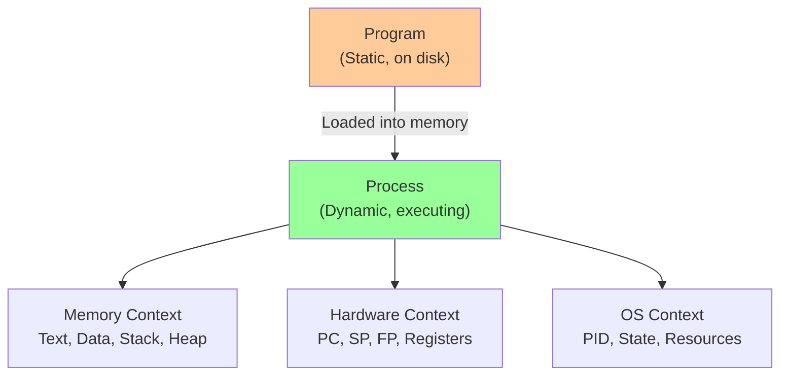
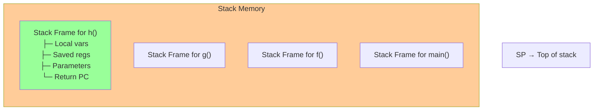
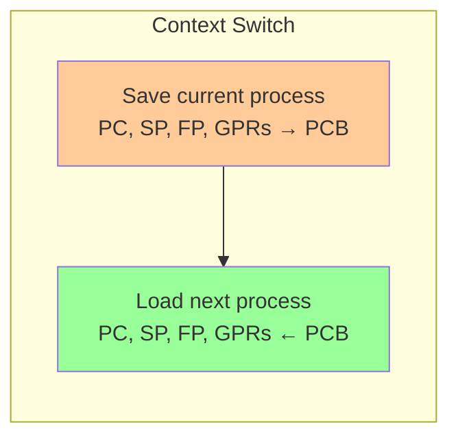
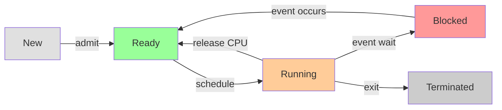
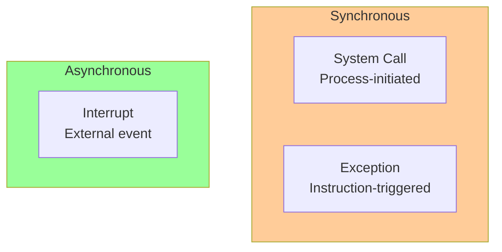
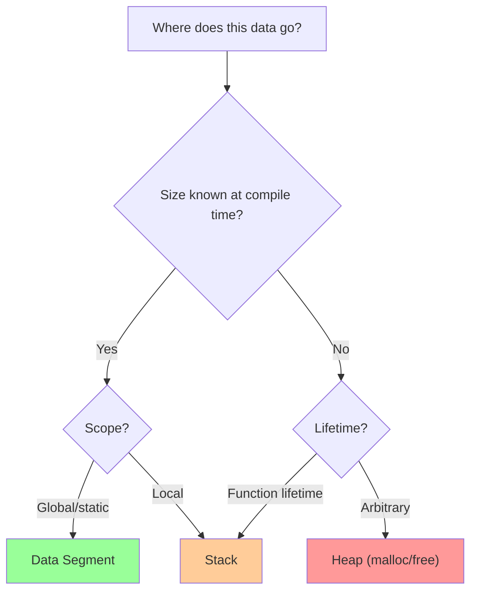

# 📘 L2: Process Abstraction

> [!abstract] Lecture Goal
> Understand why the OS needs the process abstraction, master the three contexts (Memory, Hardware, OS), and know how processes transition through states and interact with the OS via system calls, exceptions, and interrupts.

> [!tip] The Big Picture
> A process is the OS's fundamental unit of execution. Everything the OS does — scheduling, memory management, IPC — revolves around processes. Understanding this abstraction is foundational.

---

## 1. Why We Need Processes

### 🧠 Core Concept

A **program** is a static set of instructions sitting on disk. A **process** (also called a _task_ or _job_) is a **dynamic abstraction** of a program _currently executing_ on the CPU.

The OS must support **multiprogramming** — running multiple programs seemingly at the same time by rapidly switching between them. To switch from running Program A to Program B, the OS needs to:

1. **Save** all the execution information of Program A
2. **Load** the execution information of Program B

This requires a formal structure to describe a running program → **the Process**.

| Context | Contents |
| :--- | :--- |
| **Memory Context** | Code (Text), Data, Stack, Heap |
| **Hardware Context** | Registers, PC, Stack Pointer, Frame Pointer |
| **OS Context** | Process ID, Process State, Resources used |



---

### ⚠️ Common Pitfalls

> [!danger] Pitfall: Program ≠ Process
> A program is **passive** (a file on disk). A process is **active** (it has memory allocated, a PC pointing somewhere, registers with values). The same program can spawn multiple processes simultaneously (e.g., two terminal windows running the same shell).

---

### ❓ Mock Exam Questions

> [!question] Q1: Dynamic Abstraction
> Why is a process described as a "dynamic abstraction" for an executing program?
> <details><summary>Answer</summary>
>
> **Answer:**
> A process captures the runtime state of a program — its memory allocations, register values, and execution position. Unlike a static program file, a process changes continuously as it executes. The abstraction lets the OS manage execution without knowing program internals.
> </details>

> [!question] Q2: Three Contexts
> Name the three major contexts that make up the process abstraction and give one example item from each.
> <details><summary>Answer</summary>
>
> **Answer:**
> - **Memory Context**: Text segment, Data segment, Stack, Heap
> - **Hardware Context**: Program Counter, Stack Pointer, General Purpose Registers
> - **OS Context**: Process ID (PID), Process State, Open file descriptors
> </details>

---

## 2. Memory Context

### 2.1 Code & Data Regions

#### 🧠 Core Concept

When a program is loaded into memory, it is divided into regions:

| Region | Description | Properties |
| :--- | :--- | :--- |
| **Text Segment** | Machine instructions (compiled code) | Read-only during execution |
| **Data Segment** | Global and static variables | Size known at compile time |

**Example:** The C code `int i = 0; i = i + 20;` compiles to:

```asm
addi $1, $0, 0      # register $1 = 0
sw   $1, 4096       # i = 0 (store to address 4096 in Data)
lw   $2, 4096       # load i
addi $3, $2, 20     # $3 = i + 20
sw   $3, 4096       # i = i + 20
```

The assembly instructions live in **Text**; variable `i` lives in **Data** at address 4096.

---

### ⚠️ Common Pitfalls

> [!danger] Pitfall: Local variables ≠ Data segment
> The Data region is only for **global/static** variables known at compile time. Local variables live on the **stack**.

---

### 2.2 Stack Memory & Function Calls

#### 🧠 Core Concept

Functions require memory that is _created when called_ and _destroyed when they return_. This is too dynamic for the Data region.

**Solution: Stack Memory**

Each function invocation gets a **stack frame** (activation record) pushed onto the stack. The stack follows **LIFO** order — most recently called function is at the top.

| Field | Purpose |
| :--- | :--- |
| **Return PC** | Where to resume execution in the caller |
| **Parameters** | Arguments passed to the function |
| **Saved SP** | Old Stack Pointer to restore on return |
| **Saved FP** | Old Frame Pointer |
| **Saved Registers** | Registers the callee must preserve |
| **Local Variables** | Space for variables inside the function |
| **Return Result** | Return value before returning |



**Key Registers:**

| Register | Role |
| :--- | :--- |
| **Stack Pointer (SP)** | Points to the top of the stack; moves dynamically |
| **Frame Pointer (FP)** | Fixed reference within current frame; stable for accessing locals/parameters |

---

### ⚠️ Common Pitfalls

> [!danger] Pitfall: SP vs FP confusion
> **SP** = moves dynamically, always points to current stack top. **FP** = stays fixed for one function call, used as stable reference.

> [!danger] Pitfall: No universal calling convention
> The exact stack frame layout varies by architecture and language. The key concepts (return address, parameters, locals) are universal; their ordering and who sets them up differs.

> [!danger] Pitfall: Stack overflow
> Unbounded recursion causes the stack to grow until it collides with the heap → crash.

---

### ❓ Mock Exam Questions

> [!question] Q3: Return PC Purpose
> What is the purpose of saving the Return PC on the stack frame? What would go wrong if we did not save it?
> <details><summary>Answer</summary>
>
> **Answer:**
> The Return PC tells the CPU where to resume execution in the caller after the callee returns. Without it, the callee wouldn't know where to return — execution would jump to an arbitrary location, likely crashing.
> </details>

> [!question] Q4: Register Spilling
> What is "register spilling" and why is it needed?
> <details><summary>Answer</summary>
>
> **Answer:**
> CPUs have limited General Purpose Registers (GPRs). When a function needs more registers than available, it "spills" some register values to memory (in its stack frame), uses the registers freely, then restores them before returning.
> </details>

---

### 2.3 Heap Memory

#### 🧠 Core Concept

Some memory needs can only be determined **at runtime** (e.g., allocating an array whose size comes from user input). This can't go in Data or Stack:

1. **Not Data** → Size unknown at compile time
2. **Not Stack** → No fixed deallocation time

**Solution: Heap Memory**

```
Memory Layout of a Process:
┌──────────────┐  High Address
│    Stack     │  (grows downward ↓)
│      ↓       │
│   (free)     │
│      ↑       │
│    Heap      │  (grows upward ↑)
├──────────────┤
│    Data      │  (global variables)
├──────────────┤
│    Text      │  (instructions)
└──────────────┘  Low Address
```

| Region | Allocation | Deallocation |
| :--- | :--- | :--- |
| **Stack** | Automatic (function call) | Automatic (function return) |
| **Heap** | Explicit (`malloc()`) or implicit (GC) | Explicit (`free()`) or GC |

---

### ⚠️ Common Pitfalls

> [!danger] Pitfall: Using stack for large dynamic data
> Variable-Length Arrays (VLAs) on the stack are risky for large sizes — can cause stack overflow. Use `malloc()` for large/dynamic allocations.

> [!danger] Pitfall: Memory leaks
> In C/C++, failing to `free()` heap memory means it's never reclaimed until process termination.

---

### ❓ Mock Exam Questions

> [!question] Q5: Heap vs Stack
> Why can dynamically allocated memory (`malloc()`) not be placed in the Stack region?
> <details><summary>Answer</summary>
>
> **Answer:**
> Stack memory follows strict LIFO allocation — a function's local data is freed when it returns. Heap data must persist beyond function boundaries (e.g., a function returns a pointer to allocated memory). Placing it on the stack would cause it to be freed prematurely.
> </details>

> [!question] Q6: Heap Fragmentation
> What is heap fragmentation? Give a scenario that causes it.
> <details><summary>Answer</summary>
>
> **Answer:**
> Fragmentation occurs when free memory is scattered into small non-contiguous blocks. Example: Allocate 100 bytes, then 50 bytes. Free the 100-byte block. Now you have a 100-byte gap, but if you need 80 bytes and a separate 50-byte block exists elsewhere, the 100-byte gap might be unusable if allocation requires contiguous space.
> </details>

---

## 3. Hardware Context

### 🧠 Core Concept

The hardware context captures the state of CPU registers. During a **context switch**, the OS must save the current hardware context (into the PCB) and restore the new process's hardware context.

| Register | Role |
| :--- | :--- |
| **General Purpose Registers** | Intermediate values, function arguments, return values |
| **Program Counter (PC)** | Address of next instruction to execute |
| **Stack Pointer (SP)** | Top of stack |
| **Frame Pointer (FP)** | Fixed reference in current stack frame |



The **Program Counter** is critical: without saving/restoring it, the OS cannot resume a process at the correct instruction.

---

### ⚠️ Common Pitfalls

> [!danger] Pitfall: Non-atomic context save
> The hardware context must be saved **atomically**. If the OS saves some registers but gets interrupted mid-save, the stored context will be inconsistent. Real systems disable interrupts during save/restore.

---

## 4. OS Context – Process State & ID

### 🧠 Core Concept

#### Process ID (PID)

Every process gets a unique numeric identifier — the **Process ID (PID)**. This lets the OS distinguish processes.

#### The 5-State Process Model



| State | Meaning |
| :--- | :--- |
| **New** | Process just created; still initializing |
| **Ready** | Process is ready to run but waiting for CPU |
| **Running** | Process is currently executing on the CPU |
| **Blocked** | Process is waiting for an event (I/O, etc.) |
| **Terminated** | Process has finished; OS may need cleanup |

**Key Transitions:**

| Transition | Trigger |
| :--- | :--- |
| New → Ready | Initialization complete, admitted by OS |
| Ready → Running | Scheduler selects this process |
| Running → Ready | Preempted by scheduler OR voluntarily yields |
| Running → Blocked | Requests unavailable resource (I/O wait) |
| Blocked → Ready | Awaited event occurs |
| Running → Terminated | Process calls `exit()` or crashes |

> [!warning] Global Constraint
> With $m$ CPUs, **at most $m$ processes** can be Running simultaneously. Multiple processes can be Ready or Blocked at the same time.

---

### ⚠️ Common Pitfalls

> [!danger] Pitfall: Ready ≠ Blocked
> A **Ready** process has everything it needs to run — just waiting for a CPU slot. A **Blocked** process cannot run even if a CPU is free — it's waiting for an external event.

> [!danger] Pitfall: Running → Ready vs Running → Blocked
> - **Running → Ready**: process _could_ run, just lost its CPU time slot
> - **Running → Blocked**: process _cannot_ run until something happens externally

---

### ❓ Mock Exam Questions

> [!question] Q7: Ready vs Blocked
> Describe the difference between Ready and Blocked states. Give a concrete example of a transition from Running → Blocked and then Blocked → Ready.
> <details><summary>Answer</summary>
>
> **Answer:**
> - **Ready**: Process can run immediately if given CPU; waiting only for scheduler.
> - **Blocked**: Process cannot run; waiting for external event (I/O, signal).
>
> **Example:** Process calls `read()` from disk → Running → Blocked. When disk completes, interrupt handler moves it → Blocked → Ready.
> </details>

> [!question] Q8: Maximum States
> On a single-CPU system with 10 processes, what is the maximum number in Running, Ready, and Blocked states?
> <details><summary>Answer</summary>
>
> **Answer:**
> - **Running**: at most **1** (only one CPU)
> - **Ready**: at most **9** (if 1 is Running, others could all be Ready)
> - **Blocked**: at most **10** (all could be waiting for I/O)
> </details>

> [!question] Q9: State Transition Trace
> A process calls `read()` to read from disk. Trace the state transitions using the 5-state model until it resumes executing.
> <details><summary>Answer</summary>
>
> **Answer:**
> 1. Process is **Running**, calls `read()`
> 2. **Running → Blocked** (waiting for disk I/O)
> 3. Disk I/O completes, interrupt fires
> 4. **Blocked → Ready** (event occurred)
> 5. Scheduler picks this process
> 6. **Ready → Running** (resumes execution)
> </details>

---

## 5. Process Control Block & Process Table

### 🧠 Core Concept

The **Process Control Block (PCB)** is the kernel's data structure storing all information about one process:

```
┌─────────────────────────────┐
│  Process Control Block      │
├─────────────────────────────┤
│  PID                        │  ← OS Context
│  Process State              │
│  Resources Used             │
├─────────────────────────────┤
│  PC, SP, FP, …              │  ← Hardware Context
│  General Purpose Registers  │
├─────────────────────────────┤
│  Memory Region Info         │  ← Memory Context
│  (pointers to regions)      │
└─────────────────────────────┘
```

The **Process Table** is the collection of all PCBs — one entry per process.

**Context switch mechanism:**

1. Save current process's hardware context → its PCB
2. Load next process's hardware context ← its PCB
3. CPU now runs the new process

---

### ⚠️ Common Pitfalls

> [!danger] Pitfall: PCB stores metadata, not data
> The PCB stores _pointers/metadata_ about memory regions. The actual stack and heap data live in the process's own memory space, not inside the PCB.

---

## 6. OS Interaction with Processes

### 🧠 Core Concept

Processes interact with the OS in three ways:

| Type | Initiated By | Timing | Example |
| :--- | :--- | :--- | :--- |
| **System Call** | Process (voluntary) | Synchronous | `getpid()`, `read()` |
| **Exception** | Hardware (instruction error) | Synchronous | Division by zero, segfault |
| **Interrupt** | Hardware (external event) | Asynchronous | Timer, keyboard |



---

### 6.1 System Calls

A **system call** is how a user process requests OS kernel services. It requires a **mode switch** (user → kernel) via a **TRAP** instruction.

**Mechanism (7 steps):**
![[Screenshot 2026-04-20 at 1.11.23 PM.png]]

| OS | Number of System Calls |
| :--- | :--- |
| Unix/POSIX | ~100 |
| Windows API | ~1000+ |

---

### 6.2 Exceptions

An **exception** is triggered by instruction execution causing an error:

- **Arithmetic**: overflow, division by zero
- **Memory**: illegal address, misaligned access

**Effect:** CPU transfers control to an **exception handler**. After handling, execution may resume (or process terminates for fatal exceptions).

---

### 6.3 Interrupts

An **interrupt** is triggered by external hardware events, independent of program execution:

- Timer interrupt (preemption)
- I/O completion (disk read done)
- Network packet arrived

**Handler steps:**

1. Save register/CPU state
2. Perform handler routine
3. Restore register/CPU state
4. Return from interrupt

![[Screenshot 2026-04-20 at 1.11.46 PM.png]]

---

### ⚠️ Common Pitfalls

> [!danger] Pitfall: System call ≠ Function call
> A system call must switch privilege levels (user → kernel) via TRAP. Cost is much higher than a regular function call.

> [!danger] Pitfall: Synchronous vs Asynchronous
> - **Synchronous**: tied to a specific instruction (system call, exception)
> - **Asynchronous**: can happen at any time (interrupt)

---

### ❓ Mock Exam Questions

> [!question] Q10: TRAP Instruction
> Explain the role of the TRAP instruction in the system call mechanism.
> <details><summary>Answer</summary>
>
> **Answer:**
> The TRAP instruction switches the CPU from user mode to kernel mode. This is necessary because user programs cannot directly access kernel memory or hardware. The TRAP triggers a controlled entry into the kernel, which then dispatches to the appropriate handler.
> </details>

> [!question] Q11: Exception vs Interrupt
> What is the difference between an exception and an interrupt? Give one example of each.
> <details><summary>Answer</summary>
>
> **Answer:**
> - **Exception**: Synchronous, caused by instruction execution (e.g., division by zero, segmentation fault)
> - **Interrupt**: Asynchronous, caused by external hardware event (e.g., timer interrupt, keyboard input)
> </details>

> [!question] Q12: printf() and System Calls
> When `printf()` is called in a C program, is it a system call? What system call does it ultimately invoke?
> <details><summary>Answer</summary>
>
> **Answer:**
> `printf()` is a **library function**, not a system call directly. It buffers output and eventually invokes the `write()` system call to actually output data to the file descriptor. The library provides a friendlier interface over the raw system call.
> </details>

---

## 7. Summary

### 📊 Key Concepts

| Concept | Definition |
| :--- | :--- |
| **Process** | Dynamic abstraction of an executing program |
| **Memory Context** | Text, Data, Stack, Heap regions |
| **Hardware Context** | PC, SP, FP, GPRs |
| **OS Context** | PID, State, Resources |
| **Context Switch** | Saving one process's state, restoring another's |
| **System Call** | Synchronous, process-initiated kernel request |
| **Exception** | Synchronous, instruction-triggered error |
| **Interrupt** | Asynchronous, external hardware event |

---

### 🎯 Decision Guide: Which Memory Region?



---

## 🔗 Connections

| 📚 Lecture | 🔗 Connection                                                               |
| :--------- | :-------------------------------------------------------------------------- |
| [[L1]]     | OS introduction — processes are the OS's main abstraction                   |
| [[L3]]     | Process scheduling — scheduler picks from Ready queue based on state        |
| [[L4]]     | IPC — processes need OS services to communicate across isolation boundaries |
| [[L5]]     | Threads — multiple threads share one process's memory context               |
| [[L6]]     | Synchronization — coordinating access to shared resources between processes |
| [[L7]]     | Memory context — the Text, Data, Stack, Heap regions defined here           |
| [[L8]]     | Memory abstraction — logical addresses give each process its own view       |
| [[L9]]     | Virtual memory — process address space can exceed physical RAM              |
| [[L10]]    | File descriptors — processes access files through the OS context            |

> [!quote] The Key Insight
> The process abstraction lets the OS manage complexity. By encapsulating execution state (hardware, memory, OS context), the OS can transparently switch between processes, providing the illusion of simultaneous execution.


# Tutorial 2
---

## Question 1 — Process Creation Recap 🔁

### Core Concept

`fork()` creates a child process. The parent gets the child's PID as the return value; the child gets `0`. `wait()` blocks the calling process until **any** child exits.

---

### Case Analysis
```C
int main( ) {
    //This is process P 
    if ( fork() == 0 ){   
        //This is process Q   
        if ( fork() == 0 ) { 
            //This is process R           
	        ......  
            return 0;   
        }  
        <Point α>
    }
	<Point β>
    return 0;
}
```

#### Case 1: Point α = _nothing_, Point β = `wait(NULL)`

**Claim:** 
1. Q always terminates before P. 
2. R can terminate any time. 
**Answer: FALSE ❌**

**Why?**
- Only P (at Point β) calls `wait()`, so P waits for Q to exit.
- Q has **no** `wait()` at Point α, so Q does NOT wait for R.
- Therefore Q can exit before R finishes — **Q still terminates before P** ✅
- But the claim also says "R can terminate any time w.r.t. P and Q" — this part fails because Q doesn't wait for R but P does wait for Q, meaning R's timing relative to Q is unconstrained. Actually the key issue: **Q waits for R** is FALSE here — Q has nothing at α. The solution marks this FALSE because Q does NOT wait for R, contradicting the statement.

---

#### Case 2: Point α = `wait(NULL)`, Point β = _nothing_

**Claim:** 
1. Q always terminates before P. 
2. R can terminate any time. 
**Answer: FALSE ❌**

**Why?**
- Q calls `wait(NULL)` at Point α → Q **waits for R** to exit first.
- P has **no** `wait()` at Point β → P does **not** wait for Q.
- So the ordering is: R exits → Q exits, but P can exit at any time independently.
- The claim "Q always terminates before P" is **FALSE** because P has no synchronization with Q.

---

#### Case 3: Point α = `execl(valid executable...)`, Point β = `wait(NULL)`

**Claim:** 
1. Q always terminates before P. 
2. R can terminate any time. 
**Answer: TRUE ✅**

**Why?**
- `execl()` **replaces** Q's memory image with a new executable — but crucially, the **PID stays the same**.
- P called `fork()` so P still has Q as its child. When P calls `wait(NULL)`, it waits for that child PID to finish — regardless of the fact that Q has now exec'd into something new.
- P will always outlive Q. ✅
- R was spawned before `execl()`, so R is an orphan or child of Q-turned-new-process. Its timing relative to P and Q is unconstrained. ✅

> 💡 **Key insight:** `execl()` changes the _program_ but NOT the process identity. The parent-child relationship is preserved!

---

#### Case 4: Point α = `wait(NULL)`, Point β = `wait(NULL)`

**Claim:** P **never terminates**. 
**Answer: FALSE ❌**

**Why?**
- Q calls `wait(NULL)` at Point α. But at that point, **Q's only child is R**. So Q waits for R, then Q exits. ✅
- P calls `wait(NULL)` at Point β. P's only child is Q. Once Q exits, P's `wait()` returns and P exits too. ✅
- The critical note: **`wait()` does not block when a process has no children.** So no deadlock occurs.

> 💡 **Pro-Tip:** A common mistake is assuming `wait()` blocks forever. It only blocks if there ARE children to wait for. If a process has no children, `wait()` returns immediately with -1.

---

## Question 2 — Behaviour of `fork()` 🔬

### The Code Setup
```C
int dataX = 100;             

int main() {
    pid_t childPID;
    int dataY = 200;            
    int* dataZptr = (int*) malloc(sizeof(int));
    *dataZptr = 300;

    //First Phase**

    printf("PID[%d] | X = %d | Y = %d | Z = %d |\n",
            getpid(),  dataX, dataY, *dataZptr);

    //Second Phase

    childPID = fork();
    printf("*PID[%d] | X = %d | Y = %d | Z = %d |\n",
            getpid(),  dataX, dataY, *dataZptr);
            
    dataX += 1;
    dataY += 2;
    (*dataZptr) += 3;
    
    printf("#PID[%d] | X = %d | Y = %d | Z = %d |\n",
            getpid(),  dataX, dataY, *dataZptr);

    //Insertion Point

    //Third Phase

    childPID = fork();

    printf("**PID[%d] | X = %d | Y = %d | Z = %d |\n",
            getpid(),  dataX, dataY, *dataZptr);

    dataX += 1;
    dataY += 2;
    (*dataZptr) += 3;

    printf("##PID[%d] | X = %d | Y = %d | Z = %d |\n",
            getpid(),  dataX, dataY, *dataZptr);

    return 0;
```
Three variables, three memory segments:

- `dataX` → **Data segment** (global variable, initialized)
- `dataY` → **Stack segment** (local variable inside `main()`)
- `*dataZptr` → **Heap segment** (dynamically allocated via `malloc()`)

> Note: `dataZptr` itself (the pointer variable) lives on the **stack**, but the memory it _points to_ lives on the **heap**.

---

### Part (a) — Memory Regions

|Variable|Segment|Why|
|---|---|---|
|`dataX`|Data|Global, statically allocated|
|`dataY`|Stack|Local variable in `main()`|
|`*dataZptr`|Heap|Allocated with `malloc()`|

---

### Part (b) — What `fork()` does to memory

When `fork()` is called:

- The child gets a **complete copy** of the parent's memory (copy-on-write).
- The `*` messages (printed right after `fork()`) show **identical values** in parent and child — the copy is exact.
- The `#` messages (after modifications) show **different values** — proving that each process has **independent memory**.

> 💡 This is the fundamental property: after `fork()`, parent and child are isolated. Changes in one do not affect the other.

---

### Part (c) — Process Tree

Starting with PID 2000:

```
First Phase: Only 2000 runs
         [2000]

Second Phase: fork() → creates 2001
         [2000]
            └── [2001]

Third Phase: both 2000 AND 2001 call fork()
         [2000]          [2001]
            └── [2002]      └── [2003]
```

All four processes (2000, 2001, 2002, 2003) are alive and running in the third phase. Each child inherits the **modified**values from its parent at the time of the fork.

---

### Part (d) — Can output ordering differ?

**Yes!** 🎲

Once processes are created, the OS **scheduler** decides who runs next. The scheduler is non-deterministic from the program's perspective. Different runs can produce different output orderings.

---

### Part (e) — What pairs can NEVER swap?

These orderings are **always guaranteed**:

1. Within a single process, sequential order is always preserved: `*` always before `#`, and both always before `**` and `##`.
2. The First Phase message (from 2000 alone) always comes **first** — only one process exists at that point.
3. `*` and `#` from the same process always appear before that process's `**` and `##`.

**Common wrong answers:**

- ❌ "Child always prints before parent" — wrong, they're scheduled independently.
- ❌ "All messages from Phase N before Phase N+1" — wrong, the parent could sprint ahead through all phases before any child runs.

---

### Part (f) — Effect of inserting `sleep(5)` for child after Second Phase

```c
if (childPID == 0) {
    sleep(5);
}
```

This pauses process **2001** (the child of the second fork) for 5 seconds. Likely outcome:

- 2000 and 2002 will complete their Third Phase messages well before 2001 wakes up.
- 2001 and 2003 will print their Third Phase messages after the 5-second delay.

> ⚠️ This is still not 100% deterministic! The sleep creates a _likely_ ordering, not a guaranteed one. Other system load can affect timing.

---

### Part (g) — Effect of inserting `wait(NULL)` for parent after Second Phase

```c
if (childPID != 0) {
    wait(NULL);
}
```

This makes process **2000** (the parent) wait for **2001** to finish before moving on to the Third Phase. Step-by-step:

1. 2000 prints `*` and `#`, then hits `wait()` — it **pauses**.
2. 2001 moves ahead, spawns 2003, prints `**` and `##`, then exits.
3. 2000's `wait()` returns → 2000 spawns 2002.
4. 2000 and 2002 print their `**` and `##` messages independently.
5. 2003 continues independently throughout all of this.

> 💡 **Key insight:** `wait()` is a **synchronization primitive**. It lets you enforce ordering between parent and child.

---

## Question 3 — Parallel Computation with Multiple Processes ⚡

### Core Concept
Use `fork()` + `execl()` to spawn multiple child processes that run in **true parallel**, each computing prime factors of a different number.

### The Mechanism

```
Parent reads N numbers
  └─ for each number:
       fork() → child
       child: execl("./PF", number) → runs PrimeFactors
       parent: loops to next number (doesn't wait yet)
  └─ after all forks:
       wait() in a loop → collect results as they finish
```

Using `wait()` (waits for **any** child) means results are printed **as soon as they're ready** — fast computations (small/composite numbers) finish first.

### `wait()` vs `waitpid()`

||`wait()`|`waitpid(pid, ...)`|
|---|---|---|
|Waits for|Any child|Specific child PID|
|Result order|Ready-first (fastest wins)|Creation order (fixed)|
|Use case|Parallel, report ASAP|Ordered results needed|

> 💡 **Pro-Tip:** Using `waitpid()` forces the parent to wait for children in creation order, so even if child 3 finishes before child 1, the parent won't acknowledge child 3 until child 1 is done. This kills the parallelism benefit for reporting!

### The Cost-Benefit Reality

- **Benefit:** True parallel execution on multi-core systems → faster total time.
- **Cost:** `fork()` + `execl()` has overhead (memory copy, OS bookkeeping).
- If only 1 CPU core, or overhead > time saved, you see **no improvement** (or even slowdown).

---

## Additional Question 4 — `fork()` Inside Recursion 🌀

### The Code

```c
int factorial(int n) {
    if (n == 0) {
        fork();   // fork happens here!
        return 1;
    }
    return factorial(n-1) * n;
}
```

### Why does `fac(2) = 2` print twice?

When `fork()` is called inside `factorial(0)`, **both** parent and child have identical stack frames:

- Both are inside `factorial(0)` about to `return 1`
- Both will unwind through `factorial(1)` → `factorial(2)` → `main()`
- Both will reach `printf("fac(2) = %d\n", ...)`

> 💡 **Key insight:** `fork()` duplicates the **entire process**, including the **call stack**. The child doesn't restart from `main()` — it continues from exactly where the fork happened.

**Output:**

```
fac(2) = 2
fac(2) = 2
```

---

## Additional Question 5 — Fork with x and y 🔢

### Setup

```
Process 100: x=10, y=123 (initial)
y = fork();   → creates 101, y=101 in parent, y=0 in child(101)
if (y==0) x--; → only 101 does x-- → x=9 in 101
y = fork();   → 100 creates 102, 101 creates 103
```

### Values table

|PID|x at print|y at print|
|---|---|---|
|100|10 (never decremented)|102 (child of 2nd fork)|
|101|9 (decremented once)|103 (child of 2nd fork)|
|102|9 (inherited x=10, then y==0 so x--)|0|
|103|8 (inherited x=9, then y==0 so x--)|0|

### A valid output:

```
[PID 100]: x=10, y=102
[PID 102]: x=9, y=0
[PID 101]: x=9, y=103
[PID 103]: x=8, y=0
```

### A subtly wrong output:

```
[PID 100]: x=10, y=102
[PID 101]: x=9, y=0    ← WRONG: 101's y should be 103 (PID of its child), not 0
[PID 102]: x=9, y=103  ← WRONG: 102's y should be 0 (it's a child), not 103
[PID 103]: x=8, y=0
```

The mistake: PIDs 101 and 102 have their `y` values swapped. 101 is the **parent** at the second fork (gets child PID 103), and 102 is the **child** (gets y=0).

---

## Additional Question 6 — `wait()` vs `waitpid()` with 3 children 👨‍👩‍👧‍👦

### Setup

Parent (PID 100) forks 3 children: 101, 102, 103. Each does some work and exits.

### Using `wait(NULL)` in a loop:

```c
for (i = 0; i < 3; i++) {
    wait(NULL);
    printf("Parent: one child exited\n");
}
```

- Waits for **any** child to exit.
- Order of "Child X is done!" messages is non-deterministic.
- But each "Parent: one child exited" only prints **after** some child has actually exited.
- All 3 children finish before "Parent [100] is done!" prints.

### Using `waitpid()` in a loop:

```c
for (i = 0; i < 3; i++) {
    waitpid(cPidArray[i], NULL, 0);
    printf("Parent: one child exited\n");
}
```

- Waits for children in **creation order**: 101, then 102, then 103.
- Even if 103 finishes first, the parent won't acknowledge it until 101 and 102 are done.
- This enforces a **strict ordering** of acknowledgment.

### Guaranteed in both cases:

- A "Child X is done!" message always precedes the corresponding "Parent: one child exited".
- All 3 children finish before "Parent is done!" prints.

> 💡 **Pro-Tip for exams:** The key distinction is "waits for **any** child" (`wait`) vs "waits for a **specific** child" (`waitpid`). This determines whether results are reported in completion order or creation order.
