# 📘 L3: Process Scheduling

> [!abstract] Lecture Goal
> Understand how the OS decides which process runs next, master the major scheduling algorithms (FCFS, SJF, SRT, RR, Priority, MLFQ, Lottery), and know the trade-offs between fairness, throughput, and responsiveness.

> [!tip] The Big Picture
> Scheduling is the heart of multiprogramming. The core tension: **throughput vs. responsiveness** — you can't optimize both simultaneously. Every algorithm is a different compromise.

---

## 1. Concurrent Execution

### 🧠 Core Concept

**Concurrent processes** appear to run at the same time. Two forms:

| Form | Description | Example |
| :--- | :--- | :--- |
| **Virtual Parallelism** | Illusion — 1 CPU, processes take turns | Single-core laptop |
| **Physical Parallelism** | Truly simultaneous on multiple CPUs | Quad-core CPU |

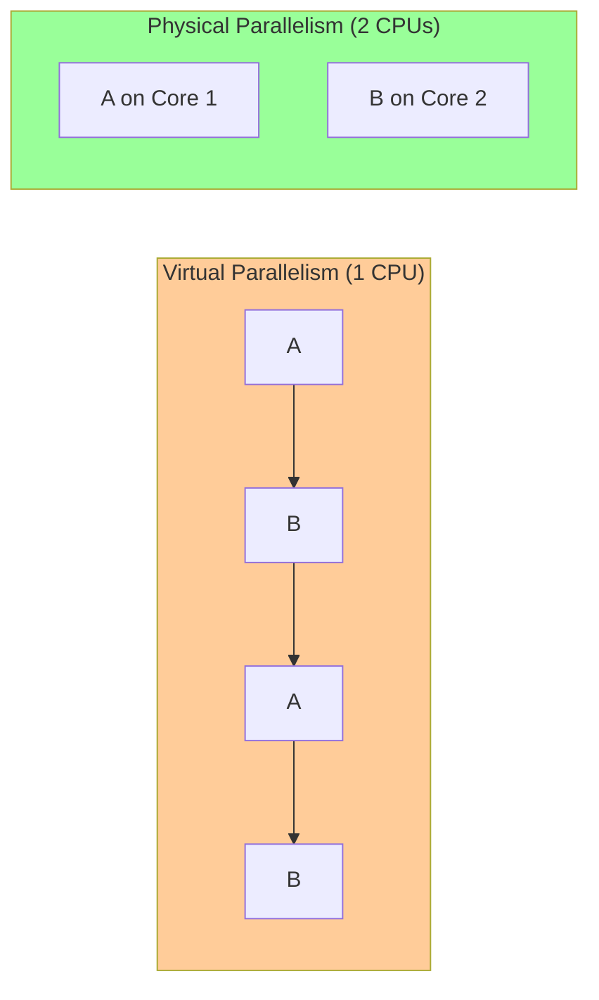

Every context switch incurs **overhead** — wasted time saving/restoring process state.

---

### ⚠️ Common Pitfalls

> [!danger] Pitfall: Concurrent ≠ Parallel
> Two processes can be **concurrent on 1 CPU** (they take turns) without ever truly running at the same instant.

---

### ❓ Mock Exam Questions

> [!question] Q1: Virtual vs Physical
> What is the difference between virtual and physical parallelism?
> <details><summary>Answer</summary>
>
> **Answer:**
> Virtual parallelism uses timeslicing on a single CPU to create the illusion of simultaneity. Physical parallelism runs processes truly simultaneously on multiple CPUs.
> </details>

> [!question] Q2: Context Switch Cost
> Why does context switching introduce overhead?
> <details><summary>Answer</summary>
>
> **Answer:**
> The OS must save the current process's state (registers, PC, SP) and restore the next process's state. This takes CPU time that could otherwise be used for useful work.
> </details>

---

## 2. Process Scheduling — Core Definitions

### 🧠 Core Concept

When more processes are ready to run than there are CPUs, the OS must decide **which process runs next**.

| Term | Definition |
| :--- | :--- |
| **Scheduler** | The part of the OS that makes scheduling decisions |
| **Scheduling Algorithm** | The logic/rules the scheduler uses to pick the next process |

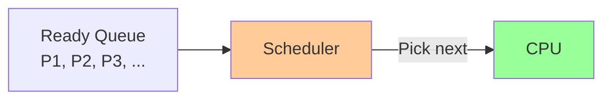

---

### ⚠️ Common Pitfalls

> [!danger] Pitfall: Scheduler ≠ Algorithm
> The scheduler is part of the OS; the algorithm is the logic it uses. They are two different things.

---

### ❓ Mock Exam Questions

> [!question] Q3: When Scheduling Is Not Needed
> Can there ever be a scenario where scheduling is not needed?
> <details><summary>Answer</summary>
>
> **Answer: Yes** — when there is only one process ready to run (or fewer processes than CPUs). No decision needed.
> </details>

---

## 3. Process Behavior & Processing Environments

### 🧠 Process Behavior

Every process alternates between two types of activity:

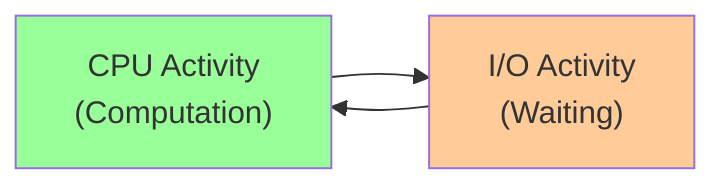

| Type | Description | Process Label |
| :--- | :--- | :--- |
| **CPU Activity** | Computation, number crunching | Compute-Bound |
| **I/O Activity** | Waiting for disk, keyboard, screen | I/O-Bound |

---

### 🧠 Processing Environments

| Environment | Who Uses It | Key Requirement |
| :--- | :--- | :--- |
| **Batch Processing** | No user (overnight jobs) | Maximize throughput |
| **Interactive** | Active users (desktop OS) | Fast, consistent response |
| **Real-Time** | Embedded/critical systems | Meet deadlines |

---

### ⚠️ Common Pitfalls

> [!danger] Pitfall: Real-time ≠ Interactive
> Real-time systems have **hard deadlines** (missing one = failure). Interactive systems just need to feel snappy.

---

### ❓ Mock Exam Questions

> [!question] Q4: Environment Classification
> A video encoder running overnight with no user interaction — which environment?
> <details><summary>Answer</summary>
>
> **Answer: Batch processing, compute-bound**
>
> No user interaction needed, maximize throughput.
> </details>

---

## 4. Criteria for Good Scheduling

### 🧠 Universal Criteria

| Criterion | Meaning |
| :--- | :--- |
| **Fairness** | Each process gets a fair share; no starvation |
| **Balance** | Keep all parts of the system busy (CPU, I/O devices) |

---

### 🧠 Batch-Specific Criteria

| Criterion | Formula / Meaning |
| :--- | :--- |
| **Turnaround Time** | $T_{turnaround} = T_{finish} - T_{arrival}$ |
| **Waiting Time** | Time spent in ready queue, not executing |
| **Throughput** | Tasks completed per unit time |
| **CPU Utilization** | Fraction of time CPU does useful work |

---

### 🧠 Interactive-Specific Criteria

| Criterion | Meaning |
| :--- | :--- |
| **Response Time** | Time from user request to first response |
| **Predictability** | Low variance in response time |

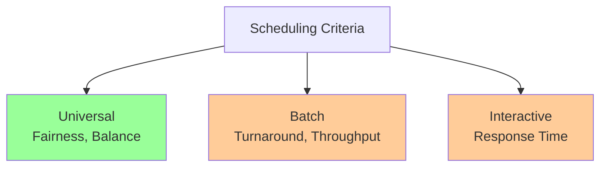

> [!tip] Turnaround = Waiting + Execution
> $T_{turnaround} = T_{waiting} + T_{execution} + \text{other delays}$

---

### ⚠️ Common Pitfalls

> [!danger] Pitfall: Fairness ≠ Equal CPU time
> A user running 10 processes shouldn't hog more CPU than a user running 1. Fairness can be per-user, not per-process.

> [!danger] Pitfall: Criteria conflict
> Optimizing throughput might hurt response time and vice versa. No single algorithm optimizes everything.

---

### ❓ Mock Exam Questions

> [!question] Q5: Turnaround vs. Waiting
> What is the difference between turnaround time and waiting time?
> <details><summary>Answer</summary>
>
> **Answer:**
> Turnaround time = total time from arrival to finish. Waiting time = only the time spent in the ready queue. Turnaround = waiting + execution.
> </details>

---

## 5. When to Schedule: Non-Preemptive vs Preemptive

### 🧠 Core Concept

| Policy | How It Works | Analogy |
| :--- | :--- | :--- |
| **Non-Preemptive** | Process runs until it **voluntarily** gives up CPU | Polite conversation |
| **Preemptive** | OS **forcibly stops** process after time quota | Talk show host cuts you off ⏱️ |

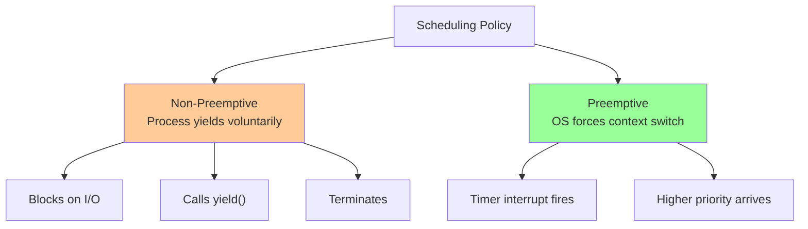

**Scheduling procedure:**
1. Scheduler is triggered (OS takes control)
2. Save context of current process → place on queue
3. Pick a suitable process using the algorithm
4. Restore context for chosen process
5. Let it run

---

### ⚠️ Common Pitfalls

> [!danger] Pitfall: Non-preemptive ≠ forever
> Non-preemptive means the process runs until **it chooses to stop** (blocks on I/O, yields, or terminates) — not that it runs infinitely.

> [!danger] Pitfall: Preemptive requires hardware
> Preemptive scheduling **requires a hardware timer** to fire interrupts. Without it, the OS cannot take back control!

---

### ❓ Mock Exam Questions

> [!question] Q6: Non-Preemptive Problem
> Why is non-preemptive scheduling problematic for interactive systems?
> <details><summary>Answer</summary>
>
> **Answer:**
> If a process decides to run for a long time, no other process can run until it voluntarily yields. This makes the system unresponsive.
> </details>

> [!question] Q7: Early Yield in Preemptive
> In what scenario might a preemptive process give up the CPU **before** its time quantum expires?
> <details><summary>Answer</summary>
>
> **Answer:**
> When it blocks on I/O (e.g., waiting for disk/keyboard input) or when a higher-priority process arrives and preempts it.
> </details>

---

## 6. Batch Processing Algorithms

### 6.1 First-Come First-Served (FCFS)

#### 🧠 Core Concept

- Tasks queued in **FIFO order** by arrival time
- First task runs until it **finishes or blocks**
- Blocked tasks rejoin the **back of the queue**
- **Guaranteed: No starvation**

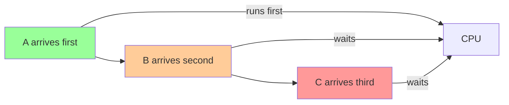

**Example:** A=8, B=5, C=3 (all arrive at t=0)

```
Timeline: [AAAAAAAA][BBBBB][CCC]
           0        8     13  16
```

| Task | Arrival | Finish | Waiting |
| :--- | :--- | :--- | :--- |
| A | 0 | 8 | 0 |
| B | 0 | 13 | 8 |
| C | 0 | 16 | 13 |

$$\text{Average Waiting} = \frac{0 + 8 + 13}{3} = 7 \text{ TUs}$$

---

### ⚠️ Common Pitfalls

> [!danger] Pitfall: Convoy Effect
> If a long CPU-bound job is at the front, all short I/O-bound jobs pile up behind it. Both CPU and I/O devices end up idle at different times — very wasteful!

---

### ❓ Mock Exam Questions

> [!question] Q8: FCFS Starvation
> Why does FCFS guarantee no starvation?
> <details><summary>Answer</summary>
>
> **Answer:**
> Every task eventually reaches the front of the FIFO queue. No task can be skipped indefinitely.
> </details>

---

### 6.2 Shortest Job First (SJF)

#### 🧠 Core Concept

- Select the task with the **smallest total CPU time**
- **Non-preemptive** — once started, runs to completion
- **Optimal** for minimizing average waiting time (fixed job set)
- **Starvation possible** — long jobs may never run

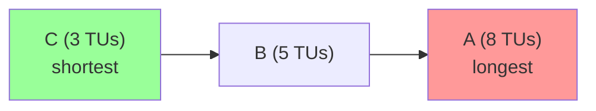

**Example:** Same tasks, SJF reorders: **C → B → A**

```
Timeline: [CCC][BBBBB][AAAAAAAA]
           0    3     8        16
```

| Task | Waiting |
| :--- | :--- |
| C | 0 |
| B | 3 |
| A | 8 |

$$\text{Average Waiting} = \frac{0 + 3 + 8}{3} = 3.67 \text{ TUs}$$

Compare to FCFS's **7 TUs** — SJF is much better!

---

#### Predicting CPU Time (Exponential Average)

Since we often don't know CPU time in advance:

$$\text{Predicted}_{n+1} = \alpha \cdot \text{Actual}_n + (1 - \alpha) \cdot \text{Predicted}_n$$

| $\alpha$ Value | Behavior |
| :--- | :--- |
| $\alpha = 1$ | Trust only most recent burst |
| $\alpha = 0$ | Ignore recent history entirely |
| $\alpha = 0.5$ | Balance recent and historical |

---

### ⚠️ Common Pitfalls

> [!danger] Pitfall: SJF requires foreknowledge
> SJF requires knowing the total CPU time upfront. In practice, this is estimated via exponential averaging — not exact.

> [!danger] Pitfall: SJF starvation
> If short jobs keep arriving, a long job may **never** run.

---

### ❓ Mock Exam Questions

> [!question] Q9: SJF Optimality
> Why does SJF minimize average waiting time for a fixed job set?
> <details><summary>Answer</summary>
>
> **Answer:**
> Short jobs don't add much to the waiting time of others. Running them first minimizes the total "waiting contributed" by each job. A long job running first adds its full duration to everyone else's wait.
> </details>

> [!question] Q10: Alpha Value
> What value of $\alpha$ gives full weight to the most recent CPU burst?
> <details><summary>Answer</summary>
>
> **Answer: $\alpha = 1$**
>
> The formula becomes: Predicted = Actual (ignores all history).
> </details>

---

### 6.3 Shortest Remaining Time (SRT)

#### 🧠 Core Concept

SRT is the **preemptive version of SJF**:

- Use **remaining CPU time** instead of total
- When a new job arrives with shorter remaining time → **preempt immediately**

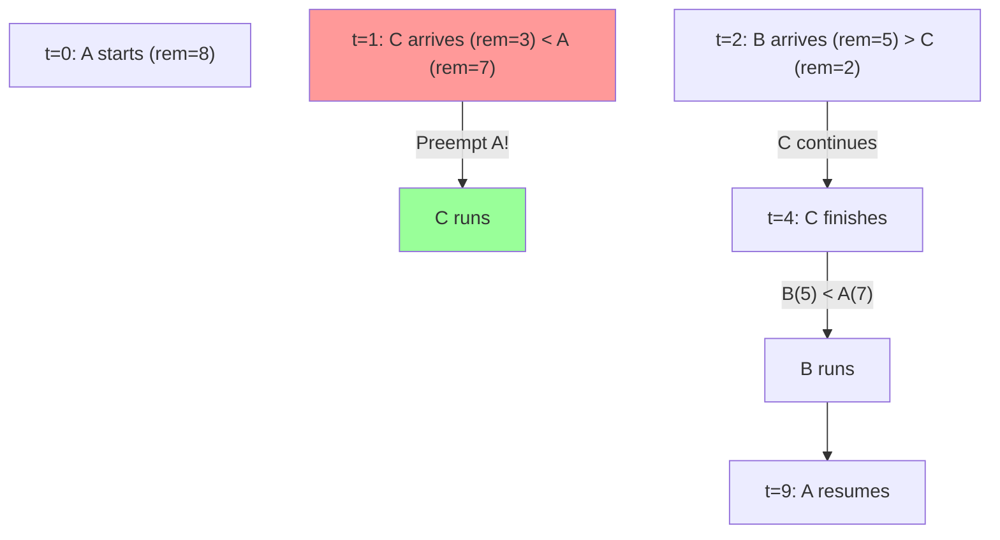

**Example:** A(8, t=0), C(3, t=1), B(5, t=2)

```
Timeline: [A][CCC][BBBBB][AAAAAAA]
           0 1    4      9       16
```

---

### ⚠️ Common Pitfalls

> [!danger] Pitfall: SRT overhead
> More context switches than SJF — preemption has overhead. But it handles late-arriving short jobs well.

---

### ❓ Mock Exam Questions

> [!question] Q11: SRT vs. SJF
> How does SRT differ from SJF?
> <details><summary>Answer</summary>
>
> **Answer:**
> SRT is preemptive — when a new job arrives with shorter remaining time, the current job is preempted. SJF is non-preemptive — once a job starts, it runs to completion.
> </details>

---

## 7. Interactive System Algorithms

> [!tip] Key Difference
> Interactive systems use **preemptive** scheduling. The OS regains control periodically via **timer interrupts**.

| Term | Meaning | Typical Value |
| :--- | :--- | :--- |
| **Interval of Timer Interrupt (ITI)** | How often hardware clock fires | 1ms – 10ms |
| **Time Quantum** | Execution slot per process | 5ms – 100ms |

> [!warning] Quantum is always a multiple of ITI
> If ITI = 10ms and quantum = 20ms, the scheduler fires every 10ms but only switches every 2nd trigger.

---

### 7.1 Round Robin (RR)

#### 🧠 Core Concept

- Processes stored in a **FIFO queue**
- Each process runs for at most one **time quantum (q)**
- When quantum expires → process goes to **back of queue**
- Response time guarantee: $T_{max\_wait} = (n - 1) \times q$

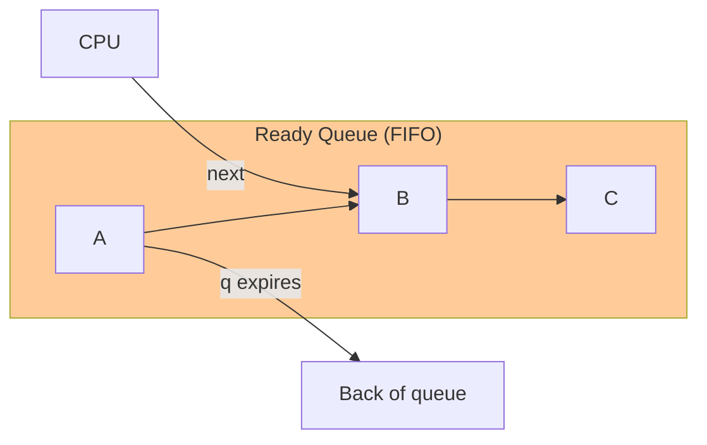

#### Time Quantum Trade-Off

| Quantum Size | Pro | Con |
| :--- | :--- | :--- |
| **Large** | Better CPU utilization | Longer wait for others |
| **Small** | Shorter wait time | More context switches → overhead |

---

### ⚠️ Common Pitfalls

> [!danger] Pitfall: RR = Preemptive FCFS
> Same queue ordering as FCFS, but with a time limit. Very small quantum → CPU spends more time context switching than doing work!

---

### ❓ Mock Exam Questions

> [!question] Q12: RR Wait Time
> Derive the maximum waiting time formula $(n-1)q$ for Round Robin.
> <details><summary>Answer</summary>
>
> **Answer:**
> With n processes and quantum q, the worst case is that a process must wait for all other n-1 processes to each use their full quantum before it runs again: $(n-1) \times q$.
> </details>

---

### 7.2 Priority Scheduling

#### 🧠 Core Concept

- Assign each process a **priority value**
- Scheduler always picks the **highest priority** ready process
- **Preemptive**: arriving high-priority immediately displaces current
- **Non-preemptive**: waits for next scheduling decision

---

#### Problem: Priority Inversion 😱

A **lower-priority task** effectively delays a **higher-priority task**:

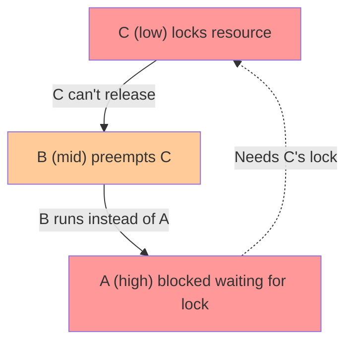

**Scenario:** C locks a resource → B preempts C → A needs C's lock → A blocked → B runs instead of A!

> [!warning] Real-World Impact
> Priority inversion crashed the **Mars Pathfinder rover** in 1997! 🚀

**Fixes:** Priority inheritance (boost priority of lock holder) or aging (gradually increase priority of waiting processes).

---

### ⚠️ Common Pitfalls

> [!danger] Pitfall: Starvation risk
> Low-priority processes may **never** run if high-priority ones keep arriving.

---

### ❓ Mock Exam Questions

> [!question] Q13: Priority Inversion
> What is priority inversion? Describe the conditions needed.
> <details><summary>Answer</summary>
>
> **Answer:**
> A high-priority process is blocked waiting for a resource held by a low-priority process, while a mid-priority process runs instead. Conditions: (1) low-priority holds a shared resource, (2) mid-priority preempts low, (3) high-priority needs the same resource.
> </details>

---

### 7.3 Multi-Level Feedback Queue (MLFQ)

#### 🧠 Core Concept

MLFQ solves the hardest problem: **scheduling well without knowing process behavior in advance.** It _learns_ from behavior and adjusts dynamically.

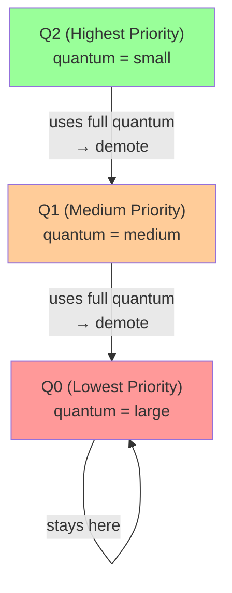

#### Rules

| Rule | Description |
| :--- | :--- |
| **Rule 1** | Higher priority always runs first |
| **Rule 2** | Same priority → Round Robin |
| **Rule 3** | New job → placed in **highest priority queue** |
| **Rule 4** | Uses full quantum → priority **decreases** (CPU-bound) |
| **Rule 5** | Gives up / blocks early → priority **stays** (I/O-bound) |

---

#### How MLFQ Learns

| Process Type | Behavior | MLFQ Response |
| :--- | :--- | :--- |
| **CPU-bound** | Uses full quantum every time | Sinks to Q0 (lowest) |
| **I/O-bound** | Blocks before quantum expires | Stays at Q2 (highest) |
| **Short job** | Finishes quickly at Q2/Q1 | Gets fast response |

---

### ⚠️ Common Pitfalls

> [!danger] Pitfall: Gaming MLFQ
> A clever process could yield just **before** its quantum expires every turn — staying at high priority while behaving like a CPU hog!
>
> **Fix:** Track total CPU usage across all quanta, not just per-slice.

> [!danger] Pitfall: Starvation of CPU-bound jobs
> If I/O-bound or short jobs keep arriving, CPU-bound jobs stuck at Q0 may starve.
>
> **Fix:** Periodically **boost all jobs back to the highest queue** (priority reset).

---

### ❓ Mock Exam Questions

> [!question] Q14: MLFQ New Jobs
> Why does MLFQ give new jobs the highest priority?
> <details><summary>Answer</summary>
>
> **Answer:**
> MLFQ assumes a new job might be short (I/O-bound or interactive). By starting it at the highest priority, it gets fast response. If it turns out to be CPU-bound, it will naturally sink to lower queues.
> </details>

> [!question] Q15: MLFQ Abuse
> Describe how a malicious process could abuse the basic MLFQ rules.
> <details><summary>Answer</summary>
>
> **Answer:**
> A process could voluntarily yield just before its quantum expires on every turn. Since it never uses its full quantum, MLFQ thinks it's I/O-bound and keeps it at high priority — even though it's actually consuming lots of CPU time.
> </details>

---

### 7.4 Lottery Scheduling

#### 🧠 Core Concept

- Give each process **lottery tickets** proportional to desired CPU share
- Each decision: **draw a random ticket** → winner runs
- Over time: X% of tickets ≈ X% of CPU time

$$P(\text{process wins}) = \frac{\text{tickets held by process}}{\text{total tickets}}$$

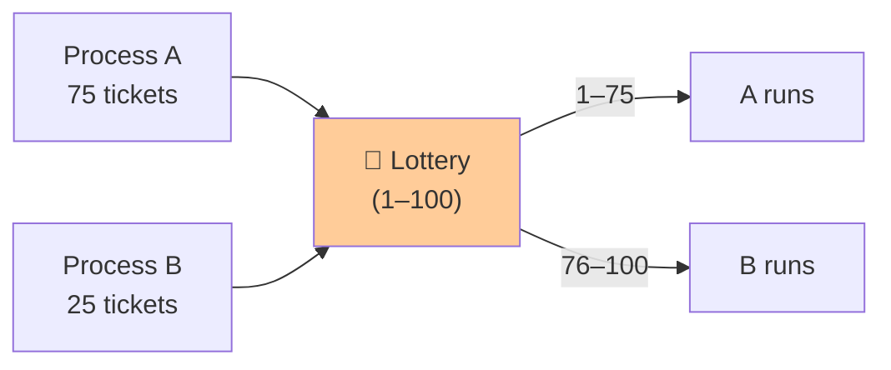

| Property | Explanation |
| :--- | :--- |
| **Responsive** | New processes join immediately |
| **Controllable** | Give important processes more tickets |
| **Simple** | Easy to implement |

---

### ⚠️ Common Pitfalls

> [!danger] Pitfall: Short-term unfairness
> B might "get lucky" and win many times in a row. Fairness is only **probabilistic in the long run**.

> [!danger] Pitfall: Not for real-time
> Lottery scheduling is **not deterministic**. Real-time systems need guaranteed deadlines.

---

### ❓ Mock Exam Questions

> [!question] Q16: Lottery vs. Priority
> What is a key advantage of lottery scheduling over priority scheduling?
> <details><summary>Answer</summary>
>
> **Answer:**
> Lottery scheduling guarantees **proportional** CPU sharing over time. Priority scheduling can cause starvation of low-priority processes. Even a process with 1 ticket will eventually win.
> </details>

---

## 8. Summary

### 📊 Algorithm Comparison

| Algorithm | Type | Environment | Starvation? | Key Property |
| :--- | :--- | :--- | :--- | :--- |
| **FCFS** | Non-preemptive | Batch | ❌ No | Simple, Convoy Effect |
| **SJF** | Non-preemptive | Batch | ✅ Yes | Optimal avg wait (fixed set) |
| **SRT** | Preemptive | Batch | ✅ Yes | Good for late short jobs |
| **Round Robin** | Preemptive | Interactive | ❌ No | Fair, bounded response |
| **Priority** | Both | Interactive | ✅ Yes | Flexible, Inversion risk |
| **MLFQ** | Preemptive | Interactive | ✅ (CPU) | Adaptive, learns behavior |
| **Lottery** | Preemptive | Interactive | ✅ (unlikely) | Proportional, probabilistic |

---

### 🎯 Decision Guide

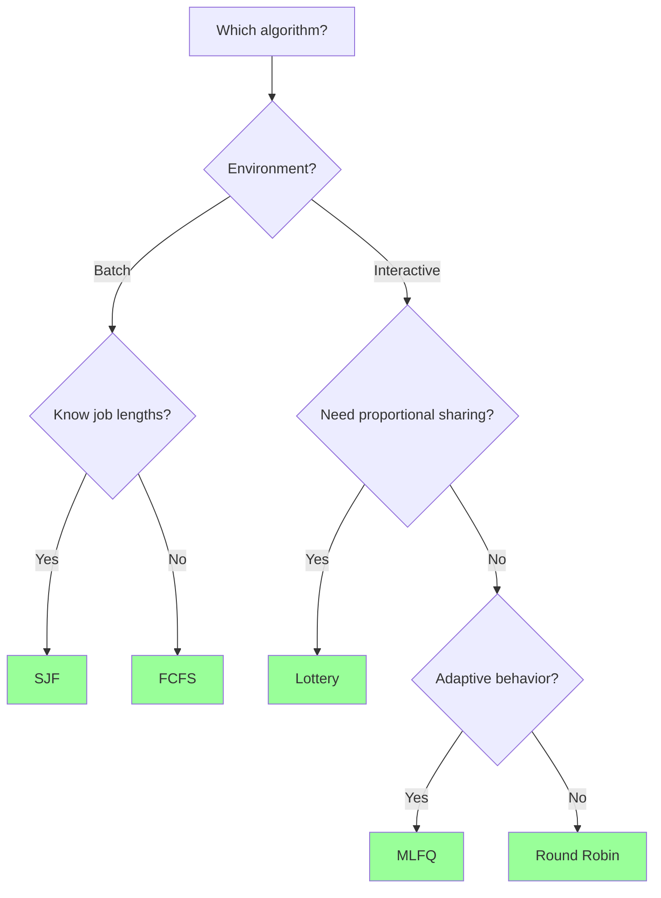

---

## 🔗 Connections

| 📚 Lecture | 🔗 Connection |
| :--- | :--- |
| [[L2]] | Process creation — scheduler picks from ready queue |
| [[L4]] | IPC — scheduling affects when processes can communicate |
| [[L5]] | Threads — same scheduling concepts apply to threads |

> [!quote] The Key Insight
> There is no single "best" scheduling algorithm. The right choice depends on the **environment**, **workload**, and **which criteria you prioritize**. Understanding the trade-offs is what matters!