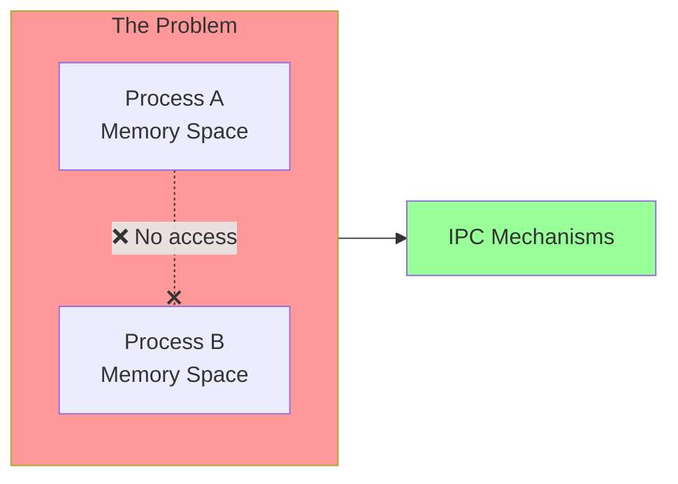
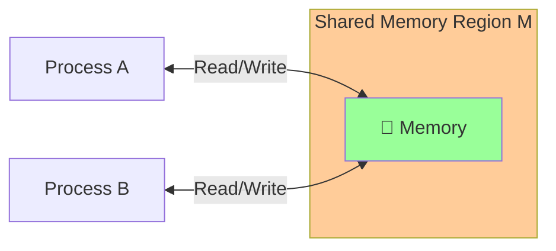
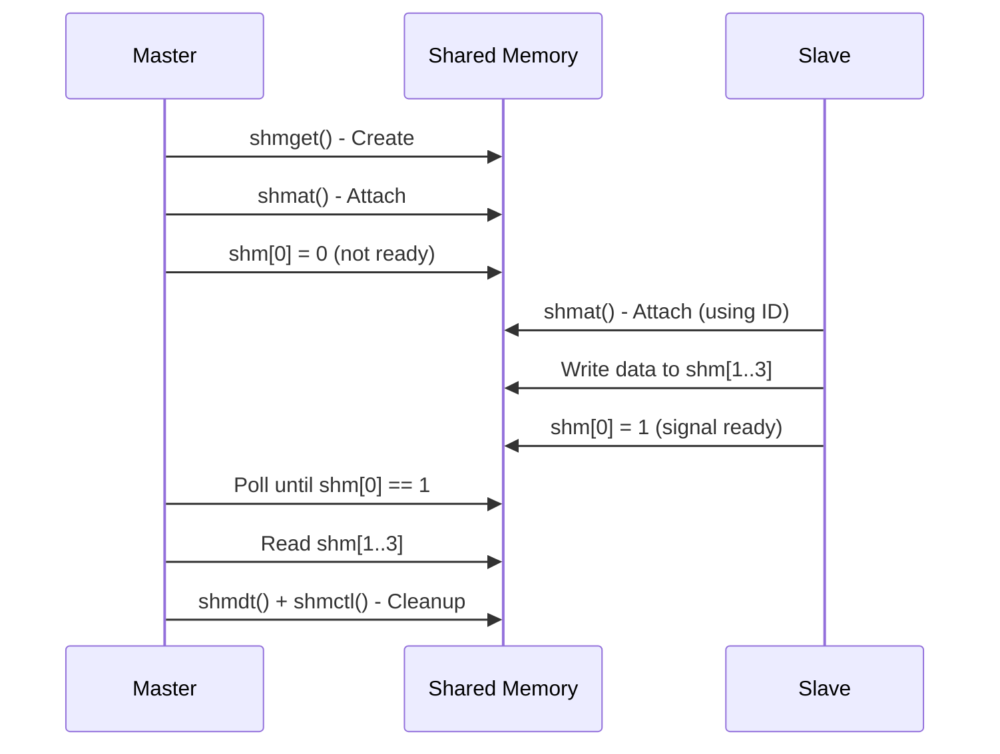
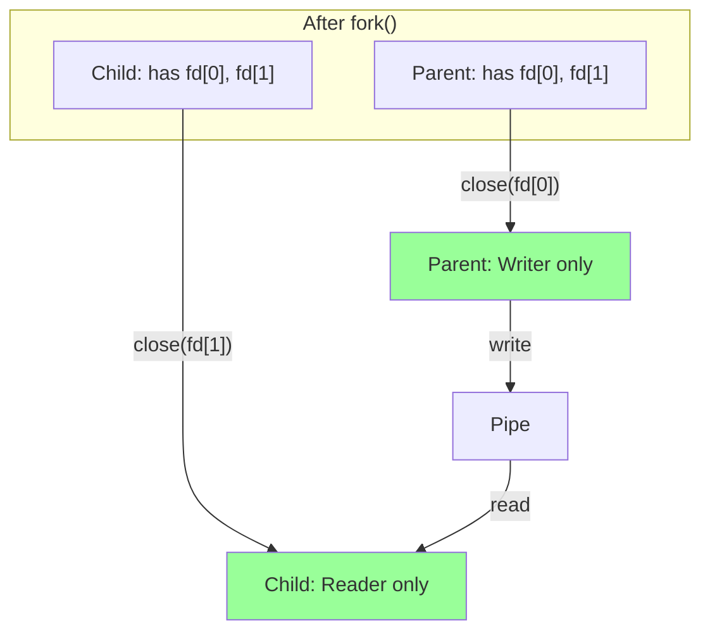
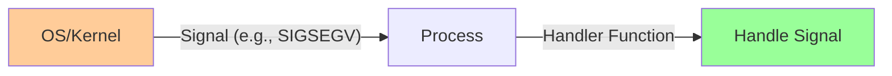
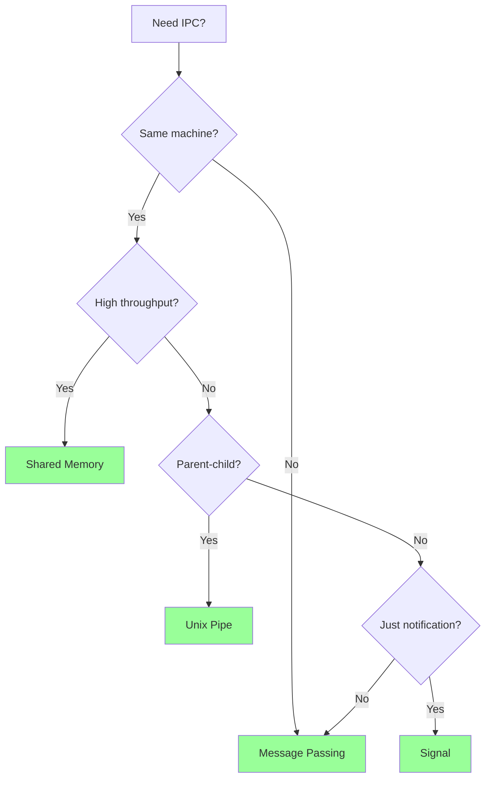

# 📘 L4: Inter-Process Communication (IPC)

> [!abstract] Lecture Goal
> Understand the four main IPC mechanisms — Shared Memory, Message Passing, Unix Pipes, and Signals — and know when to use each based on efficiency, portability, and synchronization requirements.

> [!tip] The Big Picture
> Processes are **isolated** by default — each has its own memory space. IPC is the bridge that lets them cooperate. The key trade-off: **Shared Memory = fast but hard to sync**, **Message Passing = slower but safer and portable**.

---

## 1. Why IPC?

### 🧠 The Core Problem

Each process in an OS has its **own independent memory space**. By default, Process A cannot read or write Process B's memory — they are completely isolated.

But real-world applications need processes to **cooperate and share data** (e.g., web server handling requests, compiler pipeline, database).



> **IPC (Inter-Process Communication)** is a set of mechanisms provided by the OS that allows processes to communicate and synchronize.

---

### 📊 Four Main IPC Mechanisms

| Mechanism | Type | Key Characteristic |
| :--- | :--- | :--- |
| **Shared Memory** | General | Fastest — direct memory access |
| **Message Passing** | General | Portable — works across networks |
| **Unix Pipe** | Unix-specific | Unidirectional byte stream |
| **Unix Signal** | Unix-specific | Asynchronous notification |

---

### ⚠️ Common Pitfalls

> [!danger] Pitfall: Threads vs. Processes
> Threads within the same process **do** share memory — IPC is needed only across **separate processes**. Don't confuse the two!

---

## 2. Shared Memory

### 🧠 Core Concept

A special memory region **M** is carved out and made accessible to multiple processes simultaneously. Any write by one process is immediately visible to all others — like a shared whiteboard 🗒️.



**Lifecycle:**

$$\text{Create M} \rightarrow \text{Attach M} \rightarrow \text{Read/Write M} \rightarrow \text{Detach M} \rightarrow \text{Destroy M}$$

> [!tip] Key Insight
> The OS is only involved in **Create** and **Attach**. After that, read/write happens at memory speed — **no OS involvement**! This makes it very efficient.

---

### 🛠️ POSIX System Calls

| Step | System Call | Purpose |
| :--- | :--- | :--- |
| Create | `shmget(IPC_PRIVATE, size, flags)` | Creates region, returns ID |
| Attach | `shmat(shmid, NULL, 0)` | Attaches to process address space |
| Detach | `shmdt(ptr)` | Detaches the region |
| Destroy | `shmctl(shmid, IPC_RMID, 0)` | Deletes the shared memory |

---

### ✅ Advantages vs. ❌ Disadvantages

| ✅ Advantages | ❌ Disadvantages |
| :--- | :--- |
| **Efficient** — OS only involved in setup | **Synchronization required** — race conditions |
| **Easy to use** — behaves like normal memory | **Harder to implement correctly** |
| Supports arbitrary data types and sizes | Only works on the **same machine** |

---

### 📖 Code Example: Master/Slave Pattern



**Master (Waiter):** Creates memory, polls `shm[0]` until slave signals ready.

**Slave (Writer):** Attaches using the ID, writes data, sets `shm[0] = 1` to signal.

---

### ⚠️ Common Pitfalls

> [!danger] Pitfall 1: Forgetting to detach before destroy
> You cannot call `shmctl(IPC_RMID)` if the region is still attached — it will fail or be deferred.

> [!danger] Pitfall 2: Race conditions
> If both processes write simultaneously, data corruption can occur. The example avoids this by having one writer, one reader.

> [!danger] Pitfall 3: Memory leaks
> If a process crashes before destroying shared memory, the region persists. Always clean up!

---

### ❓ Mock Exam Questions

> [!question] Q1: OS Involvement
> At which steps does the OS need to be involved in shared memory IPC?
> <details><summary>Answer</summary>
>
> **Answer: Create and Attach only**
>
> After attaching, the shared memory region behaves like normal memory — reads and writes happen directly without OS intervention.
> </details>

> [!question] Q2: Efficiency
> Why is shared memory more efficient than message passing for high-throughput IPC?
> <details><summary>Answer</summary>
>
> **Answer: No system calls per operation**
>
> Shared memory requires OS involvement only during setup. Message passing requires a system call for every send/receive.
> </details>

---

## 3. Message Passing

### 🧠 Core Concept

Processes communicate by explicitly **sending and receiving messages** through the OS kernel — like sending emails 📧.


Every send/receive goes through the OS — this is the key difference from shared memory.

---

### 📛 Two Design Decisions

#### 1. Naming — How to address the recipient?

| Scheme | Description | Example |
| :--- | :--- | :--- |
| **Direct** | Explicitly name the other process | `send(P2, Msg)` |
| **Indirect** | Use a shared mailbox/port | `send(MB, Msg)` |

> [!tip] Indirect is more flexible
> Many processes can share one mailbox — neither sender nor receiver needs to know the other's PID.

---

#### 2. Synchronization — When to block?

| Behavior | Send | Receive |
| :--- | :--- | :--- |
| **Blocking (Sync)** | Waits until message received | Waits until message arrives |
| **Non-Blocking (Async)** | Returns immediately | Returns message or "not ready" |

---

### ✅ Advantages vs. ❌ Disadvantages

| ✅ Advantages | ❌ Disadvantages |
| :--- | :--- |
| **Portable** — works across networks | **Inefficient** — every operation needs OS |
| **Easier synchronization** — blocking auto-syncs | **Limited message size/format** |

---

### ⚠️ Common Pitfalls

> [!danger] Pitfall: Blocking receive ≠ busy-waiting
> Blocking means the OS **suspends** the process until message arrives — it does NOT spin in a loop wasting CPU!

---

### ❓ Mock Exam Questions

> [!question] Q3: Direct vs. Indirect
> What is the key difference between direct and indirect communication?
> <details><summary>Answer</summary>
>
> **Answer:**
> Indirect uses a **mailbox** as intermediary — neither process needs to know the other's PID. Direct requires both parties to know each other's identity.
> </details>

---

## 4. Unix Pipes

### 🧠 Core Concept

A Unix Pipe creates a **unidirectional byte channel** with two ends:


Think of it like a literal water pipe 🚰 — data flows in **one direction only**.

---

### 🛠️ System Call

```c
#include <unistd.h>
int pipe(int fd[]);   // fd[0] = read end, fd[1] = write end
```

| File Descriptor | Purpose | Analogy |
| :--- | :--- | :--- |
| `fd[0]` | Read end | Like `stdin` (fd=0) |
| `fd[1]` | Write end | Like `stdout` (fd=1) |

---

### 📊 Pipe Semantics

| Property | Behavior |
| :--- | :--- |
| **Order** | FIFO — First In, First Out |
| **Writer blocks** | When buffer is full |
| **Reader blocks** | When buffer is empty |
| **Direction** | Unidirectional (half-duplex) |

---

### 📖 Code Example

```c
int pipeFd[2];
pipe(pipeFd);

if (fork() > 0) {  // Parent = WRITER
    close(pipeFd[0]);               // Close unused read end!
    write(pipeFd[1], "Hello!", 7);
    close(pipeFd[1]);               // Signal EOF
} else {            // Child = READER
    close(pipeFd[1]);               // Close unused write end!
    read(pipeFd[0], buffer, 7);
    close(pipeFd[0]);
}
```



---

### ⚠️ Common Pitfalls

> [!danger] Pitfall 1: Not closing unused ends
> If writer doesn't close its read end, reader may block forever waiting for EOF. Always close the end you're not using!

> [!danger] Pitfall 2: Pipes are FIFO only
> You cannot seek inside a pipe — data must be consumed in order.

> [!danger] Pitfall 3: Related processes only
> Basic `pipe()` works only between parent and children (via `fork()`). For unrelated processes, use **named pipes (FIFOs)**.

---

### ❓ Mock Exam Questions

> [!question] Q4: Pipe Ends
> In `pipe(fd)`, which is the read end?
> <details><summary>Answer</summary>
>
> **Answer: fd[0]**
>
> Memory aid: 0 → input (like stdin=0), 1 → output (like stdout=1).
> </details>

> [!question] Q5: Bidirectional Communication
> How can you achieve bidirectional communication between parent and child?
> <details><summary>Answer</summary>
>
> **Answer: Use two pipes**
>
> - Pipe 1: parent → child
> - Pipe 2: child → parent
>
> A single pipe is unidirectional only.
> </details>

---

## 5. Unix Signals

### 🧠 Core Concept

A Unix Signal is an **asynchronous notification** sent to a process — like a phone call interrupting your work 📱.



**Key properties:**
- **Asynchronous** — can arrive at any time
- **Handler function** — process must handle it
- **Default handlers** — some signals have built-in behavior
- **Custom handlers** — can override defaults (for most signals)

---

### 📊 Common Unix Signals

| Signal | Meaning | Default Action | Can Override? |
| :--- | :--- | :--- | :--- |
| `SIGKILL` | Kill process | Terminate | ❌ NO |
| `SIGTERM` | Polite termination | Terminate | ✅ Yes |
| `SIGSTOP` | Pause process | Stop | ❌ NO |
| `SIGCONT` | Continue stopped process | Continue | ✅ Yes |
| `SIGSEGV` | Segmentation fault | Terminate + core | ✅ Yes |
| `SIGFPE` | Arithmetic error | Terminate | ✅ Yes |

---

### 🛠️ Registering a Custom Handler

```c
void myHandler(int signo) {
    if (signo == SIGSEGV) {
        printf("Memory access error!\n");
        exit(1);
    }
}

int main() {
    signal(SIGSEGV, myHandler);  // Register custom handler
    int *p = NULL;
    *p = 123;  // Triggers SIGSEGV
    return 0;
}
```

---

### ⚠️ Common Pitfalls

> [!danger] Pitfall 1: SIGKILL and SIGSTOP cannot be caught
> Never try to handle these — the OS won't let you. They always use default behavior.

> [!danger] Pitfall 2: Handlers must be async-signal-safe
> Using `malloc()`, `printf()`, or other complex functions inside handlers is risky (technically unsafe).

> [!danger] Pitfall 3: Signals convey no data
> Only the signal number is passed. Signals are for **notifications**, not full data transfer.

---

### ❓ Mock Exam Questions

> [!question] Q6: Uncatchable Signals
> Which signals cannot be caught or overridden by a custom handler?
> <details><summary>Answer</summary>
>
> **Answer: SIGKILL and SIGSTOP**
>
> These always use their default behavior regardless of any `signal()` call.
> </details>

---

## 6. Summary

### 📊 IPC Mechanisms Comparison

| Mechanism | Speed | Portability | Synchronization | Use Case |
| :--- | :--- | :--- | :--- | :--- |
| **Shared Memory** | 🚀 Fastest | Same machine only | Manual (mutex) | High-throughput local IPC |
| **Message Passing** | 🐢 Slower | Works across network | Built-in blocking | Distributed systems |
| **Unix Pipe** | ⚡ Fast | Unix only | Blocking I/O | Parent-child communication |
| **Unix Signal** | ⚡ Fast | Unix only | Async handlers | Event notifications |

---

### 🎯 Decision Guide



---

## 🔗 Connections

| 📚 Lecture | 🔗 Connection |
| :--- | :--- |
| [[L1]] | OS services — IPC is a core OS service for communication |
| [[L2]] | Process isolation — IPC bridges isolated memory spaces |
| [[L3]] | Scheduling — blocked processes waiting for IPC go to Blocked state |
| [[L5]] | Threads — share memory within same process (no IPC needed!) |
| [[content/CS2106/L6]] | Synchronization — semaphores protect shared memory; pipes use blocking I/O |
| [[L10]] | File descriptors — pipes use the file descriptor interface |
| [[L11]] | File system — pipes are implemented via file system mechanisms |
| [[L12]] | File system calls — `read()`/`write()` used in pipe communication |

> [!quote] The Key Insight
> The key to IPC is knowing **when the OS is involved**, and always thinking about **synchronization**. Shared Memory is fast but you manage races; Message Passing is slower but safer!