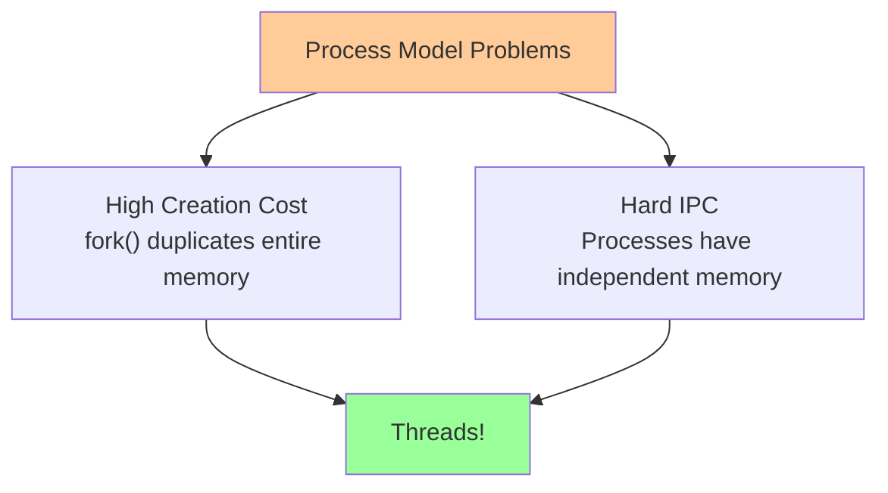
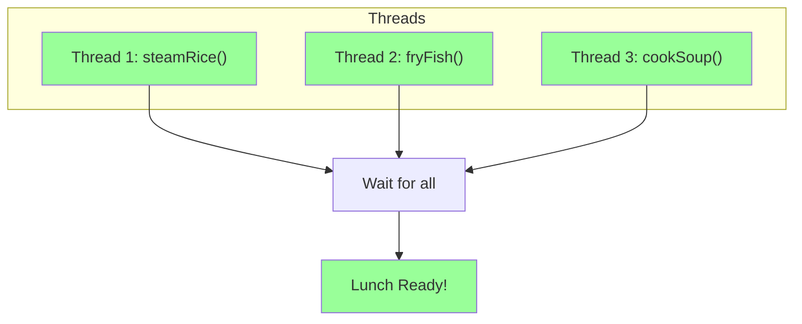
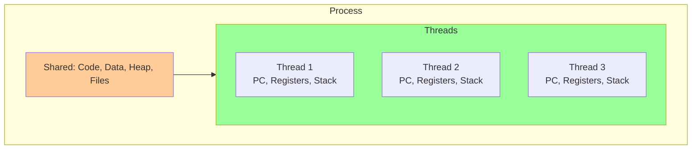
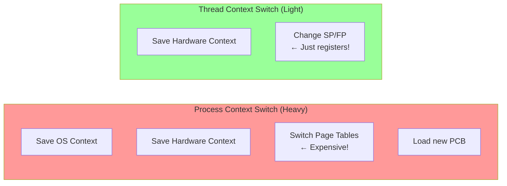
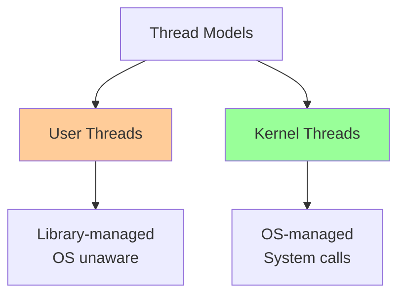
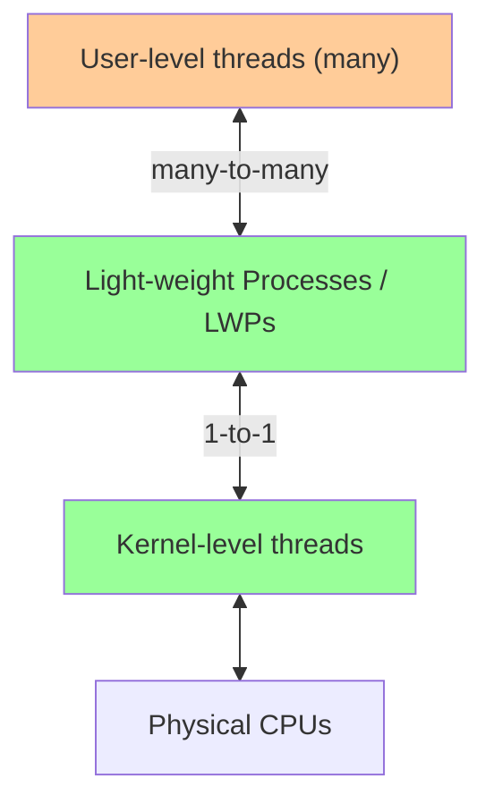
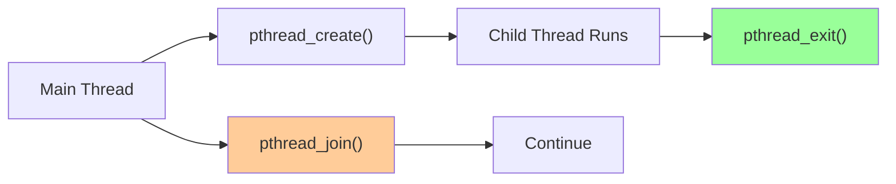

# 🧵 L5: Process Alternative — Threads

> [!abstract] Lecture Goal
> Understand why threads were invented as a lighter alternative to processes, how they differ from processes in resource sharing, and master the POSIX thread (pthread) API.

> [!tip] The Big Picture
> Threads are the dominant concurrency mechanism in modern computing. They solve the **two fatal flaws** of processes: expensive creation and hard communication. But shared memory is a double-edged sword — it enables easy communication but causes race conditions!

---

## 1. Why Threads? (Motivation)

### 🧠 The Core Problem

Processes are **expensive** to create and manage for two main reasons:



| Problem | Description |
| :--- | :--- |
| **High creation cost** | `fork()` duplicates the entire memory space and process context — wasteful when you just want multiple tasks within the same program |
| **Hard IPC** | Processes have independent memory spaces; passing data requires special mechanisms (pipes, shared memory, message queues) |

---

### 🍱 The Cooking Analogy

Imagine preparing lunch: steam rice 🍚, fry fish 🐟, cook soup 🍲.

**Single-threaded approach:** One cook does all three tasks _sequentially_:


Total time = sum of all three task durations.

**Multi-threaded approach:** Three threads run **concurrently** within the same process:



Total time ≈ duration of the **longest** task (not the sum!).

---

### ⚠️ Common Pitfalls

> [!danger] Pitfall 1: Concurrency ≠ Parallelism
> Concurrent threads can **interleave** on a single CPU (they take turns). True parallelism requires multiple CPUs running threads simultaneously.

> [!danger] Pitfall 2: fork() is NOT threading
> Using `fork()` creates a separate **process** with its own memory copy — threads within the same process share memory directly.

---

### ❓ Mock Exam Questions

> [!question] Q1: Process Model Problems
> Name **two** reasons why the process model (using `fork()`) is considered expensive.
> <details><summary>Answer</summary>
>
> **Answer:**
> 1. High creation cost — `fork()` duplicates entire memory space
> 2. Hard inter-process communication — processes have independent memory spaces, requiring IPC mechanisms
> </details>

> [!question] Q2: Multi-threaded Speedup
> In the cooking analogy, why is the multi-threaded version faster than the single-threaded version?
> <details><summary>Answer</summary>
>
> **Answer:**
> Multi-threaded runs tasks concurrently, so total time ≈ longest task duration. Single-threaded runs sequentially, so total time = sum of all durations.
> </details>

> [!question] Q3: fork() Communication
> Why does `fork()` make it hard for processes to communicate?
> <details><summary>Answer</summary>
>
> **Answer:**
> `fork()` creates an independent copy of the parent's memory. Changes in the child don't affect the parent. Communicating requires explicit IPC (pipes, shared memory, message queues).
> </details>

---

## 2. What is a Thread?

### 🧠 Core Concept

A **thread** is a _unit of execution_ within a process. Traditionally, a process has a **single thread of control** — only one instruction executes at any point in time.

$$\text{Multithreaded Process} = \text{Shared Resources} + N \times \text{Thread (own PC, registers, stack)}$$



Each thread has its own **Program Counter (PC)** that tracks where it is in the code.

---

### ⚠️ Common Pitfalls

> [!danger] Pitfall 1: Thread ≠ Process
> Multiple threads live **inside** one process and share its address space.

> [!danger] Pitfall 2: "At the same time" is conceptual
> On a single-core CPU, threads take turns very quickly, giving the **illusion** of parallelism.

---

### ❓ Mock Exam Questions

> [!question] Q4: Thread of Control
> What does "thread of control" mean? What hardware register tracks it?
> <details><summary>Answer</summary>
>
> **Answer:**
> "Thread of control" means the sequence of instructions being executed. The **Program Counter (PC)** register tracks it.
> </details>

> [!question] Q5: Program Counters
> If a process has 3 threads, how many Program Counters exist?
> <details><summary>Answer</summary>
>
> **Answer: 3**
> Each thread has its own PC to track its execution position.
> </details>

---

## 3. Process vs Thread

### 🧠 What Threads Share vs. Own

| Resource | Shared Between Threads? |
| :--- | :--- |
| Code (Text Segment) | ✅ Yes |
| Global Data (Data Segment) | ✅ Yes |
| Heap (dynamic memory) | ✅ Yes |
| Open Files / Process ID | ✅ Yes (OS Context) |
| Registers (GPR, PC, SP, FP) | ❌ No — each thread has its own |
| Stack | ❌ No — each thread has its own |
| Thread ID | ❌ No — unique to each thread |

> [!tip] Why Each Thread Needs Its Own Stack
> Each thread calls functions independently, so it needs its own call stack to track local variables and return addresses.

---

### 🔄 Context Switch Comparison



| Component | Process Switch | Thread Switch (same process) |
| :--- | :--- | :--- |
| General Purpose Registers | ✅ Save/restore | ✅ Save/restore |
| Program Counter (PC) | ✅ Save/restore | ✅ Save/restore |
| Stack Pointer (SP) | ✅ Save/restore | ✅ Save/restore |
| Page Table | ✅ Switch — **expensive!** | ❌ Not needed |
| OS Context (PCB, files) | ✅ Load new PCB | ❌ Not needed |
| TLB Flush | ✅ Usually required | ❌ Not required |

$$\text{Thread switch cost} \ll \text{Process switch cost}$$

This is why threads are called **lightweight processes**.

---

### 📊 Benefits of Threads

| Benefit | Explanation |
| :--- | :--- |
| **Economy** | Less resources needed than managing multiple processes |
| **Resource Sharing** | Threads share memory — no IPC overhead |
| **Responsiveness** | UI thread stays responsive while worker threads compute |
| **Scalability** | Can utilize multiple CPU cores simultaneously |

---

### ⚠️ Common Pitfalls

> [!danger] Pitfall 1: Shared memory is dangerous!
> Threads can read/write each other's data, enabling easy communication but causing **race conditions** if not synchronized.

> [!danger] Pitfall 2: Stack vs. Heap confusion
> Local variables (on stack) are **private** to each thread. Global variables and heap allocations are **shared** by all threads.

---

### ❓ Mock Exam Questions

> [!question] Q6: Shared vs. Unique Resources
> List **three** things threads share, and **two** things unique to each thread.
> <details><summary>Answer</summary>
>
> **Answer:**
> - **Shared:** Code, global data, heap, open files, process ID
> - **Unique:** Registers (PC, SP, FP), stack, thread ID
> </details>

> [!question] Q7: Context Switch Cost
> Why is a thread context switch cheaper than a process context switch?
> <details><summary>Answer</summary>
>
> **Answer:**
> Thread switching avoids expensive memory context switch (no page table swap, no TLB flush). Only hardware context (registers) needs saving/restoring.
> </details>

> [!question] Q8: Race Condition
> Thread A and Thread B each increment `counter++` 1000 times. Should the final value be 2000?
> <details><summary>Answer</summary>
>
> **Answer: NO**
> `counter++` is not atomic (LOAD → ADD → STORE). If both threads read the same value before either writes, one increment is lost. Requires **mutex locks** to fix.
> </details>

---

## 4. Thread Models: User vs Kernel Threads

### 🧠 Two Implementation Approaches



---

#### 👤 User Threads

Implemented entirely as a **user-space library**. The OS kernel is **completely unaware** that multiple threads exist — it only sees one process.

| Advantage | Disadvantage |
| :--- | :--- |
| Works on **any OS** | OS schedules at **process level** — one thread blocks → all block |
| Thread ops are **library calls** — very fast | **Cannot exploit multiple CPUs** |
| Highly **configurable** scheduling | |

$$\text{One thread blocks} \Rightarrow \text{Process blocks} \Rightarrow \text{ALL threads blocked}$$

---

#### 🔧 Kernel Threads

Threads are implemented **inside the OS**. Thread operations are **system calls**.

| Advantage | Disadvantage |
| :--- | :--- |
| Kernel schedules **per-thread** | Every operation is a **system call** — slower |
| One thread blocking does **not** block others | **Less flexible** — one-size-fits-all |
| True **multi-core parallelism** | |

---

### ⚠️ Common Pitfalls

> [!danger] Pitfall 1: User threads aren't "bad"
> They're faster for thread operations and great for programs that don't need true parallelism. But they fail hard if any thread makes a blocking system call.

> [!danger] Pitfall 2: Kernel threads are heavier
> But essential when you need real multi-core parallelism.

---

### ❓ Mock Exam Questions

> [!question] Q9: User Thread Blocking
> In the user thread model, what happens if one thread makes a blocking system call?
> <details><summary>Answer</summary>
>
> **Answer:**
> The OS sees the entire process as blocked. All other threads in that process are unable to run, even if ready.
> </details>

> [!question] Q10: Kernel Thread Advantage
> Why can kernel threads exploit multiple CPUs but user threads cannot?
> <details><summary>Answer</summary>
>
> **Answer:**
> The OS is aware of each kernel thread and can schedule them independently on different CPUs. User threads are invisible to the OS, which only sees one schedulable unit (the process).
> </details>

> [!question] Q11: Web Server Scenario
> A web server uses user threads for 100 clients. One thread blocks on a database query. What happens?
> <details><summary>Answer</summary>
>
> **Answer:**
> All 99 other client threads are blocked too — the web server becomes unresponsive until the database query returns.
> </details>

---

## 5. Hybrid Thread Model

### 🧠 Best of Both Worlds

The hybrid model supports **both user threads and kernel threads**:



Benefits:
- **Flexibility** — tune how many kernel threads a process gets
- **Concurrency control** — limit parallelism per process/user
- **Efficiency** — cheap user-thread operations within kernel thread context

---

### 🔧 Hardware-Level Threading (SMT)

Modern CPUs use **Simultaneous Multi-Threading (SMT)**, aka **Hyperthreading**:

| Feature | Description |
| :--- | :--- |
| Multiple register sets | One physical core has multiple logical cores |
| Shared execution units | Threads share ALU, cache, etc. |
| True parallelism | No software context switch needed |

> [!tip] SMT ≠ Multiple Cores
> Hyperthreading makes one physical core look like two logical cores, but they share execution units — performance gains are workload-dependent.

---

### ❓ Mock Exam Questions

> [!question] Q12: Hybrid Model Advantage
> How does the hybrid model avoid the main weakness of pure user threads?
> <details><summary>Answer</summary>
>
> **Answer:**
> By binding user threads to kernel threads, when one user thread blocks, the kernel can switch to another kernel thread (with its bound user threads), allowing other threads to continue.
> </details>

> [!question] Q13: SMT vs. Software Threading
> What is the key difference between SMT and software-level multi-threading?
> <details><summary>Answer</summary>
>
> **Answer:**
> SMT is hardware-level — multiple threads run truly simultaneously on the same physical core with no context switch overhead. Software threading requires the OS to save/restore context.
> </details>

---

## 6. POSIX Threads (pthread)

### 🛠️ The Standard API

**pthreads** is the standard thread API for Unix/Linux, defined by POSIX.

```c
#include <pthread.h>
// Compile with:
gcc myprogram.c -lpthread
```

**Key data types:**
| Type | Purpose |
| :--- | :--- |
| `pthread_t` | Thread ID |
| `pthread_attr_t` | Thread attributes (priority, stack size, etc.) |

---

### 🚀 Thread Creation: `pthread_create`

```c
int pthread_create(
    pthread_t* tidCreated,           // Output: TID of new thread
    const pthread_attr_t* threadAttr, // Thread attributes (NULL = defaults)
    void* (*startRoutine)(void*),    // Function for thread to execute
    void* argForStartRoutine         // Argument passed to that function
);
```

- Returns `0` on success, non-zero on error
- New thread begins executing `startRoutine(arg)` immediately
- **Caller and new thread run concurrently!**

---

### 🛑 Thread Termination: `pthread_exit`

```c
int pthread_exit(void* exitValue);
```

- `exitValue` is captured by `pthread_join`
- If not called explicitly, thread terminates when `startRoutine` returns

---

### 🔗 Thread Synchronization: `pthread_join`

```c
int pthread_join(pthread_t threadID, void** status);
```

- Blocks caller until target thread terminates
- `status` receives the exit value
- Analogous to `waitpid()` for processes



---

### 📖 Code Examples

#### Example 1 — Basic Creation

```c
void* sayHello(void* arg) {
    printf("Just to say hello!\n");
    pthread_exit(NULL);
}

int main() {
    pthread_t tid;
    pthread_create(&tid, NULL, sayHello, NULL);
    printf("Thread created with tid %i\n", tid);
    return 0;  // ⚠️ PROBLEM: may exit before child prints!
}
```

> [!warning] Bug: No `pthread_join`
> `main()` might exit before `sayHello` prints! The main thread doesn't wait.

**Fix:**
```c
pthread_join(tid, NULL);  // Wait for child to finish
return 0;
```

---

#### Example 2 — Shared Memory Race Condition

```c
int globalVar;  // Shared between ALL threads

void* doSum(void* arg) {
    for (int i = 0; i < 1000; i++)
        globalVar++;  // All 5 threads modify the SAME globalVar
}

int main() {
    pthread_t tid[5];
    for (int i = 0; i < 5; i++)
        pthread_create(&tid[i], NULL, doSum, NULL);

    // ⚠️ PROBLEM: prints before threads finish!
    printf("Global variable is %i\n", globalVar);
    return 0;
}
```

**Two problems:**
1. No `pthread_join` → main prints before threads finish
2. `globalVar++` is not atomic → **race condition**

**Fix:**
```c
for (int i = 0; i < 5; i++)
    pthread_join(tid[i], NULL);

printf("Global variable is %i\n", globalVar);
// Note: Race condition on globalVar++ still exists!
// Requires mutex locks (covered later)
```

---

### ⚠️ Common Pitfalls

> [!danger] Pitfall 1: Forgetting pthread_join
> Main thread may exit and kill all child threads before they finish.

> [!danger] Pitfall 2: pthread_exit in main vs return
> `return 0` in main may terminate all threads. `pthread_exit(NULL)` lets other threads finish.

> [!danger] Pitfall 3: globalVar++ is NOT atomic
> It compiles to LOAD → ADD → STORE. Another thread can interrupt between steps.

---

### ❓ Mock Exam Questions

> [!question] Q14: pthread_join Purpose
> What is the role of `pthread_join`? What happens if you forget it?
> <details><summary>Answer</summary>
>
> **Answer:**
> It blocks the calling thread until the target thread terminates. Forgetting it means the main thread may exit before child threads finish, killing them prematurely.
> </details>

> [!question] Q15: pthread_exit in main
> Why does `pthread_exit(NULL)` in `main()` behave differently from `return 0`?
> <details><summary>Answer</summary>
>
> **Answer:**
> `return 0` exits the process, terminating all threads. `pthread_exit(NULL)` terminates only the main thread, allowing other threads to continue running.
> </details>

> [!question] Q16: Expected vs. Actual Result
> 5 threads each increment `globalVar` 1000 times. What's expected? What's actual?
> <details><summary>Answer</summary>
>
> **Answer:**
> - Expected: 5000
> - Actual: Unpredictable (less than 5000) due to race condition on non-atomic increment.
> </details>

---

## 7. Summary

### 📊 Key Takeaways

| Concept | Key Point |
| :--- | :--- |
| **Why threads?** | Solve expensive process creation and hard IPC |
| **Thread vs Process** | Threads share memory; each has own PC, registers, stack |
| **Context switch** | Thread switch is cheap (no page table swap) |
| **User threads** | Fast but can't use multiple CPUs; one blocks → all block |
| **Kernel threads** | Slower syscalls but true parallelism |
| **pthread API** | `pthread_create`, `pthread_join`, `pthread_exit` |
| **Race conditions** | Shared variables need synchronization (mutex) |

---

## 🔗 Connections

| 📚 Lecture | 🔗 Connection |
| :--- | :--- |
| [[L1]] | Kernel threads — OS schedules kernel threads; user threads are library-managed |
| [[L2]] | Process context — threads share memory context, each has own hardware context |
| [[L3]] | Scheduling — same scheduling concepts apply (Ready/Running/Blocked states) |
| [[L4]] | IPC — threads within same process share memory, no IPC needed |
| [[content/CS2106/L6]] | Synchronization — race conditions arise from shared memory; mutex locks fix this |
| [[L7]] | Memory context — threads share Text, Data, Heap; each has own Stack |
| [[L8]] | Memory — all threads share the same page table |
| [[L9]] | Virtual memory — thread working sets affect frame allocation |

> [!quote] The Key Insight
> Threads give you concurrency with cheap context switching and easy shared memory. But with great power comes great responsibility — shared mutable state requires synchronization!