# 🧠 L6: Process Synchronization

> [!abstract] Lecture Goal
> Understand why concurrent processes need coordination, and master the tools (Critical Sections, Semaphores) that prevent race conditions, deadlocks, and starvation.

> [!tip] The Big Picture
> Synchronization is one of the **trickiest topics** in OS — not because the ideas are complex individually, but because reasoning about **interleaved** execution trips up almost everyone. Take it slow, draw timelines, and never assume order!

---

## 1. Race Conditions

### 🤔 The Core Problem

When two or more processes execute **concurrently** and share a **modifiable resource**, the final result can depend on the precise order of their operations. This unpredictability is called a **race condition**.

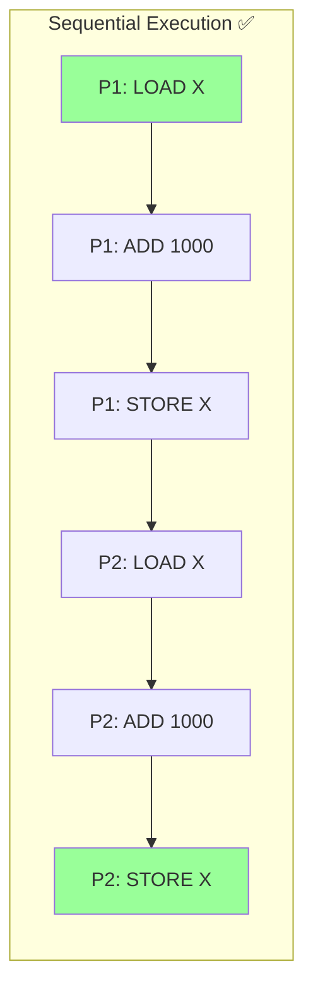

A single sequential process is **deterministic** — run it 100 times and you get the same result. But concurrent processes are **non-deterministic**: the OS can interleave their instructions in many ways.

---

### ⚙️ Why High-Level Code Isn't Atomic

A single statement like `X = X + 1000` compiles to **three** machine instructions:

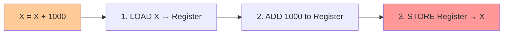

| Step | Instruction | What Happens |
| :--- | :--- | :--- |
| 1 | `LOAD X → Register` | Read X from memory into CPU |
| 2 | `ADD 1000` | Add 1000 to register value |
| 3 | `STORE Register → X` | Write result back to memory |

**The race happens between steps 3 and 3:**

| Scenario | Execution | Final X |
| :--- | :--- | :--- |
| ✅ **Good** | P1 runs 1→2→3, then P2 runs 1→2→3 | **2345** (correct!) |
| ❌ **Bad** | P1 runs 1→2, P2 runs 1→2→3, P1 runs 3 | **1345** (P2's update lost!) |

> [!warning] The Lost Update
> In the bad scenario, P2 loaded the **old** value of X before P1 stored its result. Both processes compute "new" values from the same "old" value — one update is lost.

---

### 📚 Key Terminology

| Term | Definition |
| :--- | :--- |
| **Concurrent execution** | Multiple processes making progress within overlapping time periods |
| **Race condition** | A bug where the outcome depends on non-deterministic ordering of operations |
| **Shared modifiable resource** | A variable, buffer, or data structure accessible and changeable by multiple processes |
| **Deterministic** | Same input → same output, every time |
| **Non-deterministic** | Output varies across runs due to timing/interleaving |
| **Interleaving** | The OS switching between processes mid-execution |

---

### ⚠️ Common Pitfalls

> [!danger] Pitfall 1: "High-level code = one instruction"
> Students often assume `X = X + 1` is atomic. It is NOT. At the machine level it's always multiple steps. Any step can be interrupted by a context switch.

> [!danger] Pitfall 2: "Race conditions are rare"
> They can be rare in practice (manifesting only under specific timing), making them **extremely hard to debug**. Never assume your concurrent code is correct just because it passes a few test runs!

> [!danger] Pitfall 3: "Read-only access is safe"
> Race conditions require **modification**. Two processes that only read a shared variable are safe. The race only happens when at least one process **writes**.

---

### ❓ Mock Exam Questions

> [!question] Q1: Possible Values
> Given `X = 10`, two processes P1 and P2 each execute `X = X * 2` concurrently. Which values are possible?
> <details><summary>Answer</summary>
>
> **Answer:**
> - If sequential: X = 10 → 20 → 40 (or 10 → 20 → 40)
> - If interleaved badly: Both load 10, both compute 20, both store 20
>
> Possible final values: **20 or 40**
> </details>

> [!question] Q2: Required Conditions
> Which condition is NOT required for a race condition?
> <details><summary>Answer</summary>
>
> **Answer: The processes are in the same address space**
>
> Required: concurrent execution, shared resource, at least one writer. Not required: same address space (processes can share memory via IPC).
> </details>

> [!question] Q3: Machine Instructions
> The statement `count++` in C translates to how many machine instructions?
> <details><summary>Answer</summary>
>
> **Answer: 3**
> - LOAD count → register
> - ADD 1 to register
> - STORE register → count
> </details>

---

## 2. Critical Section (CS)

### 🔒 The Solution: Protected Code Regions

The solution to race conditions is to identify the "dangerous" part of the code and wrap it in protection. This protected region is the **Critical Section**.


**Generic skeleton:**
```c
// Normal code (no shared resources)

Enter CS();          // Request permission to enter
  // Critical Work   // Only ONE process here at a time!
Exit CS();            // Signal departure

// Normal code (no shared resources)
```

---

### ✅ The Four Required Properties

For a CS implementation to be **correct**, it must satisfy all four properties:

| Property | Description | Violation = |
| :--- | :--- | :--- |
| **Mutual Exclusion** | Only one process in the CS at any time | Race condition |
| **Progress** | If no process is in the CS, a waiting process should eventually enter | Deadlock |
| **Bounded Wait** | After requesting entry, a process waits at most N times before entering | Starvation |
| **Independence** | A process NOT in the CS should never block other processes | Poor performance |

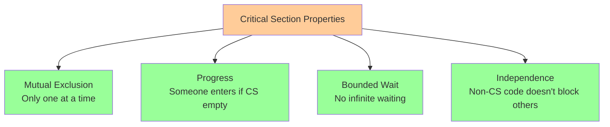

---

### 🚨 Symptoms of Broken Implementations

| Symptom | Description | Analogy |
| :--- | :--- | :--- |
| 🔴 **Deadlock** | ALL processes blocked — no one makes progress | Four cars at a 4-way stop, all waiting for each other |
| 🟡 **Livelock** | Processes "active" but make no real progress | Two people in a hallway, both stepping aside repeatedly |
| 🟠 **Starvation** | Some processes blocked forever while others proceed | The VIP line gets served, you wait forever |

> [!tip] Bathroom Analogy 🚽
> Think of the CS like a single-occupancy bathroom:
> - **Mutual exclusion** = only one person inside
> - **Progress** = if empty, next person in line gets in
> - **Bounded wait** = you don't wait forever
> - **Independence** = people not waiting don't block the line

---

### ⚠️ Common Pitfalls

> [!danger] Pitfall 1: Confusing Deadlock and Starvation
> In a **deadlock**, ALL processes are stuck — nothing moves. In **starvation**, some processes DO make progress, but one poor process is perpetually skipped.

> [!danger] Pitfall 2: Forgetting Independence
> Students often only check mutual exclusion. But if a process outside the CS can block one inside, your implementation fails — even if mutual exclusion holds.

> [!danger] Pitfall 3: Livelock ≠ Deadlock
> In a livelock, processes are NOT blocked (from the OS's perspective they are running), but they accomplish nothing. Classic example: two polite people keep saying "after you" forever.

---

### ❓ Mock Exam Questions

> [!question] Q4: Required Properties
> Which is NOT a required property of a correct CS implementation?
> <details><summary>Answer</summary>
>
> **Answer: FIFO ordering**
>
> Required: Mutual Exclusion, Progress, Bounded Wait. FIFO ordering is nice but not required — processes don't need to enter in order.
> </details>

> [!question] Q5: Symptom Identification
> All 3 processes are waiting forever at `Wait(mutex)` and none are in the CS. This is:
> <details><summary>Answer</summary>
>
> **Answer: C Deadlock**
>
> All processes blocked, none making progress = deadlock.
> </details>

> [!question] Q6: Property Violation
> Process P0 is outside the CS. Due to a bug, P0 holds a lock that prevents P1 from entering the CS. Which property is violated?
> <details><summary>Answer</summary>
>
> **Answer: D Independence**
>
> A process not in the CS should never block others from entering.
> </details>

---

## 3. CS Implementations — Assembly Level

### 🔧 Hardware Atomic Instructions

The most fundamental CS implementation uses special **atomic** hardware instructions provided by the processor.

**`TestAndSet` (TAS)** is the canonical example:

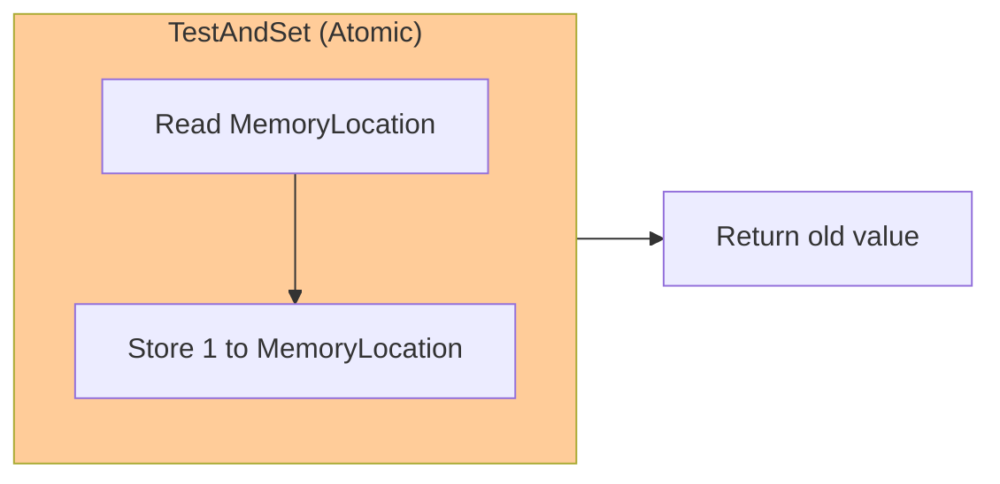

```c
// TestAndSet behavior (performed as ONE indivisible operation)
int TestAndSet(int* Lock) {
    int old_value = *Lock;  // Step 1: Read
    *Lock = 1;              // Step 2: Set to 1
    return old_value;       // Return what we read
}
```

Because this is **atomic**, no other process can interrupt between steps 1 and 2.

---

### 🔄 Spinlock Implementation

```c
// Lock = 0 means "CS is free", Lock = 1 means "CS is occupied"

void EnterCS(int* Lock) {
    while (TestAndSet(Lock) == 1);  // Spin until we "win"
}

void ExitCS(int* Lock) {
    *Lock = 0;  // Release the lock
}
```

**How it works:**

| Situation | What Happens |
| :--- | :--- |
| Lock = 0 (free) | TAS reads 0 (we win!), sets Lock to 1, while-loop exits, we enter CS |
| Lock = 1 (busy) | TAS reads 1 (we lose), sets Lock back to 1 (no change), we loop and try again |

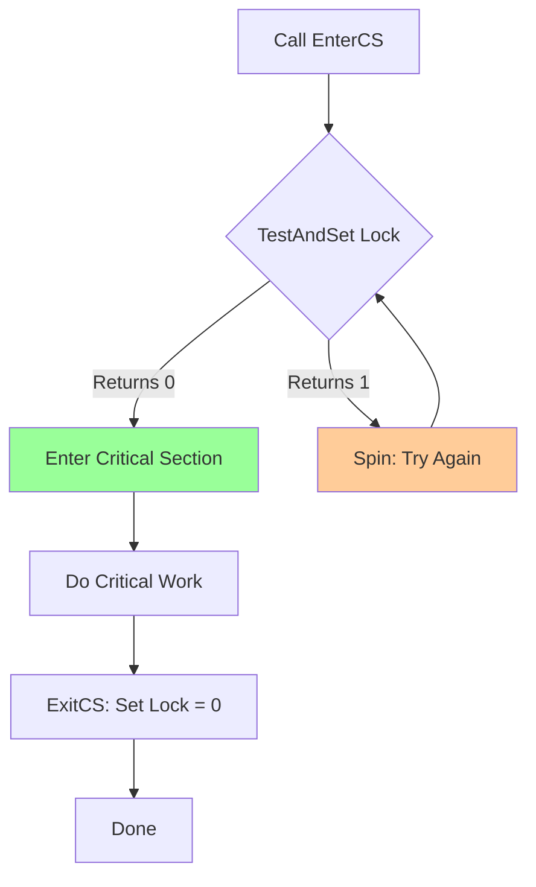

**Properties satisfied:** ✅ Mutual Exclusion, ✅ Progress, ✅ Bounded Wait

**Key downside:** 🔴 **Busy Waiting** — the waiting process keeps consuming CPU cycles checking the lock. This is wasteful!

---

### 📚 Other Atomic Instructions

| Instruction | Description |
| :--- | :--- |
| **Compare and Exchange** | Atomically compare a value and swap only if it matches |
| **Atomic Swap** | Atomically exchange two values |
| **Load-Link / Store-Conditional** | LL reads a value; SC stores only if no one else touched it |

---

### ⚠️ Common Pitfalls

> [!danger] Pitfall 1: Thinking TAS is "two steps"
> The power of TAS is that READ and SET happen as ONE indivisible instruction. You cannot separate them mentally when analyzing correctness.

> [!danger] Pitfall 2: Forgetting busy waiting is a problem
> TAS works correctly! But it wastes CPU. If the process holding the CS is long-running, the spinning process wastes potentially thousands of CPU cycles doing nothing.

---

### ❓ Mock Exam Questions

> [!question] Q7: Why Software TAS Fails
> What makes `TestAndSet` safe for mutual exclusion when implemented purely in software NOT possible?
> <details><summary>Answer</summary>
>
> **Answer: Context switches can occur between any two software instructions**
>
> Without hardware atomicity, a context switch can occur between the read and the write, allowing another process to interfere.
> </details>

> [!question] Q8: ExitCS Behavior
> After `ExitCS` is called, the Lock value becomes:
> <details><summary>Answer</summary>
>
> **Answer: 0**
>
> ExitCS sets Lock = 0 to release it, signaling the CS is free.
> </details>

> [!question] Q9: Spinlock Drawback
> The main drawback of a spinlock is:
> <details><summary>Answer</summary>
>
> **Answer: It wastes CPU cycles while waiting**
>
> The spinning process keeps checking the lock instead of doing useful work or sleeping.
> </details>

---

## 4. CS Implementations — High Level Language

### 🔨 Three Failed Attempts (And One That Works)

Can we implement a CS using only ordinary programming constructs? Let's see the evolution:

---

#### ❌ Attempt 1: Single Lock Variable

```c
// Both P0 and P1:
while (Lock != 0);   // Wait until free
Lock = 1;            // Claim the lock
// Critical Section
Lock = 0;            // Release
```

**Problem:** Both processes can see `Lock = 0` simultaneously, pass the `while`, then BOTH set `Lock = 1` and enter the CS.

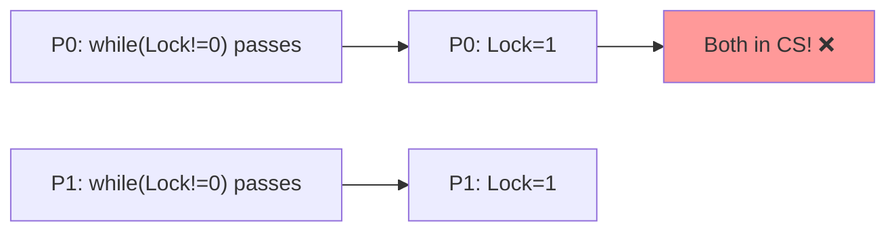

**Mutual Exclusion violated!**

---

#### ❌ Attempt 2: Turn Variable (Strict Alternation)

```c
// P0:                    // P1:
while (Turn != 0);        while (Turn != 1);
// CS                     // CS
Turn = 1;                 Turn = 0;
```

**Problem:** Processes must **strictly alternate**. If P0 never wants to enter the CS again, P1 can NEVER enter — even though the CS is empty!

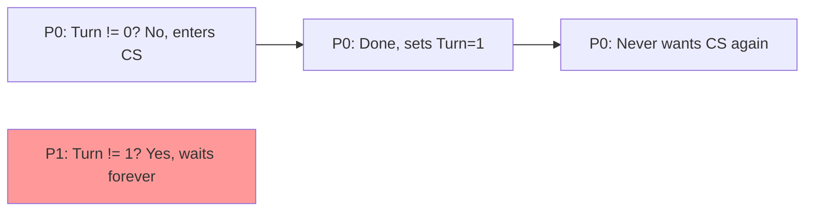

**Independence violated → Starvation!**

---

#### ❌ Attempt 3: Want Array

```c
// P0:                         // P1:
Want[0] = 1;                   Want[1] = 1;
while (Want[1]);               while (Want[0]);
// CS                          // CS
Want[0] = 0;                   Want[1] = 0;
```

**Problem:** Both set their `Want` flag simultaneously, then both block on the `while`. Neither can proceed.

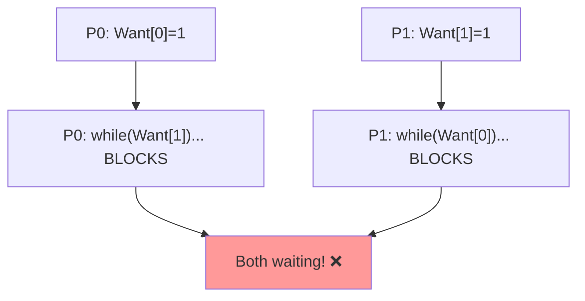

**Deadlock!**

---

#### ✅ Peterson's Algorithm (Correct!)

```c
// P0:                             // P1:
Want[0] = 1;  Turn = 1;           Want[1] = 1;  Turn = 0;
while (Want[1] && Turn == 1);     while (Want[0] && Turn == 0);
// CS                              // CS
Want[0] = 0;                       Want[1] = 0;
```

**Key insight:** The `Turn` variable breaks ties.

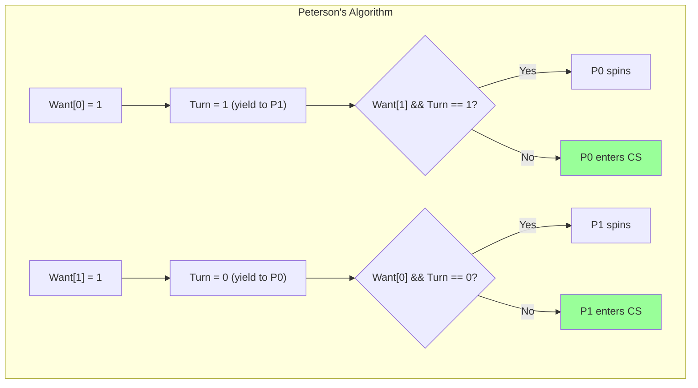

| Property | Status |
| :--- | :--- |
| Mutual Exclusion | ✅ Only one enters |
| Progress | ✅ Someone enters if CS empty |
| Bounded Wait | ✅ Finite waiting time |
| Independence | ✅ Non-CS code doesn't block |

**Assumption:** Writing to `Turn` is atomic (true on most architectures).

**Remaining problems:** 🔴 Busy waiting, 🔴 Only works for 2 processes

---

### ⚠️ Common Pitfalls

> [!danger] Pitfall 1: "Strict alternation is fair"
> But if P0 finishes early and never enters the CS again, P1 is starved forever. Independence is violated.

> [!danger] Pitfall 2: Attempt 3's deadlock is hard to see
> The deadlock requires both processes to execute `Want[i] = 1` before either checks `while(Want[other])`. This is a valid interleaving — always check for it!

> [!danger] Pitfall 3: Peterson's Turn assignment
> In Peterson's, P0 sets `Turn = 1` (yielding to P1) and P1 sets `Turn = 0` (yielding to P0). This is **backwards** from what students expect!

---

### ❓ Mock Exam Questions

> [!question] Q10: Peterson's Requirement
> Peterson's Algorithm requires:
> <details><summary>Answer</summary>
>
> **Answer: That writing to `Turn` is atomic**
>
> No hardware support needed beyond atomic writes to a single variable.
> </details>

> [!question] Q11: Strict Alternation Violation
> Attempt 2 (strict alternation) violates which property?
> <details><summary>Answer</summary>
>
> **Answer: Independence**
>
> A process that doesn't want the CS can block another process from entering.
> </details>

> [!question] Q12: Want Array Deadlock
> What execution sequence causes deadlock in Attempt 3?
> <details><summary>Answer</summary>
>
> **Answer:Both set `Want[i] = 1` before either checks the while loop**
>
> If both signal intent before checking, both see the other's flag and both wait forever.
> </details>

---

## 5. High Level Abstraction: Semaphores

### 🎫 The Elegant Solution

Semaphores, proposed by **Edsger W. Dijkstra in 1965**, are the fundamental high-level synchronization primitive.

**A semaphore `S` consists of:**
- An **integer value** (initialized to non-negative)
- A **list of waiting processes** (sleeping, not spinning)

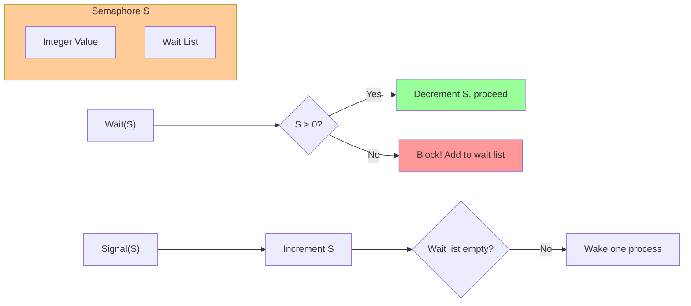

**Two atomic operations:**

| Operation | Also called | Behavior |
| :--- | :--- | :--- |
| `Wait(S)` | `P()`, `Down()` | If S ≤ 0: **block**. Decrement S. |
| `Signal(S)` | `V()`, `Up()` | Increment S. Wake one sleeping process if any. **Never blocks.** |

> [!tip] Ticket Analogy 🎟️
> Think of `S` as the number of available "tickets."
> - `Wait` takes a ticket (blocking if none available)
> - `Signal` returns a ticket (and wakes someone up)

---

### 📐 The Semaphore Invariant

$$S_{\text{current}} = S_{\text{initial}} + \#\text{signal}(S) - \#\text{wait}(S)_{\text{completed}}$$

This invariant is the key to proving correctness!

---

### 📊 Types of Semaphores

| Type | Values | Also called | Use case |
| :--- | :--- | :--- | :--- |
| **Binary semaphore** | 0 or 1 | Mutex | Mutual exclusion |
| **General semaphore** | 0, 1, 2, ... | Counting semaphore | Resource counting, signaling |

---

### 🔒 Using Semaphores for Mutual Exclusion

```c
// Semaphore s = 1  (binary)
Wait(s);
  // Critical Section
Signal(s);
```

**Proof of Mutual Exclusion:**

Let $N_{CS}$ = number of processes currently in the CS.

$$N_{CS} = \#\text{wait}(S)_{\text{completed}} - \#\text{signal}(S)$$

$$S_{\text{current}} = 1 + \#\text{signal}(S) - \#\text{wait}(S)_{\text{completed}}$$

$$\Rightarrow S_{\text{current}} + N_{CS} = 1$$

Since $S_{\text{current}} \geq 0$, we have $N_{CS} \leq 1$. ✅ **Mutual exclusion proven!**

**No deadlock?** If all processes at `Wait(S)` with no one in CS → $S = 0$ and $N_{CS} = 0$ → $S + N_{CS} = 0 \neq 1$. Contradiction! ✅

---

### ⚠️ Incorrect Semaphore Usage = Deadlock

```c
// P0:          // P1:
Wait(P)         Wait(Q)
Wait(Q)         Wait(P)    // Reversed order!
// CS           // CS
Signal(Q)       Signal(P)
Signal(P)       Signal(Q)
```

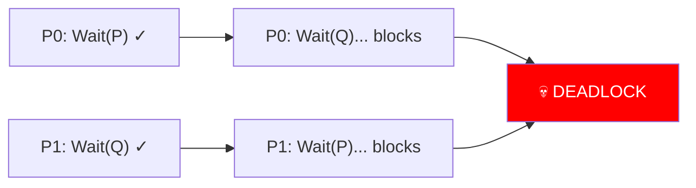

---

### ⚠️ Common Pitfalls

> [!danger] Pitfall 1: Forgetting that Wait can BLOCK
> `Wait(S)` is not just a decrement! If S ≤ 0, the calling process **goes to sleep**. Students often trace scenarios forgetting that blocked processes stop executing.

> [!danger] Pitfall 2: Signal never blocks
> `Signal(S)` always completes immediately. It increments S and optionally wakes someone — it never waits.

> [!danger] Pitfall 3: The order of Wait calls matters
> Calling `Wait(A)` then `Wait(B)` in different orders across processes is the classic recipe for deadlock. **Always acquire locks in the same order!**

> [!danger] Pitfall 4: Applying the invariant incorrectly
> `#wait(S)` in the invariant counts only **completed** waits, not total calls. A blocked process's wait is NOT complete yet.

---

### ❓ Mock Exam Questions

> [!question] Q13: Semaphore Value
> Semaphore `S` is initialized to 3. After 5 `Wait` operations and 2 `Signal` operations (all completed), what is `S`?
> <details><summary>Answer</summary>
>
> **Answer: 0**
>
> $S = 3 + 2 - 5 = 0$
> </details>

> [!question] Q14: Blocking Operation
> Which operation on a semaphore can cause the calling process to block?
> <details><summary>Answer</summary>
>
> **Answer: `Wait(S)` only**
>
> `Signal(S)` always returns immediately.
> </details>

> [!question] Q15: Signaling Pattern
> A semaphore initialized to 0 is used between Producer and Consumer. What pattern is this?
> <details><summary>Answer</summary>
>
> **Answer: Producer-consumer signaling**
>
> The producer signals when data is ready; consumer waits for data.
> </details>

---

## 6. Classical Synchronization Problems

### 🏭 Producer-Consumer Problem

**Setup:** Processes share a **bounded buffer of size K**.

- **Producers** add items — but only when buffer is **not full** (< K items)
- **Consumers** remove items — but only when buffer is **not empty** (> 0 items)

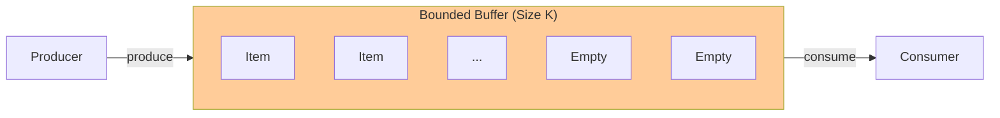

#### ✅ Blocking Solution

```c
// Semaphores:
// mutex    = S(1)   → Mutual exclusion for buffer access
// notFull  = S(K)   → Tracks available slots (initially K)
// notEmpty = S(0)   → Tracks available items (initially 0)

// Producer:                   // Consumer:
while (TRUE) {                 while (TRUE) {
  Produce Item;                  wait(notEmpty);
  wait(notFull);                 wait(mutex);
  wait(mutex);                   item = buffer[out];
  buffer[in] = item;             out = (out+1) % K;
  in = (in+1) % K;               signal(mutex);
  signal(mutex);                 signal(notFull);
  signal(notEmpty);              Consume Item;
}                              }
```

| Semaphore | Initial Value | Purpose |
| :--- | :--- | :--- |
| `mutex` | 1 | Mutual exclusion on buffer operations |
| `notFull` | K | Blocks producer when buffer is full |
| `notEmpty` | 0 | Blocks consumer when buffer is empty |

> [!warning] Critical Order!
> `wait(notFull)` must come BEFORE `wait(mutex)` in the producer. If reversed and buffer is full → **deadlock!**

---

### 📖 Readers-Writers Problem

**Setup:** Shared data structure D.

- **Multiple readers** can access D simultaneously (reading doesn't modify)
- **Writers** need **exclusive** access (no other reader or writer allowed)

```c
// roomEmpty = S(1), mutex = S(1), nReader = 0

// Writer:                 // Reader:
wait(roomEmpty);           wait(mutex);
  Modify D;                nReader++;
signal(roomEmpty);         if (nReader == 1)
                             wait(roomEmpty);  // First reader locks writers
                           signal(mutex);
                           Reads D;
                           wait(mutex);
                           nReader--;
                           if (nReader == 0)
                             signal(roomEmpty); // Last reader unlocks writers
                           signal(mutex);
```

**Problem:** 🔴 **Writer starvation!** If readers continuously arrive, `nReader` never hits 0, and the writer is blocked forever.

---

### 🍽️ Dining Philosophers Problem

**Setup:** 5 philosophers, 5 chopsticks (one between each pair). Each philosopher needs **both** adjacent chopsticks to eat.

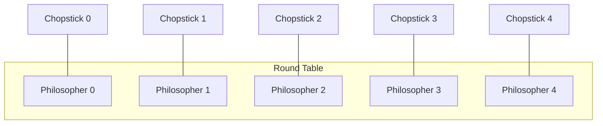

#### ❌ Attempt 1: Grab Left, Then Right

Each philosopher grabs left chopstick first, then right. If ALL grab left simultaneously → **deadlock!**

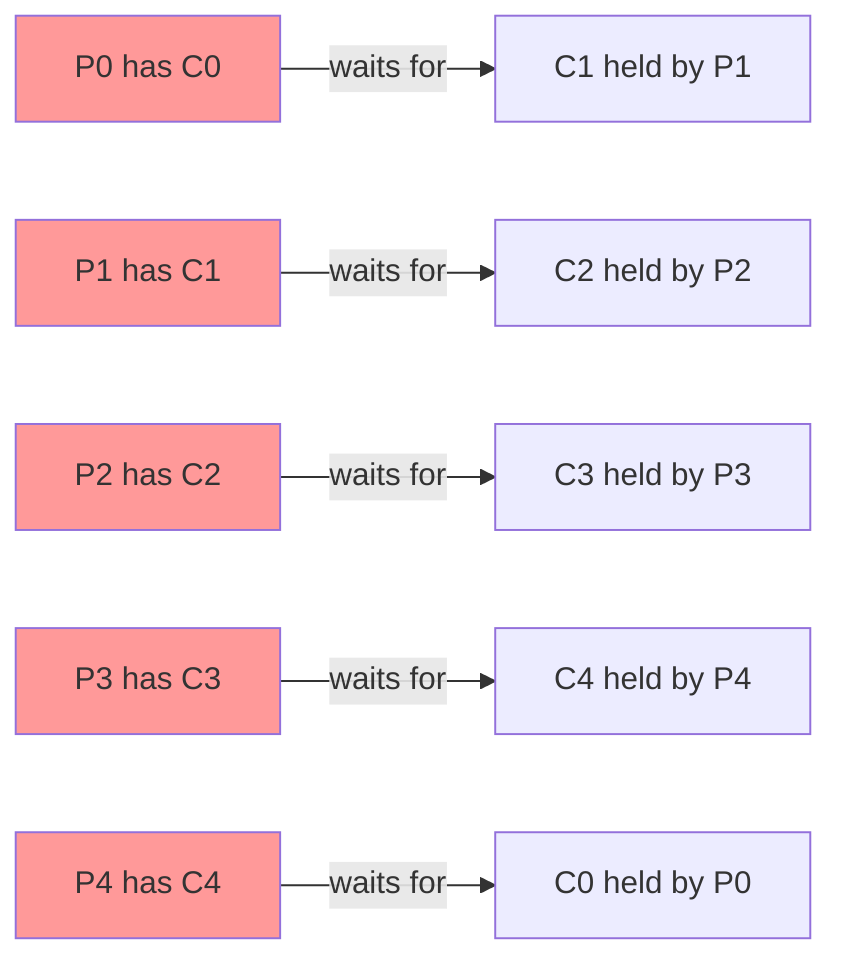

#### ✅ Solution: Limited Eater

Allow only **4 philosophers** at the table simultaneously using `seats = S(4)`:

```c
void philosopher(int i) {
    while (TRUE) {
        Think();
        wait(seats);        // Limit to 4 at table
        wait(chpStk[LEFT]);
        wait(chpStk[RIGHT]);
        Eat();
        signal(chpStk[LEFT]);
        signal(chpStk[RIGHT]);
        signal(seats);
    }
}
```

> [!tip] Why does this work?
> **Pigeonhole Principle:** With 5 chopsticks and only 4 philosophers, at least one philosopher always has both chopsticks available. ✅

---

### ⚠️ Common Pitfalls

> [!danger] Pitfall 1: Swapping wait order in Producer-Consumer
> If a producer calls `wait(mutex)` THEN `wait(notFull)` when buffer is full → holds `mutex` while sleeping → consumer can never acquire `mutex` → **deadlock!**

> [!danger] Pitfall 2: Writer starvation in Readers-Writers
> The simple solution is technically correct per spec, but writers can starve. Real systems need priority mechanisms.

> [!danger] Pitfall 3: Circular wait in Dining Philosophers
> P0 grabs C0, P1 grabs C1, P2 grabs C2, P3 grabs C3, P4 grabs C4. Now everyone waits for their right chopstick. **Perfect circular deadlock.**

---

### ❓ Mock Exam Questions

> [!question] Q16: notFull Initialization
> In Producer-Consumer, `notFull` is initialized to K because:
> <details><summary>Answer</summary>
>
> **Answer: The buffer has K available slots initially**
>
> Each successful producer `wait(notFull)` "reserves" a slot. Initially all K slots are available.
> </details>

> [!question] Q17: nReader Protection
> Why is `nReader` protected by `mutex` in Readers-Writers?
> <details><summary>Answer</summary>
>
> **Answer: `nReader` itself is a shared variable that can race**
>
> Multiple readers can modify `nReader` simultaneously — it needs protection too.
> </details>

> [!question] Q18: Limited Eater
> What happens if `seats = S(5)` instead of `S(4)`?
> <details><summary>Answer</summary>
>
> **Answer: Deadlock is possible again**
>
> With 5 philosophers allowed, all can grab their left chopstick simultaneously → deadlock.
> </details>

---

## 7. Synchronization Implementations (POSIX)

### 🛠️ Real-World Implementation

In practice, semaphores are implemented by the OS. The most common standard is **POSIX**.

#### POSIX Semaphores (Unix)

```c
#include <semaphore.h>
// Compile with: gcc something.c -lrt

sem_t s;
sem_init(&s, 0, 1);    // Initialize: pshared=0 (process-local), value=1
sem_wait(&s);           // Wait()
sem_post(&s);           // Signal()
sem_destroy(&s);        // Cleanup
```

#### pthread Mutex and Condition Variables

```c
pthread_mutex_t m = PTHREAD_MUTEX_INITIALIZER;
pthread_mutex_lock(&m);    // Wait() — binary semaphore
pthread_mutex_unlock(&m);  // Signal()

pthread_cond_t cv;
pthread_cond_wait(&cv, &m);    // Wait for event (releases mutex!)
pthread_cond_signal(&cv);      // Wake one waiter
pthread_cond_broadcast(&cv);   // Wake ALL waiters
```

**Language support summary:**

| Language | Mutex | Semaphore | Condition Variable |
| :--- | :--- | :--- | :--- |
| **Java** | `synchronized`, `ReentrantLock` | `Semaphore` class | `wait()`, `notify()`, `notifyAll()` |
| **Python** | `threading.Lock` | `threading.Semaphore` | `threading.Condition` |
| **C++** (C++11+) | `std::mutex` | (use with condition_variable) | `std::condition_variable` |
| **C (POSIX)** | `pthread_mutex_t` | `sem_t` | `pthread_cond_t` |

---
## 🔗 Connections

| 📚 Lecture | 🔗 Connection |
| :--- | :--- |
| [[content/CS2106/L1]] | OS services — synchronization primitives are kernel services |
| [[content/CS2106/L2]] | Process context — shared resources require coordination |
| [[content/CS2106/L3]] | Blocked state — processes waiting for semaphores go to Blocked |
| [[content/CS2106/L4]] | IPC — shared memory IPC requires semaphore protection |
| [[content/CS2106/L5]] | Threads — race conditions arise when threads share memory |
| [[L7]] | Memory — shared memory regions need synchronization |
| [[L8]] | Page tables — multiprocessor systems need atomic page table updates |
| [[L10]] | File locking — concurrent file access needs synchronization |
| [[L11]] | File system — concurrent file operations require locks |

> [!quote] The Key Insight
> Synchronization is all about reasoning carefully about **all possible interleavings**. When in doubt, draw a timeline, enumerate cases, and apply the invariants. You've got this! 💪