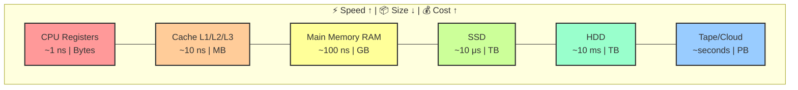
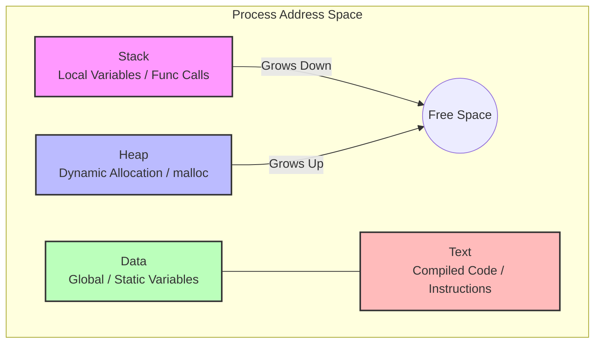
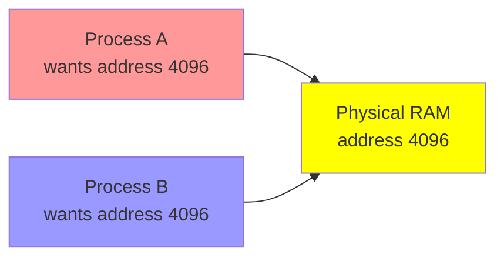
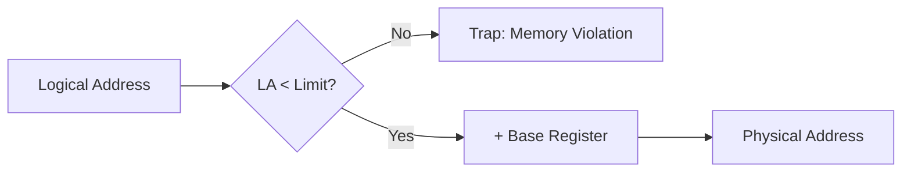
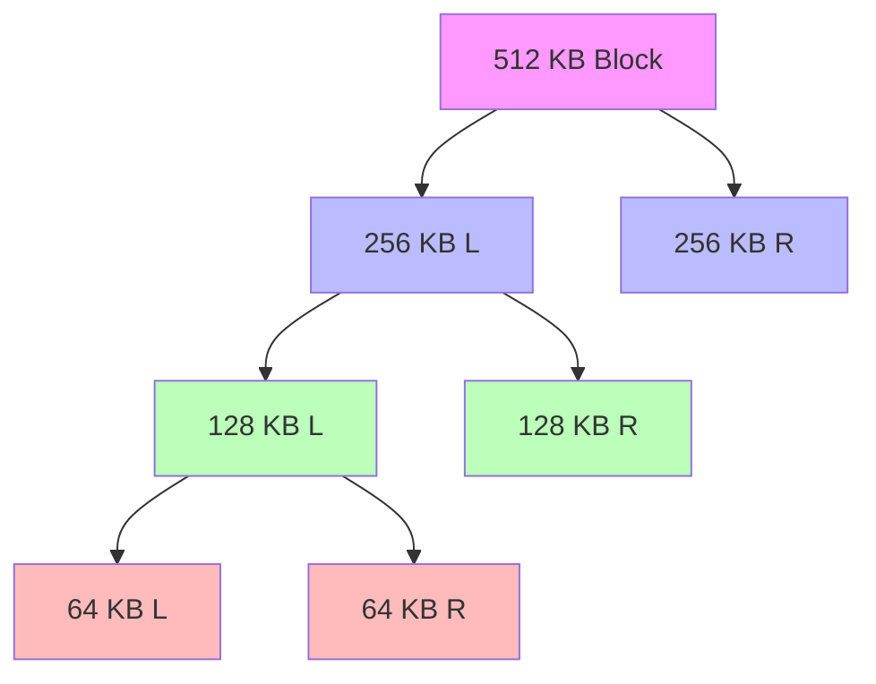
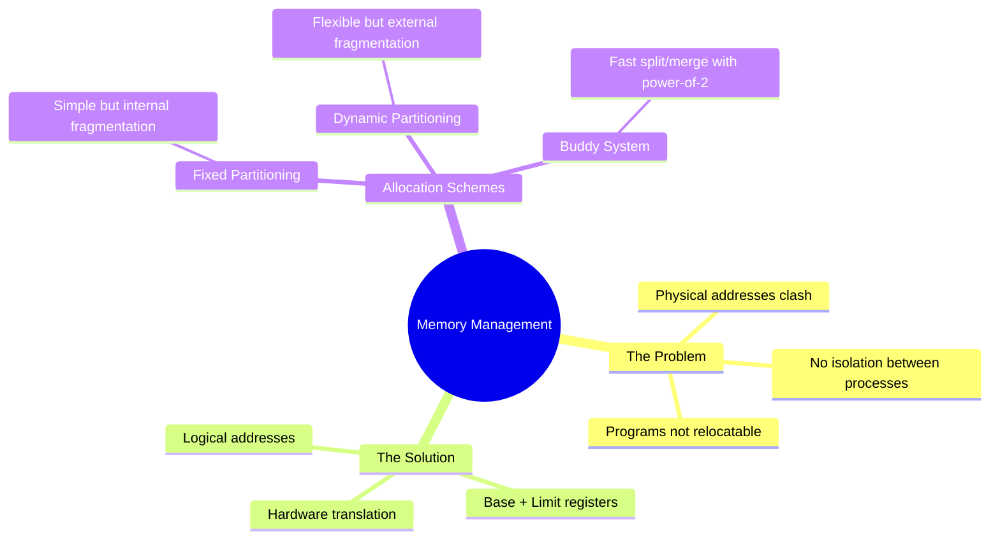

# 🧠 L7 — Memory Management & Memory Abstraction

> [!abstract] Lecture Goal
> Understand how the OS manages memory, why we need logical addresses instead of physical ones, and how contiguous memory allocation works (with all its trade-offs).

> [!tip] The Big Picture
> Every process thinks it has the entire RAM to itself. **How?** The OS creates a convincing illusion through memory abstraction.

---

## 🔩 Part 1: Memory Hardware Basics

### 🏗️ What is RAM, Really?

Physical RAM is just a **giant array of bytes**. Each byte has a unique index — its **physical address**.

```
Physical Memory (simplified):
┌─────┬─────┬─────┬─────┬─────┬─────┐
│  0  │  1  │  2  │  3  │ ... │ n-1 │
└─────┴─────┴─────┴─────┴─────┴─────┘
   ↑
   └── Physical Address (the actual location)
```

> [!warning] The Problem
> If programs use physical addresses directly, they clash. Process A writes to address 1000, Process B writes to address 1000 → **data corruption!**

---

### 🏆 The Memory Hierarchy

The OS's job is to make slow, large memory feel fast and well-organized for running processes.



| 📶 Level | ⚡ Speed | 📦 Size | 💰 Cost | 💡 Role |
| :--- | :--- | :--- | :--- | :--- |
| **CPU Registers** | ~1 ns | Bytes | Very expensive | Immediate computation |
| **Cache** | ~10 ns | ~12 MB | Expensive | Frequently used data |
| **RAM** | ~100 ns | GBs | Moderate | Active programs |
| **SSD** | ~10 μs | TBs | Cheap | Persistent storage |
| **HDD** | ~10 ms | TBs | Very cheap | Bulk storage |
| **Off-line** | seconds | PBs | Cheapest | Backup/archive |

> [!info] The 100x Rule
> Each level is roughly **100× slower** than the one above it. This gap shapes everything the OS does with memory.

---

## 🗂️ Part 2: Memory Usage of a Process

### 🗺️ Process Memory Layout

A running process has **four distinct memory regions** arranged in a specific layout.



**The four segments:**

| 📍 Segment | 📝 Contents | 📈 Growth | ⏳ Lifetime |
| :--- | :--- | :--- | :--- |
| **Stack** | Local variables, return addresses | ↓ Grows down | Function scope |
| **Heap** | `malloc()`, dynamic data | ↑ Grows up | Until `free()` |
| **Data** | Global/static variables | Fixed | Program lifetime |
| **Text** | Compiled instructions | Fixed | Program lifetime |

> [!danger] Stack vs Heap Collision
> If Stack grows down and Heap grows up, they can collide in the middle → **Stack Overflow** or **Out of Memory** error!

---

## 🎭 Part 3: Memory Abstraction

### 3.1 The Problem with Physical Addresses

What if programs directly used physical addresses (no abstraction)?



| ✅ Pros | ❌ Cons (fatal!) |
| :--- | :--- |
| Simple — no translation needed | **Clash:** Two processes claim the same address |
| Fast — direct memory access | **No Isolation:** Process B can overwrite Process A |
| | **Not Relocatable:** Program must always load at same address |

> [!tip] Apartment Analogy
> Imagine every apartment building in a city labeling rooms as "Room 1, Room 2..." with no building number. Two families in different buildings both claim "Room 101" — chaos! We need **building numbers** (abstraction).

---

### 3.2 Fix Attempt 1: Address Relocation (Bad Idea ❌)

When loading Process B at address 8000, add 8000 to every memory reference in its code.

| Why It Fails |
| :--- |
| **Slow load:** Must scan and modify every address |
| **Ambiguous:** Is `4096` an address or a constant? Hard to tell! |
| **No protection:** Still can't stop Process B from accessing Process A's memory |

---

### 3.3 Fix Attempt 2: Base + Limit Registers ✅

A much better approach using **hardware assistance**:



**Two hardware registers per process:**

| Register | Purpose |
| :--- | :--- |
| **Base Register** | Starting physical address of the process |
| **Limit Register** | Size of the process's memory region |

**How it works:**
1. Process generates **logical address** (starts from 0)
2. Hardware checks: `logical_address < limit`?
3. If yes: `physical_address = base + logical_address`
4. If no: **Trap** to OS — memory violation!

> [!example] Example
> Process with **Base = 5000**, **Limit = 3000**:
> - Logical address 2800 → Valid (2800 < 3000) → Physical = 5000 + 2800 = **7800**
> - Logical address 3500 → Invalid (3500 ≥ 3000) → **Trap!**

> [!info] Foundation of Segmentation
> This is exactly how ["[L8|segmentation"]] works! Each segment is essentially a generalized base+limit register pair.

---

### 3.4 Logical Address — The Process's View

The **logical address** is how the process *sees* its own memory — starting from 0, as if it owns all of RAM.

```
Process's view (logical):        Physical RAM:
┌──────────────┐                 ┌──────────────┐  0
│ 0            │                 │   OS         │
│ 1            │  ──mapping──►   ├──────────────┤  256
│ ...          │                 │   Process A  │
│ Limit-1      │                 ├──────────────┤  ...
└──────────────┘                 │   Process B  │
                                 └──────────────┘
```

> [!success] The Illusion
> Every process thinks it has:
> - Its own private memory starting at 0
> - The entire address space to itself
> - No awareness of other processes

---

## 🧱 Part 4: Contiguous Memory Allocation

Now we need to decide **where** in physical RAM to place each process.

### 4.1 Fixed-Size Partitioning

Physical memory is pre-divided into **equal-sized slots**. Each process gets one slot.

| 🌟 Feature | 📊 Fixed Partitioning |
| :--- | :--- |
| ✅ **Pros** | Simple to manage, fast allocation |
| ❌ **Cons** | **Internal fragmentation** — wasted space inside a partition |

> [!tip] Hotel Analogy
> A hotel with only king-size rooms. A solo traveler books one, but half the room is unused — **internal waste**.

```
Partition View:
┌──────────┬──────────┬──────────┬──────────┐
│ Part. 0   │ Part. 1   │ Part. 2   │ Part. 3   │
│ 64 KB     │ 64 KB     │ 64 KB     │ 64 KB     │
│ [Process A│ [Process B│ [empty]   │ [Process C│
│  40 KB]   │  64 KB]   │           │  20 KB]   │
│  ↓        │           │           │  ↓        │
│ 24 KB     │           │           │ 44 KB     │
│ wasted    │ perfect!  │           │ wasted    │
└──────────┴──────────┴──────────┴──────────┘
```

---

### 4.2 Dynamic (Variable-Size) Partitioning

Partitions are created to **exactly fit** each process. Free regions are called **holes**.

| 🌟 Feature | 📊 Dynamic Partitioning |
| :--- | :--- |
| ✅ **Pros** | No internal fragmentation, flexible |
| ❌ **Cons** | **External fragmentation** — total free memory is enough, but split into unusable pieces |

> [!tip] Parking Lot Analogy
> Cars park and leave. After a while, you have many small gaps between cars — too small for a new car, even though total gap space is large.

```
Dynamic View (over time):
T=0:  ┌──────────┬─────────────────────────────┐
      │ Process A │      Free (large hole)      │
      └──────────┴─────────────────────────────┘

T=1:  ┌──────────┬──────────┬──────────────────┐
      │ Process A │ Process B │ Free (smaller)   │
      └──────────┴──────────┴──────────────────┘

T=2:  ┌──────────┬────┬─────┬────┬────┬────────┐
      │ Process A │ A  │hole │ B  │hole │ Free   │
      └──────────┴────┴─────┴────┴────┴────────┘
                      ↑ External fragmentation!
                      Total free: enough for new process
                      But no single hole is big enough
```

---

### 4.3 Allocation Algorithms

When a process needs N bytes, which hole do we choose?

| 🧠 Algorithm | 🎯 Strategy | 📉 Effect |
| :--- | :--- | :--- |
| **First-Fit** | Take the first hole ≥ N | Fast, but may waste good early holes |
| **Best-Fit** | Smallest hole ≥ N | Minimizes waste per allocation, but leaves tiny "splinter" holes |
| **Worst-Fit** | Largest hole ≥ N | Leaves larger leftover holes (potentially more reusable) |

> [!question] Which is best?
> In practice, **First-Fit** often wins — it's fast and doesn't produce significantly more fragmentation than Best-Fit.

---

## 🤝 Part 5: Buddy System

A smarter dynamic allocation scheme that makes **splitting and merging efficient**.

### 5.1 Core Idea

Memory is always split into **power-of-2** sized blocks. Splitting produces two equal halves — **buddies**.



**How it works:**
1. Request for 100 KB → need 128 KB block
2. Start with 512 KB, split into 256 + 256
3. Split 256 into 128 + 128
4. Allocate one 128 KB block — **28 KB wasted (internal fragmentation)**

> [!info] The Bit Trick
> For a block of size $2^S$ at address $A$, its buddy is found by **flipping the $S$-th bit** of $A$. This makes merging incredibly fast!

**Example:** Block at address 8 (size 4). Its buddy is at address 12.
```
8  = 0b1000
12 = 0b1100  (flip bit 2)
```

---

## ❓ Mock Exam Questions

> [!question] Q1: Address Translation
> A process has Base = 5000, Limit = 3000. Is logical address 2800 valid? What is the physical address?
> <details><summary>Answer</summary>
>
> **Check:** 2800 < 3000? ✅ Yes, valid!
>
> **Physical address:** 5000 + 2800 = **7800**
>
> Note: If the logical address were 3500, it would be invalid (3500 ≥ 3000).
> </details>

> [!question] Q2: Fragmentation Types
> What is the difference between internal and external fragmentation?
> <details><summary>Answer</summary>
>
> | Type | Where | Which Scheme |
> | :--- | :--- | :--- |
> | **Internal** | Wasted space *inside* an allocated partition | Fixed partitioning |
> | **External** | Wasted space *between* allocated partitions | Dynamic partitioning |
>
> **Remember:** Internal = inside, External = outside/between.
> </details>

> [!question] Q3: Buddy System Allocation
> A system uses the Buddy System starting with a 64 KB block. Requests arrive for: 12 KB, 20 KB, 10 KB. Show the allocation.
> <details><summary>Answer</summary>
>
> - 12 KB → needs 16 KB (next power of 2)
> - 20 KB → needs 32 KB
> - 10 KB → needs 16 KB
>
> Starting from 64 KB:
> 1. Split 64 KB → 32 KB + 32 KB
> 2. Split one 32 KB → 16 KB + 16 KB (allocate one 16 KB for request 1)
> 3. Allocate one 32 KB for request 2
> 4. Split remaining 16 KB → 8 KB + 8 KB (not enough! Need another 16 KB from remaining 32 KB)
>
> Total internal fragmentation: 4 KB + 12 KB + 6 KB = **22 KB wasted**
> </details>

---

## ⚠️ Common Mistakes to Watch Out For

> [!danger] Internal vs. External Fragmentation
> **Internal** = waste *inside* (fixed scheme). **External** = waste *between* (dynamic scheme). Don't swap these!

> [!danger] Limit Check
> The check is `offset < Limit` (strictly less than). If `offset == Limit`, it's already out of bounds!

> [!danger] Buddy System Power-of-2
> If a request is for 100 bytes, you **must** allocate 128 bytes. You cannot allocate exactly 100.

> [!danger] Base + Limit Direction
> Base is where the process **starts** in physical memory. Limit is the **size** of the process. Physical address = Base + Logical address (if logical < Limit).

---

## 🗺️ Big Picture Summary



---

## 🔗 Connections

| 📚 Lecture | 🔗 Connection |
| :--- | :--- |
| [[L8]] | Base+Limit leads to **segmentation** — multiple base+limit pairs for different memory regions |
| [[L9]] | Logical addresses enable **virtual memory** — pages can live anywhere, even on disk |

> [!quote] The Key Insight
> Memory abstraction solves the fundamental problem: **how do multiple programs share one RAM without interfering?** The answer — give each program its own private address space, translated by hardware.