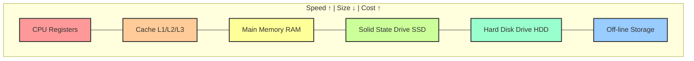
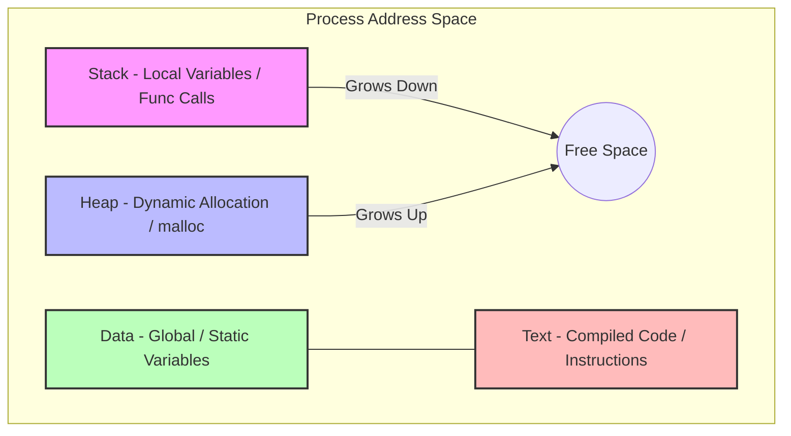
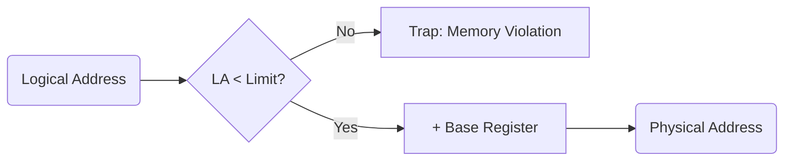
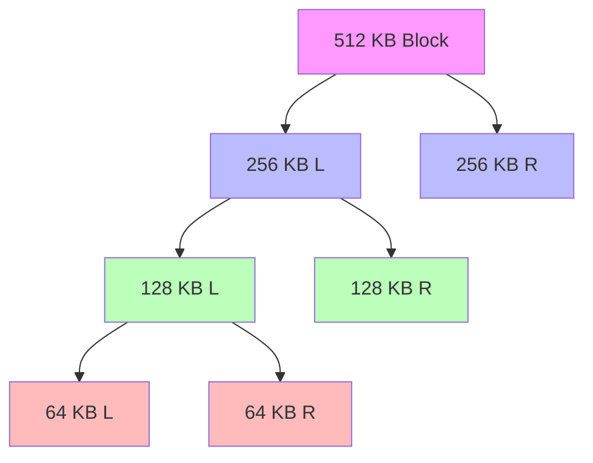
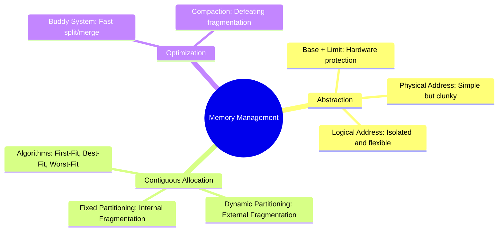

# 🧠  L7 — Memory Management & Memory Abstraction

> [!abstract] Lecture Goal
> Understand how the OS manages memory, why we need logical addresses instead of physical ones, and how contiguous memory allocation works (with all its trade-offs).

---

## 🔩 Part 1: Memory Hardware Basics

Physical RAM is just a giant array of bytes. Each byte has a unique index — its **physical address**.

```text
Physical Memory (simplified):
┌─────┬─────┬─────┬─────┬─────┬─────┐
│  0  │  1  │  2  │  3  │ ... │ n-1 │
└─────┴─────┴─────┴─────┴─────┴─────┘
   ↑
Physical Address
```

### 🏆 The Memory Hierarchy
The OS's job is to make slow, large memory feel fast and well-organised for running processes.



| 📶 Level | ⚡ Speed | 📦 Size | 💰 Cost |
| :--- | :--- | :--- | :--- |
| **CPU Registers** | ~1 ns | Bytes | Very expensive |
| **Cache** | ~10 ns | ~12 MB | Expensive |
| **RAM** | ~100 ns | GBs | Moderate |
| **SSD/Hard Disk** | ~10 ms | TBs | Cheap |
| **Off-line storage**| seconds | PBs | Very cheap |

> [!info] Key Insight
> Memory management is a balancing act between speed, capacity, and cost. The OS abstracts these layers to provide a seamless experience.

---

## 🗂️ Part 2: Memory Usage of a Process

A running process has four distinct memory regions arranged in a specific layout.

### 🗺️ Process Memory Layout



**Two types of data in a process:**

| 🛠️ Type | ⏳ Lifespan | 📝 Examples |
| :--- | :--- | :--- |
| **Transient** | Only during a function call | Parameters, local variables |
| **Persistent** | Whole program lifetime | Global variables, heap memory |

> [!tip] Growth Dynamics
> Both the Stack and Heap can grow and shrink at runtime. If they meet in the middle, you get a "Stack Overflow" or "Out of Memory" error!

---

## 🎭 Part 3: Memory Abstraction

### 3.1 The Problem with Physical Addresses

What if programs directly used physical addresses (no abstraction)?

**Pros:** Simple — address in program = address in RAM, no conversion needed.

**Cons (fatal!):**
- **Clash:** Process A and B might both want address `4096` 💥
- **No Isolation:** Process B can overwrite Process A's data.
- **Not Relocatable:** A program must always load at the same spot.

> [!tip] Apartment Analogy
> It's like every apartment building in a city labelling their rooms as "Room 1, Room 2..." with no building number. Two families in different buildings both claim "Room 101" — disaster!

---

### 3.2 Fix Attempt 1: Address Relocation (Bad idea)

When loading Process B at address 8000, add 8000 to every memory reference in its code.
**Why this fails:** Slow load times and difficulty distinguishing addresses from constants.

---

### 3.3 Fix Attempt 2: Base + Limit Registers ✅

A much better hardware-assisted approach:
- **Base Register:** Starting physical address.
- **Limit Register:** Size of the process's memory region.



> [!info] Seed of Segmentation
> This is the foundation of [[L8|segmentation]]. Each segment is essentially a generalised base+limit register pair.

---

### 3.4 Logical Address

The **logical address** is how the process _sees_ its own memory — starting from 0, as if it owns all of RAM.

```text
Process's view (logical):        Physical RAM:
┌──────────────┐                 ┌──────────────┐  0
│ 0            │                 │   OS         │
│ 1            │  ──mapping──►   ├──────────────┤  256
│ ...          │                 │   Process A  │
│ Limit-1      │                 ├──────────────┤  ...
└──────────────┘                 │   Process B  │
                                 └──────────────┘
```

---

## 🧱 Part 4: Contiguous Memory Allocation

### 4.1 Fixed-Size Partitioning
Physical memory is pre-divided into fixed-size equal slots. Each process gets one slot.

| 🌟 Feature | 📊 Fixed Partitioning |
| :--- | :--- |
| ✅ **Pros** | Simple to manage, fast allocation |
| ❌ **Cons** | **Internal fragmentation** — wasted space inside a partition |

> [!tip] Hotel Analogy
> A hotel with only king-size rooms. A solo traveller books one, but half the room is unused — internal waste.

---

### 4.2 Dynamic (Variable-Size) Partitioning
Partitions are created to **exactly fit** each process. Free regions are called **holes**.

| 🌟 Feature | 📊 Dynamic Partitioning |
| :--- | :--- |
| ✅ **Pros** | No internal fragmentation, flexible |
| ❌ **Cons** | **External fragmentation** — total free memory is enough, but split into unusable pieces |

> [!tip] Parking Lot Analogy
> A parking lot where cars park and leave. After a while, you have many small gaps between cars that are too small for a new car, even though the total gap space is large.

---

### 4.3 Allocation Algorithms

| 🧠 Algorithm | 🎯 Strategy | 📉 Effect |
| :--- | :--- | :--- |
| **First-Fit** | Take the first hole ≥ N | Fast, but may waste good early holes |
| **Best-Fit** | Smallest hole ≥ N | Minimises waste per allocation, but leaves tiny "splinter" holes |
| **Worst-Fit** | Largest hole ≥ N | Leaves larger leftover holes (potentially more reusable) |

---

## 🤝 Part 5: Buddy System

A smarter dynamic allocation scheme that makes **splitting and merging efficient**.

### 5.1 Core Idea
Memory is always split into **power-of-2** sized blocks. Splitting produces two equal halves — **buddies**.



> [!info] The Bit Trick
> For a block of size $2^S$ at address $A$, its buddy is found by **flipping the $S$-th bit** of $A$. This makes merging incredibly fast!

---

## ❓ Mock Exam Questions

> [!question] Q1: Address Translation
> A process has Base = 5000, Limit = 3000. Is logical address 2800 valid? What is the physical address?
> <details><summary>Answer</summary>Logical 2800: Physical = 5000 + 2800 = **7800**. Valid (2800 < 3000). ✅</details>

> [!question] Q2: Fragmentation
> What is the difference between internal and external fragmentation?
> <details><summary>Answer</summary>**Internal:** Wasted space *inside* a partition (Fixed Partitioning). **External:** Wasted space *between* partitions (Dynamic Partitioning).</details>

---

## ⚠️ Common Mistakes to Watch Out For

> [!danger] Internal vs. External Fragmentation
> **Internal** = waste *inside* (fixed scheme). **External** = waste *between* (dynamic scheme). Don't swap these!

> [!danger] Limit Check
> The check is `offset < Limit` (strictly less than). If `offset == Limit`, it's already out of bounds!

> [!danger] Buddy System Power-of-2
> If a request is for 100 bytes, you **must** allocate 128 bytes. You cannot allocate exactly 100.

---

## 🗺️ Big Picture Summary

