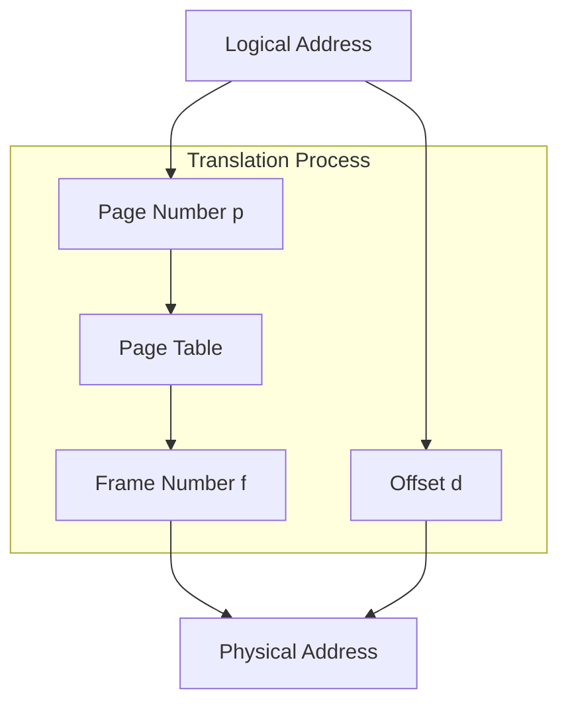
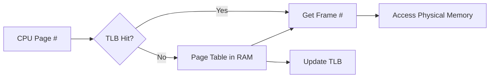
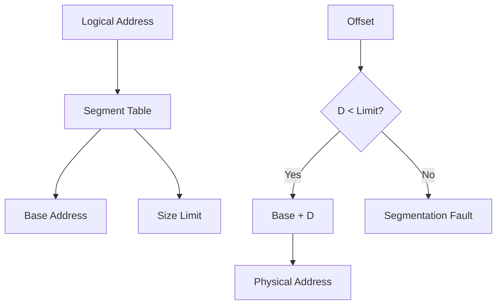

# 🧠  L8 — Disjoint Memory Schemes

> [!abstract] Lecture Goal
> Move beyond the assumption that a process must sit in _contiguous_ physical memory. Two mechanisms achieve this: **Paging** and **Segmentation**.

---

## 📦 Part 1: Paging

### 1.1 The Core Idea

In earlier lectures, a process had to occupy one big, unbroken chunk of RAM. That causes **external fragmentation** (lots of little free holes that can't be used together). Paging solves this by letting a process's memory be scattered across physical RAM.

**The key split:**

| 📄 Concept | 📍 Where it lives | 📏 Fixed/Variable size |
| :--- | :--- | :--- |
| **Page** | Logical (process) memory | Fixed ✅ |
| **Frame** | Physical memory | Fixed ✅ (same size as page) |

> [!tip] Hotel Analogy
> Think of physical memory as a hotel with numbered rooms (frames), all the same size. A process is like a tour group that needs several rooms. The hotel doesn't need to give them adjacent rooms — any free rooms will do. The **page table** is the receptionist's ledger mapping each group member (page) to their assigned room (frame).

---

### 1.2 Logical Address Translation

Because page size and frame size are both powers of 2, the address splits cleanly with bit-slicing — **no division needed!**



> [!info] Why Power of 2?
> The offset is just the lower $n$ bits of the address, and the page number is the upper $m-n$ bits. No arithmetic — just bit masking!

**Example:**
- 4-bit logical address, page size = 4 bytes → $n = 2, m = 4$
- Logical address `0b1001` → page = `0b10` = 2, offset = `0b01` = 1
- Page table says page 2 → frame 1
- Physical address = $1 \times 4 + 1 = 5 \rightarrow 0b00101$

---

### 1.3 Observations: Fragmentation

| 🧩 Type | 📈 Paging Behaviour |
| :--- | :--- |
| **External fragmentation** | ✅ Eliminated — every free frame is usable |
| **Internal fragmentation** | ⚠️ Still possible — last page of a process may not be full |

---

### 1.4 Hardware Support: The TLB

Naïve paging requires **two memory accesses** per reference. This is slow! Enter the **Translation Look-Aside Buffer (TLB)** — a small, ultra-fast on-chip cache.



> [!info] Average Access Time
> $Avg = (hit\_rate \times (TLB + MEM)) + (miss\_rate \times (TLB + MEM + MEM))$

---

### 1.5 Protection & Sharing

- **Access-right bits:** readable? writable? executable?
- **Valid bit:** Is this page in use by the process?
- **Copy-On-Write (COW):** Parent and child share pages until one writes to them.

---

## 📐 Part 2: Segmentation

### 2.1 Motivation

Paging treats memory as one flat space. But programs have distinct regions (Stack, Heap, Code) with different needs.

> [!tip] Building Analogy
> A process is like a building. It has different floors for different purposes (lobby, offices, storage). Segmentation treats each floor as an independently managed unit — each can expand or contract without affecting others.

---

### 2.2 Basic Idea

The logical address space is divided into named **segments** of **variable size**.



> [!danger] Segmentation Fault
> This occurs when your program accesses an offset beyond the limit of a segment. The hardware catches the out-of-bounds access and traps to the OS.

---

### 2.3 Segmentation vs Paging

| ⚖️ Feature | 📄 Paging | 📐 Segmentation |
| :--- | :--- | :--- |
| **Unit Size** | Fixed (hardware-decided) | Variable (usage-based) |
| **Ext. Fragmentation** | ❌ None | ⚠️ Yes |
| **Int. Fragmentation** | ⚠️ Yes (last page) | ❌ None |
| **Logical Structure** | Flat (no regions) | Structured (program layout) |

---

## 🔗 Part 3: Segmentation with Paging

### 3.1 Best of Both Worlds

Segmentation suffers from external fragmentation. The fix: **page the segments!**


---

## ❓ Mock Exam Questions

> [!question] Q1: Address Calculation
> Page size = 512 bytes, Logical address = 16 bits. How many bits for page number and offset?
> <details><summary>Answer</summary>512 = $2^9$ → **9 bits offset**. Page number = 16 - 9 = **7 bits**.</details>

> [!question] Q2: TLB Performance
> TLB = 2ns, RAM = 100ns, Hit Rate = 80%. Average memory access time?
> <details><summary>Answer</summary>$0.8 \times (2+100) + 0.2 \times (2+100+100) = 81.6 + 40.4 = \mathbf{122ns}$.</details>

---

## ⚠️ Common Mistakes to Watch Out For

> [!danger] Fragmentation Confusion
> Paging eliminates **external** fragmentation, but **internal** fragmentation still exists in the last page.

> [!danger] TLB Miss Penalty
> On a TLB miss, you still spent time checking the TLB! Total time = TLB + 2 $\times$ MEM.

---

## 🗺️ Big Picture Summary

```mermaid
mindmap
  root((Disjoint Memory))
    Paging
      Fixed Size Frames
      No External Fragmentation
      Internal Fragmentation
      TLB Cache
    Segmentation
      Variable Size Segments
      Logical Program Structure
      Segmentation Faults
      External Fragmentation
    Hybrid
      Paged Segmentation
      Best of both worlds
    Next Step
      [[L9|Virtual Memory Management]]
```

