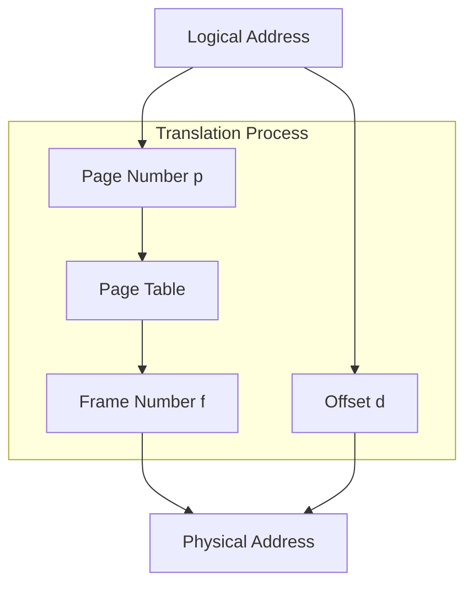
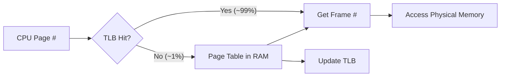
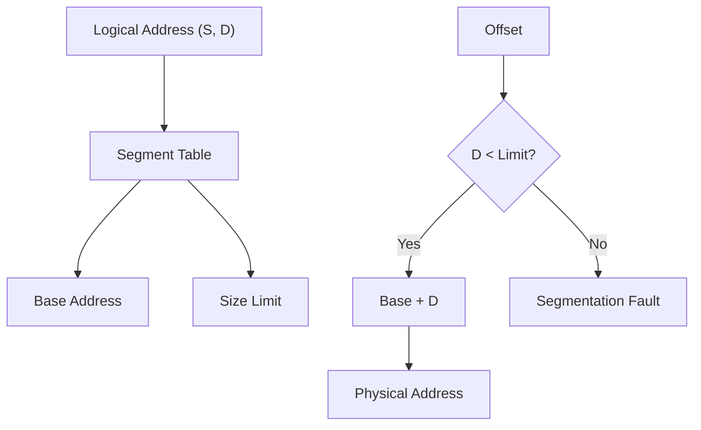
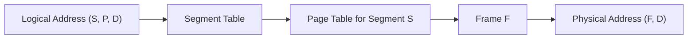
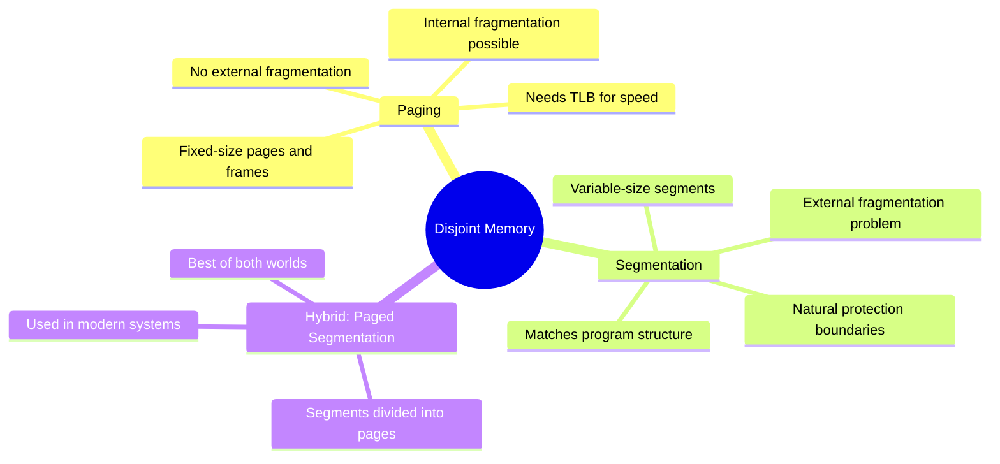

# 🧠 L8 — Disjoint Memory Schemes

> [!abstract] Lecture Goal
> Move beyond the assumption that a process must sit in *contiguous* physical memory. Two mechanisms achieve this: **Paging** and **Segmentation**.

> [!tip] The Big Picture
> In [[L7]], processes had to occupy one big, unbroken chunk of RAM. But what if we could **scatter** a process's memory across physical RAM? That's exactly what paging does.

---

## 📦 Part 1: Paging

### 1.1 The Core Idea

In contiguous allocation, a process occupies one big chunk. This causes **external fragmentation** — lots of little free holes that can't be used together.

**Paging's solution:** Let a process's memory be **scattered** across physical RAM!

| 📄 Concept | 📍 Where it lives | 📏 Fixed/Variable size |
| :--- | :--- | :--- |
| **Page** | Logical (process) memory | Fixed ✅ |
| **Frame** | Physical memory | Fixed ✅ (same size as page) |

> [!tip] Hotel Analogy
> Think of physical memory as a hotel with numbered rooms (frames), all the same size.
> - A process is like a tour group that needs several rooms
> - The hotel doesn't need to give them adjacent rooms — any free rooms will do
> - The **page table** is the receptionist's ledger mapping each group member (page) to their assigned room (frame)

```
Logical View (Process):          Physical Reality (RAM):
┌──────┬──────┬──────┐           ┌──────┐ Frame 0
│Page 0│Page 1│Page 2│    ──►    │Frame 3│ (Page 0) ← scattered!
└──────┴──────┴──────┘           ├──────┤ Frame 1
                                 │Frame 7│ (Page 2) ← not contiguous!
                                 ├──────┤ Frame 2
                                 │Frame 1│ (Page 1)
                                 └──────┘
```

---

### 1.2 Logical Address Translation

Because page size and frame size are both **powers of 2**, the address splits cleanly with bit-slicing — **no division needed!**



> [!info] Why Power of 2?
> The offset is just the lower $n$ bits of the address, and the page number is the upper $m-n$ bits. No arithmetic — just bit masking!

**Example Walkthrough:**
```
Given: 4-bit logical address, page size = 4 bytes
→ n = 2 (offset bits), m = 4 (total bits)

Logical address: 0b1001
├── Page number: 0b10 = 2 (upper 2 bits)
└── Offset:      0b01 = 1 (lower 2 bits)

Page table says: Page 2 → Frame 1

Physical address = Frame × Page size + Offset
                 = 1 × 4 + 1
                 = 5 → 0b00101
```

---

### 1.3 Fragmentation: The Good News

| 🧩 Type | 📈 Paging Behaviour |
| :--- | :--- |
| **External fragmentation** | ✅ **Eliminated!** Every free frame is usable |
| **Internal fragmentation** | ⚠️ Still possible — last page may not be full |

> [!example] Internal Fragmentation Example
> Process needs 10,050 bytes. Page size = 4 KB.
> - Pages needed: ⌈10050 / 4096⌉ = 3 pages = 12,288 bytes
> - Wasted: 12,288 - 10,050 = **2,238 bytes** (internal fragmentation)

**Key insight:** External fragmentation is solved by paging. We only have to worry about internal fragmentation, which is much smaller and more predictable.

---

### 1.4 Hardware Support: The TLB

Naïve paging requires **two memory accesses** per reference:
1. Access page table to get frame number
2. Access the actual data

This doubles memory access time! Enter the **Translation Look-Aside Buffer (TLB)** — a small, ultra-fast on-chip cache.



> [!info] Average Access Time Formula
> $$T_{avg} = hit\_rate \times (TLB + MEM) + miss\_rate \times (TLB + MEM + MEM)$$
>
> With 99% hit rate, TLB = 2ns, MEM = 100ns:
> $$T_{avg} = 0.99 \times 102 + 0.01 \times 202 = 103ns$$
>
> Compare to 200ns without TLB — nearly **2× faster!**

---

### 1.5 Protection & Sharing

The page table does more than just translation. Each entry has **metadata bits**:

| 🔒 Bit | 📝 Purpose |
| :--- | :--- |
| **Valid/Invalid** | Is this page in the process's address space? |
| **Read/Write/Execute** | Access rights for this page |
| **Dirty** | Has this page been modified? |
| **Referenced** | Has this page been accessed recently? |

> [!info] Copy-On-Write (COW)
> When `fork()` creates a child process, parent and child initially share the **same physical pages**. Only when one writes to a page does the OS make a copy. This saves memory and makes `fork()` much faster!

---

## 📐 Part 2: Segmentation

### 2.1 Motivation

Paging treats memory as one flat space. But programs have **distinct regions** with different needs:

```
┌─────────────────┐ High addresses
│     Stack       │ ← Needs to grow, limited access
├─────────────────┤
│     Heap        │ ← Needs to grow, read/write
├─────────────────┤
│     Data        │ ← Fixed size, read/write
├─────────────────┤
│     Code        │ ← Fixed size, read-only, executable
└─────────────────┘ Low addresses
```

> [!tip] Building Analogy
> A process is like a building. It has different floors for different purposes (lobby, offices, storage). Segmentation treats each floor as an independently managed unit — each can expand or contract without affecting others.

---

### 2.2 Basic Idea

The logical address space is divided into named **segments** of **variable size**.



**How it works:**
1. Logical address = `(segment_number, offset)`
2. Look up segment in segment table → get `base` and `limit`
3. Check: `offset < limit`? If no → **segfault**
4. Physical address = `base + offset`

> [!danger] Segmentation Fault
> This occurs when your program accesses an offset **beyond the limit** of a segment. The hardware catches the out-of-bounds access and traps to the OS.
>
> Common causes: Stack overflow, null pointer dereference, array out of bounds.

---

### 2.3 Segmentation vs Paging

| ⚖️ Feature | 📄 Paging | 📐 Segmentation |
| :--- | :--- | :--- |
| **Unit Size** | Fixed (hardware-decided) | Variable (usage-based) |
| **Ext. Fragmentation** | ❌ None | ⚠️ Yes (variable sizes) |
| **Int. Fragmentation** | ⚠️ Yes (last page) | ❌ None (perfect fit) |
| **Logical Structure** | Flat (no regions) | Structured (matches program) |
| **Sharing** | Page-level | Segment-level (more natural) |

> [!question] Which is better?
> Neither! They solve different problems:
> - **Paging**: Solves external fragmentation, simple allocation
> - **Segmentation**: Matches program structure, enables logical protection

---

## 🔗 Part 3: Segmentation with Paging

### 3.1 Best of Both Worlds

Segmentation suffers from external fragmentation. The fix: **page the segments!**



**How it works:**
1. **Segment** gives logical structure (Code, Data, Stack, Heap)
2. Each **segment is divided into pages**
3. **Page table** maps pages to frames
4. Best of both: logical structure + no external fragmentation

| Address Component | Meaning |
| :--- | :--- |
| **S** | Which segment? (Code, Data, Stack, etc.) |
| **P** | Which page within that segment? |
| **D** | Offset within that page |

> [!info] Modern Systems
> Modern x86-64 uses a simplified version: **paging alone**. Segments exist for legacy reasons but are mostly set to base=0, limit=max. The OS manages memory almost entirely through paging.

---

## ❓ Mock Exam Questions

> [!question] Q1: Address Calculation
> Page size = 512 bytes, Logical address = 16 bits. How many bits for page number and offset?
> <details><summary>Answer</summary>
>
> Page size = 512 bytes = $2^9$ bytes
>
> - **Offset bits** = $\log_2(512)$ = **9 bits**
> - **Page number bits** = 16 - 9 = **7 bits**
>
> Maximum pages = $2^7$ = 128 pages
> Maximum addressable memory = $2^{16}$ = 64 KB
> </details>

> [!question] Q2: TLB Performance
> TLB lookup = 2 ns, Memory access = 100 ns, Hit rate = 80%. Calculate the average memory access time.
> <details><summary>Answer</summary>
>
> $$T_{avg} = hit \times (TLB + MEM) + miss \times (TLB + MEM + MEM)$$
>
> $$T_{avg} = 0.8 \times (2 + 100) + 0.2 \times (2 + 100 + 100)$$
>
> $$T_{avg} = 0.8 \times 102 + 0.2 \times 202$$
>
> $$T_{avg} = 81.6 + 40.4 = \mathbf{122\ ns}$$
>
> **Note:** Without TLB, every access would take 200 ns (2 memory accesses). The TLB saves ~40% time at 80% hit rate!
> </details>

> [!question] Q3: Segmentation Fault
> A segment has base = 1000, limit = 500. Which logical addresses cause a segmentation fault?
> <details><summary>Answer</summary>
>
> Valid offsets: 0 to 499 (offset < limit)
>
> - Offset 300 → **Valid** (300 < 500)
> - Offset 500 → **Invalid** (500 ≥ 500) ← segfault!
> - Offset 1000 → **Invalid** (1000 ≥ 500) ← segfault!
>
> Remember: The check is **strictly less than**. `offset == limit` is already out of bounds.
> </details>

---

## ⚠️ Common Mistakes to Watch Out For

> [!danger] Fragmentation Confusion
> Paging eliminates **external** fragmentation, but **internal** fragmentation still exists in the last page. Segmentation is the opposite!

> [!danger] TLB Miss Penalty
> On a TLB miss, you **still spent time checking the TLB**!
> Total time = TLB + MEM + MEM = TLB + 2 × MEM
>
> Don't forget the TLB lookup time in your calculation!

> [!danger] Page vs Segment
> - **Page size**: Fixed, determined by hardware (e.g., 4 KB)
> - **Segment size**: Variable, determined by program structure

> [!danger] Offset Range
> For a segment with limit = N, valid offsets are 0 to N-1. Address N is out of bounds!

---

## 🗺️ Big Picture Summary



---

## 🔗 Connections

| 📚 Lecture | 🔗 Connection |
| :--- | :--- |
| [[L7]] | Base+Limit registers → generalized to segmentation |
| [[L9]] | Paging + disk backing → **Virtual Memory**! Present bit enables pages to live on disk |

> [!quote] The Key Insight
> Paging solved external fragmentation by making allocation units fixed-size. Segmentation preserved logical structure by using variable-size units. **Paged segmentation** combines both — segments for logic, pages for allocation.