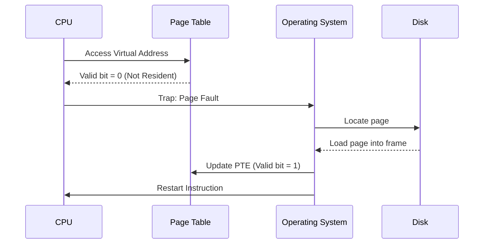
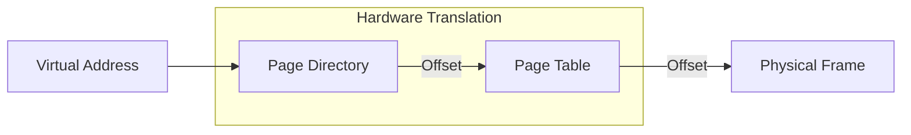
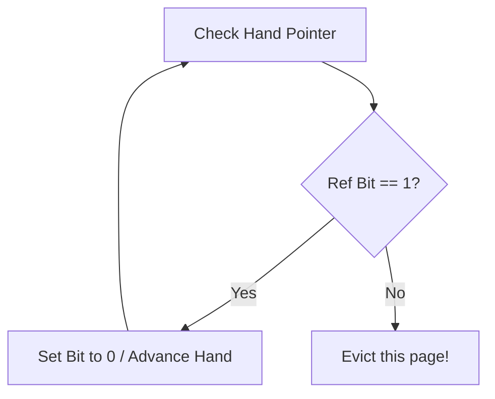
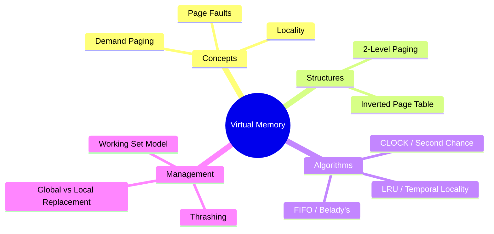

# 🧠 L9: Virtual Memory Management

> [!abstract] Lecture Goal
> Learn how the OS uses secondary storage to trick processes into thinking they have more RAM than physically exists, and the algorithms used to manage this "Virtual Memory".

---

## 1. Virtual Memory — Motivation & Basic Idea

> [!question] Why does it exist?
> Previously (as seen in [[L8]]), we assumed physical memory must hold a process's **entire** logical address space. But what if a process is **larger** than RAM? Virtual Memory solves this by using storage as an extension of RAM.

> [!info] The Core Idea
> - Some pages live in **physical memory (RAM)**.
> - Other pages are stored on **secondary storage (disk)**.
> - The CPU only "sees" logical addresses — it's abstracted from the physical location.

> [!tip] Desk Analogy
> Think of RAM as your desk and the disk as a filing cabinet. You can only work on documents on your desk. If you need something from the cabinet, you fetch it — and may need to put something back to make room.

| 🌟 Benefit | 📝 Explanation |
| :--- | :--- |
| **Size Independence** | Process can be larger than physical RAM |
| **Higher Concurrency** | Only active pages in RAM = more processes running |
| **Efficiency** | CPU is less idle because more processes are "ready" |

---

## 2. Page Fault & Access Flow

> [!info] What is a Page Fault?
> A **page fault** occurs when the CPU tries to access a page that is **not currently in physical memory**. It is NOT a crash — it's a normal event handled by the OS.

### 🔄 Step-by-Step Access Flow

---

### 🏷️ The "Memory Resident" Bit

Each Page Table Entry (PTE) contains a **valid/invalid bit**:

- `1` = page is in physical memory ✅

- `0` = page is on disk, must be fetched ❌ → triggers page fault

### 🌍 Locality Principles — Why VM Works in Practice

If page faults happened every single access, VM would be useless (disk is ~1000x slower than RAM). VM works because of **locality**:

| Type | Meaning | VM Exploitation |
|---|---|---|
| **Temporal Locality** | Recently used addresses will likely be used again soon | After a page is loaded, it'll be reused → cost is amortized |
| **Spatial Locality** | Addresses near a used address will likely be used soon | A loaded page contains nearby addresses → fewer future faults |

---

## 3. Demand Paging

### 💡 The Idea

Instead of loading all pages when a process starts, **load a page only when it is first accessed** (i.e., on demand).

- Process starts with **zero** pages in RAM

- Each access triggers a page fault initially

- Over time, the "working" pages accumulate in RAM

### ⚖️ Trade-offs

| Aspect | Detail |
|---|---|
| ✅ Fast startup | No pages pre-loaded = process starts immediately |
| ✅ Small memory footprint | Only active pages in RAM |
| ❌ Initial slowness | Multiple page faults at startup ("cold start") |
| ❌ Cascading risk | If many processes fault simultaneously → thrashing |

---

## 4. Page Table Structures

### 🌲 Solution: 2-Level Paging
Most processes don't use their full virtual address space. 2-level paging saves memory by only allocating sub-tables for regions in use.

> [!info] Memory Savings
> Empty entries in the page directory mean no sub-table is allocated, leading to massive memory savings for sparse address spaces.

---

## 5. Page Replacement Algorithms

When a page fault occurs and no free frame is available, the OS must **evict** a page.

| 🔮 Algorithm | 🎯 Strategy | 📉 Performance |
| :--- | :--- | :--- |
| **OPT** | Replace page used furthest in future | Theoretical best (not implementable) |
| **FIFO** | Replace oldest loaded page | Simple, but suffers from Belady's Anomaly |
| **LRU** | Replace least recently used page | Excellent (exploits temporal locality) |
| **CLOCK** | FIFO with a "second chance" | Practical approximation of LRU |

### ⏰ The CLOCK Algorithm

---

## 6. Thrashing & Working Set Model

> [!danger] Thrashing
> **Thrashing** occurs when a process spends more time swapping pages than executing. This happens when the OS allocates fewer frames than the process needs for its "working set".

> [!tip] Working Set Model
> Allocate enough frames to hold the set of pages a process has accessed in the last $\Delta$ time units. This ensures the process stays in its "locality" and avoids constant faulting.

---

## ❓ Mock Exam Questions

> [!question] Q: Belady's Anomaly
> What is Belady's Anomaly? Which algorithm suffers from it?
> 

Answer
The phenomenon where adding more frames leads to **more** page faults. **FIFO** is the classic algorithm that suffers from this.

> [!question] Q: Page Fault Rate
> If $T_{mem} = 100ns$ and $T_{disk} = 10ms$, how does the page fault rate $p$ affect performance?
> 

Answer
$T_{avg} = (1-p) \times 100ns + p \times 10,000,000ns$. Even a tiny $p$ (e.g., 0.1%) can slow down the system by orders of magnitude.

---

## ⚠️ Common Mistakes to Watch Out For

> [!danger] OPT in the Real World
> OPT is a **benchmark only**. You cannot implement it because you can't see the future!

> [!danger] Dirty Pages
> Evicting a **dirty** (modified) page costs more than a clean one because it must be written back to disk first.

---

## 🗺️ Big Picture Summary

