# 🧠 L9: Virtual Memory Management

> [!abstract] Lecture Goal
> Understand how virtual memory decouples logical address spaces from physical memory, how page faults work, and master the algorithms that manage this illusion efficiently.

> [!tip] The Big Picture
> Virtual memory is the **crowning achievement of OS design** — it allows processes to use more memory than physically exists, enables process isolation, and simplifies programming. The trick is making page faults so rare (via locality) that the system performs well despite disk being 10,000× slower than RAM.

---

## 1. Virtual Memory — Motivation & Basic Idea

### 🤔 The Core Problem

Traditional memory management assumes the **entire** logical address space of a process fits in physical memory. This breaks down when:

- A single process is larger than available RAM
- Many processes compete for limited physical memory simultaneously

### 💡 The Solution

Virtual Memory **decouples the logical address space from physical memory** by using secondary storage (disk) as an overflow area.

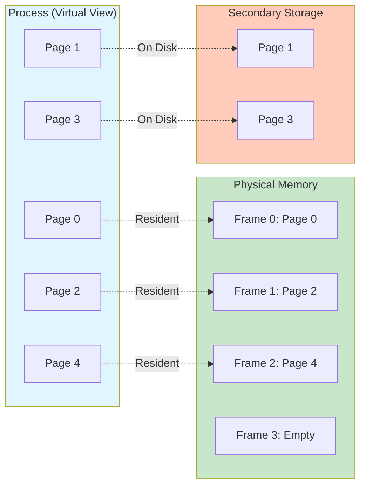

The CPU always works with **logical (virtual) addresses** — it is the OS + hardware that transparently manages which pages are physically present.

### 📊 Key Benefits Summary

| Benefit | Mechanism |
| :--- | :--- |
| **Process size > Physical RAM** | Only active pages need to be resident |
| **Higher multiprogramming degree** | More processes share limited RAM |
| **Better CPU utilization** | More runnable processes → fewer idle cycles |
| **Memory isolation** | Each process has its own virtual address space |

---

### 📚 Key Terminology

| Term | Definition |
| :--- | :--- |
| **Virtual (Logical) Address Space** | The address space a process "sees"; may be much larger than physical RAM |
| **Physical Address Space** | The actual addresses of physical RAM |
| **Page** | A fixed-size chunk of logical address space |
| **Frame** | A fixed-size chunk of physical memory (same size as a page) |
| **Secondary Storage** | Disk/SSD used to hold non-resident pages |
| **Memory-Resident Page** | A page currently loaded in a physical frame |
| **Non-Memory-Resident Page** | A page stored on disk, not currently in RAM |

---

### ⚠️ Common Pitfalls

> [!danger] Pitfall 1: Confusing "virtual memory" with "physical memory size"
> Virtual memory is a **management scheme**, not a hardware spec. A process with 8 GiB of virtual address space can run on a system with only 2 GiB of RAM.

> [!danger] Pitfall 2: Assuming all pages must be in RAM
> Only the pages being **actively accessed right now** need to be resident. The rest can stay on disk.

> [!danger] Pitfall 3: Thinking disk is "free" to use as extra RAM
> Disk access is ~1,000–10,000× slower than RAM. Over-reliance on disk (thrashing) severely degrades performance.

---

### ❓ Mock Exam Questions

> [!question] Q1: Primary Motivation
> Which of the following is the primary motivation for virtual memory?
> <details><summary>Answer</summary>
>
> **To allow a process's logical address space to exceed physical memory size**
>
> Virtual memory enables processes to use more memory than physically exists by keeping inactive pages on disk.
> </details>

> [!question] Q2: Hardware Component
> In a virtual memory system, when a process accesses a virtual address, the first hardware component involved in translation is:
> <details><summary>Answer</summary>
>
> **Page Table (via the MMU)**
>
> The Memory Management Unit (MMU) uses the page table to translate virtual addresses to physical addresses.
> </details>

> [!question] Q3: Pages and Frames
> Which of the following is TRUE about pages and frames?
> <details><summary>Answer</summary>
>
> **Pages are units of logical memory; frames are units of physical memory, both of equal size**
>
> Pages and frames must be the same size for the mapping to work correctly.
> </details>

---

## 2. Page Fault, Access Flow & Locality

### 🔍 The Page Table Entry (PTE)

Every page in a process's virtual address space has a corresponding **Page Table Entry (PTE)**. The PTE stores:

- The **physical frame number** (if the page is resident)
- A **valid/invalid (memory-resident) bit**: `1` = in RAM, `0` = on disk

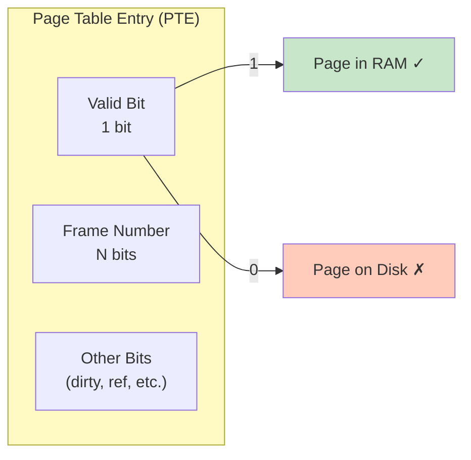

### ⚡ The Page Fault Mechanism

When the CPU accesses a virtual address whose PTE has `valid bit = 0`, a **page fault** is triggered — a hardware trap that hands control to the OS.

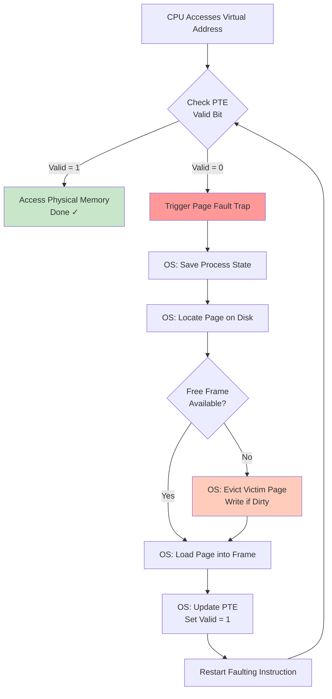

### 📐 Memory Access Time Formula

$$T_{access} = (1 - p) \cdot T_{mem} + p \cdot T_{page\_fault}$$

Where:
- $p$ = probability of a page fault on any given access
- $T_{mem}$ = time to access a memory-resident page
- $T_{page\_fault}$ = time to handle a page fault (includes disk I/O)

Since $T_{page\_fault} \gg T_{mem}$, even a tiny $p$ has a large impact on $T_{access}$.

> [!example] Example Calculation
> Given $T_{mem} = 100\text{ns}$, $T_{page\_fault} = 10\text{ms} = 10{,}000{,}000\text{ns}$, target $T_{access} = 120\text{ns}$:
> 
> $$p \approx 0.000002 \quad \text{(about 1 in 500,000 accesses)}$$
> 
> This shows how **extremely rare** page faults must be for virtual memory to be practical.

### 🎯 Locality Principles — Why VM is Viable

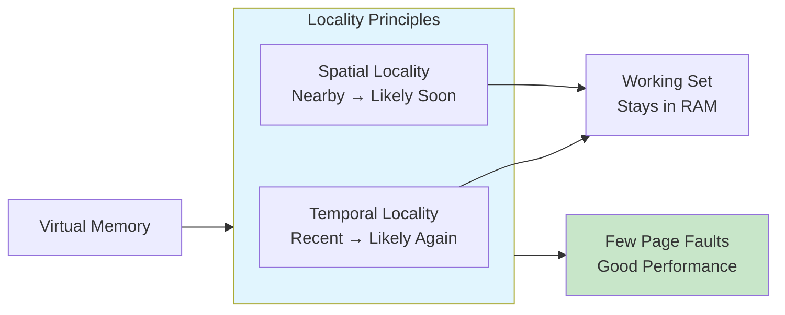

| Principle | Description | VM Benefit |
| :--- | :--- | :--- |
| **Temporal Locality** | A recently accessed address is likely to be accessed again soon | A loaded page will likely be reused → loading cost is amortized |
| **Spatial Locality** | Addresses near a recently used one are likely to be used soon | A page contains contiguous addresses → nearby accesses won't fault |

---

### 📚 Key Terminology

| Term | Definition |
| :--- | :--- |
| **Page Fault** | Exception triggered when CPU accesses a non-resident page |
| **Valid/Invalid Bit** | PTE bit indicating whether the page is currently in RAM |
| **Trap** | A synchronous exception that transfers control to the OS |
| **Dirty Page** | A page modified in RAM; must be written back before eviction |
| **Clean Page** | An unmodified page; can be evicted without writing to disk |
| **Thrashing** | State where a process spends more time on page faults than executing |

---

### ⚠️ Common Pitfalls

> [!danger] Pitfall 1: Thinking page faults mean crashes
> A page fault is a **completely normal OS event**. It's how virtual memory transparently loads pages on demand.

> [!danger] Pitfall 2: Forgetting eviction step
> Step 4 (load page) may first require **evicting** an existing page if no free frame exists. This is why page replacement algorithms are necessary.

> [!danger] Pitfall 3: Confusing clean and dirty pages
> Only **dirty** pages need to be written back to disk on eviction. Evicting a clean page is faster because the disk already has an up-to-date copy.

> [!danger] Pitfall 4: Underestimating required p
> A page fault rate of even 1-in-1000 ($p = 0.001$) is **catastrophically bad** in practice. The fault rate must be ~1 in 100,000 or better.

---

### ❓ Mock Exam Questions

> [!question] Q1: Page Fault Sequence
> Which correctly describes the sequence during a page fault?
> <details><summary>Answer</summary>
>
> **Answer: Hardware detects fault → OS loads page → hardware retries instruction**
>
> The hardware detects the invalid PTE, traps to the OS, the OS handles loading, then the instruction is restarted.
> </details>

> [!question] Q2: Page Fault Rate
> Given $T_{mem} = 50\text{ns}$ and $T_{page\_fault} = 5\text{ms}$, which page fault rate gives $T_{access} \approx 100\text{ns}$?
> <details><summary>Answer</summary>
>
> **Answer: $p = 0.00001$**
>
> Solving: $100 = (1-p)(50) + p(5,000,000)$ → $p \approx 0.00001$ or about 1 in 100,000.
> </details>

> [!question] Q3: Spatial Locality
> Spatial locality in virtual memory means:
> <details><summary>Answer</summary>
>
> **Answer: If one address is accessed, nearby addresses are also likely to be accessed**
>
> Spatial locality is about proximity in memory, not position in address space.
> </details>

---

## 3. Demand Paging

### 🚀 The Core Idea

When a new process is launched, should **all** its pages be loaded into RAM immediately? Demand paging says: **no**.

> [!quote] Demand Paging Definition
> Load a page into physical memory **only when it is first accessed** — i.e., on the first page fault for that page.

A process starts execution with **zero pages in RAM**. Every first access triggers a page fault, which loads the required page.

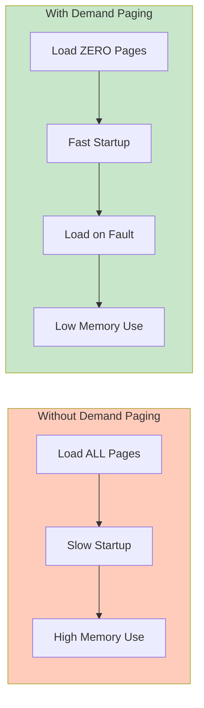

### 📊 Trade-off Analysis

| Aspect | Without Demand Paging | With Demand Paging |
| :--- | :--- | :--- |
| **Startup time** | Slow — must load all pages | Fast — zero pages to load upfront |
| **Memory footprint** | Large — all pages resident | Small — only active pages in RAM |
| **Runtime performance** | Smooth after startup | Initial sluggishness (cold start faults) |
| **Multiprogramming** | Fewer processes fit in RAM | More processes can coexist |

---

### 📚 Key Terminology

| Term | Definition |
| :--- | :--- |
| **Demand Paging** | Strategy of loading pages only when first accessed |
| **Cold Start** | Initial phase where many page faults occur |
| **Memory Footprint** | Amount of physical memory a process currently occupies |
| **Pre-paging** | Alternative — load pages speculatively before needed |

---

### ⚠️ Common Pitfalls

> [!danger] Pitfall 1: Confusing demand paging with virtual memory
> Virtual memory is the **broader system**. Demand paging is one **policy** for when to load pages.

> [!danger] Pitfall 2: Thinking demand paging eliminates page faults
> It **defers** them — the cold start will cause many page faults. After that, faults should be rare if locality holds.

> [!danger] Pitfall 3: Assuming demand paging reduces total faults
> It reduces **startup cost** but doesn't inherently reduce the total number of page faults over a process's lifetime.

---

### ❓ Mock Exam Questions

> [!question] Q1: Initial Pages
> Under demand paging, how many pages are loaded when a process is first created?
> <details><summary>Answer</summary>
>
> **Answer: Zero**
>
> Demand paging loads pages only on first access — none are loaded initially.
> </details>

> [!question] Q2: Disadvantage
> Which is a disadvantage of demand paging?
> <details><summary>Answer</summary>
>
> **Answer: Initial runtime slowness due to many page faults**
>
> The cold start causes many page faults until the working set is loaded.
> </details>

> [!question] Q3: Viability
> Demand paging is viable primarily because:
> <details><summary>Answer</summary>
>
> **Answer: Most processes access only a small fraction of their pages at any given time**
>
> Locality means most pages are never accessed during typical execution.
> </details>

---

## 4. Page Table Structures

### 📏 The Problem: Page Tables Are Huge

A page table entry (PTE) exists for every page in the virtual address space. With large virtual address spaces, page tables themselves consume significant memory.

> [!example] Direct (Flat) Paging Example
> Given a 32-bit virtual address space with 4 KiB pages and 4-byte PTEs:
> 
> $$\text{Page bits } p = 32 - 12 = 20$$
> $$\text{Number of PTEs} = 2^{20} = 1{,}048{,}576$$
> $$\text{Page table size} = 2^{20} \times 4 = \mathbf{4\text{ MiB per process}}$$
> 
> With 100 processes: **400 MiB just for page tables**. And most entries map pages that are never used!

### 🏗️ Structure 1: 2-Level Paging

**Key Insight:** Most processes use only a small fraction of their virtual address space. A flat table wastes entries for unused regions.

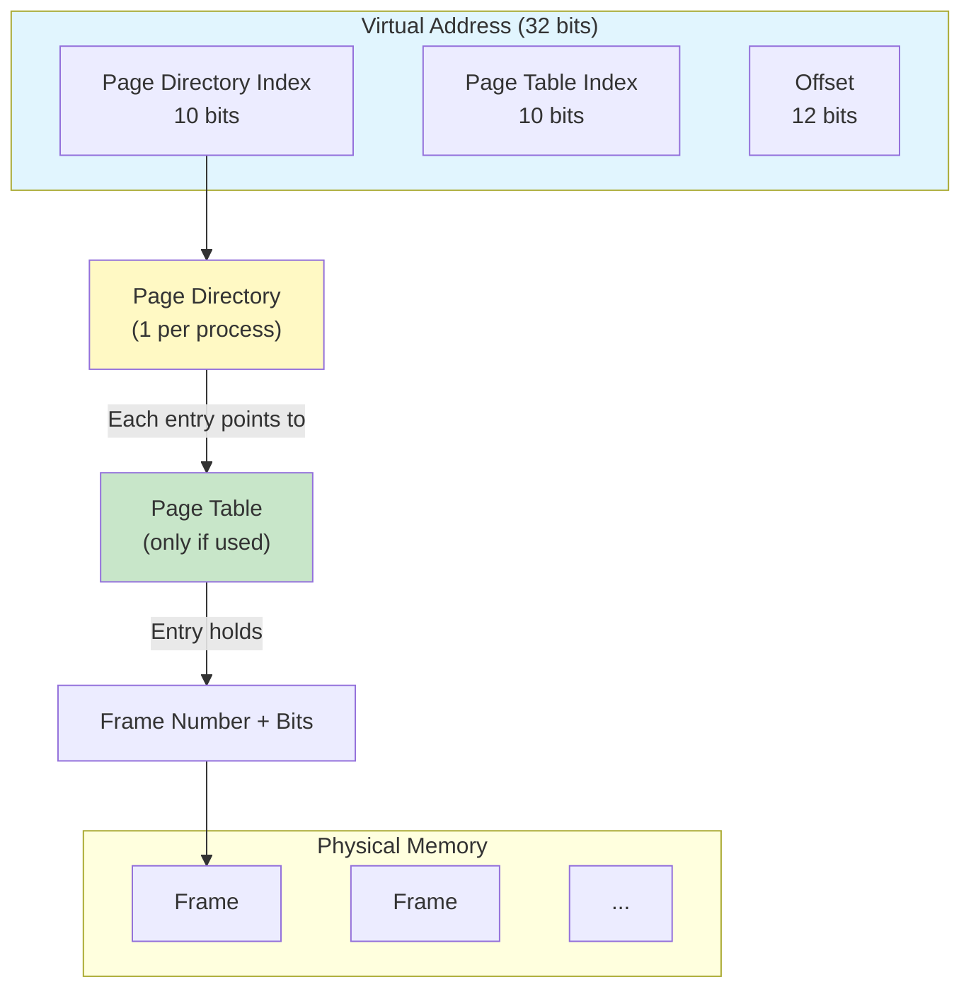

**Only allocate sub-tables for regions actually in use.**

| Structure | Size | When Efficient |
| :--- | :--- | :--- |
| Flat paging | 4 MiB per process | Dense address space |
| 2-level paging | ~13 KiB typical | Sparse address space |

---

### 🔄 Structure 2: Inverted Page Table

**Key Insight:** With $M$ processes, there are $M$ page tables. Yet only $N$ physical frames can be occupied. The majority of entries across all page tables are invalid.

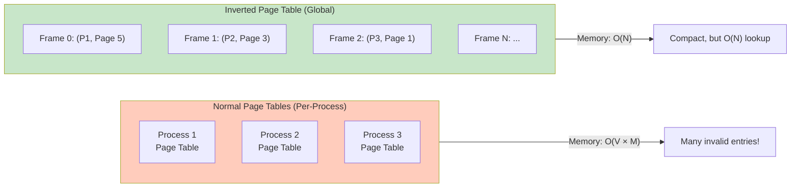

| Property | Normal Page Table | Inverted Page Table |
| :--- | :--- | :--- |
| **Table count** | One per process | **One global table** |
| **Table size** | Proportional to virtual address space | Proportional to physical frame count |
| **Lookup time** | $O(1)$ — direct index | $O(N)$ — linear search (or hashed) |
| **Multi-process support** | Easy (separate tables) | Requires `pid` field in each entry |

---

### 📚 Key Terminology

| Term | Definition |
| :--- | :--- |
| **Direct (Flat) Paging** | Single-level page table with one entry per virtual page |
| **Page Directory** | Top-level table in 2-level paging; each entry points to a sub-table |
| **Sub-table / Page Table** | Second-level table in 2-level paging; entries map to physical frames |
| **Inverted Page Table** | Single global table indexed by frame number; stores `(pid, page#)` |
| **PTE (Page Table Entry)** | One record in a page table; stores frame number and status bits |

---

### ⚠️ Common Pitfalls

> [!danger] Pitfall 1: Assuming 2-level paging is always smaller
> 2-level paging saves memory only when the address space is **sparse**. If a process uses nearly all its virtual address space, 2-level may use **more** memory due to directory overhead.

> [!danger] Pitfall 2: Forgetting extra memory accesses
> In 2-level paging, address translation requires **two memory accesses** before reaching data — one for the page directory, one for the sub-table. This is why TLB is critical.

> [!danger] Pitfall 3: Mixing up indexing direction
> Normal page table: indexed by **virtual page** → gives frame number. Inverted: indexed by **frame number** → gives (pid, page). The inverted table is used **backwards**.

> [!danger] Pitfall 4: Assuming inverted tables are faster
> They are **slower** for lookup ($O(N)$ search) but use **less memory**. Hashing speeds up the search but adds complexity.

---

### ❓ Mock Exam Questions

> [!question] Q1: Flat Page Table Size
> A system uses 32-bit virtual addresses and 4 KiB pages. Each PTE is 4 bytes. What is the size of a flat page table?
> <details><summary>Answer</summary>
>
> **Answer: 4 MiB**
>
> $p = 32 - 12 = 20$ bits. Number of entries = $2^{20}$. Size = $2^{20} \times 4 = 4$ MiB.
> </details>

> [!question] Q2: NULL Entry Meaning
> In 2-level paging, a NULL entry in the page directory means:
> <details><summary>Answer</summary>
>
> **Answer: The corresponding region of virtual address space is not in use, and no sub-table is allocated**
>
> This is exactly the memory-saving benefit — sparse regions have NULL directory entries.
> </details>

> [!question] Q3: Inverted Table Advantage
> The primary advantage of an inverted page table is:
> <details><summary>Answer</summary>
>
> **Answer: Reduced total memory consumption for page table storage**
>
> One table proportional to physical frames, not multiple tables proportional to virtual address spaces.
> </details>

---

## 5. Page Replacement Algorithms

### 🔄 When Is Replacement Needed?

When a page fault occurs and **no free physical frame exists**, the OS must **evict** an existing page to make room. The evicted page is written back to disk only if it is **dirty** (modified since loading).

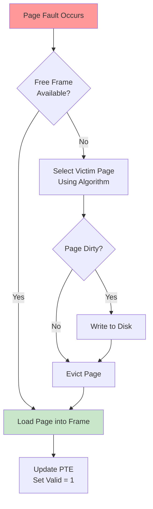

### 📏 Performance Metric

$$T_{access} = (1 - p) \cdot T_{mem} + p \cdot T_{page\_fault}$$

A good replacement algorithm **minimizes total page faults**, keeping $p$ small.

---

### Algorithm 1: OPT (Optimal)


**Strategy:** Replace the page whose **next use is furthest in the future**.

- Produces the **minimum possible** page faults — the theoretical lower bound
- **Not implementable** in practice (requires future knowledge)
- Used purely as a **benchmark**

---

### Algorithm 2: FIFO (First-In, First-Out)

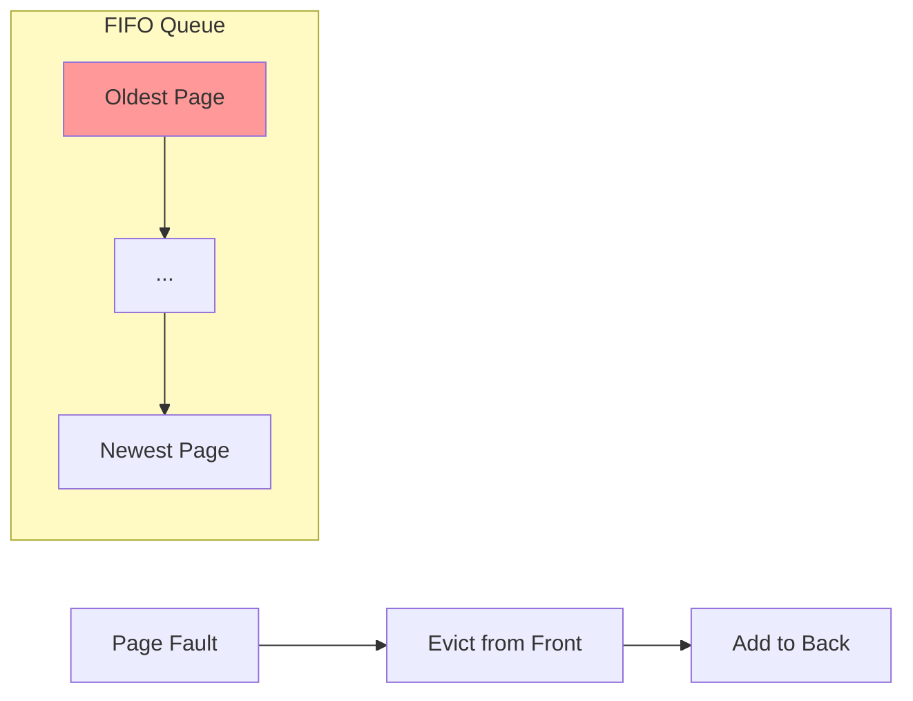

**Strategy:** Evict the page that has been in memory **the longest**.

**Weakness — Belady's Anomaly:**
> Adding more physical frames can **increase** the number of page faults under FIFO!

| Frames | Page Faults |
| :--- | :--- |
| 3 | 9 |
| 4 | 10 ← **Anomaly!** |

---

### Algorithm 3: LRU (Least Recently Used)

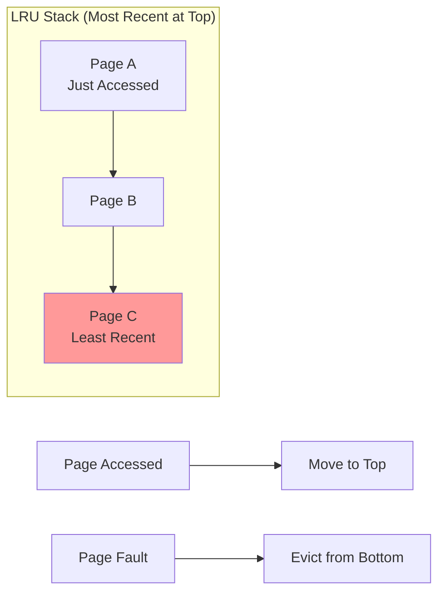

**Strategy:** Evict the page that has **not been used for the longest time**.

- Exploits **temporal locality**: recently used pages are likely to be used again
- Approximates OPT by looking **backward** in time
- Does **not** suffer from Belady's Anomaly

---

### Algorithm 4: Second-Chance (CLOCK)

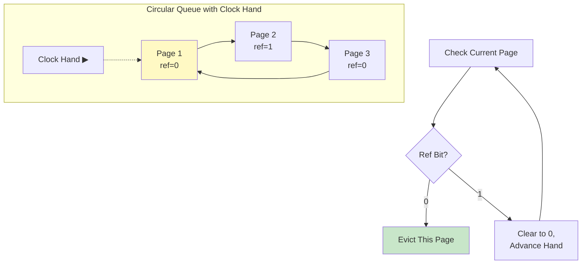

**Algorithm:**
```
Point clock hand at oldest page (victim candidate)
LOOP:
  If reference bit == 0 → EVICT this page. Done.
  If reference bit == 1 → Clear bit to 0, advance hand, continue loop.
```

| Algorithm | Faults (example) | Belady's Anomaly | Implementable? | Hardware Needed |
| :--- | :--- | :--- | :--- | :--- |
| **OPT** | 6 (minimum) | ❌ No | ❌ No | — |
| **FIFO** | 9 | ✅ Yes | ✅ Yes | None |
| **LRU** | 7 | ❌ No | ✅ Yes | Counter or stack |
| **CLOCK** | 6 | ❌ No | ✅ Yes | Reference bit only |

---

### 📚 Key Terminology

| Term | Definition |
| :--- | :--- |
| **Page Replacement** | Evicting a resident page to make room for a newly-faulted page |
| **Dirty Page** | A page modified in RAM; must be written to disk before eviction |
| **Clean Page** | An unmodified page; can be evicted without a disk write |
| **Belady's Anomaly** | More frames leading to more page faults (FIFO-specific) |
| **Reference Bit** | Hardware bit in PTE; set to 1 on any access |
| **Clock Hand** | Pointer in CLOCK algorithm pointing to victim candidate |
| **Reference String** | A sequence of page numbers representing memory accesses |

---

### ⚠️ Common Pitfalls

> [!danger] Pitfall 1: Thinking OPT is real
> OPT is **theoretically optimal** but **practically impossible** — it requires knowing the future. It exists only as a benchmark.

> [!danger] Pitfall 2: Assuming more frames always reduces faults
> True for LRU, OPT, and CLOCK — but **FIFO can violate this** (Belady's Anomaly).

> [!danger] Pitfall 3: Confusing LRU with CLOCK
> LRU is **exact** — it always evicts the true least-recently-used page but is expensive. CLOCK **approximates** LRU using the reference bit and is efficient.

> [!danger] Pitfall 4: Forgetting dirty page write-back
> When a dirty page is evicted, it must be written to disk first — **doubling the I/O cost** compared to evicting a clean page.

> [!danger] Pitfall 5: Clock hand movement
> In CLOCK simulations, the hand advances after clearing a reference bit. Track it carefully!

---

### ❓ Mock Exam Questions

> [!question] Q1: Minimum Faults
> Which page replacement algorithm is guaranteed to produce the minimum number of page faults?
> <details><summary>Answer</summary>
>
> **Answer: OPT**
>
> OPT is the theoretical minimum by definition — it looks into the future.
> </details>

> [!question] Q2: Belady's Anomaly
> Belady's Anomaly refers to:
> <details><summary>Answer</summary>
>
> **Answer: FIFO producing more page faults when given more physical frames**
>
> Counterintuitively, more frames can cause more faults under FIFO.
> </details>

> [!question] Q3: CLOCK Behavior
> In the CLOCK algorithm, when a page with reference bit = 1 is encountered:
> <details><summary>Answer</summary>
>
> **Answer: Its reference bit is set to 0 and the clock hand advances**
>
> The page gets a "second chance" — its bit is cleared and the hand moves on.
> </details>

---

## 6. Frame Allocation

### 📊 The Problem

Given $N$ physical frames and $M$ competing processes, how should frames be distributed?

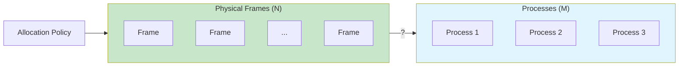

### Allocation Strategies

**Equal Allocation:**
$$\text{Frames per process} = \left\lfloor \frac{N}{M} \right\rfloor$$

Simple, but ignores process size.

**Proportional Allocation:**
$$\text{Frames for process } p = \frac{\text{size}_p}{\text{size}_{total}} \times N$$

Fairer — larger processes get more frames proportional to their size.

> [!example] Proportional Allocation Example
> $N = 64$ frames, 3 processes of sizes 10, 30, and 60.
> - Total size = 100
> - Process allocations: $\frac{10}{100} \times 64 = 6$, $\frac{30}{100} \times 64 = 19$, $\frac{60}{100} \times 64 = 38$

---

### 🔄 Local vs. Global Replacement

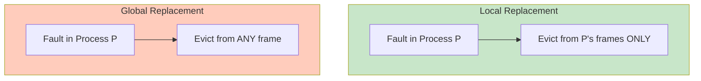

| Property | Local Replacement | Global Replacement |
| :--- | :--- | :--- |
| **Victim scope** | Only the faulting process's frames | Any frame in physical memory |
| **Frame count** | Fixed per process | Dynamic — can grow or shrink |
| **Performance** | Stable, predictable | Self-adjusting, adaptive |
| **Isolation** | Strong — one process can't hurt another | Weak — a greedy process can starve others |
| **Efficiency** | May under-use frames if process needs fewer | Better overall utilization |

---

### 📚 Key Terminology

| Term | Definition |
| :--- | :--- |
| **Equal Allocation** | Every process receives $\lfloor N/M \rfloor$ frames |
| **Proportional Allocation** | Frames distributed based on process size |
| **Local Replacement** | Victim selected only from faulting process's frames |
| **Global Replacement** | Victim selected from any frame in the system |

---

### ⚠️ Common Pitfalls

> [!danger] Pitfall 1: Thinking equal allocation is fair
> A process with 10 pages and a process with 10,000 pages receiving the same frames is **not fair** — the large process will thrash while the small one wastes frames.

> [!danger] Pitfall 2: Assuming global replacement always wins
> Global replacement is more adaptive, but a single poorly-behaved process can **steal frames** from others, causing **cascading thrashing**.

> [!danger] Pitfall 3: Forgetting local means fixed
> Local replacement means frame allocation is **fixed** for the process — when it needs a new page, it must replace one of its own.

---

### ❓ Mock Exam Questions

> [!question] Q1: Proportional Allocation
> A system has 100 frames and 4 processes of sizes 20, 30, 40, and 10. Under proportional allocation, how many frames does the size-30 process receive?
> <details><summary>Answer</summary>
>
> **Answer: 30 frames**
>
> $\frac{30}{100} \times 100 = 30$ frames.
> </details>

> [!question] Q2: Local Replacement
> Under local page replacement, if a process has too few frames:
> <details><summary>Answer</summary>
>
> **Answer: It thrashes within its own frame allocation, slowing only itself**
>
> Local replacement contains the damage — other processes' frames are protected.
> </details>

> [!question] Q3: Global Replacement Disadvantage
> Which is a disadvantage of global page replacement?
> <details><summary>Answer</summary>
>
> **Answer: A misbehaving process can reduce the frame count of other processes**
>
> Global replacement allows frame stealing, which can cascade problems.
> </details>

---

## 7. Thrashing & the Working Set Model

### 🚨 What is Thrashing?

**Thrashing** occurs when a process (or system) spends more time **swapping pages** between disk and RAM than actually executing useful instructions.

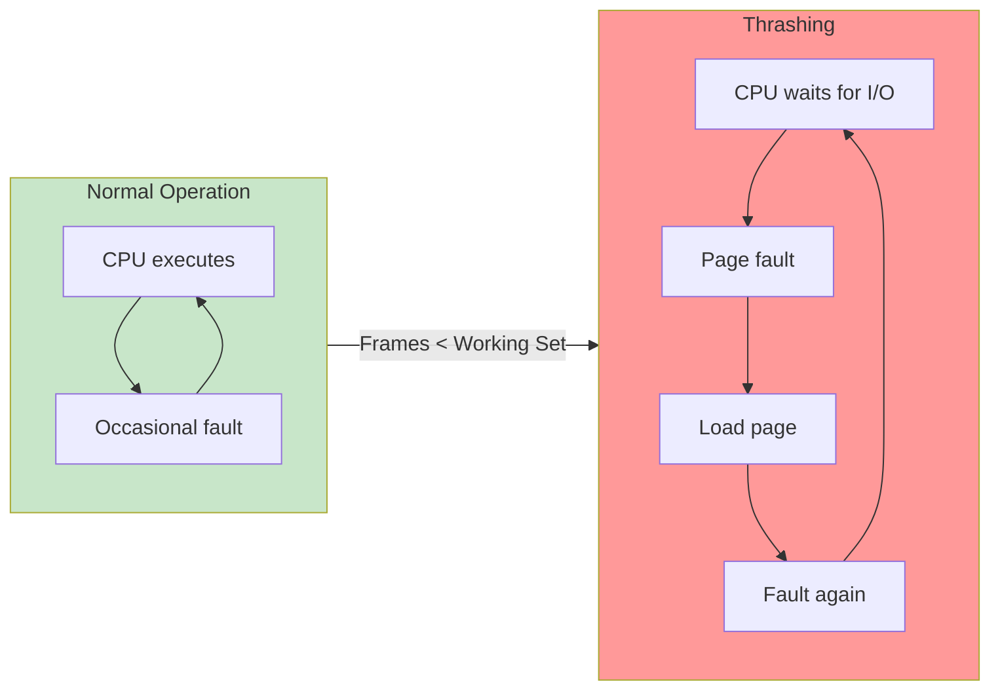

**Root cause:** A process has fewer allocated frames than needed to hold its **active working pages**.

---

### 🔄 Cascading Thrashing (Global Replacement)

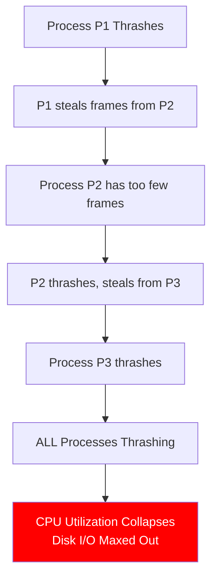

---

### 📐 The Working Set Model

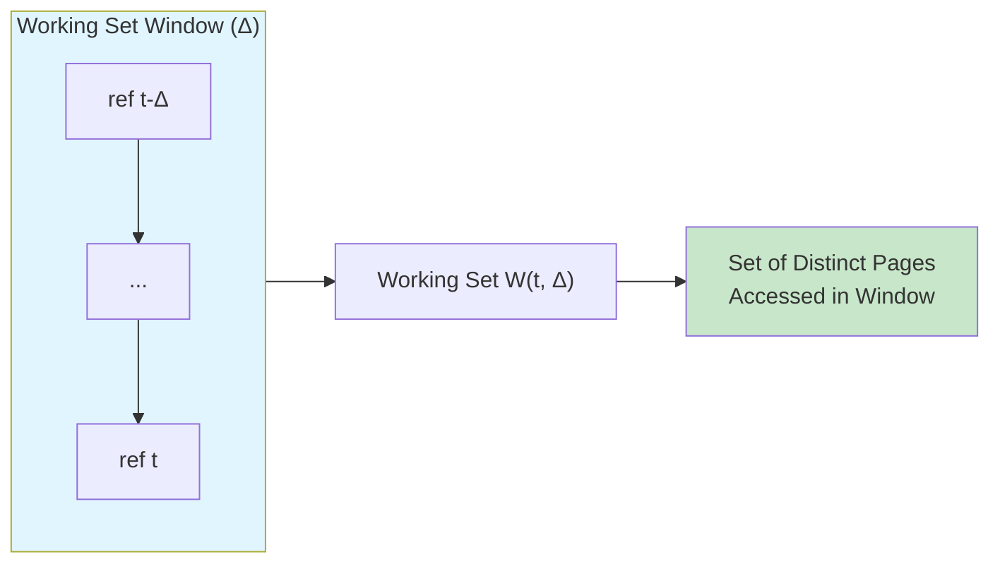

**Working Set Definition:**
$$W(t, \Delta) = \text{set of distinct pages accessed in } (t - \Delta,\ t]$$

Where $\Delta$ is the **working set window** — the number of past references to consider.

| $\Delta$ too small | $\Delta$ too large |
| :--- | :--- |
| Misses pages in current locality | Spans multiple localities |
| Underestimates frame need | Overestimates frame need |

> [!example] Working Set Example
> Reference string: `... 2 6 5 7 1 | 1 2 7 5 6 | 3 4 4 4 3 ...`
> 
> With $\Delta = 5$:
> - $W(t_1, \Delta) = \{1, 2, 5, 6, 7\}$ → 5 frames needed
> - $W(t_2, \Delta) = \{3, 4\}$ → 2 frames needed

**System-level policy:** If $\sum_{\text{all processes}} |W(t, \Delta)| > N$ (total frames), the system is **overcommitted**. The OS should **suspend** (swap out) one or more processes.

---

### 📚 Key Terminology

| Term | Definition |
| :--- | :--- |
| **Thrashing** | State where a process spends more time on page fault handling than execution |
| **Cascading Thrashing** | Thrashing spreading across processes due to global frame stealing |
| **Locality** | The set of pages actively used during a phase of execution |
| **Working Set** | $W(t, \Delta)$ — distinct pages accessed within the last $\Delta$ references |
| **Overcommitment** | Total working set size exceeds available frames |

---

### ⚠️ Common Pitfalls

> [!danger] Pitfall 1: Blaming slow CPU or large programs
> Thrashing is caused by **insufficient frame allocation relative to the working set**. A small process can thrash if given only 1 frame.

> [!danger] Pitfall 2: Confusing locality with working set
> Locality is the **concept** (programs tend to access a small active set). Working set is the **formalization** — a precisely defined window-based measurement.

> [!danger] Pitfall 3: Thinking large Δ is safe
> A very large $\Delta$ captures pages from multiple localities (including inactive ones), leading to **frame overallocation**.

> [!danger] Pitfall 4: Confusing local vs global replacement effects
> - **Global replacement + thrashing** → cascading (one process hurts all)
> - **Local replacement + thrashing** → contained (one process hurts itself)

---

### ❓ Mock Exam Questions

> [!question] Q1: Thrashing Cause
> Thrashing occurs when:
> <details><summary>Answer</summary>
>
> **Answer: A process has fewer frames than its working set size**
>
> When frames < working set, the process constantly faults on pages it needs.
> </details>

> [!question] Q2: Small Window
> In the working set model, if $\Delta$ is very small:
> <details><summary>Answer</summary>
>
> **Answer: The working set may miss pages in the current locality**
>
> A small window might not capture all active pages, leading to excess page faults.
> </details>

> [!question] Q3: Cascading Thrashing
> Under global replacement, cascading thrashing is caused by:
> <details><summary>Answer</summary>
>
> **Answer: A thrashing process stealing frames from other processes**
>
> Global replacement allows one process's thrashing to affect all others.
> </details>

---

## 🔗 Connections

| 📚 Lecture | 🔗 Connection |
| :--- | :--- |
| [[L1]] | OS structure — VM manager is a core OS component |
| [[L2]] | Memory context — logical address space may exceed physical memory |
| [[L3]] | Scheduling — working set size affects frame allocation decisions |
| [[L4]] | IPC — shared memory regions can be paged out |
| [[L5]] | Threads — all threads share the same virtual address space |
| [[L6]] | Synchronization — page table updates need atomicity in multiprocessors |
| [[L7]] | Memory abstraction — logical addresses enable VM |
| [[L8]] | Paging — VM builds on paging with disk backing |
| [[L10]] | File buffer cache — similar replacement algorithms (LRU, CLOCK) |
| [[L12]] | File system — VM concepts used for file system caching |

> [!quote] The Key Insight
> Virtual memory works because of **locality** — programs don't access all their pages uniformly. They cluster in small working sets. The entire system is designed to make those working sets fit in RAM. When they don't, thrashing happens. **Keep the working set in RAM, and the illusion holds.** 💾