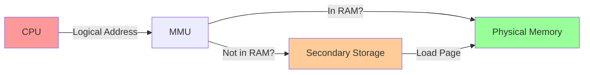
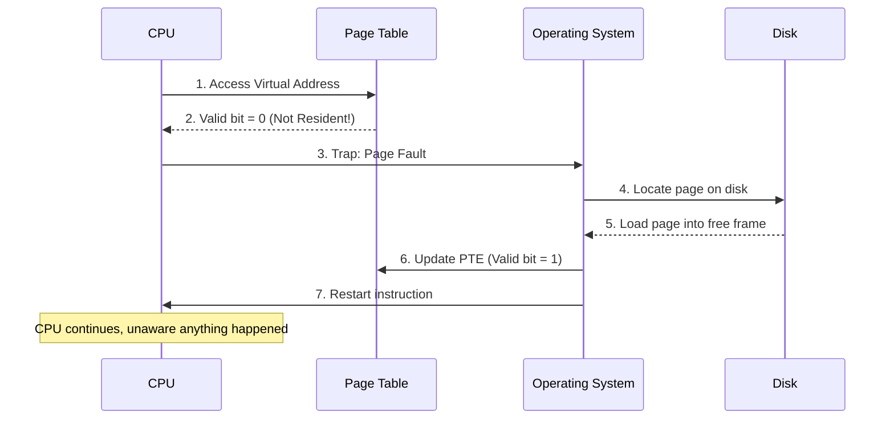
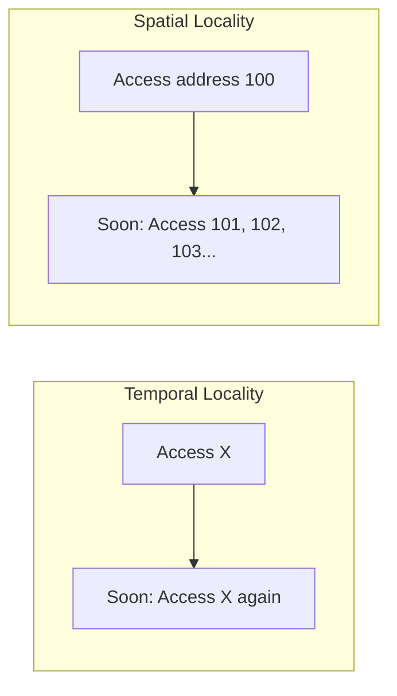
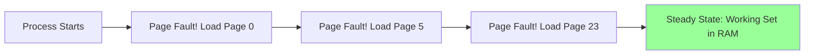
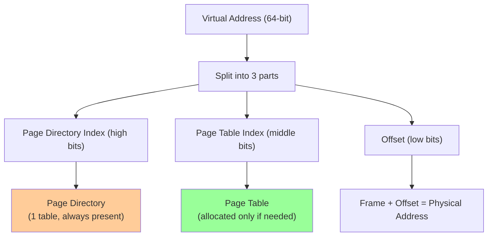
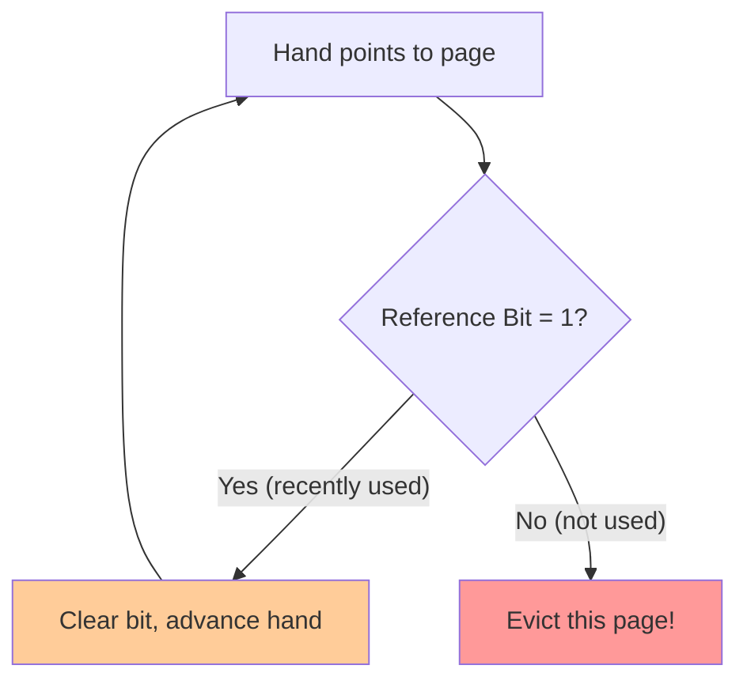
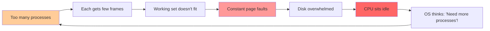
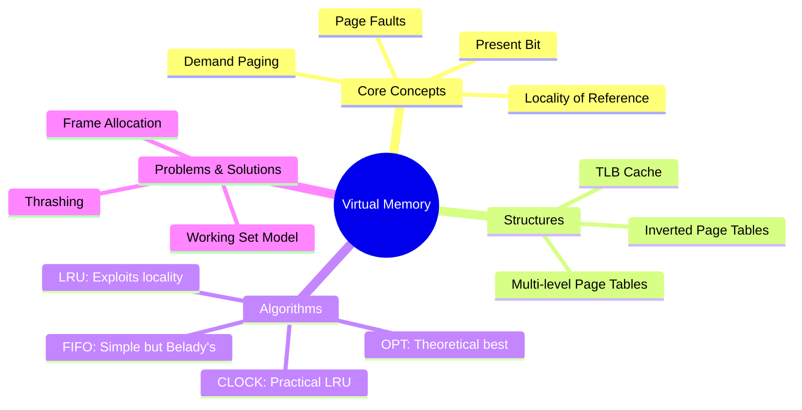

# 🧠 L9: Virtual Memory Management

> [!abstract] Lecture Goal
> Learn how the OS uses secondary storage to trick processes into thinking they have more RAM than physically exists, and the algorithms used to manage this "Virtual Memory".

> [!tip] The Big Picture
> Your laptop has 16GB RAM, but you can run a 50GB game. **How?** Virtual Memory — the OS's greatest magic trick.

---

## 1. Virtual Memory — Motivation & Basic Idea

### 🤔 The Problem That Started It All

Back in [[L8]], we made a quiet assumption: a process's **entire** address space must fit in RAM. But consider:

```
🎮 Modern game: 50 GB
💾 Your RAM: 16 GB
```

**Oops.** The game literally cannot fit in memory. Do we just... not run it?

> [!success] The Solution: Virtual Memory
> The OS lies to every process: *"Sure, you have 2^64 bytes of memory all to yourself!"*
>
> Behind the scenes, it only keeps the **actively used** pages in RAM. The rest? Quietly stashed on disk until needed.

---

### 🎯 The Core Idea



| 🧩 Piece | 📍 Location | 📝 Role |
| :--- | :--- | :--- |
| **Page Table Entry** | RAM | Maps virtual → physical, stores metadata |
| **Present Bit** | PTE | Is this page currently in RAM? |
| **Page File / Swap** | Disk | Where "evicted" pages live |

> [!tip] Desk Analogy
> Think of RAM as your **desk** and disk as a **filing cabinet**.
> - You can only work on documents on your desk
> - If you need something from the cabinet → fetch it
> - Desk full? Put something back first
> - **Goal:** Keep frequently-used docs on the desk

---

### 🌟 The Three Big Wins

| Benefit | Why It Matters | Real-World Example |
| :--- | :--- | :--- |
| **Size Independence** | Process can exceed physical RAM | Games, video editing suites |
| **Higher Concurrency** | More processes fit simultaneously | Running IDE + browser + Slack + Spotify |
| **Process Isolation** | Each process has its own virtual space | One crash doesn't take down others |

---

## 2. Page Fault & Access Flow

### 🎭 What is a Page Fault?

A **page fault** sounds scary, but it's just the OS saying: *"Hold on, let me grab that for you."*



> [!info] It's Not a Crash!
> A page fault is **not** a segfault. It's a normal, expected event. The OS handles it and resumes your program. You didn't even know it happened.

---

### 🏷️ The Present (Valid) Bit

Every Page Table Entry (PTE) has a **present/valid bit**:

| Bit | Meaning | What Happens |
| :--- | :--- | :--- |
| `1` | Page is in RAM | Translation proceeds normally |
| `0` | Page is on disk | CPU traps → OS handles page fault |

---

### 🌍 Locality — The Saving Grace

Disk is **100,000× slower** than RAM. If we faulted on every access, VM would be unusable.

**Why does VM work at all?** → **Locality of Reference**



| Type | Definition | Why It Helps |
| :--- | :--- | :--- |
| **Temporal** | Recently used → will be used again soon | Loaded page stays "hot" in RAM |
| **Spatial** | Nearby addresses → will be accessed soon | One page contains many useful addresses |

> [!example] Code Example
> ```c
> for (int i = 0; i < 1000; i++) {
>     sum += array[i];  // Spatial: array[0], array[1], array[2]...
> }
> ```
> This loop hits the same few pages repeatedly → locality keeps page faults low.

---

## 3. Demand Paging

### 💡 The Philosophy

> [!quote] The Lazy Approach
> *"Don't load pages until absolutely necessary."*

**Demand Paging** = Load a page **only when** the process first accesses it.



### ⚖️ Trade-offs

| ✅ Pros | ❌ Cons |
| :--- | :--- |
| **Instant startup** — nothing to pre-load | **Cold start penalty** — initial faults are slow |
| **Minimal RAM usage** — only active pages loaded | **Unpredictable latency** — faults happen randomly |
| **Efficient** — pages never used are never loaded | **Thrashing risk** — many processes faulting simultaneously |

> [!danger] The Cold Start Problem
> Open a large app (like Photoshop). It's sluggish at first, then smooths out. That's demand paging in action — initial page faults are being resolved.

---

## 4. Page Table Structures

### 🌲 Problem: Page Tables Are Huge

A 64-bit system with 4KB pages needs a page table of:
```
2^52 entries × 8 bytes = 36 petabytes per process!
```

**Solution:** Multi-level page tables.

### 🎯 2-Level Paging

Most processes use only a tiny fraction of their virtual address space. 2-level paging exploits this by only allocating sub-tables for **in-use regions**.



> [!info] Memory Savings
> If the page directory entry is empty, **no sub-table is allocated**. Sparse address spaces → massive memory savings.

**Address Breakdown Example:**
```
Virtual Address: 0x7FFF_1234_5678

┌─────────────────┬─────────────────┬──────────────┐
│ Page Directory  │   Page Table    │    Offset    │
│    (high bits)  │   (mid bits)    │  (low bits)  │
│       10 bits   │      42 bits    │    12 bits   │
└─────────────────┴─────────────────┴──────────────┘
```

---

## 5. Page Replacement Algorithms

When a page fault occurs but **no free frame exists**, the OS must kick someone out. Who?

| 🔮 Algorithm | 🎯 Strategy | 📊 Verdict |
| :--- | :--- | :--- |
| **OPT** | Replace page used **furthest in future** | 🏆 Theoretical best (impossible to implement) |
| **FIFO** | Replace **oldest** loaded page | ⚠️ Simple, but suffers Belady's Anomaly |
| **LRU** | Replace **least recently used** | ✅ Excellent (exploits temporal locality) |
| **CLOCK** | FIFO + "second chance" bit | ✅ Practical LRU approximation |

> [!warning] Belady's Anomaly
> With FIFO, adding **more** frames can sometimes cause **more** page faults! This is counterintuitive and bad.

---

### ⏰ The CLOCK Algorithm (Practical LRU)

LRU requires tracking exact access times — expensive! CLOCK is a clever approximation using a circular buffer and reference bits.



**The Second Chance Logic:**
1. Hand sweeps through frames like a clock
2. If reference bit = 1: give "second chance" — clear bit, move on
3. If reference bit = 0: this page is the victim

> [!tip] Intuition
> Think of it as: *"I'll let you stay if you've been used recently. But if I come back and you still haven't been used... you're out."*

---

## 6. Thrashing & Working Set Model

### 🚨 Thrashing — When VM Collapses

> [!danger] Thrashing Definition
> The system spends **more time paging than executing**. CPU utilization drops near zero because every process is waiting for disk I/O.



> [!example] The Vicious Cycle
> 1. CPU utilization drops (processes waiting for disk)
> 2. OS sees "low CPU usage" and adds more processes
> 3. More processes → even fewer frames per process
> 4. Even more page faults → system grinds to halt

---

### 🩊 The Working Set Model

**Working Set** = Set of pages a process has accessed in the last $\Delta$ time units.

> [!success] The Fix
> If the OS ensures each process has enough frames for its working set, thrashing stops.

| 📊 Situation | ✅ Action |
| :--- | :--- |
| Working set fits in allocated frames | Process runs smoothly |
| Working set exceeds allocated frames | Process thrashes → suspend or kill |

---

## ❓ Mock Exam Questions

> [!question] Q1: Belady's Anomaly
> What is Belady's Anomaly? Which algorithm suffers from it?
> <details><summary>Answer</summary>
>
> **Belady's Anomaly**: The counterintuitive phenomenon where adding more frames leads to **more** page faults.
>
> **Algorithm**: FIFO is the classic sufferer. LRU and OPT do NOT have this problem.
> </details>

> [!question] Q2: Page Fault Performance
> If $T_{mem} = 100ns$ and $T_{disk} = 10ms$, how does the page fault rate $p$ affect performance?
> <details><summary>Answer</summary>
>
> $$T_{avg} = (1-p) \times 100ns + p \times 10,000,000ns$$
>
> | Page Fault Rate | Effective Access Time |
> | :--- | :--- |
> | 0% | 100 ns |
> | 0.1% | ~10 μs (100× slower) |
> | 1% | ~100 μs (1000× slower) |
>
> **Key insight**: Even tiny fault rates devastate performance. A 0.1% fault rate makes memory access 100× slower!
> </details>

> [!question] Q3: Working Set
> Why does demand paging work well in practice despite disk being 100,000× slower than RAM?
> <details><summary>Answer</summary>
>
> **Locality of reference**: Programs don't access memory randomly.
> - **Temporal locality**: Recently used pages will be used again soon
> - **Spatial locality**: Nearby addresses will be accessed soon
>
> After the "working set" is loaded, page fault rate drops dramatically. The cost of loading pages is amortized over many accesses.
> </details>

---

## ⚠️ Common Mistakes to Watch Out For

> [!danger] OPT is Theoretical
> OPT (replace page used furthest in future) is a **benchmark**, not an implementable algorithm. You cannot see the future!

> [!danger] Dirty Pages Cost More
> Evicting a **dirty** page (modified = dirty bit = 1) requires:
> 1. Write page to disk
> 2. Then load new page
>
> A **clean** page (read-only, unchanged) can just be overwritten. Big performance difference!

> [!danger] Page Fault ≠ Segfault
> - **Page fault**: "Page not in RAM, let me fetch it" (handled by OS)
> - **Segfault**: "Invalid memory access" (process killed)

---

## 🗺️ Big Picture Summary



---

## 🔗 Connections

| 📚 Lecture | 🔗 Connection |
| :--- | :--- |
| [[L7]] | Contiguous allocation → now we don't need it! Pages can be scattered. |
| [[L8]] | Paging hardware + TLB = foundation for virtual memory. Present bit extends the page table. |

> [!quote] The Big Picture
> Virtual Memory is the culmination of everything we've learned: **address translation** (L7), **paging** (L8), and now **disk-backed memory extension**. Together, they let us run programs larger than RAM, with isolation, with more processes — the modern computing experience.