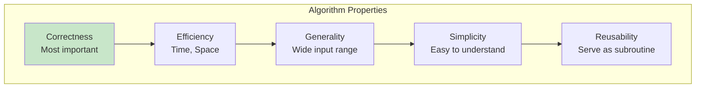
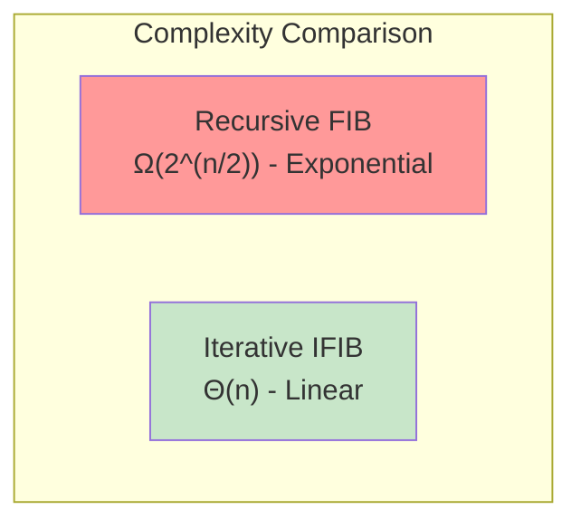
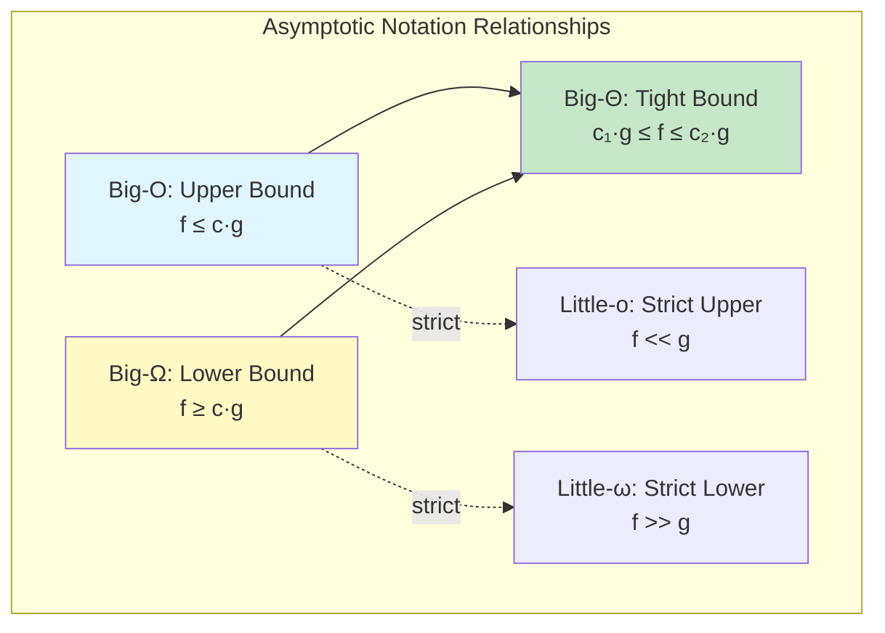

# 📚 L1: Introduction & Asymptotic Analysis

> [!abstract] Lecture Goal
> Understand what makes a valid algorithm, learn the RAM model for complexity analysis, master Big-O, Ω, Θ notation (and little-o, ω), and use asymptotic analysis to compare algorithm efficiency independent of hardware and implementation details.

> [!tip] The Big Picture
> Asymptotic notation abstracts away constants and machine-specific details, letting us focus on how algorithms scale. A $Θ(n²)$ algorithm will eventually beat a $Θ(n³)$ algorithm for large enough inputs, no matter how fast the hardware. This lecture establishes the vocabulary — Big-O for upper bounds, Ω for lower bounds, Θ for tight bounds, and little-o/ω for strict relationships — that will be used throughout the course.

---

## 1. Algorithms & Pseudocode

### 🧠 Core Concept

An **algorithm** is a sequence of unambiguous and executable instructions that, given a valid input, produces a valid output.

| Property | Description |
| :--- | :--- |
| **Unambiguous** | Precisely stated, no room for interpretation |
| **Executable** | Implementable on a target machine — no "magic" steps |
| **Deterministic** | Each step yields one outcome (randomness sometimes allowed) |
| **Terminating** | Finishes after finitely many steps (usually) |

We use **pseudocode** rather than actual code because it is language-independent, human-readable, and precise enough to implement.

### 📖 Example: Why Pseudocode?

The Python snippet `[*zip(*A)]` transposes a 2D matrix — concise but cryptic.

In pseudocode: *"Given a 2D matrix of size $n \times m$, transpose it into an $m \times n$ matrix"* — immediately understandable.

### ⚠️ Watch Out!

> [!danger] Pitfall 1: Confusing "unambiguous" with "must be code"
> Pseudocode is acceptable. The goal is clarity, not compilation.

> [!danger] Pitfall 2: Not all algorithms must terminate
> Some (like OS schedulers) are designed to run indefinitely. Always check the problem statement.

> [!danger] Pitfall 3: Invalid inputs don't count
> If an algorithm says it works for non-negative integers, you don't need to handle negative inputs.

---

## 2. Problem-Solving Framework

### 🧠 Core Concept

Good algorithms are evaluated on multiple criteria:



| Property | Priority |
| :--- | :--- |
| **Correctness** | Most important — must always give the right answer |
| **Efficiency** | Time, space, and other resources |
| **Generality** | Works on a wide range of inputs |
| **Simplicity** | Easy to implement, understand, debug |
| **Reusability** | Can serve as a subroutine for other problems |

**General problem-solving steps:**

1. Understand the problem
2. Design a method
3. Write pseudocode
4. Choose data structures
5. Prove correctness
6. Analyze complexity
7. Implement

### ⚠️ Watch Out!

> [!danger] Pitfall: Correctness before efficiency
> A fast but wrong algorithm is useless. There are real trade-offs: simpler algorithms may be slower; faster ones may be harder to understand and maintain.

---

## 3. Fibonacci: Recursive vs Iterative

### 🧠 Core Concept

The Fibonacci sequence is defined as:

$$\text{Fib}(0) = 0, \quad \text{Fib}(1) = 1, \quad \text{Fib}(n) = \text{Fib}(n-1) + \text{Fib}(n-2) \text{ for } n \geq 2$$

**Recursive Algorithm:**

```
FIB(n):
  if n <= 1: return n
  else: return FIB(n-1) + FIB(n-2)
```

**Iterative Algorithm:**

```
IFIB(n):
  if n <= 1: return n
  prev2 = 0; prev1 = 1
  for i = 2 to n:
    temp = prev1
    prev1 = prev1 + prev2
    prev2 = temp
  return prev1
```

| Algorithm | Time | Space | Why? |
| :--- | :--- | :--- | :--- |
| Recursive FIB | $\Omega(2^{n/2})$ | $O(n)$ | Same subproblems recomputed many times |
| Iterative IFIB | $\Theta(n)$ | $O(1)$ | Store and reuse previous results |



### 📖 Exponential Lower Bound

To show $\text{Fib}(n) \geq 2^{(n-2)/2}$:

Since $\text{Fib}(n) = \text{Fib}(n-1) + \text{Fib}(n-2) \geq 2 \cdot \text{Fib}(n-2)$, the value at least **doubles every two steps**. Starting from $\text{Fib}(1) = 1$, there are $\lceil(n-2)/2\rceil$ doubling steps from index 1 to $n$.

### ⚠️ Watch Out!

> [!danger] Pitfall: Elegant but catastrophically slow
> The recursive Fib looks elegant but for $n = 45$, it makes billions of calls. This is your first preview of **Dynamic Programming**: avoid recomputing overlapping subproblems.

---

## 4. Model of Computation: RAM

### 🧠 Core Concept

The **Random-Access Machine (RAM)** model abstracts away hardware differences:

| Assumption | Meaning |
| :--- | :--- |
| **Memory** | Array of words; each access takes constant time |
| **Arithmetic/Logic** | Each $+, -, \times, \div, \mod, \text{AND}, \text{OR}, \text{NOT}$ takes constant time |
| **Time measure** | Count total number of basic operations |
| **Exponentiation** | NOT constant time — depends on exponent size |

Real running time = (machine-dependent constant) $\times$ (number of RAM instructions) + other factors.

### ⚠️ Watch Out!

> [!danger] Pitfall 1: Exponentiation is not a single RAM operation
> Computing $a^b$ by repeated multiplication takes $O(b)$ steps.

> [!danger] Pitfall 2: Large numbers may not fit in one word
> Fibonacci numbers for large $n$ may require more than one word, making arithmetic take more time. We usually ignore this in early analysis.

---

## 5. Asymptotic Analysis — Big-O, Ω, Θ

### 🧠 Core Concept

Rather than counting exact operations, we describe how running time **grows** as $n \to \infty$, ignoring constants and lower-order terms.



#### Big-O (Upper Bound)

$$f \in O(g) \iff \exists\, c > 0,\, n_0 > 0 \text{ s.t. } \forall n \geq n_0:\; 0 \leq f(n) \leq c \cdot g(n)$$

_Meaning: $g$ grows at least as fast as $f$ for large $n$._

#### Big-Omega (Lower Bound)

$$f \in \Omega(g) \iff \exists\, c > 0,\, n_0 > 0 \text{ s.t. } \forall n \geq n_0:\; 0 \leq c \cdot g(n) \leq f(n)$$

_Meaning: $g$ grows no faster than $f$ for large $n$._

#### Big-Theta (Tight Bound)

$$f \in \Theta(g) \iff \exists\, c_1, c_2 > 0,\, n_0 > 0 \text{ s.t. } \forall n \geq n_0:\; c_1 \cdot g(n) \leq f(n) \leq c_2 \cdot g(n)$$

$$\Theta(g) = O(g) \cap \Omega(g)$$

_Meaning: $f$ and $g$ grow at the same rate._

#### Little-o (Strict Upper Bound)

$$f \in o(g) \iff \forall\, c > 0,\, \exists\, n_0 > 0 \text{ s.t. } \forall n \geq n_0:\; 0 \leq f(n) < c \cdot g(n)$$

_Meaning: $f$ grows strictly slower than $g$. Must hold for **every** $c > 0$._

#### Little-omega (Strict Lower Bound)

$$f \in \omega(g) \iff \forall\, c > 0,\, \exists\, n_0 > 0 \text{ s.t. } \forall n \geq n_0:\; 0 \leq c \cdot g(n) < f(n)$$

### 📊 Limit Method (Often Easier!)

For $f(n), g(n) > 0$:

| Limit | Conclusion |
| :--- | :--- |
| $\lim_{n\to\infty} \frac{f(n)}{g(n)} = 0$ | $f \in o(g)$ |
| $\lim_{n\to\infty} \frac{f(n)}{g(n)} < \infty$ | $f \in O(g)$ |
| $0 < \lim_{n\to\infty} \frac{f(n)}{g(n)} < \infty$ | $f \in \Theta(g)$ |
| $\lim_{n\to\infty} \frac{f(n)}{g(n)} > 0$ | $f \in \Omega(g)$ |
| $\lim_{n\to\infty} \frac{f(n)}{g(n)} = \infty$ | $f \in \omega(g)$ |

### 📖 Examples

**Example 1:** $100n + 1000 \in O(n^2)$

For $n \geq 1000$: $100n + 1000 \leq 101n \leq 101n^2$. So $c = 101$, $n_0 = 1000$ works.

(Note: $100n + 1000 \in O(n)$ is also true — tighter!)

**Example 2:** $10n^2 + n \in \Theta(n^2)$

For $n \geq 2$: $\frac{1}{2}n^2 \leq 10n^2 + n \leq 11n^2$. So $c_1 = 1/2$, $c_2 = 11$, $n_0 = 2$.

**Example 3 (Limit):** $n^6 + 233n^2 \in \omega(n^2)$

$$\lim_{n\to\infty} \frac{n^6 + 233n^2}{n^2} = \lim_{n\to\infty}(n^4 + 233) = \infty \implies n^6 + 233n^2 \in \omega(n^2)$$

### 📖 Key Properties

| Property | Applies to |
| :--- | :--- |
| **Reflexivity** | $f \in O(f)$, $f \in \Omega(f)$, $f \in \Theta(f)$ |
| **Transitivity** | All five: $f \in O(g)$ and $g \in O(h) \implies f \in O(h)$ |
| **Symmetry** | Θ only: $f \in \Theta(g) \iff g \in \Theta(f)$ |
| **Complementarity** | $f \in O(g) \iff g \in \Omega(f)$, $f \in o(g) \iff g \in \omega(f)$ |

### ⚠️ Watch Out!

> [!danger] Pitfall 1: Big-O is NOT exact
> $100n + 1000 \in O(n^2)$ is technically true but weak. Prefer the tightest bound: $\Theta(n)$.

> [!danger] Pitfall 2: "at least O(g)" is meaningless
> $O$ is an upper bound — you cannot be "at least" an upper bound.

> [!danger] Pitfall 3: Constants $c$ and $n_0$ are not unique
> You just need to show one valid pair exists.

> [!danger] Pitfall 4: Bases matter in exponents but not in logarithms
> $\log_2 n \in \Theta(\log_{10} n)$, but $4^n \notin \Theta(2^n)$.

> [!danger] Pitfall 5: Little-o vs Big-O quantifier difference
> Big-O needs **one** $c$ that works; little-o needs the condition to hold for **every** $c > 0$.

---

## 6. Tutorial: Limit-to-Notation Proofs

### 🧠 Core Concept

The goal is to connect the **limit definition** to the **epsilon-delta style definitions**.

**Key proof structure:**

The definition of $\lim_{n\to\infty} \frac{f(n)}{g(n)} = 0$ means:

$$\forall \epsilon > 0,\; \exists n_0 > 0 \text{ s.t. } \forall n \geq n_0:\; \frac{f(n)}{g(n)} < \epsilon$$

Since this must hold for **every** $\epsilon > 0$, set $\epsilon = c$ for any $c > 0$ — matches $f \in o(g)$.

**For other cases:**

| Case | Proof Strategy |
| :--- | :--- |
| $O(g)$ | Limit $< \infty$ means ratio bounded; set $c = z + \epsilon$ |
| $\Omega(g)$ | Flip $f$ and $g$, apply $O$ argument, use complementarity |
| $\Theta(g)$ | Combine $O$ and $\Omega$ proofs |
| $\omega(g)$ | Flip $f$ and $g$, apply little-o argument, use complementarity |

### ⚠️ Watch Out!

> [!danger] Pitfall: Quantifier flip between O and o
> Big-O: "there exists $c$"; Little-o: "for all $c$". This mirrors "bounded" vs "converging to zero."

---

## 7. Tutorial: Proving Asymptotic Properties

### 🧠 Core Concept

**Reflexivity** — use $c = 1$, $n_0 = 1$: $f(n) \leq 1 \cdot f(n)$ ✓

**Transitivity** — chain two inequalities:

If $f(n) \leq c_{fg} \cdot g(n)$ (for $n \geq n_{0,fg}$) and $g(n) \leq c_{gh} \cdot h(n)$ (for $n \geq n_{0,gh}$):

$$f(n) \leq c_{fg} \cdot g(n) \leq c_{fg} \cdot c_{gh} \cdot h(n)$$

Take $c = c_{fg} \cdot c_{gh}$ and $n_0 = \max(n_{0,fg}, n_{0,gh})$.

**Symmetry of Θ** — if $c_1 g(n) \leq f(n) \leq c_2 g(n)$, then $\frac{1}{c_2} f(n) \leq g(n) \leq \frac{1}{c_1} f(n)$.

**Complementarity** — if $f(n) \leq c \cdot g(n)$, then $\frac{1}{c} f(n) \leq g(n)$, i.e., $g \in \Omega(f)$.

### ⚠️ Watch Out!

> [!danger] Pitfall: Transitivity requires both bounds simultaneously
> Take $n_0 = \max(n_{0,fg}, n_{0,gh})$ — both must hold.

> [!danger] Pitfall: Symmetry only for Θ
> $O$ and $\Omega$ are NOT symmetric. $n \in O(n^2)$ but $n^2 \notin O(n)$.

---

## 8. Tutorial: Evaluating Asymptotic Statements

### 🧠 Core Concept

Decide **true or false** for asymptotic claims, providing valid $c$, $n_0$ for true ones or a counterexample for false ones.

### 📖 Examples

| Statement | Verdict | Reasoning |
| :--- | :--- | :--- |
| $3^{n+1} \in O(3^n)$ | **True** | $3^{n+1} = 3 \cdot 3^n$, so $c = 3$, $n_0 = 1$ |
| $4^n \in O(2^n)$ | **False** | $\frac{4^n}{2^n} = 2^n \to \infty$, no constant $c$ can bound it |
| $2^{\lfloor \log n \rfloor} \in \Theta(n)$ | **True** | $\lfloor \log n \rfloor \in [\log n - 1, \log n]$, so $\frac{n}{2} \leq 2^{\lfloor \log n \rfloor} \leq n$ |

### 📖 Critical Insight: $2^{\log_4 n}$

$$\log_4 n = \frac{\log_2 n}{\log_2 4} = \frac{\log_2 n}{2}$$

$$2^{\log_4 n} = 2^{\frac{\log_2 n}{2}} = (2^{\log_2 n})^{1/2} = n^{1/2} = \sqrt{n}$$

So $2^{\log_4 n} \in \Theta(\sqrt{n})$, which is in $O(n)$ but **not** in $\Omega(n)$ or $\Theta(n)$.

### ⚠️ Watch Out!

> [!danger] Pitfall: Logarithm base confusion
> Students often write $2^{\log_4 n} \in \Theta(n)$ by misreading $\log_4 n$ as $\log_2 n$. Always convert the base!

> [!danger] Pitfall: Exponent confusion
> $4^n \in O(2^n)$ is false — exponents don't factor out of $O$ like constants.

---

## 9. Tutorial: Ranking Functions by Growth Rate

### 🧠 Core Concept

Rank functions by asymptotic growth — group those with the same Θ class.

| Function | Simplified | Class |
| :--- | :--- | :--- |
| $f_1(n) = \log n$ | $\log n$ | $\Theta(\log n)$ |
| $f_5(n) = \log(n^2)$ | $2\log n$ | $\Theta(\log n)$ — same as $f_1$! |
| $f_6(n) = \ln(n^{2n})$ | $2n \ln n$ | $\Theta(n \log n)$ |
| $f_4(n) = n^{2.3} + 16n + \log n$ | $n^{2.3}$ dominates | $\Theta(n^{2.3})$ |
| $f_3(n) = 2^n + n$ | $2^n$ dominates | $\Theta(2^n)$ |
| $f_2(n) = n!$ | $n!$ | Grows faster than $2^n$ |

**Standard ranking (slowest to fastest):**

$$\log n \prec \sqrt{n} \prec n \prec n \log n \prec n^2 \prec n^3 \prec 2^n \prec n!$$

### ⚠️ Watch Out!

> [!danger] Pitfall 1: $\log(n^2) \neq (\log n)^2$
> $\log(n^2) = 2\log n$, which is $\Theta(\log n)$. $(\log n)^2$ is $\Theta(\log^2 n)$ — very different!

> [!danger] Pitfall 2: Lower-order terms never affect Θ
> $n^{2.3} + 16n + \log n \in \Theta(n^{2.3})$ — only the highest-order term matters.

---

## 🔗 Connections

| 📚 Lecture | 🔗 Connection |
| :--- | :--- |
| [[content/CS3230/L2]] | Recurrences — Big-O/Θ used to solve and express recurrence solutions |
| [[content/CS3230/L3]] | Divide & Conquer — asymptotic analysis determines which algorithms are worth implementing |
| [[content/CS3230/L4]] | Lower Bounds — Θ notation expresses fundamental complexity limits |

> [!quote] The Key Insight
> Asymptotic notation is the language of algorithm efficiency. Big-O tells you "no worse than," Ω tells you "no better than," and Θ gives you the tight truth. When in doubt, use the limit method — it turns most asymptotic questions into simple calculus. And remember: $n!$ crushes $2^n$ for large $n$. 🎯

---

## 10. Mock Exam Questions

### 💡 Concept Questions

> [!question] Q1: Algorithm Definition
> What is the difference between an unambiguous instruction and an executable instruction?
> <details><summary>Answer</summary>
>
> **Answer:**
> - **Unambiguous**: The instruction has exactly one interpretation — no room for confusion about what it means.
> - **Executable**: The instruction can actually be carried out by the machine — no "magic" steps that require infinite resources or impossible operations.
> </details>

> [!question] Q2: Big-O vs Little-o
> What is the key quantifier difference between Big-O and little-o?
> <details><summary>Answer</summary>
>
> **Answer:**
> - **Big-O**: $\exists c > 0$ — there exists ONE constant $c$ such that $f(n) \leq c \cdot g(n)$.
> - **Little-o**: $\forall c > 0$ — the condition must hold for EVERY positive constant $c$, no matter how small.
>
> This is the difference between "bounded above" and "grows strictly slower."
> </details>

> [!question] Q3: Θ Symmetry
> If $f(n) \in \Theta(g(n))$, does it follow that $g(n) \in \Theta(f(n))$?
> <details><summary>Answer</summary>
>
> **Answer: Yes.** Θ is symmetric.
>
> If $c_1 g(n) \leq f(n) \leq c_2 g(n)$, then dividing by constants gives $\frac{1}{c_2} f(n) \leq g(n) \leq \frac{1}{c_1} f(n)$.
> </details>

> [!question] Q4: O Symmetry
> Show that $O$ is NOT symmetric: give $f, g$ such that $f \in O(g)$ but $g \notin O(f)$.
> <details><summary>Answer</summary>
>
> **Answer:** Let $f(n) = n$ and $g(n) = n^2$.
>
> - $n \in O(n^2)$: Take $c = 1$, $n_0 = 1$. Then $n \leq n^2$ for $n \geq 1$. ✓
> - $n^2 \notin O(n)$: For any $c$, $n^2 > c \cdot n$ when $n > c$.
>
> So $O$ is not symmetric.
> </details>

> [!question] Q5: Exponentials
> Is $n^2 \in O(2^n)$? Is $4^n \in O(2^n)$?
> <details><summary>Answer</summary>
>
> **$n^2 \in O(2^n)$: Yes.** Polynomials grow slower than exponentials. $\lim_{n\to\infty} \frac{n^2}{2^n} = 0$.
>
> **$4^n \in O(2^n)$: No.** $\frac{4^n}{2^n} = 2^n \to \infty$. Exponentials with larger bases grow faster.
> </details>

---

### ✏️ Practice Problems

> [!question] P1: Fibonacci Lower Bound
> Prove by induction that $\text{Fib}(n) \geq 2^{(n-2)/2}$ for all $n \geq 2$.
> <details><summary>Answer</summary>
>
> **Base cases:**
> - $n = 2$: $\text{Fib}(2) = 1 \geq 2^{(2-2)/2} = 2^0 = 1$ ✓
> - $n = 3$: $\text{Fib}(3) = 2 \geq 2^{(3-2)/2} = 2^{1/2} \approx 1.41$ ✓
>
> **Inductive step:** Assume $\text{Fib}(k) \geq 2^{(k-2)/2}$ for all $2 \leq k \leq n-1$. For $n \geq 4$:
>
> $$\text{Fib}(n) = \text{Fib}(n-1) + \text{Fib}(n-2) \geq 2^{(n-3)/2} + 2^{(n-4)/2} = 2^{(n-4)/2}(2^{1/2} + 1)$$
>
> Since $2^{1/2} + 1 > 2$, we have $\text{Fib}(n) \geq 2^{(n-4)/2} \cdot 2 = 2^{(n-2)/2}$ ✓
> </details>

> [!question] P2: Recurrence Solving
> Given $T(0) = T(1) = 1$ and $T(n) = 2T(n-1) + 1$ for $n \geq 2$, find a closed form and classify asymptotically.
> <details><summary>Answer</summary>
>
> Unrolling: $T(n) = 2T(n-1) + 1 = 2(2T(n-2) + 1) + 1 = 4T(n-2) + 2 + 1$
>
> Continuing: $T(n) = 2^k T(n-k) + 2^{k-1} + \cdots + 1 = 2^k T(n-k) + 2^k - 1$
>
> Setting $k = n-1$: $T(n) = 2^{n-1} \cdot T(1) + 2^{n-1} - 1 = 2^{n-1} + 2^{n-1} - 1 = 2^n - 1$
>
> **Asymptotic class:** $T(n) = 2^n - 1 \in \Theta(2^n)$
> </details>

> [!question] P3: Direct Proof
> Prove from definition that $5n^2 + 3n \in \Theta(n^2)$.
> <details><summary>Answer</summary>
>
> Need $c_1, c_2, n_0$ such that $c_1 n^2 \leq 5n^2 + 3n \leq c_2 n^2$ for $n \geq n_0$.
>
> **Upper bound:** For $n \geq 1$, $3n \leq 3n^2$, so $5n^2 + 3n \leq 8n^2$. Take $c_2 = 8$.
>
> **Lower bound:** For $n \geq 1$, $5n^2 + 3n \geq 5n^2$. Take $c_1 = 5$.
>
> **Conclusion:** With $c_1 = 5$, $c_2 = 8$, $n_0 = 1$, we have $5n^2 \leq 5n^2 + 3n \leq 8n^2$ for all $n \geq 1$. ✓
> </details>

> [!question] P4: Limit Method
> Using limits, determine the relationship between $f(n) = n \ln n$ and $g(n) = n^{1.5}$.
> <details><summary>Answer</summary>
>
> $$\lim_{n\to\infty} \frac{n \ln n}{n^{1.5}} = \lim_{n\to\infty} \frac{\ln n}{n^{0.5}}$$
>
> Apply L'Hôpital's rule:
>
> $$= \lim_{n\to\infty} \frac{1/n}{0.5 \cdot n^{-0.5}} = \lim_{n\to\infty} \frac{2\sqrt{n}}{n} = \lim_{n\to\infty} \frac{2}{\sqrt{n}} = 0$$
>
> **Since limit = 0:** $n \ln n \in o(n^{1.5})$
>
> Therefore: $n\ln n \in O(n^{1.5})$ but $n\ln n \notin \Omega(n^{1.5})$ and $n\ln n \notin \Theta(n^{1.5})$.
> </details>

> [!question] P5: Function Ranking
> Rank by growth rate: $\log n$, $\sqrt{n}$, $n$, $n \log n$, $n^2$, $2^n$, $n!$
> <details><summary>Answer</summary>
>
> **Slowest to fastest:**
>
> $$\log n \prec \sqrt{n} \prec n \prec n \log n \prec n^2 \prec 2^n \prec n!$$
>
> - $\log n$ grows slowest (logarithmic)
> - $\sqrt{n} = n^{0.5}$ (polynomial with exponent < 1)
> - $n$ (linear)
> - $n \log n$ (between linear and polynomial)
> - $n^2$ (quadratic)
> - $2^n$ (exponential)
> - $n!$ (factorial, fastest)
> </details>