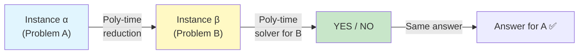
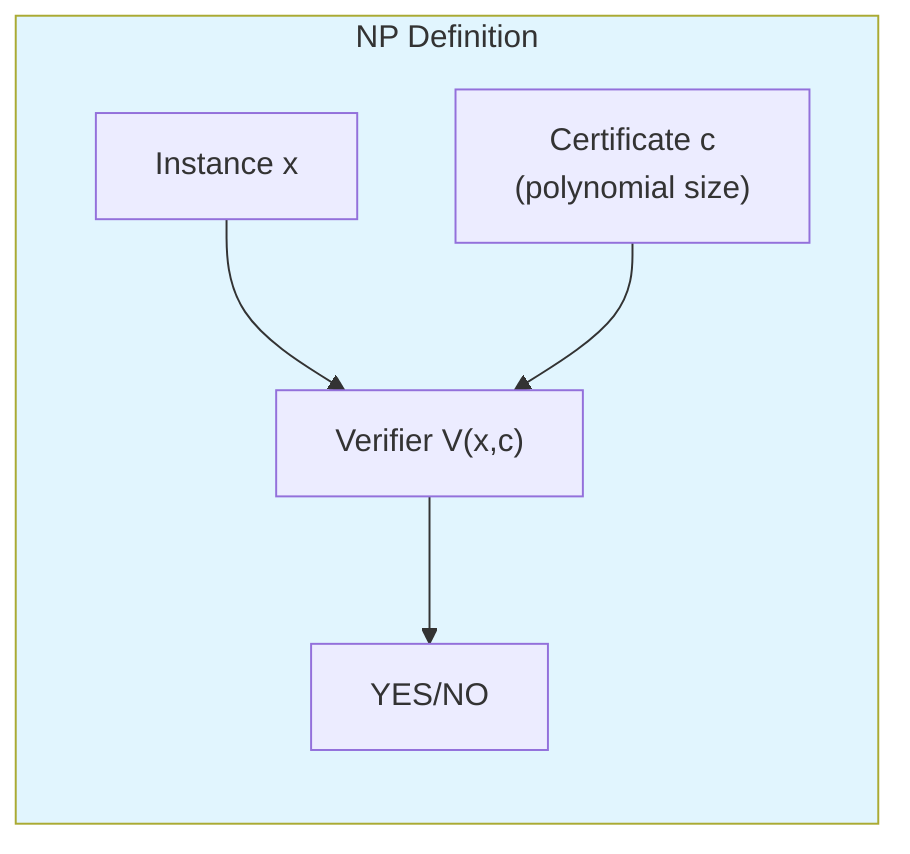
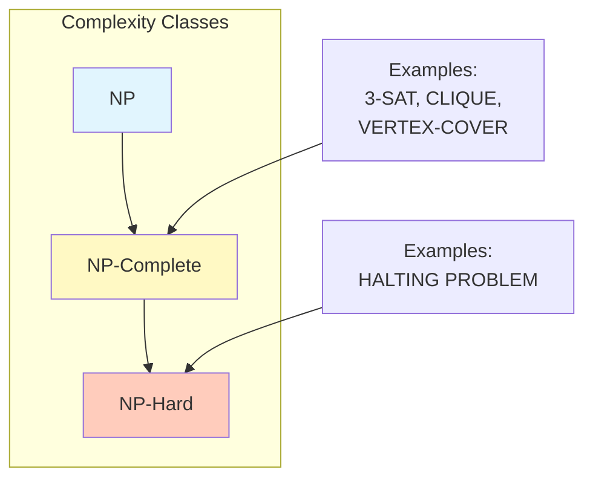
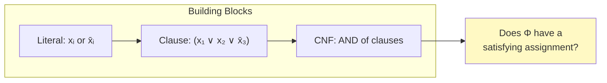
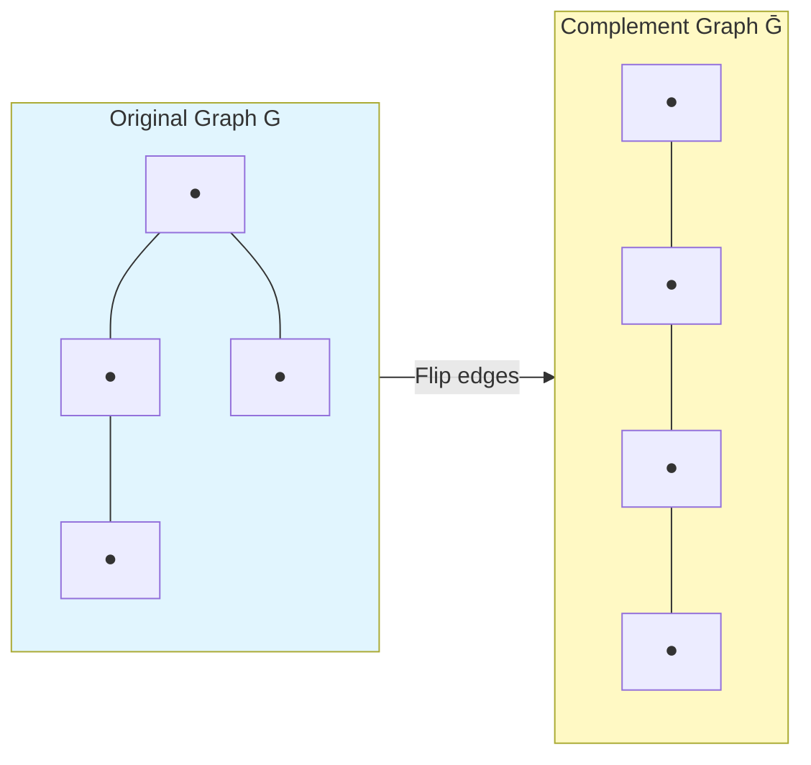
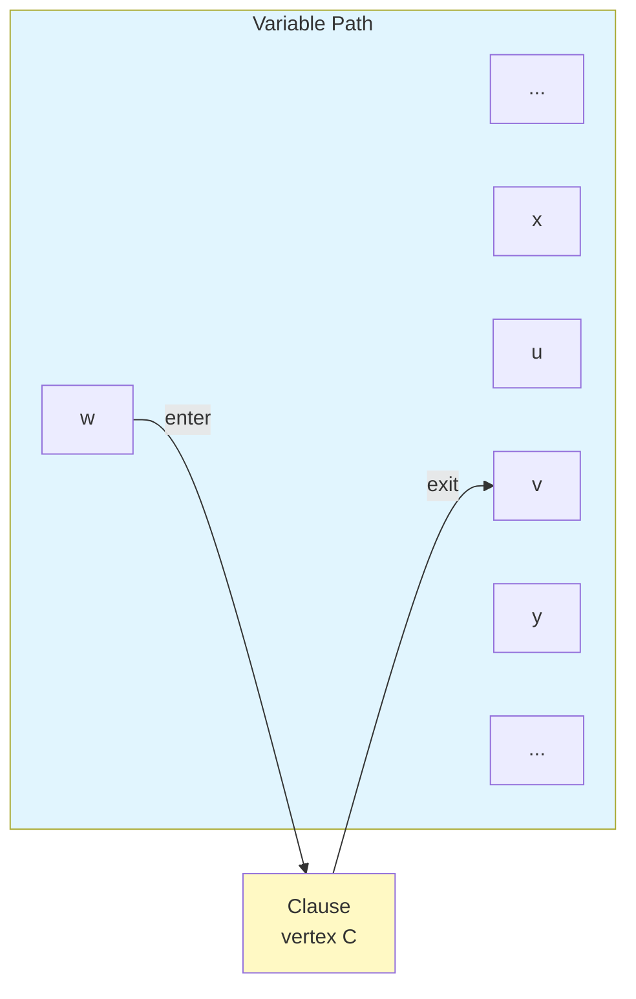

# 📚 L10: Reductions & Intractability

> [!abstract] Lecture Goal
> Understand polynomial-time reductions, NP-completeness proofs, and the intricate reduction constructions for problems like CLIQUE, DIRECTED-HAM-CYCLE, and FANTASTIC-HALF.

> [!tip] The Big Picture
> Reductions let us **stand on the shoulders of giants**. We don't need to prove hardness from scratch — we just show our problem is "at least as hard" as a known-hard problem. The entire NP-completeness web rests on this powerful idea. 🕸️

---

## 1. Polynomial-Time Reductions

### 🧠 Core Concept

A **polynomial-time reduction** from problem $A$ to problem $B$ (written $A \leq_P B$) is a way to convert any instance of $A$ into an instance of $B$ such that:

- The conversion runs in **polynomial time**
- The answer is **preserved**: YES for $A$ ↔ YES for $B$

The key idea: _"If I can solve $B$ efficiently, I can use that to solve $A$ efficiently."_



Formally, we need to show **three things**:

1. ✅ The reduction runs in **polynomial time**
2. ✅ If $\alpha$ is a YES-instance of $A$, then $\beta$ is a YES-instance of $B$ $\quad$ (⇒ direction)
3. ✅ If $\beta$ is a YES-instance of $B$, then $\alpha$ is a YES-instance of $A$ $\quad$ (⇐ direction)

### 💡 Intuition

> [!tip] Translation Analogy
> Think of it like a **translation**: you're translating the "language" of problem $A$ into problem $B$. If $B$ has a dictionary (solver), you can answer questions in $A$ by translating them first.

### ⚠️ Watch Out!

> [!danger] Pitfall 1: Only proving the ⇒ direction
> You **must** prove **both** directions (⇒ and ⇐). Many students prove one direction but forget the other.

> [!danger] Pitfall 2: Assuming the reduction is obviously polynomial
> Always **explicitly argue** poly-time. Don't just say "obvious" — state the complexity.

> [!danger] Pitfall 3: Confusing $A \leq_P B$ direction
> $A \leq_P B$ means $A$ is **at most as hard as** $B$. "$A$ reduces to $B$" means $B$ is at least as hard.

---

### 📖 Key Terminology

| Term | Definition |
| :--- | :--- |
| **Polynomial-time reduction** | Transformation where conversion runs in $O(n^c)$ time |
| **YES-instance** | An input for which the answer is YES |
| **$A \leq_P B$** | $A$ reduces to $B$ — $A$ is no harder than $B$ |

---

### ❓ Mock Exam Questions

> [!question] Q1: Reduction Implication
> If $A \leq_P B$ and $B$ has a polynomial-time algorithm, what can you conclude about $A$?
> <details><summary>Answer</summary>
>
> **Answer: $A$ also has a polynomial-time algorithm.**
>
> The reduction + $B$'s solver gives a poly-time algorithm for $A$: total time = poly + poly = polynomial.
> </details>

> [!question] Q2: Hardness Implication
> If $A \leq_P B$ and $A$ is NP-hard, what can you conclude about $B$?
> <details><summary>Answer</summary>
>
> **Answer: $B$ is also NP-hard.**
>
> By contrapositive: if $A$ is hard and reduces to $B$, then $B$ must be at least as hard as $A$.
> </details>

---

## 2. The Complexity Classes P and NP

### 🧠 Core Concept

**Class P:** The set of all decision problems solvable in **deterministic polynomial time**.

$$P = \{ \text{problems solvable in } O(n^k) \text{ time for some constant } k \}$$

**Class NP:** The set of all decision problems for which YES-instances have **polynomial-size certificates** that can be **verified in polynomial time**.



More precisely: a problem is in NP if there exists a polynomial-time **verifier** $V(x, c)$ such that:

- If $x$ is a YES-instance, there exists a certificate $c$ (of polynomial size) such that $V(x, c) = \text{YES}$
- If $x$ is a NO-instance, no certificate $c$ makes $V(x, c) = \text{YES}$

**Key relationship:**

$$P \subseteq NP$$

> [!tip] Why is P ⊆ NP?
> For a problem in $P$, the verifier can simply **ignore** the certificate and solve the problem from scratch in polynomial time.

### 📊 Examples of NP Membership

| Problem | Certificate | Verification |
| :--- | :--- | :--- |
| SUBSET-SUM | The subset $S'$ itself | Check elements sum to $t$ — $O(n)$ |
| HAM-CYCLE | The cycle itself | Check it's a valid cycle visiting each vertex once — $O(n)$ |
| CLIQUE | The $k$ vertices | Check every pair is connected — $O(k^2)$ |
| DIRECTED-HAM-CYCLE | The directed cycle | Check validity — $O(n)$ |

### 💡 Intuition for NP

> [!tip] "Needle in a Haystack"
> NP captures problems that are **hard to find** a solution, but **easy to check** one once you have it. As Papadimitriou put it, NP "roughly delimits what mathematicians and scientists have been aspiring to compute feasibly."

### ⚠️ Watch Out!

> [!danger] NP does NOT mean "not polynomial"
> NP stands for **Non-deterministic Polynomial** — it's a class of problems, not the negation of P.

> [!danger] Certificate must be polynomial size
> The certificate must fit in poly-size, not just be verifiable quickly. An exponential-size certificate doesn't count!

> [!danger] Don't skip NP membership in NP-completeness proofs
> NP-complete requires **both** NP membership **and** NP-hardness. Don't skip this step!

---

### ❓ Mock Exam Questions

> [!question] Q3: Why no NO-instance certificates?
> Why is it not required to provide certificates for NO-instances in NP?
> <details><summary>Answer</summary>
>
> **Answer: NP is about verification of YES answers.**
>
> If you want to verify NO answers, that's the class **co-NP**, which is different from NP.
> </details>

> [!question] Q4: P and NP Relationship
> Give an example of a problem in P and explain why it is also in NP.
> <details><summary>Answer</summary>
>
> **Answer: Any problem in P is automatically in NP.**
>
> Example: REACHABILITY asks if there's a path from $s$ to $t$ in a graph. It's in P (BFS runs in $O(V+E)$). To show it's in NP: the certificate is the path itself, and we verify it in $O(V)$ time. (Or simply: the verifier ignores the certificate and runs BFS.)
> </details>

---

## 3. NP-Hardness and NP-Completeness

### 🧠 Core Concept

**NP-Hard:** A problem $A$ is NP-hard if **every** problem $B \in \text{NP}$ satisfies:

$$B \leq_P A$$

In other words, $A$ is at least as hard as every NP problem. Solving $A$ efficiently would give efficient algorithms for **all** NP problems.

**NP-Complete:** A problem $A$ is NP-complete if:

1. $A \in \text{NP}$ (it's in NP), **and**
2. $A$ is NP-hard (every NP problem reduces to it)



### 📝 The Standard Proof Template for NP-Completeness

```
To show X is NP-complete:
  Step 1: Show X ∈ NP
           → Describe a polynomial-size certificate
           → Describe a polynomial-time verifier
  Step 2: Show X is NP-hard
           → Pick a known NP-hard problem Y
           → Show Y ≤_P X (i.e., reduce Y to X)
           → Prove: poly-time reduction, YES ⇒ YES, NO ⇒ NO
```

### 💡 The Web of Reductions

The lecture shows this chain:

$$3\text{-SAT} \leq_P \text{INDEPENDENT-SET} \leq_P \text{VERTEX-COVER} \leq_P \text{SET-COVER}$$

$$3\text{-SAT} \leq_P \text{DIR-HAM-CYCLE} \leq_P \text{HAM-CYCLE}$$

If **any** of these has a poly-time algorithm, **all** of them do.

### ⚠️ Watch Out!

> [!danger] Reducing in the wrong direction
> To show $X$ is NP-hard, reduce **a known NP-hard problem** $Y$ **TO** $X$ (i.e., $Y \leq_P X$), not the other way around.

> [!danger] Skipping NP membership
> NP-complete requires **both** NP membership **and** NP-hardness.

> [!danger] Not citing a known NP-hard problem
> Always anchor your reduction to a problem already known to be NP-hard.

---

### ❓ Mock Exam Questions

> [!question] Q5: NP-hard but not in NP
> If a problem $A$ is NP-hard but not in NP, what can we call it?
> <details><summary>Answer</summary>
>
> **Answer: Just "NP-hard" (not NP-complete).**
>
> NP-complete requires both NP membership and NP-hardness. Examples of NP-hard problems not in NP: HALTING PROBLEM, the halting problem's complement.
> </details>

> [!question] Q6: Reduction Implication
> Suppose $A$ is NP-complete and $A \leq_P B$. What can you say about $B$?
> <details><summary>Answer</summary>
>
> **Answer: $B$ is NP-hard.**
>
> Since $A$ is NP-hard, every NP problem reduces to $A$, and $A$ reduces to $B$. By transitivity, every NP problem reduces to $B$.
> </details>

---

## 4. The Cook-Levin Theorem

### 🧠 Core Concept

**Theorem (Cook-Levin):** Every problem in NP reduces to **3-SAT** in polynomial time. Therefore, 3-SAT is NP-complete.

**3-SAT** asks: given a CNF formula $\Phi$ where each clause has **exactly 3 literals**, is there a truth assignment satisfying $\Phi$?

**Key terminology:**

- **Literal:** A Boolean variable $x_i$ or its negation $\bar{x}_i$
- **Clause:** A disjunction (OR) of literals, e.g., $C_j = x_1 \vee x_2 \vee x_3$
- **CNF (Conjunctive Normal Form):** A conjunction (AND) of clauses: $\Phi = C_1 \wedge C_2 \wedge \cdots \wedge C_m$



> [!tip] Why does this matter?
> Since every NP problem reduces to 3-SAT, showing that $3\text{-SAT} \leq_P X$ immediately shows $X$ is NP-hard. This is the **foundation** of the whole reduction web.

### ⚠️ Watch Out!

> [!danger] Confusing SAT and 3-SAT
> SAT allows clauses of any size; 3-SAT requires **exactly 3 literals per clause**.

> [!danger] Thinking you need to prove Cook-Levin
> The theorem is given to you — just cite it!

---

## 5. Example: CLIQUE is NP-Complete

### 🧠 Core Concept

**CLIQUE:** Given graph $G = (V, E)$ and integer $k$, does $G$ contain a subset of $k$ (or more) vertices such that there is an edge between **every pair** of those vertices?

### Proof of NP-Completeness

**Step 1 — CLIQUE $\in$ NP:**

- Certificate: the $k$ vertices forming the clique
- Verifier: check all $\binom{k}{2} = O(k^2)$ pairs have edges
- ✅ Polynomial time

**Step 2 — CLIQUE is NP-Hard (via $\text{INDEPENDENT-SET} \leq_P \text{CLIQUE}$):**

The key insight: **an independent set in $G$ is a clique in $\bar{G}$** (the complement graph).



**Reduction:** Given instance $(G, k)$ of INDEPENDENT-SET, output instance $(\bar{G}, k)$ of CLIQUE, where $\bar{G}$ has the same vertices as $G$ but contains edge $(u,v)$ **if and only if** $G$ does **not** contain edge $(u,v)$.

**Proof of correctness:**

- _(⇒)_ If $G$ has an independent set $S$ of size $k$: no edge exists between any two vertices in $S$ in $G$, so **every** pair in $S$ has an edge in $\bar{G}$ → $S$ is a clique in $\bar{G}$ ✅
- _(⇐)_ If $\bar{G}$ has a clique $S$ of size $k$: every pair in $S$ has an edge in $\bar{G}$, so **no** pair in $S$ has an edge in $G$ → $S$ is an independent set in $G$ ✅
- Reduction runs in polynomial time (constructing $\bar{G}$ takes $O(|V|^2)$) ✅

### 💡 Intuition

> [!tip] Complement Graph Duality
> The complement graph "flips" the edge structure. Dense clusters (cliques) in $\bar{G}$ correspond to sparse clusters (independent sets) in $G$. It's a beautiful duality!

### ⚠️ Watch Out!

> [!danger] Forgetting to construct $\bar{G}$
> The actual graph used in CLIQUE must be $\bar{G}$, not $G$.

> [!danger] Wrong reduction direction
> Since INDEPENDENT-SET is already NP-hard, reduce **from** it **to** CLIQUE.

---

## 6. Example: DIRECTED-HAM-CYCLE is NP-Complete

### 🧠 Core Concept

**DIRECTED-HAM-CYCLE (DIR-HAM-CYCLE):** Given a directed graph $G$, is there a simple directed cycle that visits **every vertex exactly once**?

### Proof

**Step 1 — DIR-HAM-CYCLE $\in$ NP:**

- Certificate: the directed cycle itself
- Verifier: check it's a valid directed cycle visiting each vertex once — $O(|V|)$ ✅

**Step 2 — DIR-HAM-CYCLE is NP-Hard (via $3\text{-SAT} \leq_P \text{DIR-HAM-CYCLE}$):**

This is a sophisticated reduction. Here's how it works:

### 🏗️ The Reduction Construction

**Variables → Paths:** For each variable $x_i$, create a directed path of length $3m+1$ (where $m$ = number of clauses). The Hamiltonian cycle must traverse this path either:

- **Left to right** → $x_i = \text{True}$
- **Right to left** → $x_i = \text{False}$

All paths are connected through a source $s$ and sink $t$ in a "chain" structure, ensuring any Hamiltonian cycle goes through each path exactly once.

**Clauses → Detour vertices:** For each clause $C_j = (\ell_1 \vee \ell_2 \vee \ell_3)$, add a **clause vertex** $C_j$. If literal $\ell_i$ appears in $C_j$, add edges from the path of variable $x_i$ so the cycle can **detour** through $C_j$ — but only when $x_i$ is set in the direction satisfying $\ell_i$.



**Critical structural rule:** Each clause vertex connects to a **non-endpoint** of the path segment (not the 1st, 4th, 7th… vertices). Different clauses connect to **different** vertices on each path.

### 🔑 The Key Claim

> [!tip] The Bounce-Back Property
> _"In any Hamiltonian cycle, after visiting a clause vertex, the cycle must return to the same path it came from."_

**Why?** Consider the vertices $x, w, u, v, y$ around a clause vertex $C$:

- $w$'s only in-neighbor (not connected to a clause) is $x$ → the path must enter $w$ from $x$
- $w$'s only out-neighbor is $u$
- $v$'s only in-neighbor here is $C$ → after $C$, the cycle must go to $v$
- $v$'s only out-neighbor (not $u$) is $y$ → path exits to $y$

So the detour goes: $\ldots x \to w \to C \to v \to y \ldots$ — the cycle **bounces off** $C$ and returns.

### ✅ Correctness

- _(⇒)_ Given a satisfying assignment, construct the Hamiltonian cycle by choosing path directions per assignments, and detour through each clause vertex using a literal that satisfies it.
- _(⇐)_ Given a Hamiltonian cycle in $G$: by the key claim, it must follow the "standard route" when clause vertices are removed. This gives a valid variable assignment. Each clause vertex was visited, so at least one literal in each clause was satisfied. ✅

### ⚠️ Watch Out!

> [!danger] Not justifying the "standard route"
> You need the key claim about clause vertices to argue this — don't skip it!

> [!danger] Forgetting to count vertices/edges
> State that there are $O(nm)$ vertices and edges (polynomial).

---

## 7. Example: FANTASTIC-HALF is NP-Complete

### 🧠 Core Concept

**FANTASTIC-HALF:** Given non-negative integers $a_1, \ldots, a_n$ (sum $A$) and $b_1, \ldots, b_n$ (sum $B$), is there a set $S \subseteq \{1, \ldots, n\}$ of size **exactly** $n/2$ such that:

$$\sum_{i \in S} a_i \geq A/2 \quad \text{and} \quad \sum_{i \in S} b_i \geq B/2 , ?$$

**Step 1 — FANTASTIC-HALF $\in$ NP:**

- Certificate: the set $S$
- Verifier: check $|S| = n/2$, compute both sums and compare — $O(n)$ ✅

**Step 2 — Reduction from PARTITION-SPECIAL:**

**PARTITION-SPECIAL:** Given non-negative integers $x_1, \ldots, x_n$, can they be partitioned into two equal-size parts with **equal sums**?

### 🔍 Learning from Failed Attempts

The lecture walks through 4 attempts — this is extremely valuable exam practice!

| Attempt | Construction | Problem |
| :--- | :--- | :--- |
| **1** | $a_i = b_i = x_i$ | ⇐ direction fails: $\sum_{S} a_i \geq A/2$ only gives $\geq$, not $=$ |
| **2** | $a_i = x_i$, $b_i = x_{n+1-i}$ | Same issue — still only $\geq$ |
| **3** | $a_i = x_i$, $b_i = -x_i$ | Proof works algebraically but $b_i < 0$ — **violates** non-negativity! |
| **4** ✅ | $a_i = x_i$, $b_i = X - x_i$ | Works! |

### ✅ Attempt 4 — The Correct Reduction

**Construction:** Let $a_i = x_i$ and $b_i = X - x_i$ where $X = \sum_{i=1}^n x_i$.

- All $b_i \geq 0$ ✅ (since $X$ is the total sum, each $x_i \leq X$)
- Runs in polynomial time ✅

**Correctness (⇒):** Suppose $I$ is a YES-instance: $\exists S$ with $|S| = n/2$ and $\sum_{i \in S} x_i = \sum_{i \notin S} x_i = X/2$. Then:
$$\sum_{i \in S} a_i = X/2 = A/2 \checkmark$$
$$\sum_{i \in S} b_i = \sum_{i \in S}(X - x_i) = \frac{nX}{2} - \frac{X}{2} = \frac{(n-1)X}{2} = B/2 \checkmark$$

**Correctness (⇐):** Suppose $I'$ is a YES-instance: $\exists S$ with $|S| = n/2$, $\sum_{i \in S} a_i \geq A/2$ and $\sum_{i \in S} b_i \geq B/2$. Then:

$$\sum_{i \in S} x_i \geq \sum_{i \notin S} x_i \quad \text{(from } a_i \text{ condition)}$$
$$\frac{nX}{2} - \sum_{i \in S} x_i \geq \frac{nX}{2} - \sum_{i \notin S} x_i \implies \sum_{i \in S} x_i \leq \sum_{i \notin S} x_i \quad \text{(from } b_i \text{ condition)}$$

Combining both: $\sum_{i \in S} x_i = \sum_{i \notin S} x_i$ → $I$ is a YES-instance ✅

### 💡 The Core Insight

> [!tip] The Complement Trick
> The key trick in Attempt 4 is making $b_i$ the **complement** of $a_i$ relative to $X$. When both $\sum a_i \geq A/2$ **and** $\sum b_i \geq B/2$ must hold simultaneously, the two inequalities **force equality** — because $b_i = X - a_i$ means a large sum in one implies a small sum in the other.

### ⚠️ Watch Out!

> [!danger] Not checking validity of constructed instance
> Always verify your construction satisfies **all constraints** of the target problem (e.g., non-negativity).

> [!danger] Attempt 3's mistake
> Mathematically elegant but **invalid** — always read the problem constraints carefully!

---

### ❓ Mock Exam Questions

> [!question] P1: Identifying the Breakdown
> In Attempt 1 ($a_i = b_i = x_i$), identify which step of the reduction proof breaks down, and give a concrete counterexample.
> <details><summary>Answer</summary>
>
> **Answer: The ⇐ direction fails.**
>
> Counterexample: $x = [3, 3, 2, 2]$ (sum $X = 10$, $n = 4$). The FANTASTIC-HALF instance has $a = [3,3,2,2]$, $b = [3,3,2,2]$, $A = B = 10$. If we pick $S = \{1, 2\}$, we get $\sum_S a = 6 \geq 5 = A/2$ and $\sum_S b = 6 \geq 5 = B/2$. So this is a YES-instance of FANTASTIC-HALF. But $\sum_S x = 6 \neq 4 = \sum_{\bar{S}} x$, so the original PARTITION-SPECIAL is a NO-instance.
> </details>

> [!question] P2: Why can't we use $b_i = -x_i$?
> Why can't we use $b_i = -x_i$ even if the math works out?
> <details><summary>Answer</summary>
>
> **Answer: The problem requires non-negative integers.**
>
> $b_i = -x_i$ violates the non-negativity constraint. The constructed instance is invalid for FANTASTIC-HALF.
> </details>

---

## 🗝️ Answer Key

### Additional Practice Problems

> [!question] P3: HALF-CLIQUE $\leq_P$ CLIQUE
> Show that $\text{HALF-CLIQUE} \leq_P \text{CLIQUE}$.
> 
> HALF-CLIQUE: Given a graph $G = (V, E)$, does $G$ contain a clique of size $\geq |V|/2$?
> <details><summary>Answer</summary>
>
> **Reduction:** Given a HALF-CLIQUE instance $(G)$, let $k = |V|/2$. Output the CLIQUE instance $(G, k)$.
>
> **Correctness:**
> - _(⇒)_ If $G$ has a clique of size $\geq |V|/2$, then $(G, |V|/2)$ is a YES-instance of CLIQUE. ✅
> - _(⇐)_ If $(G, |V|/2)$ is a YES-instance of CLIQUE, $G$ has a clique of size $\geq |V|/2$, so $G$ is a YES-instance of HALF-CLIQUE. ✅
> - **Poly-time:** Just computing $k = |V|/2$ is $O(1)$. ✅
> </details>

> [!question] P4: GRAPH-COLORING $\in$ NP
> Show that GRAPH-COLORING $\in$ NP.
> <details><summary>Answer</summary>
>
> **Certificate:** An assignment of colors $\{1, \ldots, k\}$ to all $|V|$ vertices.
>
> **Verifier:**
> 1. Check all colors are in $\{1, \ldots, k\}$: $O(|V|)$
> 2. For each edge $(u, v) \in E$, check that $\text{color}(u) \neq \text{color}(v)$: $O(|E|)$
>
> Total: $O(|V| + |E|)$ = polynomial. ✅
> </details>

> [!question] P5: BALANCED-PARTITION is NP-Hard
> The problem **BALANCED-PARTITION** asks: given non-negative integers $x_1, \ldots, x_{2n}$, can they be split into two groups of size $n$ such that both groups have the **same sum**? This is essentially PARTITION-SPECIAL. Assume PARTITION is NP-hard. Prove that BALANCED-PARTITION is NP-hard.
> <details><summary>Answer</summary>
>
> **Reduction from PARTITION:**
>
> Given a PARTITION instance $y_1, \ldots, y_m$ with sum $Y$, construct a BALANCED-PARTITION instance as follows:
>
> **Case: $m$ is even.** Add elements $z_1 = z_2 = Y$ (two copies of the total sum $Y$). The new instance has $m + 2$ elements (even number), and we want two groups of size $(m+2)/2 = m/2 + 1$ with equal sums.
>
> **Correctness:**
> - _(⇒)_ Suppose the $y$'s partition with equal sums $Y/2$. Then group $\{y_{i_1}, \ldots, y_{i_{m/2}}, z_1\}$ and $\{y_{j_1}, \ldots, y_{j_{m/2}}, z_2\}$ both have size $m/2 + 1$ and sum to $Y/2 + Y = 3Y/2$. ✅
> - _(⇐)_ Suppose a balanced partition exists. Since $z_1 = z_2 = Y$ and total sum is $3Y$, each group must sum to $3Y/2$. The two elements $z_1, z_2$ can't both be in the same group. So one $z$ is in each group, contributing $Y$ each. The remaining $y$'s must sum to $Y/2$ in each group → valid PARTITION. ✅
>
> **Poly-time:** Adding 2 elements is $O(1)$. ✅
> </details>

---

## 📌 Quick Reference: Exam Checklist for NP-Completeness Proofs

```
✅ Step 1: Show the problem is in NP
   - Name the certificate explicitly
   - Describe the verifier
   - State the running time of verification (must be polynomial)

✅ Step 2: Show NP-Hardness
   - State which known NP-hard problem Y you are reducing from
   - Describe the reduction (how to transform instance of Y to instance of X)
   - Prove poly-time for the reduction
   - Prove YES ⇒ YES (⇒ direction)
   - Prove YES ⇒ YES (⇐ direction, i.e., if X says YES, then Y says YES)

✅ Conclude: "Since X ∈ NP and X is NP-hard, X is NP-complete." □
```

---

## 🔗 Connections

| 📚 Lecture | 🔗 Connection |
| :--- | :--- |
| [[content/CS2106/L10]] | Using reductions to prove NP-completeness |

> [!quote] The Key Insight
> Reductions let us **stand on the shoulders of giants**. We don't need to prove hardness from scratch — we just show our problem is "at least as hard" as a known-hard problem. The entire NP-completeness web rests on this powerful idea. 🕸️