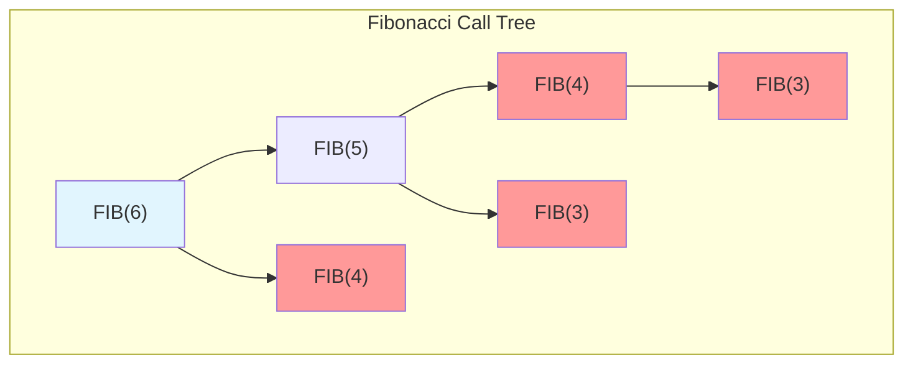
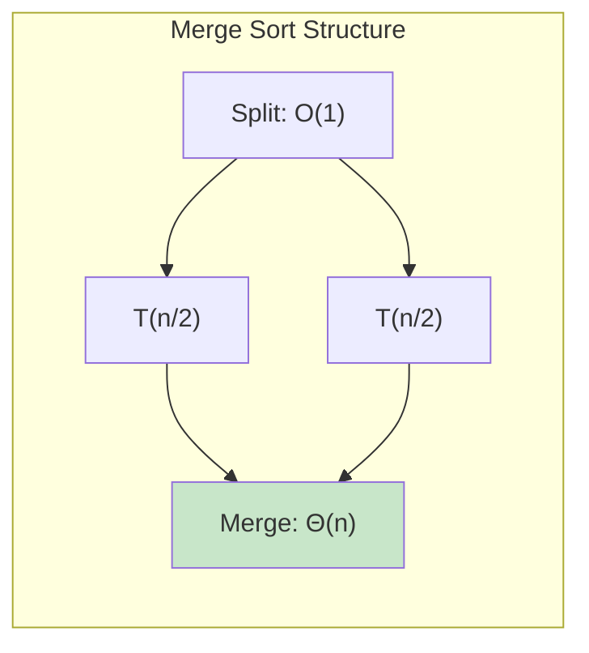
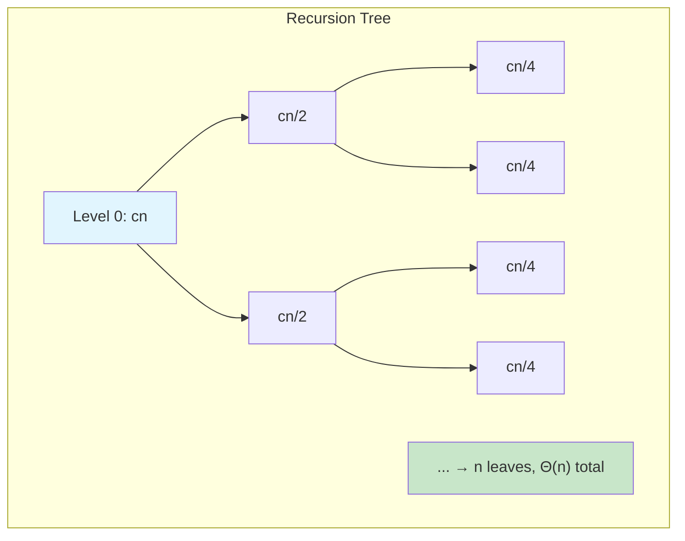

# 📚 L2: Recurrences & Master Theorem

> [!abstract] Lecture Goal
> Master the systematic analysis of recursive algorithms through recurrences, learn four solving methods (telescoping, substitution, recursion tree, Master Theorem), and apply the Master Theorem's three cases to instantly classify divide-and-conquer complexities.

> [!tip] The Big Picture
> A recurrence captures the structure of a recursive algorithm: $T(n) = aT(n/b) + f(n)$ means "$a$ recursive calls on inputs of size $n/b$, plus $f(n)$ work to split and combine." Solving recurrences transforms this recursive definition into closed-form $\Theta$ notation. The Master Theorem is the ultimate shortcut — it tells you the answer by comparing $f(n)$ to the "watershed" function $n^{\log_b a}$.

---

## 1. Analyzing Recursive Algorithms

### 🧠 Core Concept

When analyzing a **recursive algorithm**, the goal is to express worst-case running time $T(n)$ as a function of input size $n$:

1. **Derive a recurrence** — express $T(n)$ in terms of $T$ on smaller inputs
2. **Solve the recurrence** — find a closed-form (non-recursive) expression

A **recurrence** typically looks like:

$$T(n) = \begin{cases} \Theta(1) & \text{if } n \leq 1 \\ \text{(recursive calls)} + \text{(extra work)} & \text{if } n > 1 \end{cases}$$

The **base case** tells us trivially small inputs take constant time.

### 📖 Example: Fibonacci

```
FIB(n):
  If n ≤ 1, return n
  Else, return FIB(n-1) + FIB(n-2)
```

Recurrence: $T(n) = T(n-1) + T(n-2) + \Theta(1)$

This gives $T(n) \in \Omega(2^{n/2})$ — **exponential!** Each call branches into two more.



### ⚠️ Watch Out!

> [!danger] Pitfall: Assuming recursion is always efficient
> The Fibonacci recurrence shows naive recursion with overlapping subproblems can be exponential. Always draw the call tree!

---

## 2. Merge Sort — Deriving Recurrences

### 🧠 Core Concept

**Merge Sort** is a classic divide-and-conquer algorithm:

```
MERGESORT(A[1..n]):
  If n ≥ 2:
    MERGESORT(A[1..n/2])
    MERGESORT(A[n/2+1..n])
    Merge the two sorted halves
```

To derive the recurrence:

| Cost Component | Value |
| :--- | :--- |
| **Recursive calls** | 2 calls on arrays of size $\approx n/2$ |
| **Merging** | $\Theta(n)$ to combine sorted halves |

$$T(n) = 2T\left(\frac{n}{2}\right) + \Theta(n)$$



### 📖 Example: Tracing Merge

For `[5, 1, 7, 2, 4, 6]`:
- Recursively sort `[1, 5, 7]` and `[2, 4, 6]`
- Merge by comparing elements one by one → `[1, 2, 4, 5, 6, 7]`

### ⚠️ Watch Out!

> [!danger] Pitfall: Forgetting the merge cost
> The recursion does NOT solve the problem by itself — the combination (merge) step is where most work happens and contributes the $\Theta(n)$ term.

---

## 3. Methods for Solving Recurrences

### 🧠 Core Concept

There are **four methods** for solving recurrences:

| Method | Best for | Key Idea |
| :--- | :--- | :--- |
| **Telescoping** | Clean recursive structure | Divide by clever function, sum telescoping series |
| **Substitution** | Verifying a guess | Guess solution, prove by induction |
| **Recursion Tree** | Intuition building | Visualize work at each level |
| **Master Theorem** | Standard divide-and-conquer | Apply formula directly |

### 📖 Example: Telescoping Method

**Goal:** Solve $T(n) = 2T(n/2) + n$ (assume $n = 2^k$).

Divide by $n$: $\frac{T(n)}{n} = \frac{T(n/2)}{n/2} + 1$

Let $g(n) = T(n)/n$. Then $g(n) = g(n/2) + 1$. Telescoping:

$$g(n) = g(n/2) + 1 = g(n/4) + 2 = \cdots = g(1) + \log n$$

So $T(n) \in \Theta(n \log n)$. ✅

### 📖 Example: Substitution Method

**Goal:** Solve $T(n) = 4T(n/2) + n$. Guess $T(n) \in O(n^2)$.

Prove $T(n) \leq (c+1)n^2 - n$:

- **Base case** ($n=1$): $T(1) = c = (c+1)(1)^2 - 1 = c$ ✅
- **Inductive step** ($n \geq 2$):

$$T(n) = 4T\left(\frac{n}{2}\right) + n \leq 4\left[(c+1)\frac{n^2}{4} - \frac{n}{2}\right] + n = (c+1)n^2 - n \checkmark$$

**Key insight:** Choose hypothesis with subtracted lower-order term to absorb the $+n$.

### 📖 Example: Tower of Hanoi

```
HANOI(n, src, dst, tmp):
  If n > 0:
    HANOI(n-1, src, tmp, dst)
    Move disk n from src to dst
    HANOI(n-1, tmp, dst, src)
```

Recurrence: $T(n) = 2T(n-1) + 1$, $T(0) = 0$.

Guess $T(n) = 2^n - 1$ and verify:

$$T(n) = 2T(n-1) + 1 = 2(2^{n-1} - 1) + 1 = 2^n - 1 \checkmark$$

### ⚠️ Watch Out!

> [!danger] Pitfall: Induction not closing
> Guessing $T(n) \leq cn^2$ gives $T(n) \leq cn^2 + n$, which is **not** $\leq cn^2$ — the $+n$ makes it fail! Use a tighter hypothesis with subtracted lower-order term.

---

## 4. Recursion Tree Method

### 🧠 Core Concept

The **Recursion Tree** is a visual tool. Draw recursive calls as a tree, label each node with non-recursive work, then sum across levels.

For $T(n) = 2T(n/2) + cn$:



| Level | Work per Level |
| :--- | :--- |
| 0 | $cn$ |
| 1 | $cn/2 + cn/2 = cn$ |
| 2 | $cn/4 + cn/4 + cn/4 + cn/4 = cn$ |
| $\vdots$ | $\vdots$ |
| $\log n$ | $\Theta(n)$ (leaves) |

**Total:** $cn \cdot \log n + \Theta(n) \in \Theta(n \log n)$

**Key observations:**
- **Tree height:** $\log_b n$ (each level divides by $b$)
- **Number of leaves:** $a^{\log_b n} = n^{\log_b a}$
- **Work per level:** Depends on $a$ vs $b$

### 📖 Example: Skewed Recursion Tree

For $T(n) = T(n-1) + T(1) + c$ (worst-case Quick Sort):

Tree is unbalanced — one branch shrinks by 1 each time. Work at level $i$ is proportional to $n-i$:

$$T(n) = \sum_{i=2}^{n} i \in \Theta(n^2)$$

Even with only two calls, skewed structure leads to **quadratic** time!

### ⚠️ Watch Out!

> [!danger] Pitfall: Assuming balanced tree
> If recursion is $T(n-1)$ instead of $T(n/2)$, tree has **$n$ levels**, not $\log n$!

---

## 5. The Master Theorem

### 🧠 Core Concept

The **Master Theorem** instantly solves recurrences of the form:

$$T(n) = aT(n/b) + f(n) \quad \text{where } a \geq 1,\ b > 1$$

Compare two types of work:
- **Solving base cases:** proportional to leaves = $n^d$ where $d = \log_b a$
- **Splitting/combining:** $f(n)$ per level, summed across all levels

```mermaid
flowchart TD
    subgraph MasterTheorem ["Master Theorem Decision"]
        Start["f(n) vs n^d?"]
        C1["Case 1: f(n) smaller<br/>T(n) = Θ(n^d)"]
        C2["Case 2: f(n) equal<br/>T(n) = Θ(n^d log n)"]
        C3["Case 3: f(n) larger<br/>T(n) = Θ(f(n))"]
    end

    Start -->|f(n) ∈ O| C1
    Start -->|f(n) ∈ Θ| C2
    Start -->|f(n) ∈ Ω| C3

    style C1 fill:#e1f5fe
    style C2 fill:#fff9c4
    style C3 fill:#c8e6c9
```

| Case | Condition | Result | Intuition |
| :--- | :--- | :--- | :--- |
| **Case 1** | $f(n) \in O(n^{d-\varepsilon})$ | $T(n) \in \Theta(n^d)$ | Base cases dominate |
| **Case 2** | $f(n) \in \Theta(n^d \log^k n)$ | $T(n) \in \Theta(n^d \log^{k+1} n)$ | Balanced — adds a log |
| **Case 3** | $f(n) \in \Omega(n^{d+\varepsilon})$ + regularity | $T(n) \in \Theta(f(n))$ | Combine dominates |

### 📖 Examples

**Example 1 (Case 1):** $T(n) = 4T(n/2) + n$

- $a = 4$, $b = 2$, $d = \log_2 4 = 2$
- $f(n) = n \in O(n^{2-1})$ ✅ **Case 1** with $\epsilon = 1$
- **Answer:** $T(n) \in \Theta(n^2)$

**Example 2 (Case 2):** $T(n) = 2T(n/2) + n$

- $a = 2$, $b = 2$, $d = \log_2 2 = 1$
- $f(n) = n \in \Theta(n^1 \log^0 n)$ ✅ **Case 2** with $k = 0$
- **Answer:** $T(n) \in \Theta(n \log n)$ — Merge Sort! 🎉

**Example 3 (Case 3):** $T(n) = 4T(n/2) + n^3$

- $a = 4$, $b = 2$, $d = 2$
- $f(n) = n^3 \in \Omega(n^{2+1})$ ✅ **Case 3** with $\epsilon = 1$
- **Regularity:** $4(n/2)^3 = n^3/2 \leq \frac{1}{2}n^3$ for $c = 1/2 < 1$ ✅
- **Answer:** $T(n) \in \Theta(n^3)$

### 📖 When Master Theorem Doesn't Apply

Consider $T(n) = T(n/2) + 2^{\log n}$:
- $d = \log_2 1 = 0$
- $f(n) = 2^{\log n}$ doesn't fit any case cleanly

Use telescoping or recursion tree instead. Answer: $T(n) \in \Theta(2^{\log n} \cdot \log n)$.

### ⚠️ Watch Out!

> [!danger] Pitfall 1: Forgetting regularity in Case 3
> Must verify $af(n/b) \leq cf(n)$ for some $c < 1$!

> [!danger] Pitfall 2: Misidentifying d
> $d = \log_b a$, **not** $\log_a b$. For $T(n) = 8T(n/2) + n^2$: $d = \log_2 8 = 3$, not $1/3$!

> [!danger] Pitfall 3: Applying when it doesn't fit
> $f(n)$ with $2^{\log n}$ or non-polynomial terms may not fit any case.

---

## 6. Floors, Ceilings, and Extensions

### 🧠 Core Concept

In practice, Merge Sort splits into $\lfloor n/2 \rfloor$ and $\lceil n/2 \rceil$, not exactly $n/2$:

$$T(n) = T\left(\left\lfloor \frac{n}{2} \right\rfloor\right) + T\left(\left\lceil \frac{n}{2} \right\rceil\right) + \Theta(n)$$

**Good news:** Floors and ceilings do **not** affect asymptotic complexity for standard recurrences. Safe to ignore when applying Master Theorem.

For unequal splits (e.g., $T(n) = T(n/3) + T(2n/3) + f(n)$), use the **Akra-Bazzi method**.

### ⚠️ Watch Out!

> [!danger] Pitfall: Overthinking floors/ceilings
> For standard divide-and-conquer (Merge Sort, Binary Search), $\lfloor n/2 \rfloor \approx n/2$ is always safe asymptotically.

---

## 🔗 Connections

| 📚 Lecture | 🔗 Connection |
| :--- | :--- |
| [[content/CS3230/L3]] | Proof of Correctness — recurrences describe recursive algorithms whose correctness we prove by induction |
| [[content/CS3230/L4]] | Lower Bounds — recurrences tell us the complexity we're trying to prove optimal |
| [[content/CS3230/L6]] | Dynamic Programming — similar recurrences appear in DP analysis; compare memoization vs. recursion tree |

> [!quote] The Key Insight
> The Master Theorem is your cheat sheet for divide-and-conquer analysis. Just identify $a$, $b$, $f(n)$, compute the watershed $n^d = n^{\log_b a}$, and compare $f(n)$ against it. Case 1 means leaves dominate, Case 2 means balanced, Case 3 means root dominates. When in doubt, draw the recursion tree — it tells the same story visually. 🎯

---

## 7. Mock Exam Questions

### 💡 Concept Questions

> [!question] Q1: Recurrence Derivation
> What are the two steps for analyzing the running time of a recursive algorithm?
> <details><summary>Answer</summary>
>
> **Answer:**
> 1. **Derive a recurrence** — express $T(n)$ in terms of $T$ on smaller inputs
> 2. **Solve the recurrence** — find a closed-form (non-recursive) expression
> </details>

> [!question] Q2: Induction Pitfall
> Why is it insufficient to show $T(n) \leq cn^2 + n$ when trying to prove $T(n) \in O(n^2)$ by induction?
> <details><summary>Answer</summary>
>
> **Answer:** The goal is $T(n) \leq cn^2$, but $cn^2 + n > cn^2$. The induction doesn't "close" — the extra $+n$ breaks the bound. Need a tighter hypothesis like $T(n) \leq cn^2 - n$.
> </details>

> [!question] Q3: Critical Exponent
> What is the critical exponent $d$ for $T(n) = 8T(n/4) + n^2$?
> <details><summary>Answer</summary>
>
> **Answer:** $d = \log_b a = \log_4 8 = \log_4(4^{1.5}) = 1.5 = 3/2$
> </details>

> [!question] Q4: Case 2 Intuition
> In Case 2 of the Master Theorem, why does the answer gain an extra factor of $\log n$?
> <details><summary>Answer</summary>
>
> **Answer:** Case 2 occurs when $f(n)$ and $n^d$ are comparable. Work per level is $\Theta(f(n)) = \Theta(n^d)$, and there are $\log_b n$ levels. Multiplying: $n^d \cdot \log n$.
> </details>

> [!question] Q5: Master Theorem Gaps
> Give an example where the Master Theorem doesn't apply and explain why.
> <details><summary>Answer</summary>
>
> **Answer:** $T(n) = T(n/2) + 2^{\log n}$. The $f(n) = 2^{\log n}$ doesn't fit $O(n^{d-\varepsilon})$, $\Theta(n^d \log^k n)$, or $\Omega(n^{d+\varepsilon})$ for any valid $\varepsilon, k$. Use recursion tree or telescoping instead.
> </details>

---

### ✏️ Practice Problems

> [!question] P1: Derive Recurrence
> Write the recurrence for:
> ```
> MYSTERY(n):
>   If n ≤ 1, return 1
>   Return MYSTERY(n-1) + MYSTERY(n-1) + MYSTERY(n-1)
> ```
> Is it efficient?
> <details><summary>Answer</summary>
>
> **Recurrence:** $T(n) = 3T(n-1) + \Theta(1)$
>
> **Not efficient!** $T(n) \in \Theta(3^n)$ — exponential growth from triple branching.
> </details>

> [!question] P2: Telescoping
> Use telescoping to solve $T(n) = 3T(n/3) + n$ (assume $n = 3^k$).
> <details><summary>Answer</summary>
>
> Divide by $n$: $\frac{T(n)}{n} = \frac{T(n/3)}{n/3} + 1$
>
> Let $g(n) = T(n)/n$. Then $g(n) = g(n/3) + 1$.
>
> Telescoping: $g(n) = g(1) + \log_3 n$
>
> So $T(n) = n \cdot g(n) = n(g(1) + \log_3 n) \in \Theta(n \log n)$
> </details>

> [!question] P3: Master Theorem Applications
> Apply the Master Theorem:
> (a) $T(n) = 3T(n/9) + \sqrt{n}$
> (b) $T(n) = 2T(n/4) + \sqrt{n}$
> (c) $T(n) = 9T(n/3) + n^3$
> <details><summary>Answer</summary>
>
> **(a)** $a=3, b=9, d = \log_9 3 = 1/2$. $f(n) = \sqrt{n} = n^{1/2} \in \Theta(n^d \log^0 n)$ → **Case 2** → $T(n) \in \Theta(\sqrt{n} \log n)$
>
> **(b)** $a=2, b=4, d = \log_4 2 = 1/2$. $f(n) = n^{1/2} \in \Theta(n^{1/2})$ → **Case 2** → $T(n) \in \Theta(\sqrt{n} \log n)$
>
> **(c)** $a=9, b=3, d = \log_3 9 = 2$. $f(n) = n^3 \in \Omega(n^{2+1})$. Regularity: $9(n/3)^3 = n^3/3 \leq c \cdot n^3$ for $c=1/3$ ✅ → **Case 3** → $T(n) \in \Theta(n^3)$
> </details>

> [!question] P4: Beyond Master Theorem
> Determine if Master Theorem applies to $T(n) = 2T(n/2) + n \log n$. If so, solve it.
> <details><summary>Answer</summary>
>
> $a = 2$, $b = 2$, $d = \log_2 2 = 1$
>
> $f(n) = n \log n = n^1 \cdot \log^1 n \in \Theta(n^d \log^k n)$ with $k = 1$ ✅
>
> **Case 2 applies!** Answer: $T(n) \in \Theta(n \log^2 n)$
> </details>

> [!question] P5: Unequal Splits
> Use recursion tree to argue that $T(n) = T(n/3) + T(2n/3) + n \in \Theta(n \log n)$.
> <details><summary>Answer</summary>
>
> Draw the tree:
> - Shortest path to leaf: $\log_3 n$ (dividing by 3)
> - Longest path: $\log_{3/2} n$ (dividing by 3/2)
> - At each **complete level**, subproblem sizes sum to $n$
>
> So every level does $\Theta(n)$ work, and there are $\Theta(\log n)$ levels.
>
> Total: $\Theta(n \log n)$
> </details>