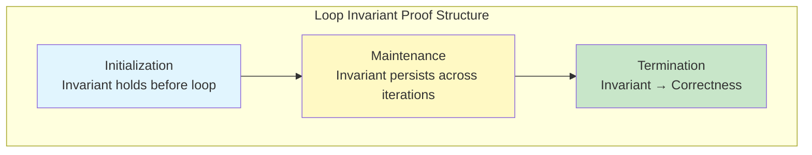
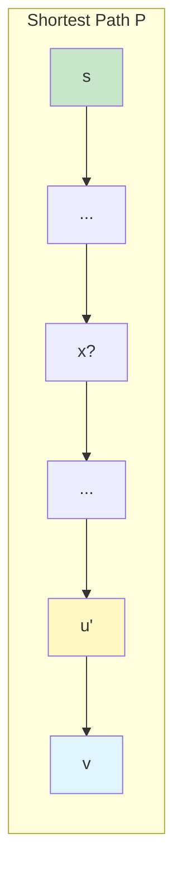
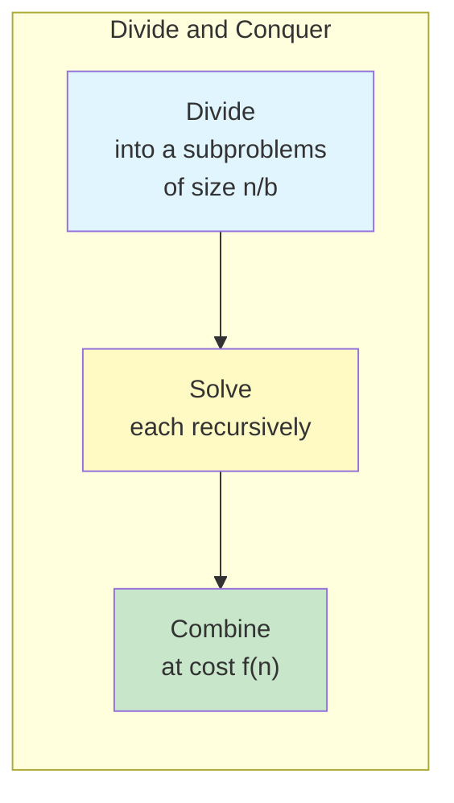
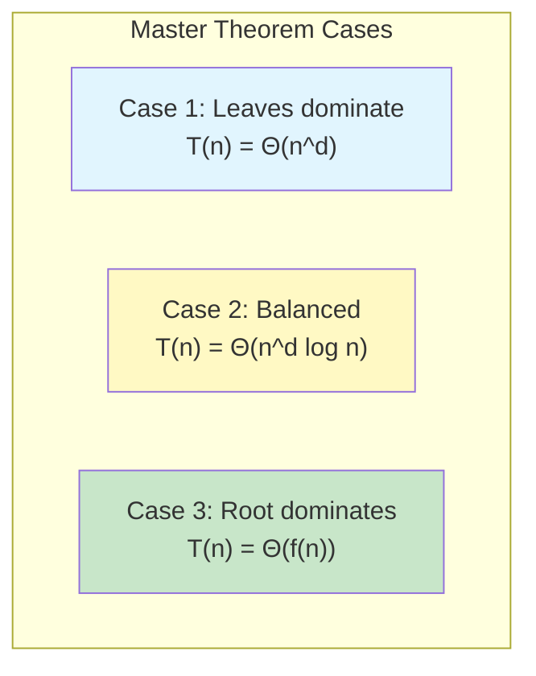

# 📚 L3: Proof of Correctness & Divide and Conquer

> [!abstract] Lecture Goal
> Master the rigorous proof of algorithm correctness using loop invariants for iterative algorithms and strong induction for recursive algorithms, then apply divide-and-conquer paradigms to design efficient algorithms analyzable via the Master Theorem.

> [!tip] The Big Picture
> Correctness proofs are the mathematical foundation that separates "it seems to work" from "it is guaranteed to work." Loop invariants let us reason about iteration the same way induction lets us reason about recursion. Once correctness is established, the Master Theorem provides a cookbook for analyzing divide-and-conquer recurrences — turning $T(n) = aT(n/b) + f(n)$ directly into $\Theta$ notation.

---

## 1. Loop Invariants — Proving Iterative Algorithms Correct

### 🧠 Core Concept

To prove an **iterative algorithm** correct, use a **loop invariant** — a condition that holds true at the start of every loop iteration. The proof follows the same structure as **mathematical induction**:

| Proof Step | What to Show |
| :--- | :--- |
| **Initialization** (Base Case) | The invariant holds before the first iteration |
| **Maintenance** (Inductive Step) | If it holds at start of iteration $i$, it holds at start of iteration $i+1$ |
| **Termination** | When the loop ends, the invariant implies correctness |



---

## 2. Example: Iterative Fibonacci (`IFIB`)

### 🧠 Core Concept

**Algorithm:**

```
IFIB(n):
  If n ≤ 1, return n
  Else:
    prev2 = 0, prev1 = 1
    for i = 2 to n:
      temp = prev1
      prev1 = prev1 + prev2
      prev2 = temp
    return prev1
```

**Loop Invariant:** At the start of iteration $i$: $$\text{prev2} = F_{i-2}, \quad \text{prev1} = F_{i-1}$$

### 📖 Proof

**Initialization** ($i = 2$):
- $\text{prev2} = 0 = F_0$ ✓
- $\text{prev1} = 1 = F_1$ ✓

**Maintenance:** Suppose at start of iteration $i$, `prev2` $= F_{i-2}$ and `prev1` $= F_{i-1}$. After the body executes:
- New `prev1` $= F_{i-1} + F_{i-2} = F_i$
- New `prev2` $= F_{i-1}$ (saved via `temp`)

So at start of iteration $i+1$: `prev2` $= F_{i-1}$, `prev1` $= F_i$ ✓

**Termination:** Loop ends after $i = n$. At that point, `prev1` $= F_n$, so algorithm correctly returns $F_n$. ✓

---

## 3. Example: Selection Sort

### 🧠 Core Concept

```
SELECTIONSORT(A[1..n]):
  for j = 1 to n-1:
    Select s ∈ {j, j+1, ..., n} so A[s] is smallest in A[j..n]
    Swap A[j] and A[s]
```

**Choosing the right invariant is critical.** The correct invariant is:

> **(A[1..j-1] is sorted) AND (every element in A[1..j-1] ≤ every element in A[j..n])**

### ⚠️ Watch Out!

> [!danger] Pitfall 1: Weaker invariants fail
> - **"A is sorted"** — Fails Initialization: A is generally unsorted at start.
> - **"A[1..j-1] is sorted"** — Fails Maintenance: Inserting A[j] could violate order with remaining elements.
> - **"x ≤ y for all x ∈ A[1..j-1], y ∈ A[j..n]"** — Fails Termination: When j = n, A[j..n] is singleton and condition is vacuously true — tells nothing about sortedness.

> [!danger] Pitfall 2: Vacuous truth trap
> A condition becomes vacuously true when the right-hand set is empty or singleton. This can make termination step useless.

---

## 4. Dijkstra's Algorithm — Correctness Proof

### 🧠 Core Concept

**Problem:** Given weighted directed graph $G = (V, E)$ with positive edge weights and source $s$, compute shortest-path distance $\text{dist}(s, v)$ for all $v \in V$.

**Algorithm:**

```
d(s) = 0; R = {s}
While R ≠ V:
  Select v ∈ V \ R to minimize min_{u∈R} [d(u) + w(u,v)]
  d(v) = min_{u∈R} [d(u) + w(u,v)]
  Add v to R
```

**Loop Invariant:** At start of each iteration: $$\forall u \in R, \quad d(u) = \text{dist}(s, u)$$

Every vertex already in $R$ has its distance correctly computed.

### 📖 Proof of Maintenance (Key Claim)

**Claim:** For newly selected vertex $v$: $$\text{dist}(s, v) = \min_{u \in R} \left[ d(u) + w(u, v) \right]$$

**Proof sketch:** Let $P$ be a shortest path from $s$ to $v$.



1. All intermediate vertices of $P$ must already be in $R$ — if some $x \notin R$ came before $v$ on path, greedy selection would choose $x$ before $v$ (since sub-path to $x$ is shorter). Contradiction.

2. Therefore, last vertex $u'$ before $v$ on $P$ is in $R$, and by invariant $d(u') = \text{dist}(s, u')$.

3. So: $\text{dist}(s, v) = d(u') + w(u', v) \geq \min_{u \in R}[d(u) + w(u,v)]$

4. The inequality goes both ways, giving equality. ✓

**Why positive weights matter:** If edge weights could be negative, a vertex outside $R$ could offer a shortcut even after another vertex was selected — breaking the greedy argument.

### 📊 Efficient Implementation

Maintain tentative distance $x(v)$ for each $v \notin R$ and update only neighbors of newly added vertex:

```
x(z) ← min(x(z), d(v) + w(v, z))   for each z adjacent to v
```

| Data Structure | Insert | Extract-min | Decrease-key | Total Complexity |
| :--- | :--- | :--- | :--- | :--- |
| Binary Heap | $O(\log n)$ | $O(\log n)$ | $O(\log n)$ | $O((V + E) \log V)$ |
| Fibonacci Heap | $O(1)$ | $O(\log n)$ amort. | $O(1)$ amort. | $O(E + V \log V)$ |

### ⚠️ Watch Out!

> [!danger] Pitfall 1: Negative weights break Dijkstra's
> The proof relies on adding edges only increasing path length. Negative weights invalidate this.

> [!danger] Pitfall 2: Confusing d(v) with dist(s, v)
> $d(v)$ is the computed estimate; $\text{dist}(s, v)$ is the true shortest path. The invariant says these are equal for vertices in $R$.

---

## 5. Recursive Algorithms — Strong Induction

### 🧠 Core Concept

To prove a **recursive algorithm** correct, use **strong induction** on input size $n$:

- **Base Case:** Show correctness for smallest input (no recursive calls).
- **Inductive Step:** Assume correctness for **all** inputs of size $< n$. Show it works for size $n$.

### 📖 Example: Binary Search

```
BINSEARCH(A, lb, ub, x):
  If lb > ub, return NO
  mid ← ⌊(lb + ub) / 2⌋
  If x = A[mid], return YES
  If x > A[mid], return BINSEARCH(A, mid+1, ub, x)
  If x < A[mid], return BINSEARCH(A, lb, mid-1, x)
```

**Induction on:** $n = \text{ub} - \text{lb} + 1$ (search range size).

**Base Case** ($n < 1$, i.e., $\text{lb} > \text{ub}$): Correctly returns NO (empty range). ✓

**Inductive Step:** Assume correct for any range of size $< n$.
- If $x = A[\text{mid}]$: correctly returns YES ✓
- If $x > A[\text{mid}]$: since $A$ is sorted, $x \in A[\text{lb}..\text{ub}]$ iff $x \in A[\text{mid}+1..\text{ub}]$. Recursive call is on range size $\leq n/2 < n$, so by hypothesis it's correct ✓
- If $x < A[\text{mid}]$: symmetric argument ✓

### ⚠️ Watch Out!

> [!danger] Pitfall: Strong vs. weak induction
> For recursive algorithms calling themselves on multiple smaller inputs (like Fibonacci), you need **strong induction** (assuming correctness for all sizes $< n$), not just the previous one.

---

## 6. Divide and Conquer Paradigm

### 🧠 Core Concept

A divide-and-conquer algorithm works in three stages:



This gives the recurrence: $$T(n) = a \cdot T\left(\frac{n}{b}\right) + f(n)$$

---

## 7. The Master Theorem

### 🧠 Core Concept

For $T(n) = a \cdot T(n/b) + f(n)$ where $a \geq 1$, $b > 1$:

Let $n^d = n^{\log_b a}$ (the "watershed" function).

| Case | Condition | Result |
| :--- | :--- | :--- |
| **Case 1** | $f(n) = O(n^{d-\varepsilon})$ for some $\varepsilon > 0$ | $T(n) = \Theta(n^d)$ |
| **Case 2** | $f(n) = \Theta(n^d)$ | $T(n) = \Theta(n^d \log n)$ |
| **Case 3** | $f(n) = \Omega(n^{d+\varepsilon})$ and regularity holds | $T(n) = \Theta(f(n))$ |

**Intuition:**



- **Case 1:** Most work done deep in recursion tree (leaves dominate)
- **Case 2:** Each level does equal work — $\log n$ factor counts levels
- **Case 3:** Most work done at top level (combine dominates)

### 📖 Example: Merge Sort

$$T(n) = 2T\left(\frac{n}{2}\right) + \Theta(n)$$

$a = 2$, $b = 2$, $f(n) = \Theta(n)$. Watershed: $n^{\log_2 2} = n^1 = n$.

Since $f(n) = \Theta(n) = \Theta(n^d)$, this is **Case 2**: $$T(n) = \Theta(n \log n)$$

### 📖 Example: Strassen's Matrix Multiplication

Naively: $\Theta(n^3)$. Simple divide-and-conquer with 8 multiplications: still $\Theta(n^3)$.

**Strassen's insight:** Use clever algebra to reduce to **7 multiplications**:

$$T(n) = 7T(n/2) + \Theta(n^2) \Rightarrow T(n) = \Theta(n^{\log_2 7}) \approx \Theta(n^{2.807})$$

Current best known exponent (2024): approximately $2.371552$.

### ⚠️ Watch Out!

> [!danger] Pitfall 1: Check regularity for Case 3
> You need $a \cdot f(n/b) \leq c \cdot f(n)$ for some $c < 1$. Don't skip this step!

> [!danger] Pitfall 2: Master Theorem doesn't cover all recurrences
> For example, $T(n) = 2T(n/2) + n \log n$ is not directly covered — it's a stronger Case 2 variant giving $\Theta(n \log^2 n)$.

> [!danger] Pitfall 3: Reducing subproblems vs. reducing combine cost
> Both improvements (8→7 subproblems, or $n^3$→$n^2$ combine) can yield the same asymptotic improvement — understand which dominates!

---

## 🔗 Connections

| 📚 Lecture | 🔗 Connection |
| :--- | :--- |
| [[content/CS3230/L4]] | Lower bounds — proving algorithms optimal requires correctness proofs first; Master Theorem gives us precise complexity classes |
| [[content/CS3230/L5]] | Randomized algorithms — correctness proofs extend to expected-case analysis for randomized quick sort |
| [[content/CS3230/L6]] | Dynamic Programming — divide and conquer overlaps with DP when subproblems repeat; the recurrence structure is similar |

> [!quote] The Key Insight
> Loop invariants transform "I think this works" into "I can prove this works." The three-step structure (initialization, maintenance, termination) mirrors induction exactly. For divide and conquer, the Master Theorem is your cheat sheet — memorize the three cases and their intuition, and you'll never need to unroll a recursion tree by hand again. 🎯

---

## 8. Mock Exam Questions

### 💡 Concept Questions

> [!question] Q1: Loop Invariant Components
> What are the three components of a loop invariant proof, and what does each correspond to in proof by induction?
> <details><summary>Answer</summary>
>
> **Answer:**
> - **Initialization** ↔ Base case: invariant holds before first iteration
> - **Maintenance** ↔ Inductive step: invariant persists across iterations
> - **Termination** ↔ What induction proves: invariant at end implies correctness
> </details>

> [!question] Q2: Selection Sort Invariant
> Why is it insufficient to use "A is sorted" as a loop invariant for Selection Sort?
> <details><summary>Answer</summary>
>
> **Answer:** The invariant "A is sorted" fails at initialization — the array is generally unsorted at the start. A valid invariant must be true at the start of every iteration.
> </details>

> [!question] Q3: Strong Induction
> True or False: The base case of a recursive correctness proof must be $n = 0$ or $n = 1$. Explain.
> <details><summary>Answer</summary>
>
> **Answer: False.** The base case can be any smallest input where the algorithm makes no recursive calls. For binary search, the base case is when the search range is empty ($\text{lb} > \text{ub}$), not necessarily $n = 0$ or $n = 1$.
> </details>

> [!question] Q4: Dijkstra's Positive Weights
> Why does Dijkstra's algorithm fail on graphs with negative edge weights?
> <details><summary>Answer</summary>
>
> **Answer:** The correctness proof relies on the fact that adding edges to a path can only increase its length (when weights are positive). With negative weights, a vertex outside $R$ could offer a "shortcut" that bypasses the greedy selection — the first chosen vertex might not have the true shortest distance.
> </details>

> [!question] Q5: Master Theorem Intuition
> In the Master Theorem, what does the "watershed function" $n^{\log_b a}$ represent intuitively?
> <details><summary>Answer</summary>
>
> **Answer:** It represents the work done at the leaves of the recursion tree — the total contribution of all base cases. When $f(n)$ grows slower than this (Case 1), leaves dominate. When $f(n)$ grows faster (Case 3), the root dominates. When equal (Case 2), work is balanced across all levels.
> </details>

---

### ✏️ Practice Problems

> [!question] P1: SUM Algorithm Proof
> Consider the algorithm that computes $S = \sum_{k=1}^{n} k$:
> ```
> SUM(n):
>   S = 0
>   for i = 1 to n:
>     S = S + i
>   return S
> ```
> State an appropriate loop invariant and prove correctness.
> <details><summary>Answer</summary>
>
> **Loop Invariant:** At start of iteration $i$, $S = \sum_{k=1}^{i-1} k = \frac{(i-1)i}{2}$.
>
> **Initialization** ($i = 1$): $S = 0 = \sum_{k=1}^{0} k$ ✓
>
> **Maintenance:** If $S = \sum_{k=1}^{i-1} k$ at start of iteration $i$, after `S = S + i`, we have $S = \sum_{k=1}^{i} k$ — satisfying invariant for iteration $i+1$ ✓
>
> **Termination:** Loop ends after $i = n+1$. At that point, $S = \sum_{k=1}^{n} k$ ✓
> </details>

> [!question] P2: Bubble Sort Outer Loop
> For Bubble Sort's outer loop, propose a loop invariant and verify initialization and termination.
> <details><summary>Answer</summary>
>
> **Loop Invariant:** At start of outer iteration $i$, the $i-1$ largest elements are correctly placed in $A[n-i+2..n]$.
>
> **Initialization** ($i = 1$): No elements placed yet — invariant holds vacuously ✓
>
> **Termination:** After $i = n$ iterations, $n-1$ largest elements are correctly positioned. The remaining element $A[1]$ is trivially in place. Array is sorted ✓
> </details>

> [!question] P3: Master Theorem Applications
> Solve using the Master Theorem:
> (a) $T(n) = 4T(n/2) + n$
> (b) $T(n) = 4T(n/2) + n^2$
> (c) $T(n) = 4T(n/2) + n^3$
> <details><summary>Answer</summary>
>
> For all three: $a = 4$, $b = 2$, watershed $= n^{\log_2 4} = n^2$.
>
> **(a)** $f(n) = n = O(n^{2-1})$ → **Case 1** → $T(n) = \Theta(n^2)$
>
> **(b)** $f(n) = n^2 = \Theta(n^2)$ → **Case 2** → $T(n) = \Theta(n^2 \log n)$
>
> **(c)** $f(n) = n^3 = \Omega(n^{2+1})$. Regularity: $4 \cdot (n/2)^3 = n^3/2 \leq c \cdot n^3$ for $c = 1/2 < 1$ ✓ → **Case 3** → $T(n) = \Theta(n^3)$
> </details>

> [!question] P4: Maximum Subarray (Divide & Conquer)
> Design a divide-and-conquer algorithm for maximum subarray sum. State and solve the recurrence.
> <details><summary>Answer</summary>
>
> **Algorithm:** Split at midpoint $m$. Maximum subarray either:
> 1. Lies entirely in left half $A[1..m]$
> 2. Lies entirely in right half $A[m+1..n]$
> 3. Crosses the midpoint — find best suffix of left + best prefix of right in $O(n)$
>
> Return max of three cases.
>
> **Recurrence:** $T(n) = 2T(n/2) + \Theta(n)$
>
> Watershed: $n^{\log_2 2} = n = \Theta(n) = f(n)$ → **Case 2**: $T(n) = \Theta(n \log n)$
> </details>