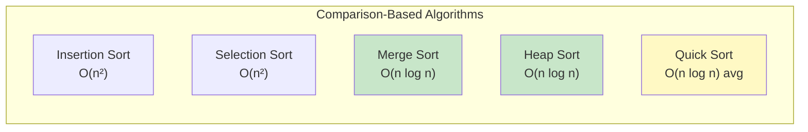
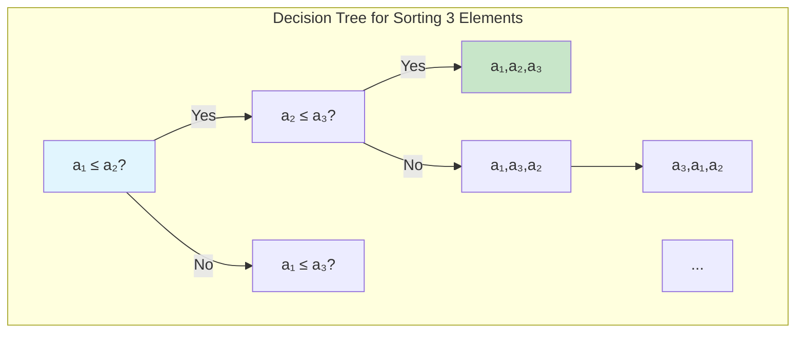
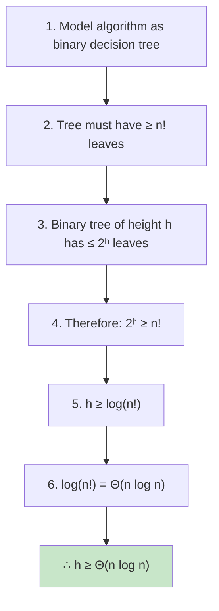
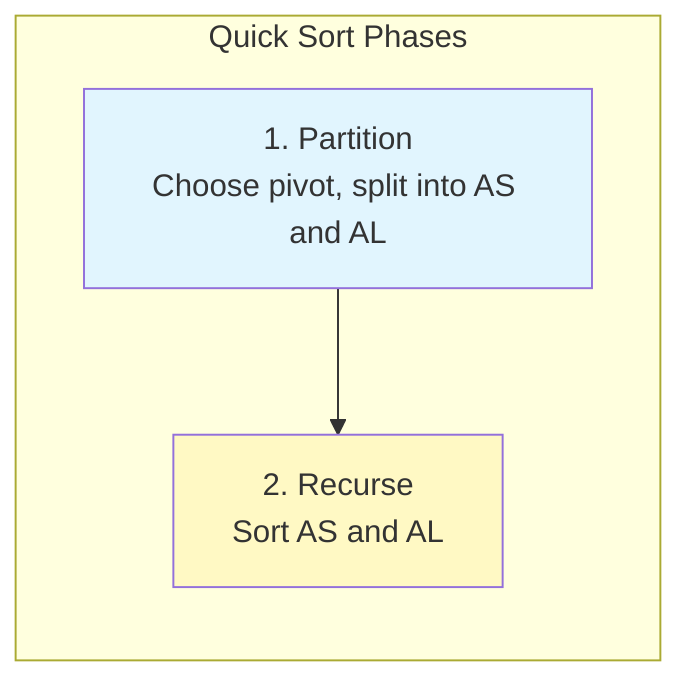
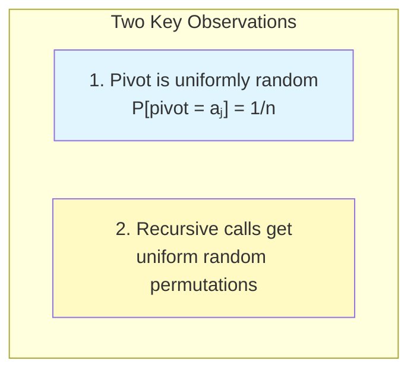

# 📚 L4: Lower Bounds & Average-Case Analysis

> [!abstract] Lecture Goal
> Understand why $O(n \log n)$ is a fundamental lower bound for comparison-based sorting, learn to use decision trees as a proof technique, and master the average-case analysis of Quick Sort including the telescoping technique for solving recurrences.

> [!tip] The Big Picture
> Lower bounds tell us when we've hit a theoretical wall — no algorithm can do better. The $\Omega(n \log n)$ bound for comparison-based sorting comes from counting permutations: $n!$ possible inputs require $\log(n!) = \Theta(n \log n)$ comparisons to distinguish. Non-comparison sorts like Counting Sort break this barrier by exploiting additional structure. Average-case analysis reveals that Quick Sort, despite $\Theta(n^2)$ worst case, achieves $O(n \log n)$ on random inputs.

---

## 1. Comparison-Based Sorting

### 🧠 Core Concept

A **comparison-based sorting algorithm** is one where the only operations allowed on input elements are comparisons: $<, \leq, =, >, \geq$. No other information (bit representation, odd/even, absolute value) can be used.

| ✅ Allowed | ❌ Not Allowed |
| :--- | :--- |
| `if A[i] < A[j]` | `if A[i] + A[j] = A[k]` |
| `if A[i] = A[j]` | `if A[i] = k` (comparing to constant) |
| `if A[i] > A[j]` | `if A[i] is odd` |
| | `if the j-th bit of A[i] is 1` |

All "classic" sorting algorithms (Insertion, Selection, Merge, Heap, Quick Sort) are comparison-based.



**Key insight:** $O(n \log n)$ is not a coincidence — it's a **fundamental lower bound** for this class.

### ⚠️ Watch Out!

> [!danger] Pitfall: Confusing "comparison-based" with "slow"
> Merge Sort and Heap Sort are comparison-based **and** optimal! The restriction applies to how elements are used, not to other bookkeeping logic.

---

## 2. Decision Trees

### 🧠 Core Concept

Any comparison-based algorithm can be modeled as a **decision tree**:

| Tree Component | Meaning |
| :--- | :--- |
| **Internal nodes** | Comparisons made by algorithm (e.g., "Is $a_1 \leq a_2$?") |
| **Edges** | Results of comparisons (Yes/No) |
| **Leaves** | Final outputs (sorted permutations) |



**Key facts:**
- Decision tree is **binary** (each comparison has 2 outcomes)
- Must have **at least $n!$ leaves** (one per permutation)
- **Height** = worst-case number of comparisons

### 📖 Example: Sorting 3 Elements

For $A = (a_1, a_2, a_3)$:
1. Root: "Is $a_1 \leq a_2$?"
2. Left (Yes): "Is $a_2 \leq a_3$?" → output $a_1, a_2, a_3$ if Yes
3. And so on...

Tree has **6 leaves** ($3! = 6$ permutations) and height **3**.

### ⚠️ Watch Out!

> [!danger] Pitfall: Decision tree models a specific algorithm
> The tree is for one algorithm, not "sorting in general." Different algorithms have different trees.

---

## 3. The $\Omega(n \log n)$ Lower Bound

### 🧠 Core Concept

> **Theorem:** The worst-case time complexity of any comparison-based sorting algorithm is $\Omega(n \log n)$.

**Proof outline:**



**By Stirling's Approximation:**

$$\log(n!) \in n \log n - n \log e + O(\log n) \subseteq \Theta(n \log n)$$

**Consequence:** Merge Sort and Heap Sort are **asymptotically optimal** — no comparison-based algorithm can do better!

### 📖 Example: Can We Sort 5 Elements in 6 Comparisons?

**Claim:** Exists algorithm sorting any 5-element array using at most 6 comparisons.

**Answer: FALSE.**

- $5! = 120$ possible permutations
- Binary tree of height $\leq 6$ has at most $2^6 = 64$ leaves
- $120 > 64$ → impossible!

At least **7 comparisons** required (since $2^7 = 128 \geq 120$).

### 📖 Example: Merging k Sorted Arrays

**Problem:** Merge $k$ sorted arrays (each length $n$) into one sorted array.

**Lower bound:** $\Omega(kn \log k)$

**Why?** Number of valid interleavings: $\frac{(kn)!}{(n!)^k}$

So comparisons needed: $\log \frac{(kn)!}{(n!)^k} = \log(kn)! - k\log(n!) = \Theta(kn \log k)$

### ⚠️ Watch Out!

> [!danger] Pitfall 1: Lower bound is for worst-case only
> Some inputs can be sorted faster (e.g., already-sorted array takes $O(n)$ with insertion sort).

> [!danger] Pitfall 2: $\log(n!)$ grows as $\Theta(n \log n)$
> Don't confuse with $\Theta(n^2)$ or $\Theta(n)$.

---

## 4. Non-Comparison Sorts (Counting Sort)

### 🧠 Core Concept

If elements are restricted to $\{1, 2, \ldots, k\}$, we can exploit this to sort in $O(n + k)$ — **breaking the $\Omega(n \log n)$ barrier!**

```
COUNTING_SORT(A):
  For all i ∈ {1, 2, ..., k}, compute cnt[i] = # of times i appears in A
  Set first cnt[1] entries of result to 1
  Set next cnt[2] entries of result to 2
  ...
```

| Property | Value |
| :--- | :--- |
| **Time complexity** | $O(n + k)$ |
| **Why it works** | Uses value of elements, not just comparisons |
| **Limitation** | Only works for bounded integer range |

### ⚠️ Watch Out!

> [!danger] Pitfall: Counting Sort only practical when k = O(n)
> If $k \gg n$ (e.g., $k = 2^{64}$), $O(n + k)$ becomes prohibitive.

---

## 5. Quick Sort — Worst Case

### 🧠 Core Concept

Quick Sort works in two phases:



$$A = [\underbrace{A_S}_{\forall x \leq \text{pivot}}\ |\ \text{pivot}\ |\ \underbrace{A_L}_{\forall x \geq \text{pivot}}]$$

If pivot is $j$-th smallest, recurrence is: $$T(n) = T(j-1) + T(n-j) + \Theta(n)$$

### 📊 Worst-Case Analysis

When pivot is always smallest or largest ($j=1$ or $j=n$):

$$T(n) = T(0) + T(n-1) + cn = T(n-1) + cn$$

Unrolling: $$T(n) = cn + c(n-1) + \cdots + c \cdot 1 = c \cdot \frac{n(n+1)}{2} \in \Theta(n^2)$$

**When does this happen?** Input already sorted + always pick first element as pivot!

### ⚠️ Watch Out!

> [!danger] Pitfall: Quick Sort worst case is quadratic
> "Quick Sort is fast" is only true on average — worst case is $\Theta(n^2)$.

---

## 6. Quick Sort — Average-Case Analysis

### 🧠 Core Concept

**Setup:** Input is a random permutation $\pi$ of distinct elements $a_1 < a_2 < \cdots < a_n$, chosen uniformly.

$$A(n) = \sum_\pi \frac{1}{n!} \cdot T(\pi)$$

**Key observations:**



1. **Pivot is uniformly random:** Since we pick first element and permutation is random, each element is equally likely to be pivot.

2. **Recursive calls preserve randomness:** Partition never compares elements within $A_S$ or $A_L$ against each other — their relative ordering is preserved as uniform random permutation.

### 📊 The Recurrence

$$A(n) = cn + \frac{2}{n}\sum_{j=0}^{n-1} A(j)$$

**Solving via telescoping:**

1. Multiply by $n$: $n \cdot A(n) = cn^2 + 2\sum_{j=0}^{n-1} A(j)$
2. Write for $n-1$: $(n-1) \cdot A(n-1) = c(n-1)^2 + 2\sum_{j=0}^{n-2} A(j)$
3. Subtract: $n \cdot A(n) - (n+1) \cdot A(n-1) = c(2n-1)$
4. Divide by $n(n+1)$ and telescope:

$$\frac{A(n)}{n+1} < 2c\left(\frac{1}{n} + \frac{1}{n-1} + \cdots + \frac{1}{2}\right) + \frac{A(1)}{2}$$

The harmonic sum $H_n = \sum_{i=1}^{n} \frac{1}{i} \in \Theta(\log n)$, so:

$$\boxed{A(n) \in O(n \log n)}$$

**Conclusion:** Quick Sort's average-case complexity is $O(n \log n)$ — same as Merge Sort's worst case! 🎉

### ⚠️ Watch Out!

> [!danger] Pitfall 1: Average-case assumes random input
> In practice, inputs may not be random (nearly-sorted arrays). Use random pivot selection.

> [!danger] Pitfall 2: Don't confuse harmonic series with log(n!)
> $H_n = \Theta(\log n)$ but $\log(n!) = \Theta(n \log n)$.

---

## 7. Stability and In-Place Sorting

### 🧠 Core Concept

Two additional properties matter in practice:

**🔹 Stability:** A sorting algorithm is **stable** if equal elements maintain original relative order. Formally: if $A[i] = A[j]$ and $i < j$, then $A[i]$ appears before $A[j]$ in output.

| Algorithm | Stable? |
| :--- | :--- |
| Insertion Sort | ✅ Yes |
| Merge Sort | ✅ Yes (if careful) |
| Quick Sort | ❌ Usually No |
| Heap Sort | ❌ No |

**🔹 In-Place:** Uses only $O(1)$ or $O(\log n)$ extra memory.

| Algorithm | Extra Memory |
| :--- | :--- |
| Insertion Sort | $O(1)$ — in-place ✅ |
| Merge Sort | $O(n)$ — NOT in-place ❌ |
| Quick Sort | $O(\log n)$ — in-place ✅ |

**Why $O(\log n)$ for Quick Sort?** Recursion stack depth. If we always recurse on smaller sub-array first, depth is at most $O(\log n)$.

### ⚠️ Watch Out!

> [!danger] Pitfall: These properties are implementation-dependent
> A carelessly implemented Merge Sort might not be stable!

---

## 🔗 Connections

| 📚 Lecture | 🔗 Connection |
| :--- | :--- |
| [[content/CS3230/L3]] | Proof techniques — decision tree arguments are a form of proof by counting |
| [[content/CS3230/L5]] | Randomized algorithms — randomized Quick Sort avoids worst case by random pivot selection |
| [[content/CS3230/L6]] | Dynamic Programming — average-case analysis uses techniques similar to DP recurrences |

> [!quote] The Key Insight
> Lower bounds are just as valuable as upper bounds — they tell us when to stop looking for better algorithms. The $\Omega(n \log n)$ bound proves that Merge Sort and Heap Sort are optimal within the comparison-based model. To beat this bound, you must step outside the model (like Counting Sort does). For Quick Sort, the $\Theta(n^2)$ worst case seems scary, but the $O(n \log n)$ average case makes it practical — randomness is your friend. 🎯

---

## 8. Mock Exam Questions

### 💡 Concept Questions

> [!question] Q1: Decision Tree Leaves
> Why must the decision tree for sorting $n$ elements have at least $n!$ leaves? What would happen if it had fewer?
> <details><summary>Answer</summary>
>
> **Answer:** There are $n!$ possible permutations of the input. Each permutation must lead to a distinct leaf with the correct sorted output. If there were fewer leaves, at least one leaf would correspond to multiple permutations — but those permutations require different outputs, so the algorithm would be incorrect.
> </details>

> [!question] Q2: Breaking the Lower Bound
> Is it possible to design a comparison-based algorithm that sorts $n$ elements in $O(n)$ worst-case time? Justify using decision trees.
> <details><summary>Answer</summary>
>
> **Answer: No.** A comparison-based algorithm requires at least $\log(n!) = \Theta(n \log n)$ comparisons in the worst case. The decision tree must have height $h \geq \log(n!)$ to distinguish all $n!$ permutations. An $O(n)$ algorithm would require $h = O(n)$, but $\log(n!) \neq O(n)$.
> </details>

> [!question] Q3: Average vs. Worst Case
> What is the key difference between worst-case and average-case analysis? When would you prefer each?
> <details><summary>Answer</summary>
>
> **Answer:** Worst-case analysis guarantees performance for every input; average-case analyzes expected performance over a distribution. Prefer worst-case when inputs may be adversarial (security-critical systems). Prefer average-case when inputs are random or when worst-case is rare in practice.
> </details>

> [!question] Q4: Quick Sort Pivot
> In average-case analysis, why must the partition step NOT compare elements within $A_S$ against each other?
> <details><summary>Answer</summary>
>
> **Answer:** For the analysis to work, recursive calls must receive uniformly random permutations of their elements. If the partition step compares elements within $A_S$ against each other (e.g., to find median), their relative ordering would no longer be uniform, and the recurrence would not hold.
> </details>

> [!question] Q5: Stability
> Why does stability matter when sorting objects with multiple keys?
> <details><summary>Answer</summary>
>
> **Answer:** When sorting by one key after another, stability ensures that the second sort preserves the ordering from the first sort. For example, sorting people by name then by age: the age-sort must be stable to preserve name-ordering among people with the same age.
> </details>

---

### ✏️ Practice Problems

> [!question] P1: Minimum Comparisons for 4 Elements
> Prove that any comparison-based algorithm for sorting $n = 4$ elements requires at least 5 comparisons in the worst case.
> <details><summary>Answer</summary>
>
> **Step 1:** Count permutations: $4! = 24$
>
> **Step 2:** Find minimum height: $2^h \geq 24$
>
> **Step 3:** Solve: $h \geq \log_2(24) \approx 4.585$
>
> Since $h$ must be an integer: $h \geq 5$
>
> Check: $2^4 = 16 < 24$ (insufficient), $2^5 = 32 \geq 24$ (sufficient).
>
> **Conclusion:** At least 5 comparisons required in worst case. ✅
> </details>

> [!question] P2: Merging k Singletons
> For $k$ sorted arrays of length $n = 1$ (i.e., $k$ individual elements), derive the lower bound for merging them.
> <details><summary>Answer</summary>
>
> Number of valid arrangements: $\frac{(kn)!}{(n!)^k} = \frac{k!}{(1!)^k} = k!$
>
> Comparisons needed: $\log(k!) \in \Theta(k \log k)$
>
> **Intuition:** Merging $k$ singleton arrays is the same problem as sorting $k$ elements. The bound matches the standard sorting lower bound. ✅
> </details>

> [!question] P3: Quick Sort with Median Pivot
> If Quick Sort always selects the median element as pivot (assume finding median is free), write and solve the recurrence for running time.
> <details><summary>Answer</summary>
>
> **Recurrence:** With median pivot, sub-arrays each have size $\approx n/2$:
>
> $$T(n) = 2T(n/2) + cn$$
>
> **Master Theorem:** $a = 2$, $b = 2$, $f(n) = cn = \Theta(n^{\log_2 2}) = \Theta(n)$
>
> **Case 2:** $T(n) = \Theta(n \log n)$
>
> **Conclusion:** With perfect median selection, Quick Sort achieves $\Theta(n \log n)$ worst case — matching Merge Sort! ✅
> </details>

> [!question] P4: Verify Average-Case Bound
> Verify that $A(n) \leq 4cn \ln n$ satisfies the average-case recurrence for large $n$.
> <details><summary>Answer</summary>
>
> **Substitute:** $A(n) \leq cn + \frac{8c}{n} \sum_{j=1}^{n-1} j \ln j$
>
> **Bound the sum:** $\sum_{j=1}^{n-1} j \ln j \leq \int_1^n x \ln x \, dx = \frac{n^2 \ln n}{2} - \frac{n^2}{4} + \frac{1}{4} \leq \frac{n^2 \ln n}{2}$
>
> **Result:** $A(n) \leq cn + \frac{8c}{n} \cdot \frac{n^2 \ln n}{2} = cn + 4cn \ln n$
>
> For large $n$, $\ln n \geq 1$, so $cn \leq 4cn \ln n$:
>
> $A(n) \leq 4cn \ln n + 4cn \ln n = 8cn \ln n \in O(n \log n)$ ✅
> </details>