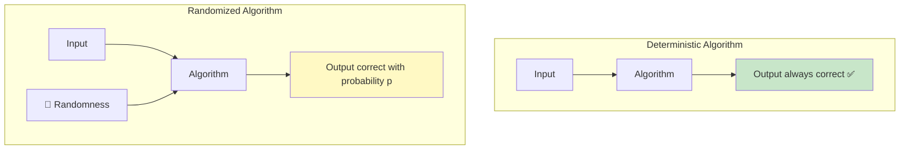
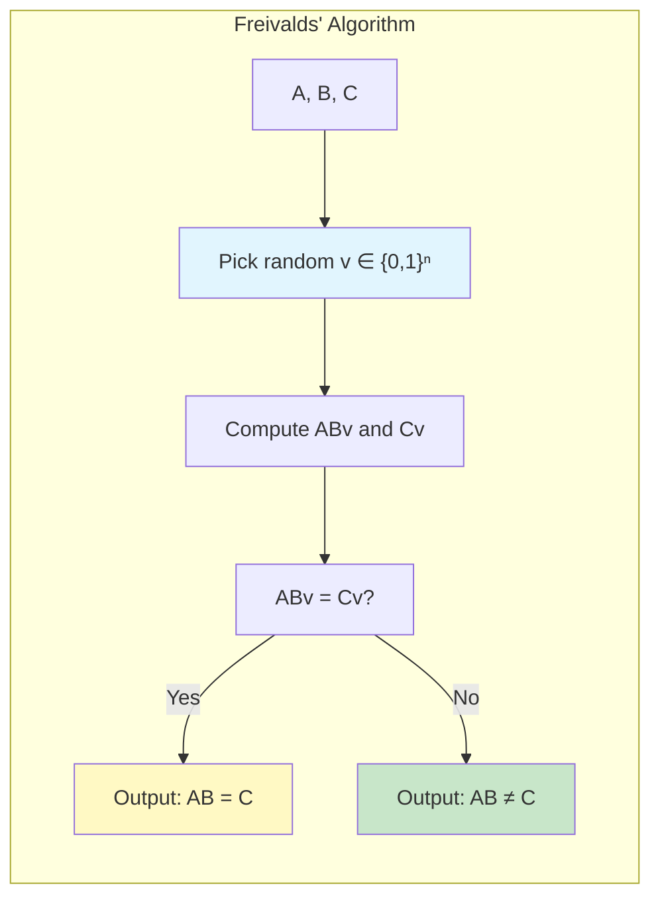
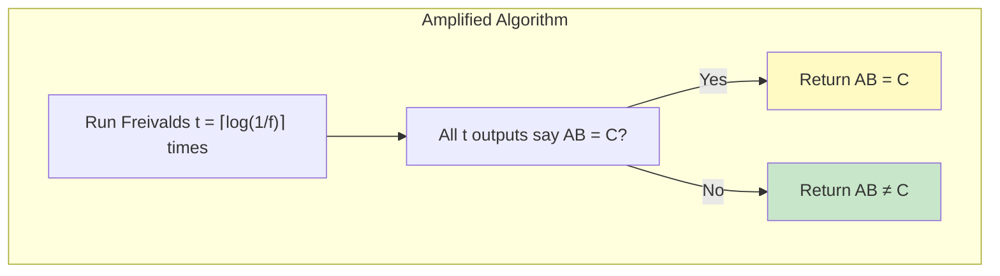
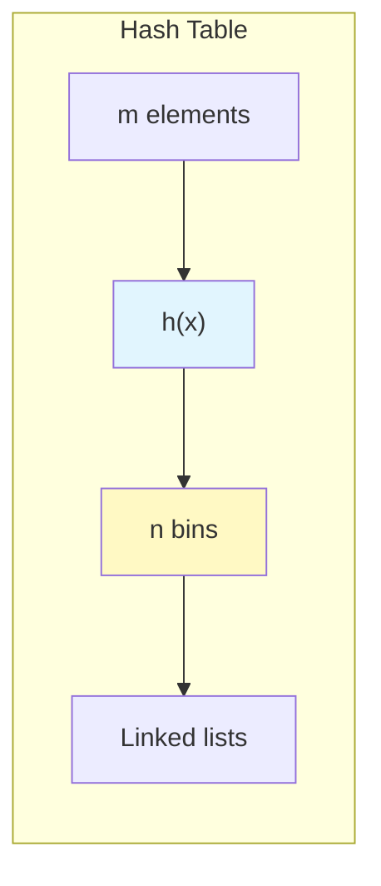
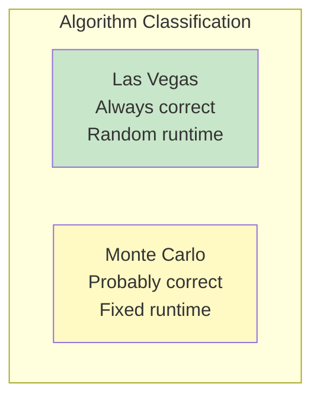

# 📚 L5: Randomized Algorithms

> [!abstract] Lecture Goal
> Understand how randomness can be used to design faster, simpler algorithms, master key techniques like Freivalds' algorithm, hashing analysis, and coupon collector bounds, and distinguish between Las Vegas and Monte Carlo algorithms.

> [!tip] The Big Picture
> Randomized algorithms trade guaranteed correctness for speed. Instead of always computing exact answers deterministically, we let coin flips guide us toward efficient solutions — achieving polynomial-time algorithms for problems where the best deterministic approach is slower. The key insight: a small error probability can be amplified away, but speed gains are permanent.

---

## 1. Randomized Algorithms — The Big Idea

### 🧠 Core Concept

A **deterministic algorithm** always produces the correct output for every input. A **randomized algorithm** introduces a source of randomness and may produce the correct output only _with some probability_.

| Property | Deterministic | Randomized |
| :--- | :--- | :--- |
| **Output** | Always correct | Correct with probability $p$ |
| **Runtime** | Fixed for each input | Random variable |
| **Guarantee** | Worst-case | Expected or high-probability |



**Key insight:** Use randomization to develop algorithms that are more efficient or simpler than deterministic counterparts, at the cost of allowing a small error probability.

### ⚠️ Watch Out!

> [!danger] Mistake 1: Confusing randomized complexity with average-case complexity
> A randomized algorithm performs well **for every input** in expectation over random choices. Average-case analysis only says the algorithm performs well on **some distribution** of inputs.

> [!danger] Mistake 2: Assuming error probability $1/2$ is "useless"
> This error can almost always be driven down to negligible levels by repetition (see Amplification).

---

## 2. Freivalds' Algorithm

### 🧠 Core Concept

**Problem:** Given three $n \times n$ matrices $A$, $B$, $C$, check whether $AB = C$.

**Naive approach:** Multiply $AB$ directly. Time: $O(n^3)$ (basic) or $O(n^{2.807\ldots})$ (Strassen's).

**Freivalds' approach:** Instead of computing $AB$, pick a random vector and check a weaker condition.



**Algorithm:**

```
FREIVALDS(A, B, C, n):
  1. Choose random v ∈ {0, 1}ⁿ (each vᵢ = 0 or 1 independently with prob 1/2)
  2. Compute ABv (via two matrix-vector multiplications) and Cv
  3. If ABv = Cv, output "AB = C"; else output "AB ≠ C"
```

**Time complexity:** $O(n^2)$ — much faster than computing $AB$ directly! 🎉

### 📊 Analysis

**Case 1: $AB = C$.** Then $ABv = Cv$ for all $v$, so the algorithm **always** outputs correctly.

**Case 2: $AB \neq C$.** Define $C^* = AB - C \neq 0$ and $u = C^*v$. The algorithm makes an error iff $u = 0$ (i.e., $u_k = 0$ for all $k$).

Since $AB \neq C$, there exists some entry $(i, j)$ with $c^*_{i,j} \neq 0$. Consider row $i$:

$$u_i = c^*_{i,1}v_1 + c^*_{i,2}v_2 + \cdots + c^*_{i,j}v_j + \cdots + c^*_{i,n}v_n$$

Fix all variables except $v_j$. There is **at most one** value of $v_j \in \{0, 1\}$ that makes $u_i = 0$ (since $c^*_{i,j} \neq 0$). Since $v_j$ is chosen uniformly from $\{0, 1\}$:

$$\Pr[u_i \neq 0] \geq \frac{1}{2}$$

Therefore: $\boxed{\Pr[\text{Freivalds' algorithm is successful}] \geq \frac{1}{2}}$

### 📖 Example Explained

Suppose $n = 2$ and:

$$A = \begin{pmatrix} 1 & 0 \\ 0 & 1 \end{pmatrix}, \quad B = \begin{pmatrix} 2 & 3 \\ 4 & 5 \end{pmatrix}, \quad C = \begin{pmatrix} 2 & 3 \\ 4 & \mathbf{6} \end{pmatrix}$$

Here $AB \neq C$ (the $(2,2)$ entry differs: $AB_{22} = 5 \neq 6$).

**Pick $v = \begin{pmatrix} 0 \\ 1 \end{pmatrix}$:**
- $ABv = \begin{pmatrix} 3 \\ 5 \end{pmatrix}$, $Cv = \begin{pmatrix} 3 \\ 6 \end{pmatrix}$ — they differ! ✅ Algorithm correctly detects $AB \neq C$.

**Pick $v = \begin{pmatrix} 0 \\ 0 \end{pmatrix}$:**
- $ABv = \begin{pmatrix} 0 \\ 0 \end{pmatrix}$, $Cv = \begin{pmatrix} 0 \\ 0 \end{pmatrix}$ — they're equal! ❌ Algorithm incorrectly outputs $AB = C$.

This shows the algorithm **can** fail, but only with probability $\leq 1/2$.

### ⚠️ Watch Out!

> [!danger] Pitfall 1: False negatives are impossible
> The algorithm can **never** output $AB \neq C$ when $AB = C$. Only false positives ($AB = C$ when it isn't) can occur.

> [!danger] Pitfall 2: Forgetting amplification
> Error probability $1/2$ is already good for a single round and can be reduced further by repetition.

---

## 3. Techniques: Deferred Decision & Amplification

### 🧠 Principle of Deferred Decision

This principle justifies a common proof technique: fix some random variables and analyze the remaining randomness.

**Formal statement:** If we can show that $\Pr[\mathcal{E} \mid X = x] \geq p$ for **every** value $x$, then:

$$\Pr[\mathcal{E}] = \sum_x \Pr[\mathcal{E} \mid X = x] \cdot \Pr[X = x] \geq p \cdot \sum_x \Pr[X = x] = p$$

**In Freivalds' analysis:** Fix all of $v_1, \ldots, v_n$ except $v_j$. No matter how the other variables turn out, the remaining randomness in $v_j$ still gives success probability $\geq 1/2$.

### 🧠 Success Probability Amplification

A single run of Freivalds has error $\leq 1/2$. To reduce this to $\leq f$:



**Correctness:**

- If $AB = C$: every run correctly outputs $AB = C$ → no error.
- If $AB \neq C$: each run independently makes an error with probability $\leq 1/2$. All $t$ runs err with probability at most:

$$\left(\frac{1}{2}\right)^t \leq f$$

**Total runtime:** $O(n^2 \log(1/f))$ — still very fast! 🚀

### ⚠️ Watch Out!

> [!danger] Pitfall 1: Forgetting independence
> You must draw a **fresh** random vector $v$ for each repetition.

> [!danger] Pitfall 2: Wrong amplification direction
> Outputting $AB = C$ if **any** run says so would amplify false positives, not reduce them.

---

## 4. Coupon Collector's Problem & Balls-and-Bins

### 🧠 Core Concept

**The Coupon Collector's Problem:** There are $n$ types of coupons. Each cereal box contains a uniformly random coupon. How many boxes must you buy to collect all $n$ types?

This maps elegantly to a **Balls-and-Bins** model:

| Balls-and-Bins | Coupon Collector |
| :--- | :--- |
| $m$ balls | $m$ cereal boxes |
| $n$ bins | $n$ coupon types |
| Every bin has $\geq 1$ ball | All $n$ coupon types collected |

**Answer:** Buying $m = 2n \ln n \in \Theta(n \log n)$ boxes guarantees success probability $\geq 1 - 1/n$.

### 📊 Analysis

**For one bin**, the probability it receives zero balls (out of $m$) is:

$$\left(1 - \frac{1}{n}\right)^m \leq e^{-m/n}$$

using the inequality $1 + x \leq e^x$.

**By the Union Bound**, the probability that **at least one** bin is empty:

$$n \cdot \left(1 - \frac{1}{n}\right)^m \leq n \cdot e^{-m/n}$$

Setting $m = 2n \ln n$:

$$n \cdot e^{-2\ln n} = n \cdot \frac{1}{n^2} = \frac{1}{n}$$

So with $m = 2n\ln n$ boxes, the probability all coupons are collected is $\geq 1 - 1/n$. ✅

### 📖 Example Explained

With $n = 4$ coupons, you need $m = 2 \cdot 4 \cdot \ln 4 \approx 11$ boxes to have a $\geq 75\%$ chance of collecting all 4.

### ⚠️ Watch Out!

> [!danger] Pitfall 1: Using $m = n$
> With $m = n$, you expect 1 ball per bin on average, but many bins will still be empty!

> [!danger] Pitfall 2: Forgetting the $\ln n$ factor
> The $\Theta(n \log n)$ bound is tight — $\Theta(n)$ boxes is **not** enough.

---

## 5. Probabilistic Techniques Toolkit

### 🧠 Union Bound

To upper-bound the probability of a bad event $\mathcal{E} = \mathcal{E}_1 \vee \mathcal{E}_2 \vee \cdots \vee \mathcal{E}_n$:

$$\Pr[\mathcal{E}] \leq \Pr[\mathcal{E}_1] + \Pr[\mathcal{E}_2] + \cdots + \Pr[\mathcal{E}_n]$$

**Corollary:** To ensure $\Pr[\mathcal{E}] \leq f$, it suffices that each $\Pr[\mathcal{E}_i] \leq f/n$.

### 🧠 Expected Value

$$\mathbb{E}[X] = \sum_x x \cdot \Pr[X = x]$$

### 🧠 Indicator Random Variables

For an event $\mathcal{E}$, define:

$$\mathbf{1}_\mathcal{E} = \begin{cases} 1 & \text{if } \mathcal{E} \text{ occurs} \\ 0 & \text{otherwise} \end{cases}$$

**Key observation:** $\mathbb{E}[\mathbf{1}_\mathcal{E}] = \Pr[\mathcal{E}]$. This is extremely useful for computing expected values! 🎯

### 🧠 Linearity of Expectation

If $X = \sum_{i=1}^n X_i$, then:

$$\mathbb{E}[X] = \sum_{i=1}^n \mathbb{E}[X_i]$$

**This holds even if the $X_i$ are not independent!** This is what makes it so powerful.

### 🧠 Markov's Inequality

If $X$ is a non-negative random variable and $a > 0$:

$$\Pr[X \geq a \cdot \mathbb{E}[X]] \leq \frac{1}{a}$$

**Practical use:** If expected runtime is $t$, then runtime exceeds $100t$ with probability $\leq 1/100 = 0.01$. So it runs in $O(t)$ with probability $\geq 0.99$. 💡

### ⚠️ Watch Out!

> [!danger] Pitfall 1: Union Bound can be loose
> It's an **upper bound** — it can be very loose when events have high overlap.

> [!danger] Pitfall 2: Independence not needed for linearity
> You **do not** need independence for $\mathbb{E}[X+Y] = \mathbb{E}[X]+\mathbb{E}[Y]$. Independence is required for $\mathbb{E}[XY] = \mathbb{E}[X]\mathbb{E}[Y]$.

> [!danger] Pitfall 3: Markov only applies to non-negative variables
> Applying it to signed quantities is invalid.

---

## 6. Hashing

### 🧠 Core Concept

A **hash table** uses a hash function $h: U \to \{1, 2, \ldots, n\}$ to map elements from a universe $U$ into an array of length $n$.

| Operation | Description |
| :--- | :--- |
| **Insert($v$)** | Store $v$ at $A[h(v)]$ |
| **Search($v$)** | Check $A[h(v)]$ |
| **Delete($v$)** | Remove $v$ from $A[h(v)]$ |

**Chain hashing:** When multiple elements map to the same slot, use a linked list. The cost of an operation is proportional to the linked list size.



### 📊 Expected Linked List Size

**For a random bin (not conditioned on anything):**

With $m$ elements hashed into $n$ slots, the expected number of elements in any fixed slot:

$$\mathbb{E}[X] = \frac{m}{n}$$

**Proof using indicator variables:**
- Let $\mathcal{E}_i$ = event that the $i$-th element hashes to the selected bin.
- $X_i = \mathbf{1}_{\mathcal{E}_i}$, so $\mathbb{E}[X_i] = 1/n$.
- $X = \sum_{i=1}^m X_i$, so $\mathbb{E}[X] = m/n$ by linearity of expectation.

**For the bin containing a specific element (the "selected ball"):**

$$\mathbb{E}[X] = 1 + (m-1) \cdot \frac{1}{n}$$

The $+1$ accounts for the selected element itself (probability 1 of being in its own bin), while each of the other $m-1$ elements hashes there with probability $1/n$.

### ⚠️ Watch Out!

> [!danger] Pitfall: Different expected list sizes
> The expected list size for "the bin of a selected element" is $1 + (m-1)/n$, not $m/n$.

---

## 7. Randomized Quick Sort

### 🧠 Core Concept

**Algorithm:**

1. **Partition:** Select a pivot **uniformly at random** from the current array. Rearrange so all elements $\leq$ pivot come before, all $\geq$ pivot come after.
2. **Recurse:** Recursively sort both sub-arrays.

**Key observation:** The running time is $\Theta(\text{number of comparisons})$.

### 📊 Expected Running Time

Let $a_1 < a_2 < \cdots < a_n$ be the sorted elements. Let $X_{i,j}$ = number of comparisons between $a_i$ and $a_j$ (which is 0 or 1).

By linearity of expectation:

$$\mathbb{E}[\text{comparisons}] = \sum_{1 \leq i < j \leq n} \mathbb{E}[X_{i,j}] = \sum_{1 \leq i < j \leq n} \Pr[\mathcal{E}_{i,j}]$$

**Key claim:** $\Pr[\mathcal{E}_{i,j}] = \dfrac{2}{j - i + 1}$

**Why?** $a_i$ and $a_j$ are compared iff the **first element from $\{a_i, a_{i+1}, \ldots, a_j\}$ chosen as a pivot is either $a_i$ or $a_j$** (because before any such pivot is chosen, all of $a_i, \ldots, a_j$ live in the same sub-array). Since each of the $j - i + 1$ elements is equally likely to be chosen first:

$$\Pr[\mathcal{E}_{i,j}] = \frac{2}{j - i + 1}$$

**Computing the total:**

$$\mathbb{E}[\text{comparisons}] = \sum_{1 \leq i < j \leq n} \frac{2}{j-i+1} = 2\sum_{i=1}^n \sum_{k=2}^{n-i+1} \frac{1}{k} \in O(n \log n)$$

**Theorem:** The expected running time of randomized quick sort is $O(n \log n)$. By Markov's inequality, it runs in $O(n \log n)$ with probability $\geq 0.99$. 🎉

### 💡 Intuition

If we always pick the median as pivot, we'd get perfect $O(n \log n)$ behavior. Randomization ensures that, **in expectation**, we don't keep picking terrible pivots (like always choosing the max/min).

### ⚠️ Watch Out!

> [!danger] Pitfall 1: Multiple comparisons misconception
> $a_i$ and $a_j$ might be compared **at most once**. Once either is chosen as pivot, they are separated into different sub-arrays and will never be in the same sub-array again.

> [!danger] Pitfall 2: Worst-case still $O(n^2)$
> The expected time is $O(n \log n)$, but the worst case is **still** $O(n^2)$. Randomization helps in expectation, not worst-case.

---

## 8. Las Vegas vs. Monte Carlo Algorithms

### 🧠 Core Concept

| Property | Las Vegas | Monte Carlo |
| :--- | :--- | :--- |
| **Output correctness** | Always correct ✅ | Correct with probability $p$ 🎲 |
| **Time complexity** | Guaranteed only in expectation | Deterministic time bound ✅ |
| **Example** | Randomized Quick Sort | Freivalds' Algorithm |

**Which is stronger?** Las Vegas is generally "stronger" for correctness, but Monte Carlo can be preferable when you need strict time guarantees.



**Converting Las Vegas → Monte Carlo via Markov:** If a Las Vegas algorithm has expected runtime $t$, then by Markov's inequality:

$$\Pr[\text{runtime} \geq 100t] \leq \frac{1}{100}$$

So the algorithm runs in $100t$ time with probability $\geq 0.99$ — giving a Monte Carlo guarantee.

### 📊 Average-Case vs. Randomized

| Concept | Source of Randomness | Guarantee |
| :--- | :--- | :--- |
| **Average-case complexity** | Input distribution | Holds for typical inputs only |
| **Expected complexity** | Algorithm's coin flips | Holds for **every** input |

For quick sort: the expected comparisons for randomized quick sort equals the average-case comparisons for deterministic quick sort on uniformly random permutations — but they arise from **different** sources of randomness.

### ⚠️ Watch Out!

> [!danger] Pitfall 1: Monte Carlo → Las Vegas conversion
> This is generally **hard** and often requires additional structure.

> [!danger] Pitfall 2: Equating average-case with expected analysis
> They can differ in subtle but important ways — a randomized algorithm's guarantee holds for every input, not just "typical" ones.

---

## 🔗 Connections

| 📚 Lecture | 🔗 Connection |
| :--- | :--- |
| [[content/CS3230/L6]] | Dynamic Programming — randomized algorithms complement DP; sometimes randomization gives simpler/faster solutions than DP |
| [[content/CS3230/L7]] | Greedy Algorithms — randomized algorithms can succeed where greedy fails; also share expected-case analysis techniques |
| [[content/CS3230/L9]] | Reductions — many NP-complete problems have randomized approximation algorithms |
| [[content/CS3230/L10]] | NP-completeness — randomized algorithms often provide the best known solutions for hard problems |

> [!quote] The Key Insight
> Randomization is a powerful algorithmic tool that trades guaranteed correctness for speed. The magic is that a small error probability can be made exponentially small through repetition, but the speed gains are permanent. When you see exponential blowup from repeated subproblems, consider whether random sampling can give you a fast approximate answer. 🎲

---

## 9. Mock Exam Questions

### 💡 Concept Questions

> [!question] Q1: Freivalds' Correctness
> Freivalds' algorithm checks $AB = C$ in $O(n^2)$ time. Explain precisely why choosing $v \in \{0,1\}^n$ instead of $v \in \mathbb{R}^n$ does NOT invalidate the algorithm.
> <details><summary>Answer</summary>
>
> **Answer: The success probability bound still holds.**
>
> Even with $v \in \{0,1\}^n$, when $AB \neq C$, there exists some row $i$ where $u_i = c^*_{i,1}v_1 + \cdots + c^*_{i,j}v_j + \cdots$. Fixing all $v_k$ for $k \neq j$, at most one value of $v_j \in \{0,1\}$ makes $u_i = 0$. Since $v_j$ is chosen uniformly from 2 values, $\Pr[u_i \neq 0] \geq 1/2$.
> </details>

> [!question] Q2: Amplification
> Suppose Freivalds' algorithm is run $k$ times independently and outputs $AB = C$ every time. What is the probability that $AB \neq C$?
> <details><summary>Answer</summary>
>
> **Answer: $(1/2)^k$**
>
> Each run independently makes an error with probability $\leq 1/2$ when $AB \neq C$. All $k$ runs err with probability $\leq (1/2)^k$.
> </details>

> [!question] Q3: Deferred Decision
> Why does the Principle of Deferred Decision allow us to "fix" $v_1, \ldots, v_{j-1}, v_{j+1}, \ldots, v_n$ and only treat $v_j$ as random during the analysis?
> <details><summary>Answer</summary>
>
> **Answer: Conditional probability decomposition.**
>
> If $\Pr[\mathcal{E} \mid X = x] \geq p$ for every value $x$, then $\Pr[\mathcal{E}] = \sum_x \Pr[\mathcal{E} \mid X = x] \cdot \Pr[X = x] \geq p \cdot \sum_x \Pr[X = x] = p$. So fixing all but one variable and showing success probability $\geq 1/2$ in the remaining variable proves the overall bound.
> </details>

> [!question] Q4: Coupon Collector Bound
> You have $n = 100$ bins and throw $m$ balls. Using the union bound, find the smallest $m$ such that the probability all bins are non-empty is at least $1 - 1/n$.
> <details><summary>Answer</summary>
>
> **Answer: $m = 2n \ln n$**
>
> For one bin, $\Pr[\text{empty}] = (1 - 1/n)^m \leq e^{-m/n}$.
>
> By union bound, $\Pr[\text{at least one empty}] \leq n \cdot e^{-m/n}$.
>
> Setting $n \cdot e^{-m/n} = 1/n$ gives $e^{-m/n} = 1/n^2$, so $m/n = 2\ln n$, thus $m = 2n \ln n$.
> </details>

> [!question] Q5: Markov's Inequality Application
> State Markov's inequality and give one concrete algorithmic application.
> <details><summary>Answer</summary>
>
> **Answer: Markov's inequality states that for non-negative $X$ and $a > 0$:**
>
> $$\Pr[X \geq a \cdot \mathbb{E}[X]] \leq \frac{1}{a}$$
>
> **Application:** If randomized quick sort has expected runtime $O(n \log n)$, then by setting $a = 100$, we get runtime $\leq 100 \cdot O(n \log n)$ with probability $\geq 0.99$.
> </details>

---

### ✏️ Practice Problems

> [!question] P1: Balls and Bins — Expected Maximum Load
> Suppose $m = n$ balls are thrown independently and uniformly at random into $n$ bins.
>
> (a) What is the expected number of balls in any one specific bin?
>
> (b) Use indicator random variables and linearity of expectation to compute the expected number of **empty** bins.
>
> (c) Show that all bins are non-empty with probability at most $1/e$ when $m = n$.
> <details><summary>Answer</summary>
>
> **(a) Expected number of balls in one bin:**
>
> Each ball goes into any specific bin with probability $1/n$. Using indicators $X_i = \mathbf{1}[\text{ball } i \text{ in selected bin}]$:
>
> $$\mathbb{E}[X] = \sum_{i=1}^n \mathbb{E}[X_i] = \sum_{i=1}^n \frac{1}{n} = 1$$
>
> **(b) Expected number of empty bins:**
>
> For bin $j$, $\Pr[\text{bin } j \text{ is empty}] = (1 - 1/n)^n$.
>
> Let $Y_j = \mathbf{1}[\text{bin } j \text{ is empty}]$. By linearity:
>
> $$\mathbb{E}\left[\sum_{j=1}^n Y_j\right] = n \cdot \left(1 - \frac{1}{n}\right)^n \approx \frac{n}{e}$$
>
> **(c) All bins non-empty probability:**
>
> $\Pr[\text{bin 1 is empty}] = (1-1/n)^n \to 1/e$. For all $n$ bins to be non-empty requires bin 1 to be non-empty, which has probability $\leq 1 - 1/e$. Thus $\Pr[\text{all non-empty}] \leq 1 - 1/e$.
> </details>

> [!question] P2: Modified Freivalds' Algorithm
> Consider a modified version of Freivalds' algorithm that uses $v \in \{0, 1, 2\}^n$ instead of $v \in \{0, 1\}^n$, where each $v_i$ is chosen uniformly from $\{0, 1, 2\}$.
>
> (a) Show that if $AB = C$, the algorithm still always outputs correctly.
>
> (b) Show that if $AB \neq C$, the probability of a correct output is still $\geq 2/3$.
>
> (c) How many repetitions $t$ are needed to reduce the error probability to at most $f$?
> <details><summary>Answer</summary>
>
> **(a) Correctness when $AB = C$:**
>
> If $AB = C$, then $C^* = AB - C = 0$. So $u = C^*v = 0$ for **every** choice of $v$. The algorithm always computes $ABv = Cv$ and correctly outputs $AB = C$. ✅
>
> **(b) Error probability when $AB \neq C$:**
>
> Since $AB \neq C$, there exists entry $(i, j)$ with $c^*_{i,j} \neq 0$.
>
> Consider row $i$: $u_i = c^*_{i,1}v_1 + \cdots + c^*_{i,j}v_j + \cdots$
>
> Fix all variables except $v_j$. We need $v_j = -\alpha/c^*_{i,j}$ for $u_i = 0$. Since $v_j \in \{0,1,2\}$, at most 1 out of 3 choices causes $u_i = 0$.
>
> Therefore: $\Pr[u_i \neq 0] \geq 2/3$. ✅
>
> **(c) Number of repetitions for error $\leq f$:**
>
> Each independent run has error probability $\leq 1/3$.
>
> After $t$ runs: $\Pr[\text{all } t \text{ runs err}] \leq (1/3)^t \leq f$
>
> So: $t \geq \log_3(1/f) = \lceil \ln(1/f)/\ln 3 \rceil \approx 0.63 \cdot \log_2(1/f)$
>
> This is **fewer** repetitions than the $\{0,1\}$ version (which needs $\log_2(1/f)$ repetitions). 🎉
> </details>