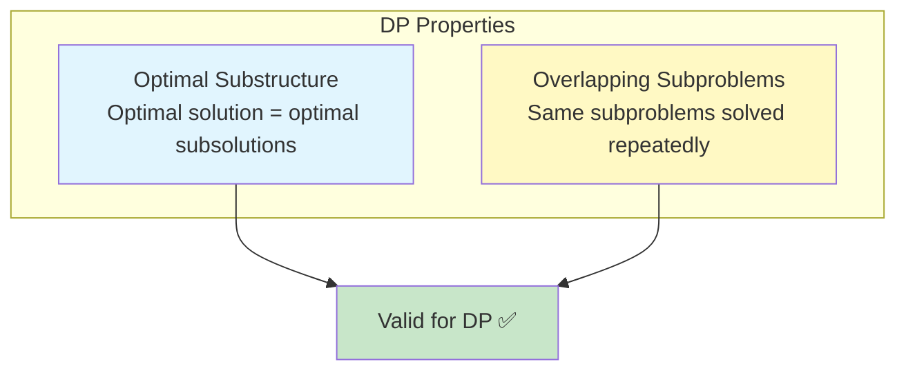
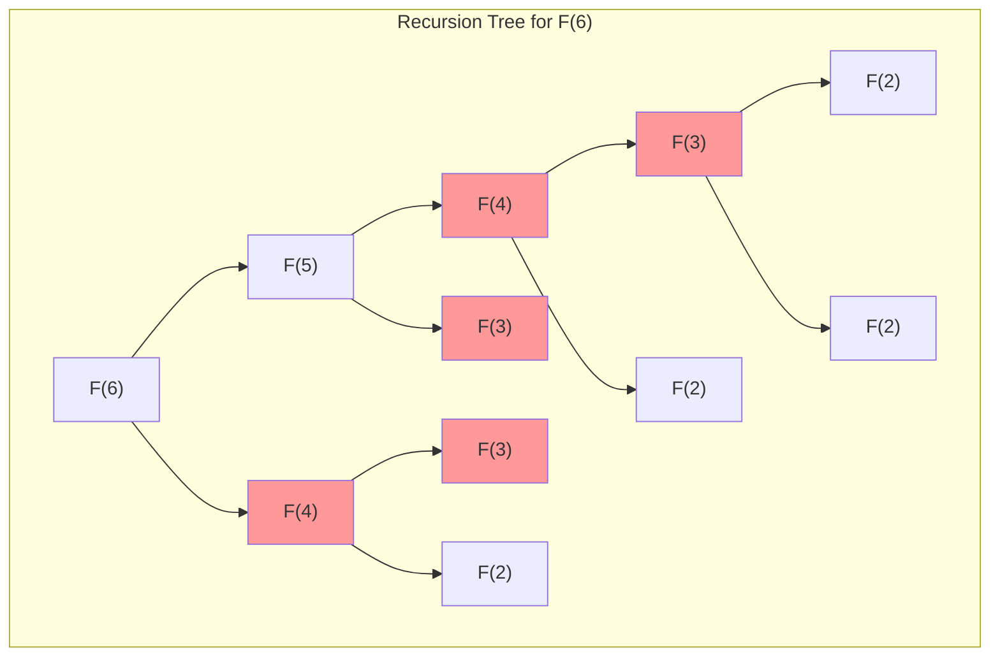
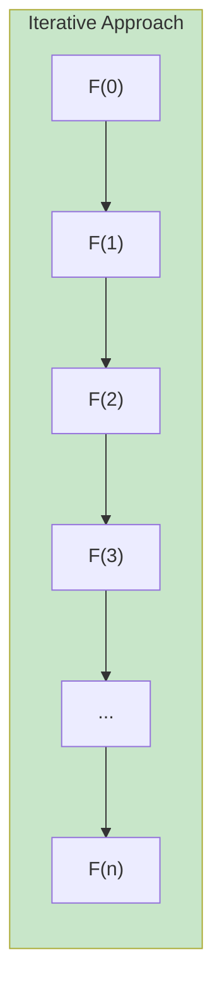
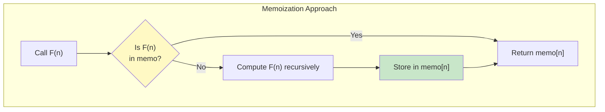
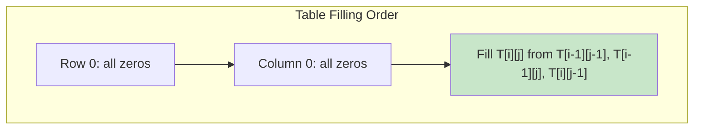
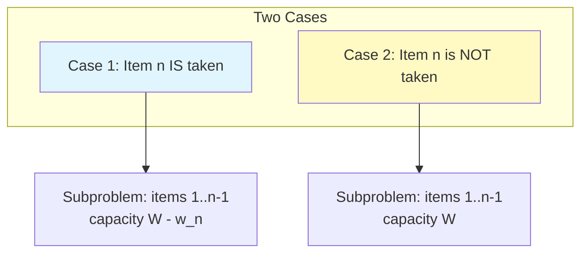
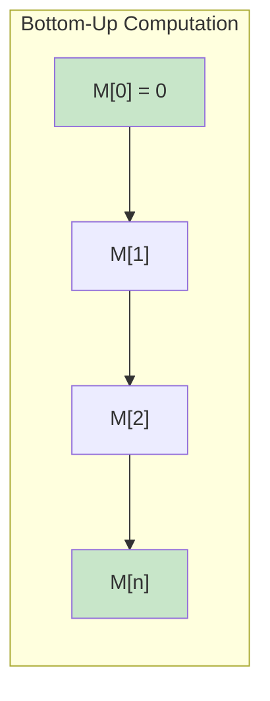
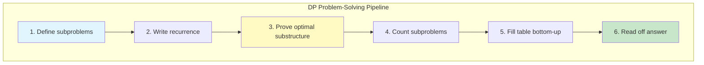

# 📚 L6: Dynamic Programming

> [!abstract] Lecture Goal
> Understand dynamic programming as a technique for problems with optimal substructure and overlapping subproblems, master the paradigm through Fibonacci, LCS, Knapsack, and Coin Change, and know when DP is the right tool.

> [!tip] The Big Picture
> Dynamic Programming (DP) is the **art of avoiding recomputation**. When a recursive solution solves the same subproblems repeatedly, DP stores results in a table — turning exponential time into polynomial time. The key insight: solve each subproblem once, save the answer, and look it up when needed.

---

## 1. What is Dynamic Programming?

### 🧠 Core Concept

Dynamic Programming (DP) is an algorithm design technique for solving problems that have **two key properties**:

| Property | Description |
| :--- | :--- |
| **Optimal Substructure** | An optimal solution to the overall problem contains optimal solutions to its subproblems |
| **Overlapping Subproblems** | The recursive solution solves the same subproblems repeatedly (unlike divide & conquer) |



The DP strategy is:

1. Find a **recursive formulation** of the solution
2. Observe there are only a **polynomial number of distinct subproblems**, but the naive recursion solves them exponentially many times
3. Compute the solutions **bottom-up** (iteratively), storing results in a table to avoid redundant computation

### ⚠️ Watch Out!

> [!danger] Pitfall 1: Confusing "recursive definition" with "recursive algorithm"
> You can use a recursive definition to design an **iterative** algorithm! The recursive formulation tells you *what* to compute; the iterative approach tells you *how* to compute it efficiently.

> [!danger] Pitfall 2: Assuming recursion depth equals time complexity
> The recursion tree for Fibonacci has exponential size, not just depth. The branching (two recursive calls) causes exponential blowup.

---

## 2. Fibonacci Numbers — The Gateway Example

### 🧠 Core Concept

The Fibonacci sequence is defined as:

$$F(0) = 0, \quad F(1) = 1, \quad F(n) = F(n-1) + F(n-2) \text{ for } n > 1$$

**Problem:** Compute $F(n) \mod m$.

### ❌ Recursive Algorithm (RFIB) — Slow!

```
RFIB(n, m):
  if n = 0: return 0
  else if n = 1: return 1
  else: return (RFIB(n-1) + RFIB(n-2)) mod m
```

**Why is it slow?** The recursion tree recalculates the same values over and over.



The number of instructions is:

$$T(n) \geq 2^{(n-2)/2} \quad \text{(exponential in } n\text{)}$$

### ✅ Iterative Algorithm (IFIB) — Fast!

```
IFIB(n, m):
  if n = 0: return 0
  else if n = 1: return 1
  else:
    a ← 0; b ← 1
    for i = 2 to n:
      temp ← b
      b ← (a + b) mod m
      a ← temp
    return b
```

Number of instructions $\approx 5n$ — **linear in $n$**! 🎉



### 📖 Example Explained

For the recursion tree of $F(6)$, notice that $F(4)$ is computed **twice**, $F(3)$ is computed **three times**, $F(2)$ is computed **five times**, and so on. The iterative version simply walks forward, keeping only the last two values — no repeated work.

---

## 3. Memoization — The Bridge Technique

### 🧠 Core Concept

**Memoization** is a technique where you keep the recursive structure but store (cache) results of already-computed subproblems in a table. When a subproblem is encountered again, you look it up instead of recomputing.

Think of it as "lazy DP from the top down." 🗂️



For Fibonacci, we store $F[0], F[1], \ldots, F[n]$. When the recursion reaches $F(4)$ for the second time, it just reads the stored value instead of branching again.

$$F = [0, 1, 1, 2, 3, 5, 8, \ldots]$$

This reduces the exponential recursion tree to a **linear** computation by pruning all already-computed subtrees.

### ⚠️ Watch Out!

> [!danger] Pitfall 1: Forgetting to check the memo table **before** making recursive calls
> Always check if a result exists before recursing!

> [!danger] Pitfall 2: Confusing memoization (top-down) with tabulation (bottom-up)
> Both avoid redundant work, but DP in this course usually refers to the **bottom-up tabulation** approach.

---

## 4. Longest Common Subsequence (LCS)

### 🧠 Core Concept

**Definition:** A subsequence is obtained by removing zero or more elements from a sequence (without changing order). $C$ is a subsequence of $A$ if there exist indices $1 \leq i_1 < i_2 < \cdots < i_k \leq n$ such that $C[j] = A[i_j]$ for all $j$.

**Problem:** Given sequences $A[1..n]$ and $B[1..m]$, find the **longest** sequence $C$ that is a subsequence of both.

#### Brute-Force Analysis

- There are $2^n$ subsequences of $A$
- Checking each one against $B$ takes $O(m)$ time
- Total: $O(m \cdot 2^n)$ — **exponential and impractical**

#### Recursive Formulation

Let $L(i, j)$ = length of LCS of $A[1..i]$ and $B[1..j]$.

**Base case:** $$L(i, 0) = 0 \text{ for all } i, \quad L(0, j) = 0 \text{ for all } j$$

**General case:**

$$L(i, j) = \begin{cases} L(i-1, j-1) + 1 & \text{if } a_i = b_j \\ \max(L(i-1, j),\ L(i, j-1)) & \text{if } a_i \neq b_j \end{cases}$$

#### Why is this correct? (Key Lemmas)

**Lemma 1 (when $a_n = b_m$):** $\text{LCS}(n, m) = \text{LCS}(n-1, m-1) \mathbin{::} a_n$

_Proof idea (cut-and-paste argument):_ Suppose the optimal solution $S$ does NOT end with $a_n$. Then $S$ is a subsequence of $A[1..n-1]$ and $B[1..m-1]$. But since $a_n = b_m$, we can append $a_n$ to $S$ to get a longer common subsequence — **contradicting** $S$'s optimality. ✂️

**Lemma 2 (when $a_n \neq b_m$):** Either $a_n$ or $b_m$ is not in $\text{LCS}(n,m)$, so: $$\text{LCS}(n,m) = \text{larger of } \text{LCS}(n-1, m) \text{ or } \text{LCS}(n, m-1)$$

#### DP Algorithm

Fill an $(n+1) \times (m+1)$ table $T$ where $T[i][j] = L(i,j)$:

```
for i = 0 to n: T[i][0] ← 0
for j = 0 to m: T[0][j] ← 0
for i = 1 to n:
  for j = 1 to m:
    if a[i] = b[j]:
      T[i][j] ← T[i-1][j-1] + 1
    else:
      T[i][j] ← max(T[i-1][j], T[i][j-1])
return T[n][m]
```

**Time complexity:** $O(nm)$ — each of the $(n+1)(m+1)$ table entries takes $O(1)$ time. 🏆

**Space complexity:** $O(nm)$ for the table (reducible to $O(\min(n,m))$ with a trick).



### 📖 Example Explained

For $A = [a, d, c, d, s, a]$ and $B = [d, d, a, c, d, a]$ with the filled table shown in the slides, the bottom-right entry $T[6][6] = 4$ tells us the LCS has length 4. By tracing back through the table (where diagonal moves indicate matches), you can recover the actual LCS.

### ⚠️ Watch Out!

> [!danger] Pitfall 1: Confusing "subsequence" with "substring"
> A substring must be contiguous; a subsequence need not be.

> [!danger] Pitfall 2: The naive recursive algorithm for $L(n,m)$ is also exponential
> $T(n,m) \geq \binom{n+m}{n} > 2^n$ (for $m \approx n$). Don't stop at the recursion — you must build the table!

> [!danger] Pitfall 3: The LCS is not necessarily unique
> The problem asks for **a** longest common subsequence, not **the** one.

---

### ❓ Mock Exam Questions

> [!question] Q1: LCS Table Size
> For sequences of length $n$ and $m$, what is the size of the DP table for LCS?
> <details><summary>Answer</summary>
>
> **Answer: $(n+1) \times (m+1)$**
>
> We need rows $0$ to $n$ and columns $0$ to $m$ to handle the base cases.
> </details>

> [!question] Q2: LCS Traceback
> In LCS traceback, what does a diagonal move in the table indicate?
> <details><summary>Answer</summary>
>
> **Answer: A character match.**
>
> When $T[i][j] = T[i-1][j-1] + 1$, it means $a[i] = b[j]$ and this character is part of the LCS.
> </details>

---

## 5. The Knapsack Problem

### 🧠 Core Concept

**Problem (formal):**

- **Input:** $n$ items, each with weight $w_i$ and value $v_i$, and a knapsack of capacity $W$
- **Output:** A subset $S \subseteq \{1, 2, \ldots, n\}$ that maximizes $\sum_{i \in S} v_i$ subject to $\sum_{i \in S} w_i \leq W$

**Brute force:** Check all $2^n$ subsets — exponential and impractical.

#### Optimal Substructure

Consider the last item $n$. Either it's in the optimal set or it isn't:



- **Case 1 (item $n$ is taken):** The remaining items must be an optimal solution for the first $n-1$ items with capacity $W - w_n$
- **Case 2 (item $n$ is not taken):** The remaining items must be an optimal solution for the first $n-1$ items with capacity $W$

_(If either case had a sub-optimal sub-solution, we could do better by the cut-and-paste argument — contradiction!)_

#### Recursive Formula

Let $m[i][j]$ = maximum value obtainable from items $\{1, \ldots, i\}$ with weight limit $j$:

$$m[i][j] = \begin{cases} 0 & \text{if } i = 0 \text{ or } j = 0 \\ \max(m[i-1][j-w_i] + v_i,\ m[i-1][j]) & \text{if } w_i \leq j \\ m[i-1][j] & \text{otherwise} \end{cases}$$

#### DP Algorithm (Bottom-Up)

```
KNAPSACK(v, w, W):
  for j = 0 to W: m[0][j] ← 0
  for i = 1 to n: m[i][0] ← 0
  for i = 1 to n:
    for j = 0 to W:
      if j >= w[i]:
        m[i][j] ← max(m[i-1][j - w[i]] + v[i], m[i-1][j])
      else:
        m[i][j] ← m[i-1][j]
  return m[n][W]
```

**Time complexity:** $O(nW)$ — each of the $(n+1)(W+1)$ entries takes $O(1)$ time.

### 📖 Example Explained

From the lecture, with $v[1..5] = \{4, 2, 10, 1, 2\}$, $w[1..5] = \{12, 1, 4, 1, 2\}$, and $W = 15$:

- Row 0: all zeros (no items)
- Row 1 (item with $w=12, v=4$): value $4$ only appears from $j \geq 12$
- Row 2 (item with $w=1, v=2$): can now combine — e.g., $m[2][13] = 6$ (take both)
- ...and so on until $m[5][15] = 15$ — the maximum achievable value

The answer of 15 comes from choosing items 2, 3, 4, 5 (weights $1+4+1+2 = 8 \leq 15$, values $2+10+1+2 = 15$).

### ⚠️ Watch Out!

> [!danger] Pitfall 1: This is a **0/1 Knapsack**
> Each item can be taken at most once. The formula changes for the "unbounded" variant where items can be repeated.

> [!danger] Pitfall 2: $O(nW)$ is **pseudo-polynomial**
> It depends on the _value_ of $W$, not just the _size_ of the input. This is not the same as polynomial time!

> [!danger] Pitfall 3: When $w_i > j$
> The value is simply inherited from $m[i-1][j]$ — the item is **not** taken.

---

### ❓ Mock Exam Questions

> [!question] Q3: Knapsack Pseudo-Polynomial
> Why is $O(nW)$ called pseudo-polynomial rather than polynomial?
> <details><summary>Answer</summary>
>
> **Answer: Because $W$ is the numeric value, not the encoding length.**
>
> The input size is $O(n \log W + \log W)$ bits. Since $W$ can be as large as $2^{(\text{bits for } W)}$, the runtime $O(nW) = O(n \cdot 2^{(\text{bits for } W)})$ is exponential in the actual input size.
> </details>

> [!question] Q4: Knapsack Recurrence
> In the Knapsack recurrence, what does $j - w_i$ represent?
> <details><summary>Answer</summary>
>
> **Answer: The remaining capacity after including item $i$.**
>
> If we decide to include item $i$ (which weighs $w_i$), then out of our budget $j$, only $j - w_i$ remains for items $1, \ldots, i-1$.
> </details>

---

## 6. The Coin Change Problem

### 🧠 Core Concept

**Problem:** Given $n$ cents and denominations $d_1, d_2, \ldots, d_k$, find the minimum number of coins to make change for $n$ cents.

#### Optimal Substructure

If the optimal solution for $n$ cents uses $t$ coins: $n = d_{i_1} + d_{i_2} + \cdots + d_{i_t}$, then the first $t-1$ coins must be an optimal solution for $n' = n - d_{i_t}$ cents (by cut-and-paste argument).

#### Recursive Formula

Let $M[j]$ = minimum number of coins to make $j$ cents:

$$M[j] = \begin{cases} 0 & \text{if } j = 0 \\ \infty & \text{if } j < 0 \\ 1 + \min_{i \in \{1,\ldots,k\}} M[j - d_i] & \text{if } j > 0 \end{cases}$$

#### DP Algorithm

```
NUM-COINS-DP(n, d):
  for j = 0 to n: M[j] ← ∞
  M[0] ← 0
  for j = 1 to n:
    for i = 1 to k:
      if j - d[i] >= 0 and M[j - d[i]] + 1 < M[j]:
        M[j] ← M[j - d[i]] + 1
  return M[n]
```

**Time complexity:** $O(nk)$



### 📖 Example Explained

With denominations $\{25, 10, 1\}$ and $n = 30$:

- $M[0] = 0$
- $M[10] = 1$ (one 10-cent coin)
- $M[20] = 2$ (two 10-cent coins)
- $M[30] = 3$ (three 10-cent coins — better than $25+1+1+1+1+1 = 6$ coins!)

The greedy approach would fail for some denomination sets (e.g., $\{4, 3, 1\}$ for $n = 6$: greedy gives $4+1+1=3$ coins, DP finds $3+3=2$ coins).

### ⚠️ Watch Out!

> [!danger] Pitfall 1: Greedy does NOT always work
> For arbitrary denominations, DP is necessary. Only for specific systems (like standard US coins) does greedy give the optimal answer.

> [!danger] Pitfall 2: Initializing $M[j] = \infty$
> Initialize $M[j] = \infty$ (not 0) to correctly detect when change is impossible, and so that `min` comparisons work correctly.

---

### ❓ Mock Exam Questions

> [!question] Q5: Coin Change Greedy Counterexample
> Give a denomination set where greedy fails to find the minimum number of coins.
> <details><summary>Answer</summary>
>
> **Answer: Denominations $\{4, 3, 1\}$ for making 6 cents.**
>
> - Greedy: pick 4, then 1, then 1 → 3 coins
> - Optimal: pick 3, then 3 → 2 coins
> </details>

> [!question] Q6: Coin Change DP Table
> With denominations $\{1, 3, 4\}$, compute $M[6]$ (minimum coins for 6 cents).
> <details><summary>Answer</summary>
>
> **Answer: 2 coins**
>
> - $M[0] = 0$
> - $M[1] = 1$
> - $M[2] = 2$
> - $M[3] = 1$
> - $M[4] = 1$
> - $M[5] = 2$
> - $M[6] = \min(M[5]+1, M[3]+1, M[2]+1) = \min(3, 2, 3) = 2$ (two 3-cent coins)
> </details>

---

## 7. DP Paradigm Summary

### 🧠 Core Concept

| Step | What to Do |
| :--- | :--- |
| 1. **Define subproblems** | Identify what parameters change in the recursion |
| 2. **Write recurrence** | Express the optimal solution in terms of smaller subproblems |
| 3. **Prove optimal substructure** | Use cut-and-paste argument to show the recurrence is correct |
| 4. **Count subproblems** | Verify there are only polynomially many |
| 5. **Fill table bottom-up** | Compute in an order where dependencies are already solved |
| 6. **Read off answer** | The answer lives in one specific table entry |

### 📊 Common DP Patterns

| Problem | Table Size | Time Complexity |
| :--- | :--- | :--- |
| Fibonacci | $O(n)$ | $O(n)$ |
| LCS | $O(nm)$ | $O(nm)$ |
| Knapsack | $O(nW)$ | $O(nW)$ |
| Coin Change | $O(n)$ | $O(nk)$ |



---

## 🔗 Connections

| 📚 Lecture | 🔗 Connection |
| :--- | :--- |
| [[content/CS3230/L7]] | DP vs Greedy — when greedy fails, DP is often the fallback. Greedy commits to one choice; DP explores all subproblems |
| [[content/CS3230/L8]] | Amortized analysis — both DP and amortized analyze sequences of operations, but DP focuses on correctness while amortized focuses on cost |
| [[content/CS3230/L9]] | Reductions — NP-completeness explains why DP (pseudo-polynomial) may be the best we can do for some problems |
| [[content/CS3230/L10]] | NP-completeness — showing a problem is NP-complete tells us no polynomial-time algorithm exists (unless P=NP), explaining why pseudo-polynomial DP is used |

> [!quote] The Key Insight
> The most important skill in DP is recognizing the **right subproblem definition**. Once you define $m[i][j]$ (or whatever your table indices are) precisely and correctly, the recurrence follows naturally from the two-case analysis (include or exclude, match or no-match, etc.). Practice this on new problems and you'll be set! 💪

---

## 8. Mock Exam Questions

### 💡 Concept Questions

> [!question] Q1: DP Properties
> Which of the following is NOT a required property for Dynamic Programming to be applicable?
> - (a) Optimal Substructure
> - (b) Overlapping Subproblems
> - (c) Greedy Choice Property
> - (d) Polynomial number of distinct subproblems
> <details><summary>Answer</summary>
>
> **Answer: (c) Greedy Choice Property**
>
> This is the hallmark of Greedy algorithms, not DP. DP requires optimal substructure and overlapping subproblems.
> </details>

> [!question] Q2: LCS Time Complexity
> Consider the naive recursive algorithm for LCS on sequences of lengths $n$ and $m$ (with $m \approx n$). Which best describes its time complexity?
> - (a) $O(nm)$
> - (b) $O(n + m)$
> - (c) $\Omega(2^n)$
> - (d) $O(n \log m)$
> <details><summary>Answer</summary>
>
> **Answer: (c) $\Omega(2^n)$**
>
> The recurrence $T(n,m) = T(n-1,m) + T(n,m-1)$ yields $T(n,m) \geq \binom{n+m}{n} > 2^n$ for $m \approx n$.
> </details>

> [!question] Q3: Knapsack Recurrence Meaning
> In the Knapsack DP, the recurrence uses $m[i-1][j - w_i] + v_i$. What does the "$j - w_i$" represent?
> - (a) The weight of item $i$
> - (b) The remaining capacity after including item $i$
> - (c) The value of all remaining items
> - (d) The index of the next item to consider
> <details><summary>Answer</summary>
>
> **Answer: (b) The remaining capacity after including item $i$**
>
> If we decide to include item $i$ (which weighs $w_i$), then out of our budget $j$, only $j - w_i$ remains for items $1, \ldots, i-1$.
> </details>

---

### ✏️ Open-Ended Practice Problems

> [!question] P1: LCS Table Construction
> Let $A = [b, a, c, b, a, d]$ and $B = [a, b, c, b, d, a, b]$.
>
> (a) Set up and completely fill in the DP table $T[i][j] = L(i,j)$.
>
> (b) What is the length of the LCS?
>
> (c) Trace back through the table to identify one valid LCS.
> <details><summary>Answer</summary>
>
> **(a) The DP table:**
>
> ```
>      ""   a  b  c  b  d  a  b
> ""  [ 0,  0, 0, 0, 0, 0, 0, 0 ]
> b   [ 0,  0, 1, 1, 1, 1, 1, 1 ]
> a   [ 0,  1, 1, 1, 1, 1, 2, 2 ]
> c   [ 0,  1, 1, 2, 2, 2, 2, 2 ]
> b   [ 0,  1, 2, 2, 3, 3, 3, 3 ]
> a   [ 0,  1, 2, 2, 3, 3, 4, 4 ]
> d   [ 0,  1, 2, 2, 3, 4, 4, 4 ]
> ```
>
> **(b) Length of LCS = $T[6][7] = 4$** ✅
>
> **(c) Traceback:** Starting at $T[6][7]$, move diagonally when $A[i] = B[j]$ (recording the match), otherwise move in the direction of the larger neighbor (up or left).
>
> One valid traceback:
> - $T[6][5]$: $A[6]=d, B[5]=d$ → match, go to $T[5][4]$, record **d**
> - $T[5][4]$: $A[5]=a, B[4]=b$ → no match, $T[4][4]=3 > T[5][3]=2$, go up to $T[4][4]$
> - $T[4][4]$: $A[4]=b, B[4]=b$ → match, go to $T[3][3]$, record **b**
> - $T[3][3]$: $A[3]=c, B[3]=c$ → match, go to $T[2][2]$, record **c**
> - $T[2][2]$: $A[2]=a, B[2]=b$ → no match, $T[1][2]=1 = T[2][1]=1$, go up to $T[1][2]$
> - $T[1][2]$: $A[1]=b, B[2]=b$ → match, go to $T[0][1]$, record **b**
> - $T[0][1] = 0$ → stop.
>
> **LCS = [b, c, b, d]** (length 4) ✅
>
> _(Other valid LCS include [a, c, b, d] or [a, b, a, b] — there may be more than one!)_
> </details>

> [!question] P2: Knapsack Variant
> You have a knapsack with capacity $W = 6$ and the following items:
>
> | Item | Weight ($w_i$) | Value ($v_i$) |
> | :--- | :--- | :--- |
> | 1 | 1 | 1 |
> | 2 | 2 | 6 |
> | 3 | 3 | 10 |
> | 4 | 5 | 16 |
>
> (a) Write the recurrence relation for $m[i][j]$.
>
> (b) Fill in the complete DP table $m[i][j]$ for $0 \leq i \leq 4$ and $0 \leq j \leq 6$.
>
> (c) What is the maximum value achievable, and which items are selected?
> <details><summary>Answer</summary>
>
> **(a) Recurrence relation:**
>
> $$m[i][j] = \begin{cases} 0 & \text{if } i = 0 \text{ or } j = 0 \\ \max(m[i-1][j-w_i] + v_i,\ m[i-1][j]) & \text{if } w_i \leq j \\ m[i-1][j] & \text{otherwise} \end{cases}$$
>
> **(b) The DP table:**
>
> ```
>       j=0  j=1  j=2  j=3  j=4  j=5  j=6
> i=0  [  0,   0,   0,   0,   0,   0,   0  ]
> i=1  [  0,   1,   1,   1,   1,   1,   1  ]  ← item1: w=1, v=1
> i=2  [  0,   1,   6,   7,   7,   7,   7  ]  ← item2: w=2, v=6
> i=3  [  0,   1,   6,  10,  11,  16,  17  ]  ← item3: w=3, v=10
> i=4  [  0,   1,   6,  10,  11,  16,  17  ]  ← item4: w=5, v=16
> ```
>
> **Sample calculations for row $i=2$:**
> - $j=1$: $w_2=2 > 1$, so $m[2][1] = m[1][1] = 1$
> - $j=2$: $w_2=2 \leq 2$, $\max(m[1][0] + 6, m[1][2]) = \max(6, 1) = 6$
> - $j=3$: $\max(m[1][1] + 6, m[1][3]) = \max(7, 1) = 7$
>
> **Sample calculations for row $i=3$:**
> - $j=3$: $\max(m[2][0]+10, m[2][3]) = \max(10, 7) = 10$
> - $j=5$: $\max(m[2][2]+10, m[2][5]) = \max(16, 7) = 16$
> - $j=6$: $\max(m[2][3]+10, m[2][6]) = \max(17, 7) = 17$
>
> **(c) Maximum value = $m[4][6] = \mathbf{17}$** ✅
>
> **Which items are selected?** Traceback from $m[4][6]$:
>
> - $m[4][6] = 17 = m[3][6]$ → item 4 is **NOT** taken (values are equal, checking the alternative: $m[3][1]+16 = 1+16 = 17$ also works, but let's trace without item 4)
> - At $m[3][6] = 17$: $m[2][3] + 10 = 17$ → item 3 **IS** taken. Remaining capacity: $6 - 3 = 3$
> - At $m[2][3] = 7$: $m[1][1] + 6 = 7$ → item 2 **IS** taken. Remaining capacity: $3 - 2 = 1$
> - At $m[1][1] = 1$: $m[0][0] + 1 = 1$ → item 1 **IS** taken. Remaining capacity: $1 - 1 = 0$
>
> **Selected items: {1, 2, 3}** with total weight $1+2+3 = 6 \leq 6$ ✅ and total value $1+6+10 = 17$ ✅
> </details>