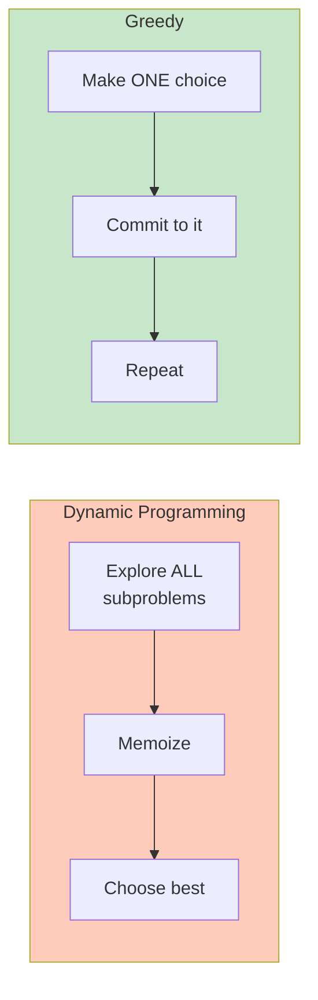
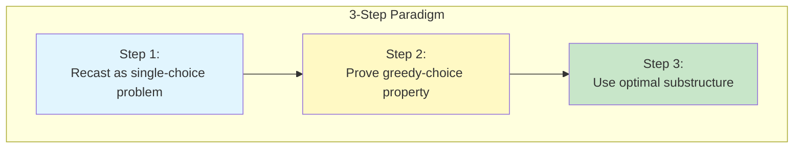
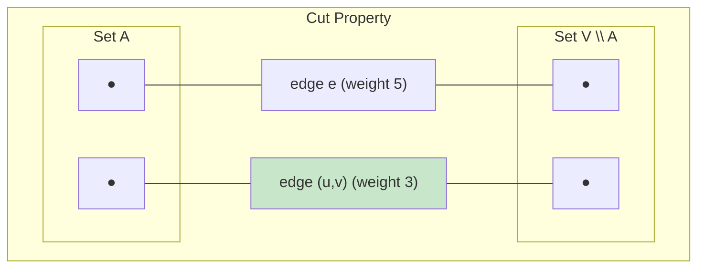
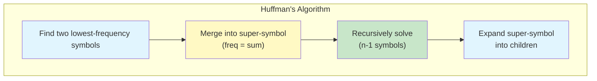

# 📚 L7: Greedy Algorithms

> [!abstract] Lecture Goal
> Understand the greedy paradigm, prove correctness via greedy-choice property and optimal substructure, and apply greedy algorithms to problems like Fractional Knapsack, MST, and Huffman Coding.

> [!tip] The Big Picture
> Greedy algorithms are **simple but powerful** — make the locally optimal choice at each step and never look back. When they work, they're faster than DP. But the key is **proving they work** via the greedy-choice property.

---

## 1. What is a Greedy Algorithm?

### 🧠 Core Concept

A **greedy algorithm** builds up a solution piece by piece, **always choosing the locally optimal option at each step**, hoping that local optimality leads to global optimality.



> [!important] Key Difference from DP
> Unlike divide-and-conquer (which splits into multiple subproblems) or dynamic programming (which solves _all_ overlapping subproblems), a greedy algorithm only ever has **one subproblem left** after each choice.

The two key properties that make greedy algorithms _correct_ are:

1. **Greedy-Choice Property**: A globally optimal solution can always be obtained by making a locally optimal (greedy) choice. You don't need to reconsider past choices.
2. **Optimal Substructure**: An optimal solution to the full problem contains optimal solutions to its subproblems.

### ⚠️ Watch Out!

> [!danger] Greedy doesn't always work!
> Just because a locally optimal choice _feels_ right doesn't mean it produces a globally optimal solution. You **must prove** the greedy-choice property formally (usually via an exchange/cut-and-paste argument).

> [!danger] Don't confuse greedy with DP
> DP explores _all_ possible subproblem combinations, while greedy commits to _one_ at each step. DP is more thorough but slower.

---

### 📖 Key Terminology

| Term | Definition |
| :--- | :--- |
| **Greedy-Choice Property** | Making locally optimal choice leads to globally optimal solution |
| **Optimal Substructure** | Optimal solution contains optimal solutions to subproblems |
| **Exchange Argument** | Proof technique: swap greedy choice into any optimal solution |

---

### ❓ Mock Exam Questions

> [!question] Q1: Greedy-Choice vs Optimal Substructure
> What is the difference between the "greedy-choice property" and "optimal substructure"? Can a problem have one without the other?
> <details><summary>Answer</summary>
>
> **Answer:**
> - **Greedy-choice property**: A locally optimal choice can always be extended to a globally optimal solution.
> - **Optimal substructure**: An optimal solution contains optimal solutions to subproblems.
>
> Yes, a problem can have optimal substructure WITHOUT the greedy-choice property (e.g., 0/1 Knapsack — needs DP). A problem CANNOT have greedy-choice without optimal substructure (greedy requires both).
> </details>

> [!question] Q2: Greedy vs DP Complexity
> Why does a greedy algorithm typically have better time complexity than dynamic programming for the same problem, when the greedy approach is valid?
> <details><summary>Answer</summary>
>
> **Answer:**
> Greedy commits to one choice per step and never revisits — $O(n \log n)$ or similar. DP must explore all subproblems and combine them, often $O(nW)$ or $O(n^2)$ or worse. Greedy avoids the "explore all" overhead.
> </details>

> [!question] Q3: Testing vs Proving
> True or False: If a greedy algorithm gives the correct answer on several test cases, it is guaranteed to be correct in general.
> <details><summary>Answer</summary>
>
> **Answer: FALSE.**
>
> Counterexample: Coin change with denominations {1, 3, 4}. For making 6 cents, greedy picks 4+1+1 = 3 coins, but optimal is 3+3 = 2 coins. Testing alone cannot prove correctness — you need a formal proof of the greedy-choice property.
> </details>

---

## 2. The (Semi-)Fractional Knapsack Problem

### 🧠 Core Concept

**Problem Setup:**

- You have $n$ items, each with weight $w_i$ and value $v_i$.
- Your knapsack can carry at most $W$ kg.
- You can take **integer amounts** $x_i$ (where $0 \le x_i \le w_i$) of each item.
- **Objective**: Maximize total value $\sum_i v_i \cdot \frac{x_i}{w_i}$.

The key insight is thinking in terms of **value-per-kg**:

$$\text{value per kg of item } i = \frac{v_i}{w_i}$$

### 📐 Greedy-Choice Property

> [!important] Formal Claim
> Let $j^*$ be the item with the **maximum value-per-kg** $\frac{v_{j^*}}{w_{j^*}}$. Then there exists an optimal solution containing $\min(w_{j^*}, W)$ kg of item $j^*$.

**Proof (exchange argument):** If an optimal solution doesn't have $\min(w_{j^*}, W)$ kg of $j^*$, we can swap 1 kg of any other item $j$ (with $\frac{v_j}{w_j} \le \frac{v_{j^*}}{w_{j^*}}$) for 1 kg of $j^*$. The total value **does not decrease**, so the new solution is also optimal but contains more of $j^*$. Repeat until $j^*$ is fully included. ✅

**Optimal Substructure:** After filling $\min(w_{j^*}, W)$ kg of $j^*$, the remaining capacity $W - w_{j^*}$ should be filled optimally using the remaining items — a smaller version of the same problem. ✅

### 🔧 The Algorithm

```
ITER-FRAC-KNAPSACK(v, w, W):
  Sort items by v[i]/w[i] in decreasing order
  For i = n down to 1:
    if W = 0: break
    j ← item with i-th highest value/kg
    k ← min(w[j], W)
    Take k kg of item j
    W ← W - k
```

**Time Complexity:** $O(n \log n)$ — dominated by the sort step.

### 🔍 Worked Example

The lecture shows a knapsack with capacity $W = 4$ kg, and four items:

| Item | Weight | Value | Value/kg |
| :--- | :--- | :--- | :--- |
| 1 | 1 kg | $100 | $100/kg |
| 2 | 5 kg | $100 | $20/kg |
| 3 | 3 kg | $30 | $10/kg |
| 4 | 4 kg | $20 | $5/kg |

Sorted by value/kg: Item 1 → Item 2 → Item 3 → Item 4.

- Take **all 1 kg** of Item 1. Remaining capacity: $4 - 1 = 3$ kg.
- Take **3 kg** of Item 2 (it has 5 kg but only 3 remain). Remaining: 0 kg.
- Stop.

**Total value** = $100 \times \frac{1}{1} + 100 \times \frac{3}{5} = 100 + 60 = $160$ ✅

The DP approach (recurrence $m[i,j]$) would give the same answer but at $O(nW^2)$ time — much worse!

### ⚠️ Watch Out!

> [!danger] Don't confuse semi-fractional with 0/1 Knapsack!
> In 0/1 Knapsack, you either take the whole item or none — **greedy does NOT work there**. You must use DP.

> [!danger] Capacity limits
> Make sure to take $\min(w_j, W)$ kg — don't take more of an item than it weighs, and don't exceed remaining capacity.

> [!danger] Value formula
> The value formula is $v_i \cdot \frac{x_i}{w_i}$, not just $v_i \cdot x_i$. Think of it as: each kg of item $i$ contributes $\frac{v_i}{w_i}$ value.

---

### ❓ Mock Exam Questions

> [!question] Q4: Why doesn't greedy work for 0/1 Knapsack?
> Why does the greedy algorithm for Fractional Knapsack fail on the 0/1 Knapsack problem? Give a small counterexample.
> <details><summary>Answer</summary>
>
> **Answer:**
> In 0/1 Knapsack, you can't take partial items. The greedy choice (highest value/kg) might "block" a better combination.
>
> **Counterexample:** $W = 10$, items: A (weight 6, value 60), B (weight 5, value 50), C (weight 5, value 50).
> - Value/kg: A = $10/kg, B = C = $10/kg (tie)
> - Greedy picks A first (weight 6, value 60), then can't fit B or C. Total: 60.
> - Optimal: pick B + C (weight 10, value 100).
> </details>

> [!question] Q5: Exchange Argument Details
> In the greedy proof for Fractional Knapsack, we use an "exchange argument." What exactly are we exchanging, and why does the exchange not decrease the objective value?
> <details><summary>Answer</summary>
>
> **Answer:**
> We exchange 1 kg of a non-greedy item $j$ (with lower value/kg) for 1 kg of the greedy item $j^*$ (with higher value/kg).
>
> Since $\frac{v_{j^*}}{w_{j^*}} \ge \frac{v_j}{w_j}$, the value gained from $j^*$ is at least the value lost from $j$. Thus the total value does not decrease.
> </details>

---

## 3. The Greedy Paradigm: A General Framework

### 🧠 Core Concept

The lecture identifies a **3-step paradigm** for designing and proving greedy algorithms:



**Step 1 — Recast as a single-choice problem:** Express the problem so that at each step, you make exactly one decision and are left with one subproblem.

**Step 2 — Prove greedy-choice property:** Show that a locally optimal choice is "safe" — i.e., there always exists an optimal solution consistent with the greedy choice.

> [!tip] Proof Technique: Exchange Argument
> Assume no optimal solution makes the greedy choice, then modify it to make the greedy choice without worsening the solution. Contradiction! ✅

**Step 3 — Use optimal substructure:** After making the greedy choice, show the remaining subproblem can be combined with the greedy choice to get a globally optimal solution.

### ⚠️ Watch Out!

> [!danger] Don't skip Step 2!
> Many students skip Step 2 and assume greedy is correct. **Always prove the greedy-choice property!** This is what separates a correct greedy solution from an incorrect one.

> [!danger] At least as good, not necessarily better
> The exchange argument must show the new solution is **at least as good** as the original — not necessarily strictly better. Even if value stays the same, if it now includes the greedy choice, you've proven the property.

---

## 4. Dynamic Programming vs Greedy Algorithms

### 🧠 Core Concept

| Feature | Dynamic Programming | Greedy |
| :--- | :--- | :--- |
| **Optimal Substructure** | ✅ Required | ✅ Required |
| **Overlapping Subproblems** | ✅ Exploits via memoization | ❌ Not needed |
| **Subproblems per step** | Many (explores all) | **One** (commits immediately) |
| **Proof of correctness** | Substructure alone | Must also prove greedy-choice property |
| **Typical complexity** | Higher (e.g., $O(nW^2)$) | Lower (e.g., $O(n \log n)$) |

The **key difference**: DP avoids recomputation by solving all subproblems systematically. Greedy never looks back — it makes one irreversible choice per step. When greedy is valid, it's significantly faster.

### ⚠️ Watch Out!

> [!danger] Both require Optimal Substructure
> A common misconception is that greedy doesn't need it — it does! The difference is that DP also needs overlapping subproblems (to justify memoization).

> [!danger] When greedy fails, use DP
> If a problem has optimal substructure but fails the greedy-choice property, use DP, not greedy.

---

### ❓ Mock Exam Questions

> [!question] Q6: Choosing the Right Technique
> A problem has both optimal substructure and the greedy-choice property. Should you use DP or greedy? Why?
> <details><summary>Answer</summary>
>
> **Answer: Use greedy.**
>
> When the greedy-choice property holds, greedy is both correct AND faster. There's no need for DP's overhead of exploring all subproblems.
> </details>

> [!question] Q7: What does DP need that greedy doesn't?
> Both DP and greedy require optimal substructure. What additional property does DP require that greedy does not?
> <details><summary>Answer</summary>
>
> **Answer: Overlapping subproblems.**
>
> DP memoizes results to avoid recomputation. If subproblems don't overlap, memoization provides no benefit. Greedy doesn't need this — it commits to one path and never revisits.
> </details>

---

## 5. Minimum Spanning Trees (MSTs)

### 🧠 Core Concept

**Problem:** Given a connected, undirected graph $G = (V, E)$ with positive edge weights $w: E \to \mathbb{R}^+$, find a **spanning tree** $T$ (a tree connecting all $|V|$ vertices) of **minimum total weight**.

### 📐 Optimal Substructure of MST

> [!important] Key Property
> If we remove any edge $(u,v) \in T$, the MST $T$ is split into two subtrees $T_1$ (on vertex set $V_1$) and $T_2$ (on $V_2$). Then $T_1$ is an MST of the subgraph induced by $V_1$, and similarly for $T_2$.

**Proof (Cut-and-Paste):** Suppose $T_1$ were not optimal for $V_1$ — there exists a spanning tree $T_1'$ of $V_1$ with $w(T_1') < w(T_1)$. Then $T' = \{(u,v)\} \cup T_1' \cup T_2$ is a spanning tree of $G$ with total weight $w(T') < w(T)$, contradicting the optimality of $T$. ✅

### 📐 Greedy-Choice Property (Key Theorem)

> [!important] Cut Property
> Let $A \subseteq V$ be any subset of vertices, and let $(u,v)$ be the **least-weight edge** crossing the cut $(A, V \setminus A)$. Then $(u,v)$ is in **every** MST of $G$.



**Proof:** Suppose $(u,v) \notin T$ (the MST). Since $T$ is a spanning tree, there's a unique path from $u$ to $v$ in $T$. This path must cross the cut $(A, V \setminus A)$ via some other edge $e$. Since $w(u,v) \le w(e)$, we can replace $e$ with $(u,v)$: $T' = (T \setminus \{e\}) \cup \{(u,v)\}$. This gives $w(T') \le w(T)$, so $T'$ is also an MST containing $(u,v)$. ✅

### 🔧 Prim's Algorithm

```
PRIM(G, w):
  Start with any vertex v, set A = {v}, T = ∅
  While A ≠ V:
    Let e = least-weight edge connecting A and V \ A
    Add e to T
    Update A = vertices connected by T
  Output T
```

At each step, Prim's greedily picks the cheapest edge crossing the current frontier — directly applying the greedy-choice theorem.

**Time Complexity:** $O(E \log V)$ with a min-heap (priority queue).

### 🔧 Kruskal's Algorithm

- Sort all edges by weight.
- Greedily add the cheapest edge that doesn't form a cycle.
- Use Union-Find for efficient cycle detection.

**Greedy-choice property:** Any edge that is not the maximum-weight edge in any cycle must be in the MST.

**Time Complexity:** $O(E \log E)$ — dominated by sorting.

### ⚠️ Watch Out!

> [!danger] The theorem applies to ANY partition
> The greedy-choice theorem says the minimum crossing edge is **in the MST** — this is for **any** partition $(A, V \setminus A)$. Students sometimes think it only applies to specific partitions.

> [!danger] Distinct edge weights
> Assumption: **All edge weights are distinct** (as stated in the lecture). With ties, the theorem still holds but the proof needs slight adjustment.

> [!danger] Don't confuse with shortest path
> Don't confuse **spanning tree** (connects all vertices) with a minimum-weight path between two vertices.

---

### ❓ Mock Exam Questions

> [!question] Q8: Cut Property
> State the greedy-choice property for MSTs precisely. Why must the minimum-weight crossing edge always be in the MST?
> <details><summary>Answer</summary>
>
> **Answer:**
> For any partition $(A, V \setminus A)$ of vertices, the minimum-weight edge crossing the cut is in every MST.
>
> **Reason:** If that edge $(u,v)$ weren't in the MST, the MST would have some other path connecting $u$ to $v$. That path crosses the cut via some edge $e$ with $w(e) \ge w(u,v)$. Replacing $e$ with $(u,v)$ gives a tree of no greater weight that includes $(u,v)$.
> </details>

> [!question] Q9: Prim's vs Kruskal's
> Prim's and Kruskal's both produce MSTs, but their greedy choices are different. Describe the greedy choice of each.
> <details><summary>Answer</summary>
>
> **Answer:**
> - **Prim's:** Pick the cheapest edge that connects the current tree to a new vertex (grows one tree).
> - **Kruskal's:** Pick the cheapest edge overall that doesn't create a cycle (grows a forest until it becomes a tree).
> </details>

---

## 6. Huffman Coding

### 🧠 Core Concept

**Motivation:** When encoding text, not all characters appear equally often (e.g., 'e' is far more frequent in English than 'z'). Fixed-length encoding wastes space on rare characters. **Variable-length encoding** can assign shorter codes to frequent characters.

**Fixed-Length Encoding:** For an alphabet of size $n$, each symbol gets $\lceil \log_2 n \rceil$ bits. Simple to decode, but not space-optimal.

**Average Bit Length (ABL):** For a coding $\gamma$ with frequencies $f(x)$:

$$\text{ABL}(\gamma) = \sum_{x \in A} f(x) \cdot |\gamma(x)|$$

We want to **minimize ABL**.

### 📐 The Prefix-Code Requirement

> [!important] Unique Decodability
> A coding is a **prefix code** if no codeword is a prefix of another. This is essential for **unique decodability** — you can always tell where one symbol ends and the next begins.

> [!danger] Example of ambiguity
> If $\gamma(b) = 10$ and $\gamma(d) = 101$, then `101` could be `b` followed by `1...` or just `d`. ❌

### 📐 Prefix Codes ↔ Full Binary Trees

Every prefix code corresponds to a **full binary tree** (every internal node has exactly 2 children) where:

- Leaves = alphabet symbols
- Left edge = 0, right edge = 1
- Code of a symbol = path label from root to its leaf

$$\text{ABL}(\gamma) = \sum_{x \in A} f(x) \cdot \text{depth}_T(x)$$

### 📐 Greedy-Choice Property of Huffman

> [!important] Key Lemma
> In an optimal prefix code, the two symbols $a_1, a_2$ with the **lowest frequencies** can always be made siblings at the deepest level of the tree.

**Proof sketch:**

1. In any full binary tree, the deepest level has sibling pairs.
2. We can always swap $a_1$ to the deepest level (exchange argument: swapping with a deeper node can only decrease ABL since $f(a_1)$ is smallest).
3. Similarly swap $a_2$ to be the sibling of $a_1$. ✅

### 🔧 Huffman's Algorithm



```
HUFFMAN-CODE(a_1, ..., a_n):
  If n = 1: return a single node
  Find a_1, a_2 with lowest frequency
  Create super-symbol a_{1,2} with f(a_{1,2}) = f(a_1) + f(a_2)
  Recursively run HUFFMAN-CODE(a_3, ..., a_n, a_{1,2})
  Expand a_{1,2} into children a_1 and a_2
```

Use a **min-heap** (priority queue) to efficiently find the two minimum-frequency symbols → $O(n \log n)$ total time.

### 🔍 Worked Example

The lecture uses 5 symbols with frequencies: $a=0.45, b=0.18, c=0.15, d=0.12, e=0.10$.

| Step | Merge | Result |
| :--- | :--- | :--- |
| 1 | $d(0.12) + e(0.10)$ | $de(0.22)$ |
| 2 | $b(0.18) + c(0.15)$ | $bc(0.33)$ |
| 3 | $de(0.22) + bc(0.33)$ | $debc(0.55)$ |
| 4 | $a(0.45) + debc(0.55)$ | root |

**Resulting codes:** $a=0$, $b=100$, $c=101$, $d=110$, $e=111$.

$$\text{ABL} = 0.45 \times 1 + 0.18 \times 3 + 0.15 \times 3 + 0.12 \times 3 + 0.10 \times 3 = 2.24 \text{ bits/symbol}$$

Compare to fixed-length: $\lceil \log_2 5 \rceil = 3$ bits/symbol. **Huffman saves ~25% space!** 🎉

### ⚠️ Watch Out!

> [!danger] Prefix code ≠ fixed-length code
> The prefix-free property is about no codeword being a _prefix_ of another — this allows variable lengths while maintaining unique decodability.

> [!danger] Always pick TWO lowest
> When merging, always pick the **two** lowest-frequency nodes (not just the lowest). Ties can be broken arbitrarily — any tie-breaking gives an optimal code.

> [!danger] "There exists" vs "every"
> It's NOT true that in _every_ optimal prefix code, $a_1$ and $a_2$ are siblings. The lemma says _there exists_ an optimal code where they are — which is enough for the greedy algorithm to be correct.

---

### ❓ Mock Exam Questions

> [!question] Q10: Why must the tree be full?
> Why is it important that a prefix code corresponds to a **full** binary tree? What goes wrong if an internal node has only one child?
> <details><summary>Answer</summary>
>
> **Answer:**
> If an internal node has only one child, you can bypass it and shorten all codes in that subtree by 1 bit. This would decrease ABL, contradicting optimality.
>
> In other words: if you have a node with one child, you're wasting a bit on every symbol in that subtree — not optimal!
> </details>

> [!question] Q11: Depth and ABL
> What is the relationship between the ABL of a prefix code and the depth of leaves in its corresponding binary tree?
> <details><summary>Answer</summary>
>
> **Answer:**
> $\text{ABL} = \sum_{x \in A} f(x) \cdot \text{depth}_T(x)$
>
> Each symbol contributes its frequency times its depth (code length). To minimize ABL, frequent symbols should be shallow (short codes), rare symbols can be deep (long codes).
> </details>

---

## 🗝️ Answer Key

### Practice Problem: Coin Change

**Standard denominations {1, 5, 10, 25}:** The greedy strategy (always pick the largest coin ≤ remaining amount) works. This can be proven via a case analysis or exchange argument.

**Denominations {1, 3, 4} making change for 6 cents:**

- Greedy: picks 4, then 1, then 1 → **3 coins**
- Optimal: picks 3, then 3 → **2 coins** ❌

Greedy **fails** for arbitrary denominations. This shows why a proof of the greedy-choice property is essential.

---

### Practice Problem: Fractional Knapsack

Compute value/kg for each item:

| Item | Weight | Value | Value/kg |
| :--- | :--- | :--- | :--- |
| A | 6 kg | $30 | $5.00/kg |
| B | 4 kg | $20 | $5.00/kg |
| C | 3 kg | $18 | $6.00/kg |
| D | 2 kg | $12 | $6.00/kg |

**Sort by value/kg (descending):** C=D ($6/kg), then A=B ($5/kg). Break ties arbitrarily, say: C, D, A, B.

- Take all 3 kg of C: value = $18, remaining $W = 10 - 3 = 7$ kg
- Take all 2 kg of D: value += $12 = $30$, remaining $W = 7 - 2 = 5$ kg
- Take all 4 kg of B: value += $20 = $50$, remaining $W = 5 - 4 = 1$ kg
- Take 1 kg of A: value += $30 \times \frac{1}{6} = $5$, remaining $W = 0$ kg

**Total value = $55.** ✅

---

### Practice Problem: Prim's Algorithm

**Graph:** AB=4, AC=2, AD=6, BC=5, BD=7, BE=3, CD=1, CE=8, DE=9. Start: $A$.

| Step | $A$ (visited) | Min crossing edge | Edge added |
| :--- | :--- | :--- | :--- |
| Init | {A} | AB=4, AC=2, AD=6 → min: AC=2 | **AC (weight 2)** |
| 2 | {A,C} | AB=4, AD=6, BC=5, CD=1, CE=8 → min: CD=1 | **CD (weight 1)** |
| 3 | {A,C,D} | AB=4, AD=6, BC=5, BD=7, CE=8, DE=9 → min: AB=4 | **AB (weight 4)** |
| 4 | {A,B,C,D} | AD=6, BC=5, BD=7, BE=3, CE=8, DE=9 → min: BE=3 | **BE (weight 3)** |
| 5 | {A,B,C,D,E} | All vertices visited! | Done ✅ |

**MST edges:** AC=2, CD=1, AB=4, BE=3. **Total weight = 10.**

---

### Practice Problem: Uniqueness of MST (Distinct Weights)

**Proof by contradiction:** Suppose $T_1$ and $T_2$ are both MSTs with $w(T_1) = w(T_2)$, but $T_1 \ne T_2$.

Let $e^*$ be the minimum-weight edge in $T_1 \triangle T_2$ (symmetric difference — edges in one but not both). Without loss of generality, say $e^* \in T_1 \setminus T_2$.

Adding $e^*$ to $T_2$ creates a cycle $C$. Since $e^*$ is not in $T_2$ but $T_1$ is a spanning tree, there must be some edge $e' \in C \cap T_2 \setminus T_1$.

By choice of $e^*$: $e^*$ was the minimum-weight edge in $T_1 \triangle T_2$. Since $e' \in T_1 \triangle T_2$, we have $w(e^*) \le w(e')$.

But since all weights are distinct, $w(e^*) < w(e')$.

Now replace $e'$ in $T_2$ with $e^*$: $T_2' = T_2 - \{e'\} + \{e^*\}$. This is a spanning tree with $w(T_2') = w(T_2) - w(e') + w(e^*) < w(T_2)$.

This contradicts $T_2$ being an MST! ✅ Hence the MST is unique when all edge weights are distinct.

---

### Practice Problem: Huffman Coding

**Given:** X=0.35, Y=0.25, Z=0.20, W=0.12, V=0.08

| Step | Merge | Result |
| :--- | :--- | :--- |
| 1 | V(0.08) + W(0.12) | VW(0.20) |
| 2 | Z(0.20) + VW(0.20) | ZVW(0.40) |
| 3 | Y(0.25) + X(0.35) | XY(0.60) |
| 4 | ZVW(0.40) + XY(0.60) | root |

**Codewords:**

| Symbol | Code | Length |
| :--- | :--- | :--- |
| X | 11 | 2 |
| Y | 10 | 2 |
| Z | 00 | 2 |
| W | 011 | 3 |
| V | 010 | 3 |

**ABL** = $0.35 \times 2 + 0.25 \times 2 + 0.20 \times 2 + 0.12 \times 3 + 0.08 \times 3 = 2.20$ **bits/symbol** ✅

Fixed-length would need $\lceil \log_2 5 \rceil = 3$ bits/symbol. Huffman saves ~27% space! 🎉

---

## 📌 Quick Reference: Greedy Algorithm Checklist

```
✅ Step 1: Recast as Single-Choice Problem
   - At each step, make ONE choice
   - Left with ONE subproblem

✅ Step 2: Prove Greedy-Choice Property
   - Show the greedy choice is "safe"
   - Use exchange/cut-and-paste argument
   - "There exists an optimal solution containing the greedy choice"

✅ Step 3: Use Optimal Substructure
   - After greedy choice, remaining problem must be optimal
   - Combine with greedy choice for global optimum

⚠️ Warning: If greedy-choice property doesn't hold, use DP!
```

---

## 🔗 Connections

| 📚 Lecture | 🔗 Connection |
| :--- | :--- |
| [[content/CS3230/L8]] | Dynamic Programming — the fallback when greedy fails |
| [[content/CS3230/L9]] | Reductions — connecting greedy problems to broader theory |

> [!quote] The Key Insight
> Greedy algorithms are **tempting but dangerous** — they're fast and simple, but only correct when the greedy-choice property holds. Always prove correctness before trusting a greedy solution! ⚡