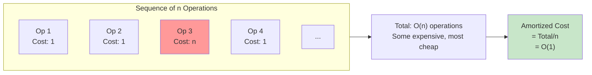
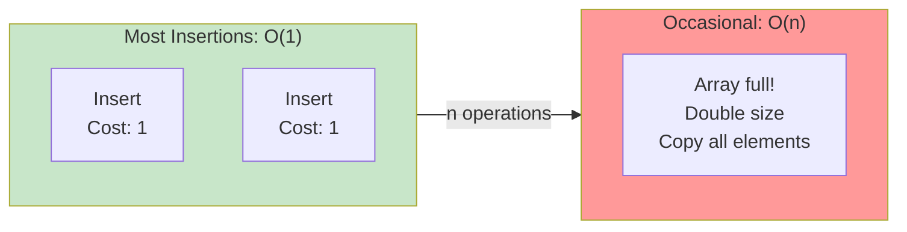
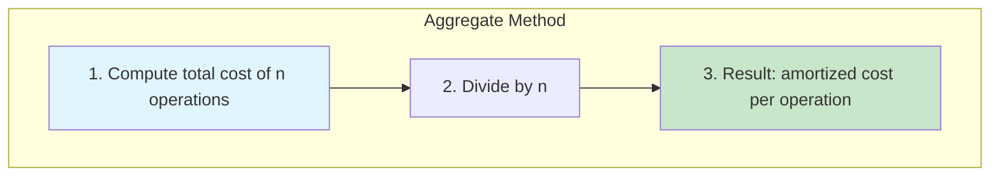
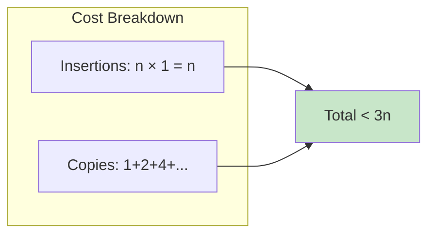
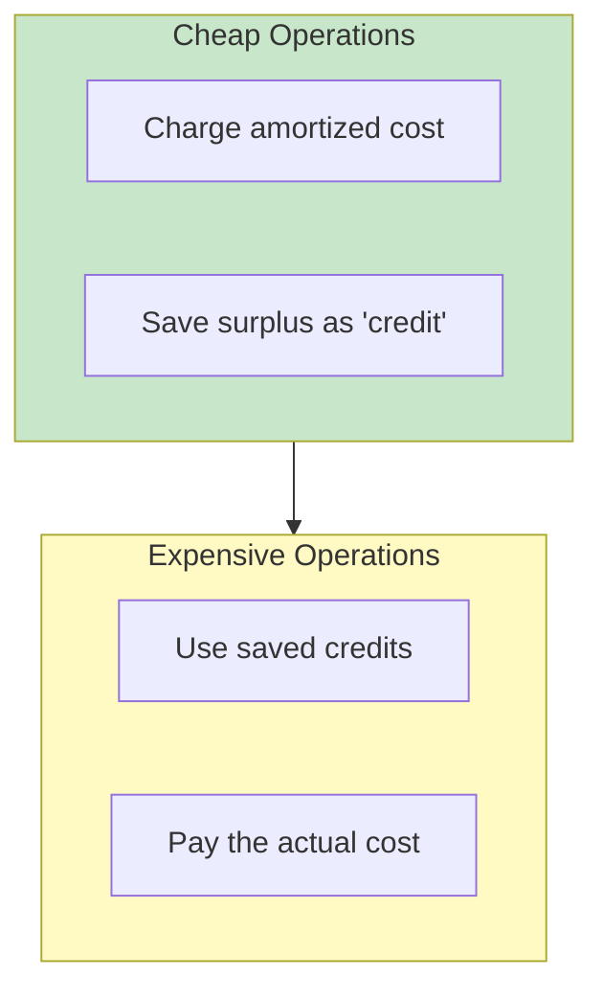
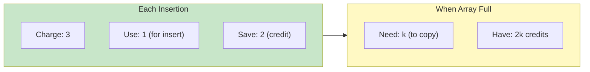
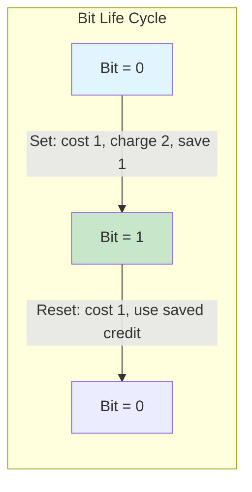
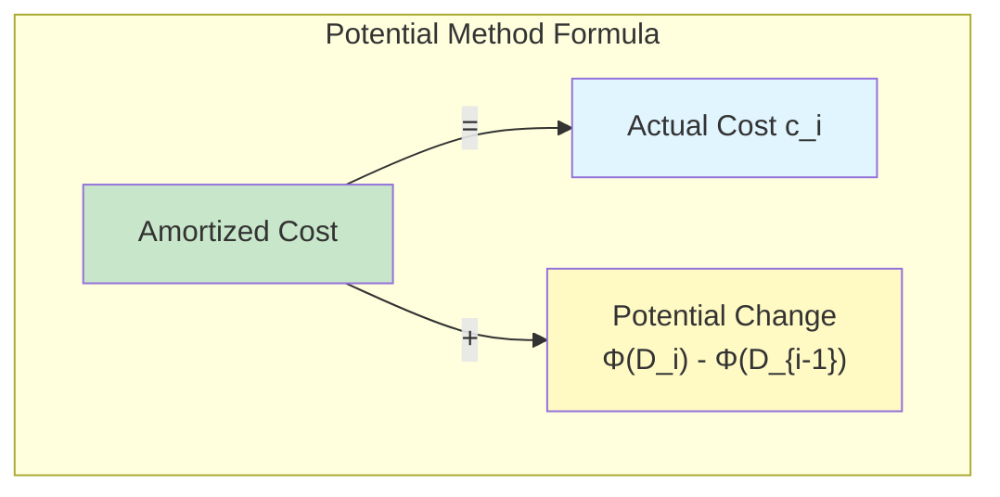
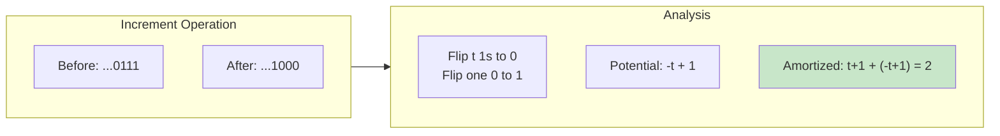
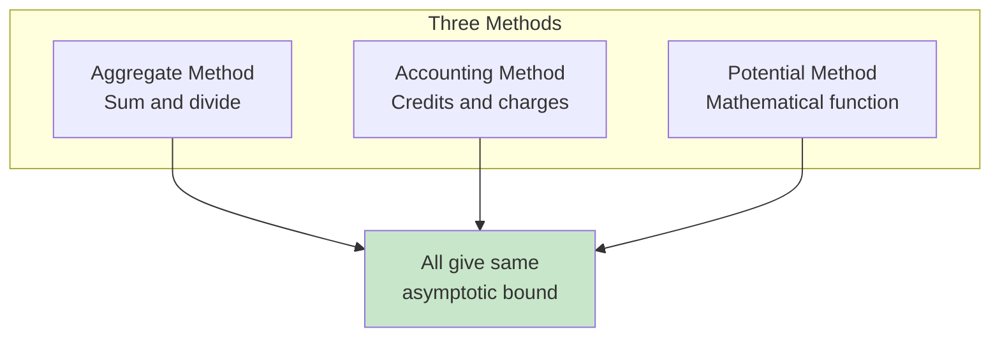

# 📚 L8: Amortized Analysis

> [!abstract] Lecture Goal
> Understand how to analyze the total cost of a sequence of operations, rather than individual operation costs, using three methods: aggregate, accounting, and potential.

> [!tip] The Big Picture
> Some data structures have operations that are usually cheap but occasionally expensive. Worst-case analysis would overestimate the total cost. Amortized analysis gives a more realistic picture by averaging costs over a sequence — showing that occasional expensive operations don't doom overall performance.

---

## 1. What is Amortized Analysis?

### 🤔 The Core Problem

Some data structures have operations with **varying costs**:

- Most operations are cheap
- Occasionally, an operation is very expensive
- What's the true cost over many operations?

### 💡 The Amortized Concept

**Amortized Analysis** asks: "What is the average cost per operation over a sequence of $n$ operations?"

$$\text{Amortized Cost} = \frac{\text{Total Cost of } n \text{ Operations}}{n}$$

> [!example] The Detective Analogy 🕵️
> Imagine you're a detective solving cases. Most cases are easy (P problems) — you follow the clues and solve them quickly. But some cases require checking every possible suspect (expensive operations). However, if you solve 100 cases and only 1 was hard, your **average** case-solving time is still pretty good. That's amortized analysis!

---

### 📖 Key Terminology

| Term | Definition |
| :--- | :--- |
| **Worst-case analysis** | Considers the most expensive single operation |
| **Amortized analysis** | Considers average cost per operation over a sequence |
| **Average-case analysis** | Probabilistic expectation over random inputs |
| **Total cost** | Sum of costs over all $n$ operations |

---

### 💡 Warm-Up Example: Dynamic Array

A dynamic array (like Python list or Java ArrayList) doubles in size when full:

- **Worst-case per insertion:** $O(n)$ (when array doubles)
- **Amortized cost:** $O(1)$ (expensive operations are rare)

---

### ⚠️ Common Pitfalls

> [!danger] Confusing amortized with average-case
> Amortized analysis is **not** probabilistic. It's a **worst-case bound on the average** over any sequence of operations. Average-case assumes random inputs; amortized makes no such assumption.

> [!danger] Thinking "worst case × n" is correct
> For $n$ operations with worst-case $O(n)$ each, you might think total is $O(n^2)$. But the expensive case is rare! The amortized analysis shows total is actually $O(n)$.

---

### ❓ Mock Exam Questions

> [!question] Q1: Amortized vs Worst-Case
> If an operation has worst-case cost $O(n)$, what does amortized analysis tell us?
> 

Answer

>
> **Answer: Amortized analysis might show average cost per operation is much lower**
>
> Because the expensive operation occurs rarely. For dynamic array, worst-case is $O(n)$ but amortized is $O(1)$.
> 

---

## 2. Aggregate Method

### 🧠 Core Concept

The **Aggregate Method** computes the total cost of all operations and divides by $n$.

$$\text{Amortized Cost} = \frac{\text{Total Cost of All Operations}}{\text{Number of Operations}}$$

**Key Idea:** No need to track individual costs — just sum everything!

---

### 📖 Example 1: Dynamic Array

Starting with an empty array of capacity 1, do $n$ insertions:

| Operation | Array Size | Capacity | Cost | Notes |
| :--- | :--- | :--- | :--- | :--- |
| 1 | 1 | 1 | 1 | Insert, no resize |
| 2 | 2 | 2 | 2 | Copy 1 + insert 1, capacity doubled |
| 3 | 3 | 4 | 3 | Copy 2 + insert 1 |
| 4 | 4 | 4 | 1 | Insert, no resize |
| 5 | 5 | 8 | 5 | Copy 4 + insert 1 |

**Analysis:**

- **Insertions:** $n$ operations, each costs 1 → Total: $n$
- **Copying:** Occurs at capacities 1, 2, 4, 8, ... → Total: $1 + 2 + 4 + ... + 2^k$ where $2^k < n$
- This is a geometric series: $< 2n$

**Total cost:** $n + (1 + 2 + 4 + ... + 2^k) < n + 2n = 3n$

**Amortized cost:** $\frac{3n}{n} = O(1)$ ✅

---

### 📖 Example 2: Binary Counter

A $k$-bit binary counter, incremented $n$ times starting from 0.

**Key Observation:**

| Bit | Flips Every... | Total Flips |
| :--- | :--- | :--- |
| Bit 0 (LSB) | 1 increment | $n$ |
| Bit 1 | 2 increments | $n/2$ |
| Bit 2 | 4 increments | $n/4$ |
| Bit $i$ | $2^i$ increments | $n/2^i$ |

**Total bit flips:**

$$\sum_{i=0}^{k-1} \frac{n}{2^i} = n \cdot \sum_{i=0}^{k-1} \frac{1}{2^i} < n \cdot 2 = 2n$$

**Amortized cost per increment:** $\frac{2n}{n} = O(1)$ ✅

---

### ⚠️ Common Pitfalls

> [!danger] Forgetting geometric series formula
> Sum of powers of 2 is $2^{k+1} - 1$, not $k^2$. Remember: $\sum_{i=0}^{k} 2^i = 2^{k+1} - 1 < 2 \cdot 2^k$

> [!danger] Counting each bit flip equally
> Higher-order bits flip exponentially less often! Bit $i$ flips every $2^i$ operations, not every operation.

---

### ❓ Mock Exam Questions

> [!question] Q2: Binary Counter Bit Flips
> In a binary counter incremented $n$ times, how many times does bit 3 flip?
> 

Answer

>
> **Answer: $n/8$ times**
>
> Bit $i$ flips every $2^i$ increments. Bit 3 flips every $2^3 = 8$ increments, so it flips $n/8$ times.
> 

> [!question] Q3: Dynamic Array Copy Cost
> After $n$ insertions into a dynamic array that doubles when full, what is the total copying cost?
> 

Answer

>
> **Answer: $O(n)$**
>
> Copies occur at sizes 1, 2, 4, 8, ... up to first power of 2 ≥ $n$. Total: $1 + 2 + 4 + ... + 2^k < 2n$.
> 

---

## 3. Accounting Method

### 🧠 Core Concept

The **Accounting Method** assigns an amortized cost to each operation and uses "credits" to pay for expensive operations.

**Key Idea:**
- Charge each operation an amortized cost (may differ from actual cost)
- Store surplus as **credit** for future expensive operations
- **Credit must never go negative!**

$$\text{Credit} = \text{Amortized Cost} - \text{Actual Cost}$$

> [!example] The Savings Account Analogy 💰
> Think of it like a savings account. You deposit money during good times (cheap operations), and withdraw during expensive times (expensive operations). The goal is to always have enough saved up — credit never goes negative!

---

### 📖 Example 1: Dynamic Array

**Strategy:** Charge amortized cost of **3** for each insertion.

| Operation | Actual Cost | Amortized Cost | Credit |
| :--- | :--- | :--- | :--- |
| Insert (no resize) | 1 | 3 | +2 |
| Insert (with resize) | $k+1$ | 3 | varies |

**Why does this work?**

When array is full and needs expansion from size $k$ to $2k$:
- We need to copy $k$ elements → cost = $k$
- We have saved $2k$ credits from previous insertions (2 credits per element)
- Credits saved ≥ copy cost ✅

**Result:** Total amortized cost = $3n$ for $n$ operations → $O(1)$ per operation ✅

---

### 📖 Example 2: Binary Counter

**Strategy:** Charge amortized cost of **2** for each increment.

| What | Cost | Credit |
| :--- | :--- | :--- |
| Set bit 0→1 | 1 | +1 (from the 2 charged) |
| Reset bit 1→0 | 1 | Use saved credit |

**Accounting:**
- When bit flips 0→1: costs 1, charge 2, save 1 credit
- When bit flips 1→0: costs 1, use the saved credit from when it was set
- Every 1→0 flip is "prepaid" by a previous 0→1 flip

**Result:** Amortized cost per increment ≤ 2 → $O(1)$ ✅

---

### ⚠️ Common Pitfalls

> [!danger] Letting credit go negative
> You must prove credit $\geq 0$ at all times. If credit ever goes negative, your amortized bound is wrong.

> [!danger] Not accounting for all costs
> Every actual cost must be paid — either by the amortized charge or by credits. Don't forget any operations.

---

### ❓ Mock Exam Questions

> [!question] Q4: Accounting Method Credit
> For dynamic array with amortized cost 3, how much credit is saved per non-resize insertion?
> 

Answer

>
> **Answer: 2 credits**
>
> Charge 3, actual cost is 1, so save 2 credits for future resize.
> 

---

## 4. Potential Method

### 🧠 Core Concept

The **Potential Method** uses a mathematical potential function $\Phi(D)$ on the data structure state.

$$\hat{c}_i = c_i + \Phi(D_i) - \Phi(D_{i-1})$$

Where:
- $\hat{c}_i$ = amortized cost of operation $i$
- $c_i$ = actual cost of operation $i$
- $\Phi(D_i)$ = potential after operation $i$

**Requirements:**
- $\Phi(D_0) = 0$ (initial potential is zero)
- $\Phi(D_i) \geq 0$ for all $i$ (potential never negative)

> [!example] The Physics Analogy ⚡
> Think of potential energy. A ball at the top of a hill has high potential energy — it can "pay" for the descent later. Similarly, the potential function stores "energy" in the data structure for future expensive operations!

---

### 📖 Example 1: Dynamic Array

**Potential Function:**
$$\Phi(D) = 2 \times \text{size} - \text{capacity}$$

**Case 1: Insert without resize**

| Quantity | Before | After |
| :--- | :--- | :--- |
| Size | $s$ | $s+1$ |
| Capacity | $c$ | $c$ |
| Potential | $2s - c$ | $2(s+1) - c$ |

- Actual cost: 1
- Potential change: $(2s + 2 - c) - (2s - c) = 2$
- **Amortized cost:** $1 + 2 = 3$ ✅

**Case 2: Insert with resize (array full)**

| Quantity | Before | After |
| :--- | :--- | :--- |
| Size | $s$ | $s+1$ |
| Capacity | $s$ | $2s$ |
| Potential | $2s - s = s$ | $2(s+1) - 2s = 2$ |

- Actual cost: $s$ (copy) + $1$ (insert) = $s + 1$
- Potential change: $2 - s$
- **Amortized cost:** $(s + 1) + (2 - s) = 3$ ✅

---

### 📖 Example 2: Binary Counter

**Potential Function:**
$$\Phi(D) = \text{number of 1-bits in the counter}$$

**Analysis:**

When we increment and flip bits:
- Suppose we flip $t$ trailing 1s to 0, and one 0 to 1
- Actual cost: $t + 1$ bit flips
- Potential change: lose $t$ ones, gain 1 one → change = $-t + 1$
- **Amortized cost:** $(t + 1) + (-t + 1) = 2$ ✅

---

### ⚠️ Common Pitfalls

> [!danger] Choosing a potential that goes negative
> You must prove $\Phi(D) \geq 0$ for all states. If potential ever goes negative, the bound is invalid.

> [!danger] Forgetting the initial condition
> $\Phi(D_0) = 0$ must hold for the initial state. This ensures the total amortized cost bounds the total actual cost.

---

### ❓ Mock Exam Questions

> [!question] Q5: Potential Method Formula
> In the potential method, what is the formula for amortized cost?
> 

Answer

>
> **Answer: $\hat{c}_i = c_i + \Phi(D_i) - \Phi(D_{i-1})$**
>
> Amortized cost = actual cost + potential change.
> 

> [!question] Q6: Potential Change Interpretation
> If actual cost is 10 and potential decreases by 3, what is the amortized cost?
> 

Answer

>
> **Answer: $10 + (-3) = 7$**
>
> Amortized cost = $c_i + \Delta\Phi$. When potential decreases, we "spend" saved energy, reducing the amortized cost.
> 

---

## 5. Comparison of Methods

### 🧠 Core Concept

| Method | Approach | Best For |
| :--- | :--- | :--- |
| **Aggregate** | Sum all costs, divide by $n$ | Simple sequences with predictable patterns |
| **Accounting** | Assign amortized costs, track credit | Intuitive understanding, teaching |
| **Potential** | Mathematical potential function | Rigorous proofs, complex data structures |

---

### 📖 When to Use Each Method

| Scenario | Recommended Method | Why |
| :--- | :--- | :--- |
| Simple, uniform operations | Aggregate | Easy to calculate total |
| Need intuitive explanation | Accounting | Credit concept is easy to explain |
| Complex data structures | Potential | Mathematical rigor |
| Proving bounds for publications | Potential | Most rigorous method |
| Teaching amortized analysis | Accounting | Most intuitive |

> [!example] The Budgeting Analogy 📊
> - **Aggregate** is like calculating your total yearly expenses and dividing by 12 to get monthly average
> - **Accounting** is like budgeting with envelopes — setting aside money each month for known future expenses
> - **Potential** is like physics equations — tracking energy levels precisely

---

### ⚠️ Common Pitfalls

> [!danger] Using the wrong method for the problem
> Some problems are easier with one method. Practice all three to know which to use.

> [!danger] Inconsistent bounds between methods
> All three methods should give the same asymptotic bound. If not, check your analysis.

---

## 6. Classic Examples Summary

### 📊 Dynamic Array (Resizable Array)

| Method | Analysis | Result |
| :--- | :--- | :--- |
| Aggregate | Total = $n + (1+2+4+...) < 3n$ | $O(1)$ |
| Accounting | Charge 3, save 2 for resize | $O(1)$ |
| Potential | $\Phi = 2s - c$ | $O(1)$ |

### 📊 Binary Counter

| Method | Analysis | Result |
| :--- | :--- | :--- |
| Aggregate | Total flips < $2n$ | $O(1)$ |
| Accounting | Charge 2, save 1 per 1-bit | $O(1)$ |
| Potential | $\Phi$ = number of 1-bits | $O(1)$ |

---

## 🔗 Connections

| 📚 Lecture | 🔗 Connection |
| :--- | :--- |
| [[L9]] | Amortized analysis used in analyzing complex data structures |

> [!quote] The Key Insight
> Amortized analysis reveals that **occasional expensive operations don't doom overall performance**. By averaging over a sequence, we see the true cost — like understanding that a gym membership's value comes from consistent use, not just one intense session! 🏋️

---

## 7. Mock Exam Questions

### 📝 Multiple Choice

> [!question] Q1: Amortized vs Worst-Case
> A dynamic array has worst-case insertion cost $O(n)$. What is the amortized insertion cost?
> 

Answer

>
> **Answer: (b) $O(1)$**
>
> Even though some insertions cost $O(n)$ when the array resizes, the amortized cost over $n$ operations is $O(1)$ because resizing happens rarely (logarithmically many times).
> 

> [!question] Q2: Aggregate Method
> In the aggregate method, how do we compute amortized cost?
> 

Answer

>
> **Answer: (b) Sum total cost and divide by $n$**
>
> The aggregate method computes the total cost of all $n$ operations and divides by $n$ to get average cost per operation.
> 

> [!question] Q3: Binary Counter
> A binary counter incremented $n$ times has how many total bit flips?
> 

Answer

>
> **Answer: (b) $< 2n$**
>
> Bit $i$ flips $n/2^i$ times. Total: $\sum_{i=0}^{k-1} n/2^i = n(1 + 1/2 + 1/4 + ...) < 2n$.
> 

---

### ✍️ Open-Ended Practice Problems

> [!question] P1: Stack with Multipop
> A stack supports push (cost 1) and multipop($k$) (cost $\min(k, s)$ where $s$ is stack size). Using any method, show that a sequence of $n$ operations has amortized cost $O(1)$ per operation.
> 

Answer

>
> **Solution (Accounting Method):**
>
> - Charge amortized cost 2 for push, 0 for multipop
> - Each push saves 1 credit on the element
> - Each pop uses 1 credit from the element
> - Total pushes $\leq n$, so total credits $\geq$ total pops
> - Credit never goes negative
> - Amortized cost: $2 \cdot \text{pushes} + 0 \cdot \text{pops} \leq 2n$
> - Per operation: $O(1)$ ✅
>
> **Solution (Potential Method):**
>
> Define $\Phi(D) = $ size of stack
>
> - **Push:** cost 1, $\Delta\Phi = +1$, amortized = $1 + 1 = 2$
> - **Multipop($k$):** cost $\min(k, s)$, $\Delta\Phi = -\min(k, s)$, amortized = $\min(k, s) - \min(k, s) = 0$
>
> Both operations have constant amortized cost ✅
> 

> [!question] P2: Potential Method for Dynamic Array
> (a) Define a potential function for a dynamic array and prove that insert without resize has amortized cost $O(1)$.
>
> (b) Using the same potential function, prove that insert with resize also has amortized cost $O(1)$.
> 

Answer

>
> **Potential Function:** $\Phi(D) = 2 \cdot \text{size} - \text{capacity}$
>
> **Initial state:** $\Phi(D_0) = 0$ (empty array) ✅
>
> **Non-negative:** Since size $\leq$ capacity, $\Phi \geq 0$ ✅
>
> **(a) Insert without resize:**
> - Actual cost: 1
> - Size increases by 1, capacity unchanged
> - $\Delta\Phi = 2(s+1) - c - (2s - c) = 2$
> - Amortized cost: $1 + 2 = 3 = O(1)$ ✅
>
> **(b) Insert with resize (array was full):**
> - Before: size = $s$, capacity = $s$
> - After: size = $s+1$, capacity = $2s$
> - Actual cost: $s$ (copy) + $1$ (insert) = $s + 1$
> - $\Delta\Phi = (2(s+1) - 2s) - (2s - s) = 2 - s$
> - Amortized cost: $(s+1) + (2-s) = 3 = O(1)$ ✅
> 

> [!question] P3: Comparing Methods
> Explain why all three methods (aggregate, accounting, potential) give the same asymptotic bound for the dynamic array.
> 

Answer

>
> All three methods bound the same quantity: total actual cost.
>
> - **Aggregate:** Directly counts total cost < $3n$
> - **Accounting:** Total amortized cost = $3n$, and credit $\geq 0$ means total actual $\leq$ total amortized
> - **Potential:** Total amortized = Total actual + $\Phi(D_n) - \Phi(D_0)$, and $\Phi(D_n) \geq 0 = \Phi(D_0)$ means total actual $\leq$ total amortized
>
> All methods show total cost = $O(n)$, so per-operation = $O(1)$.
> 
