# 📚 L9: Reductions & Intractability

> [!abstract] Lecture Goal
> Understand how reductions formalize "problem A is no harder than problem B", use reductions to prove hardness, and see the chain that connects 3-SAT, Independent Set, Vertex Cover, and Set Cover.

> [!tip] The Big Picture
> Reductions are the **universal language of hardness**. Instead of proving each problem hard from scratch, we show a known-hard problem reduces to it — and hardness "flows" through the reduction chain. This is how we know thousands of problems are all equivalent in difficulty to 3-SAT.

---

## 1. What is a Reduction?

### 🤔 The Core Problem

Instead of learning a new algorithm for every problem, can we **transform** one problem into another we already know how to solve?

### 💡 The Reduction Concept

A **reduction** is a way to solve problem $A$ by transforming it into a problem $B$ that you already know how to solve.

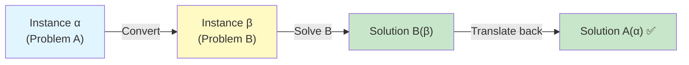

**Formally, to reduce $A$ to $B$:**

1. Take an instance $\alpha$ of problem $A$
2. Convert $\alpha$ into an instance $\beta$ of problem $B$ _(this is the reduction step)_
3. Solve $B$ on $\beta$
4. Translate $B$'s answer back into an answer for $A$

We write this as: $A \leq_P B$, read as **"A reduces to B"** or **"A is no harder than B"**.

---

### 📖 Key Terminology

| Term | Definition |
| :--- | :--- |
| **Instance** | A specific input to a problem (sometimes called "encoding") |
| **Reduction** | A transformation from instances of $A$ to instances of $B$ |
| **$A \leq_P B$** | "$A$ reduces to $B$" — solving $B$ gives us a way to solve $A$ |

---

### 💡 Warm-Up Example: T-SUM reduces to 0-SUM

- **0-SUM**: Given array $A$, find $i,j$ such that $A[i] + A[j] = 0$
- **T-SUM**: Given array $B$ and number $T$, find $i,j$ such that $B[i] + B[j] = T$

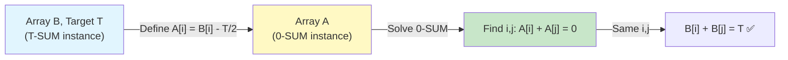

**Reduction:** Given $B$ for T-SUM, define $A[i] = B[i] - T/2$.

Then $A[i] + A[j] = 0 \iff B[i] + B[j] = T$. ✅

---

### ⚠️ Common Pitfalls

> [!danger] Pitfall 1: Confusing the direction of the reduction
> $A \leq_P B$ means you are **solving A using B**. It does NOT mean $B$ is easier than $A$ — it means $B$ is **at least as hard** as $A$. Students often read the arrow backwards!

> [!danger] Pitfall 2: Forgetting the translation step
> You need both directions: converting $\alpha \to \beta$ **AND** converting $B(\beta) \to A(\alpha)$. Forgetting the back-translation is a common error in proofs.

---

### ❓ Mock Exam Questions

> [!question] Q1: Reduction Direction
> If we reduce Problem A to Problem B, which problem's algorithm do we use?
> 

Answer

>
> **Answer: We use Problem B's algorithm**
>
> $A \leq_P B$ means we transform A-instances into B-instances and solve using B's algorithm.
> 

> [!question] Q2: Arrow Meaning
> What does $A \leq_P B$ mean?
> 

Answer

>
> **Answer: A is no harder than B (or equivalently, B is at least as hard as A)**
>
> The arrow points from easier to harder. If B is solvable, so is A.
> 

---

## 2. p(n)-Time Reductions & Running Time Composition

### 🧠 Core Concept

A **$p(n)$-time reduction** from $A$ to $B$ means:

- The conversion $\alpha \to \beta$ runs in $p(n)$ time
- The back-translation $B(\beta) \to A(\alpha)$ runs in $p(n)$ time

where $n$ is the **size of the input $\alpha$** (NOT the size of $\beta$'s output).

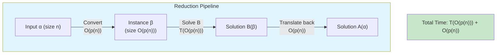

### 📐 Running Time Composition

**If there is a $p(n)$-time reduction from $A$ to $B$, and $B$ has a $T(n)$-time algorithm, then $A$ can be solved in:**

$$T\bigl(O(p(n))\bigr) + O(p(n)) \text{ time}$$

**Why?** The instance $\beta$ has size $O(p(n))$, so solving $B$ on it takes $T(O(p(n)))$ time. Add the $O(p(n))$ for conversion and back-translation.

---

### 📖 Key Terminology

| Term | Definition |
| :--- | :--- |
| **$p(n)$-time reduction** | Reduction where both conversion and back-translation run in $p(n)$ time |
| **Input size $n$** | The size of the original instance $\alpha$ — **not** the size of $\beta$ |
| **Running Time Composition** | How to combine reduction cost and $B$-solver cost to get total runtime for $A$ |

---

### ⚠️ Common Pitfalls

> [!danger] Confusing $n$ (size of $\alpha$) with $|\beta|$ (size of constructed instance)
> In the MAT-MULTI → MAT-SQR example: the input size $n = N^2$ (number of entries in two $N \times N$ matrices). The conversion constructs a $2N \times 2N$ matrix — $O(N^2) = O(n)$ work. So it's an $O(n)$-time reduction, **not** $O(N)$!

---

## 3. Polynomial-Time Reductions & Pseudo-Polynomial Algorithms

### 🧠 Core Concept

**Definition:** $A \leq_P B$ (polynomial-time reduction) if there is a $p(n)$-time reduction from $A$ to $B$ where $p(n) = O(n^c)$ for some constant $c$.

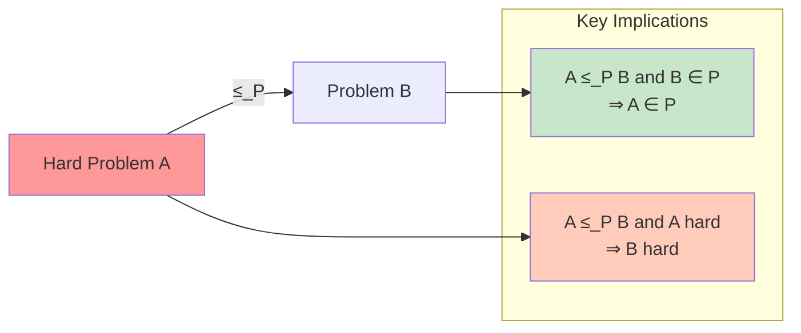

**Key implication:**
$$A \leq_P B \text{ and } B \text{ solvable in poly-time} \implies A \text{ solvable in poly-time}$$

**Contrapositive (crucial for hardness!):**
$$A \leq_P B \text{ and } A \text{ is hard} \implies B \text{ is hard}$$

Think of it like a disease spreading upward in difficulty: if $A$ is hard and $A$ reduces to $B$, then $B$ "inherits" the hardness of $A$. 🦠

**Why polynomial time?** The notion is robust: multiplying two polynomials gives another polynomial. So chaining reductions $A \leq_P B \leq_P C$ still gives $A \leq_P C$.

---

### 📊 Pseudo-Polynomial Algorithms

An algorithm is **pseudo-polynomial** if it runs in time polynomial in the _numeric value_ of the input, but exponential in the _length_ (number of bits) of the input.

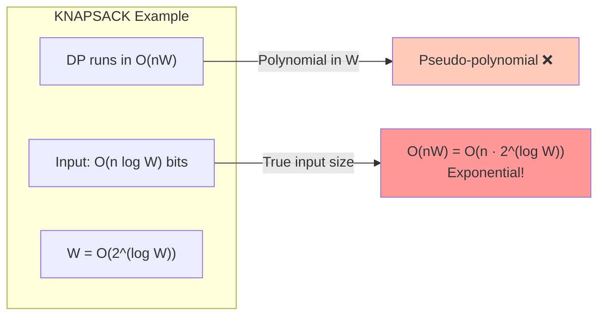

**Classic example:** Dynamic programming for KNAPSACK runs in $O(nW)$.

- The input size is $O(n \log W + \log W)$ bits
- But $W$ can be as large as $2^{\text{(number of bits for } W\text{)}}$
- So $O(nW)$ is exponential in the input length → **pseudo-polynomial**, NOT truly polynomial ❌

Compare to FRACTIONAL KNAPSACK with $O(n \log n)$: this IS polynomial ✅

---

### 📖 Key Terminology

| Term | Definition |
| :--- | :--- |
| **$A \leq_P B$** | $A$ polynomial-time reduces to $B$ |
| **Polynomial-time algorithm** | Runs in $O(n^c)$ for some constant $c$, where $n$ = input _encoding_ length |
| **Pseudo-polynomial** | Polynomial in the _numeric value_ but exponential in the _bit length_ |
| **Tractable** | Solvable in polynomial time |
| **Intractable** | No known polynomial-time algorithm (and strong evidence none exists) |

---

### ⚠️ Common Pitfalls

> [!danger] Thinking $O(nW)$ is polynomial for KNAPSACK
> $W$ is encoded in $O(\log W)$ bits. So the actual input size is $n_{bits} = O(\log W)$, meaning $W = O(2^{n_{bits}})$. The runtime $O(nW) = O(n \cdot 2^{n_{bits}})$ is exponential! Always measure polynomial-ness against the _encoding length_, not the numeric value.

> [!danger] Believing $A \leq_P B$ and $A$ poly-time $\Rightarrow$ $B$ poly-time
> This is **FALSE**. The implication only goes the other way: $B$ poly-time $\Rightarrow$ $A$ poly-time. And: $A$ hard $\Rightarrow$ $B$ hard.

---

### ❓ Mock Exam Questions

> [!question] Q3: Implication Direction
> If $A \leq_P B$ and $A$ can be solved in polynomial time, what can we conclude?
> 

Answer

>
> **Answer: Nothing about B's complexity**
>
> The reduction only tells us: "if B is easy, then A is easy" (and contrapositively: "if A is hard, then B is hard"). It says nothing about B when A is easy.
> 

> [!question] Q4: Pseudo-polynomial Classification
> The KNAPSACK DP runs in $O(nW)$ time. Input encoded in $O(n \log W)$ bits. What is this?
> 

Answer

>
> **Answer: Pseudo-polynomial**
>
> It's polynomial in the numeric value $W$, but $W = 2^{(\text{bits for } W)}$, making it exponential in the actual input length.
> 

---

## 4. Decision Problems vs Optimisation Problems

### 🧠 Core Concept

To compare problem hardness uniformly, we use a common language: **decision problems**.

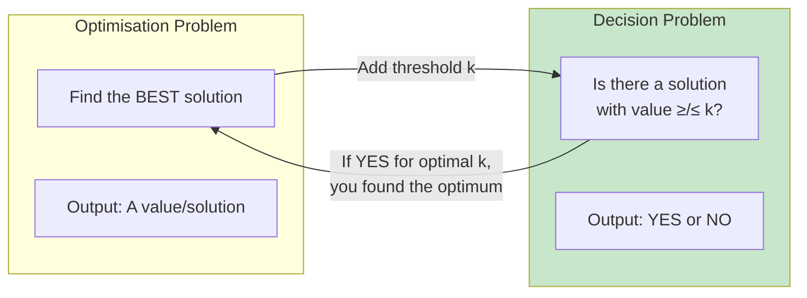

| Type | Output | Example |
| :--- | :--- | :--- |
| **Optimisation** | A value/solution | "What is the shortest path from $u$ to $v$?" |
| **Decision** | YES or NO | "Is there a path from $u$ to $v$ of length $\leq k$?" |

**Conversion recipe:** Given an optimisation problem, create a decision version by introducing a threshold $k$ and asking "is there a solution with value $\leq k$?" (for minimisation) or "$\geq k$?" (for maximisation).

**Why does this work for hardness?**  
The decision version is **no harder** than the optimisation version:

- If you can solve optimisation, just check if the optimal value satisfies the threshold.
- So: if the decision version is hard → the optimisation version is also hard.

---

### 📖 Key Terminology

| Term | Definition |
| :--- | :--- |
| **Decision problem** | Maps an instance to {YES, NO} |
| **YES-instance** | An input for which the answer is YES |
| **NO-instance** | An input for which the answer is NO |
| **Threshold $k$** | Parameter added to convert optimisation to decision |

---

### ⚠️ Common Pitfalls

> [!danger] Thinking the decision problem is always strictly easier
> Decision $\leq_P$ Optimisation (decision is no harder). But in many cases they are equivalent in hardness — if you can solve the decision version for all $k$, you can binary search for the optimum.

---

## 5. Reductions Between Decision Problems

### 🧠 Core Concept

For decision problems, a poly-time reduction $A \leq_P B$ is a poly-time transformation $\alpha \mapsto \beta$ such that:

$$\alpha \text{ is a YES-instance of } A \iff \beta \text{ is a YES-instance of } B$$

The YES/NO answer is "copied" — no translation needed, just the if-and-only-if.

**To prove a valid reduction, show three things:**

1. ✅ The transformation runs in polynomial time
2. ✅ **($\Rightarrow$)** If $\alpha$ is a YES-instance of $A$, then $\beta$ is a YES-instance of $B$
3. ✅ **($\Leftarrow$)** If $\beta$ is a YES-instance of $B$, then $\alpha$ is a YES-instance of $A$

Both directions of the if-and-only-if must be proved! 🔁

---

### ⚠️ Common Pitfalls

> [!danger] Proving only one direction of the iff
> Many students prove ($\Rightarrow$) but forget ($\Leftarrow$), or vice versa. Both are required and examiners will look for both.

> [!danger] Confusing $A \leq_P B$ with $B \leq_P A$
> These are very different statements! $A \leq_P B$ means "$A$ is no harder than $B$." Always be explicit about which direction you're reducing.

---

## 6. The Problem Zoo

### 🧠 Key Problems

#### 🕸️ INDEPENDENT-SET

**Problem:** Given a graph $G = (V, E)$ and integer $k$, is there a subset $S \subseteq V$ with $|S| \geq k$ such that no two vertices in $S$ are adjacent?

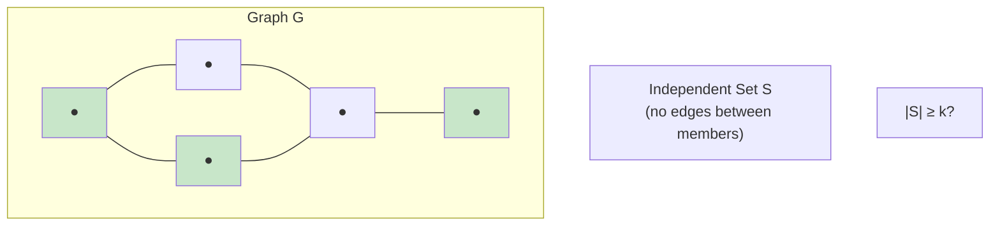

_Analogy: A group of people at a party where nobody knows each other — they're "independent."_ 🥳

#### 🛡️ VERTEX-COVER

**Problem:** Given a graph $G = (V, E)$ and integer $k$, is there a subset $S \subseteq V$ with $|S| \leq k$ such that every edge has at least one endpoint in $S$?

_Analogy: Place security cameras at $k$ intersections so that every road is watched by at least one camera._ 📷

#### 🧩 SET-COVER

**Problem:** Given integers $k$, $n$, and a collection $\mathcal{S}$ of subsets of $\{1, \ldots, n\}$, are there $\leq k$ subsets in $\mathcal{S}$ whose union is $\{1, \ldots, n\}$?

_Analogy: Choose $k$ radio stations so that every city is in at least one station's broadcast range._ 📻

#### 🔮 3-SAT

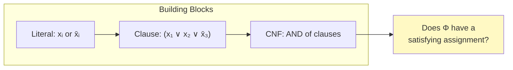

**Building blocks:**

- **Literal:** A Boolean variable $x_i$ or its negation $\bar{x}_i$
- **Clause:** A disjunction (OR) of literals, e.g., $(x_1 \vee x_2 \vee \bar{x}_3)$
- **CNF formula:** A conjunction (AND) of clauses

**Problem:** Given a CNF formula $\Phi$ where every clause has exactly 3 literals, does $\Phi$ have a satisfying truth assignment?

_Analogy: Can you set switches (True/False) so that in every group of 3 switches, at least one is ON?_ 💡

---

### 📖 Key Terminology Summary

| Problem | Input | YES iff... |
| :--- | :--- | :--- |
| INDEPENDENT-SET | $G, k$ | $\exists$ subset of $\geq k$ mutually non-adjacent vertices |
| VERTEX-COVER | $G, k$ | $\exists$ subset of $\leq k$ vertices touching all edges |
| SET-COVER | $n, k, \mathcal{S}$ | $\exists \leq k$ subsets whose union $= \{1,\ldots,n\}$ |
| 3-SAT | CNF formula $\Phi$ | $\exists$ truth assignment satisfying all clauses |

---

### ⚠️ Common Pitfalls

> [!danger] Confusing Independent Set and Vertex Cover
> Independent Set wants vertices with NO edges between them (size $\geq k$). Vertex Cover wants vertices that TOUCH all edges (size $\leq k$). Note the complementary nature — this is exactly the key insight in their reduction!

---

## 7. The Reduction Chain

The lecture builds the following reduction chain:

By transitivity: $\text{3-SAT} \leq_P \text{SET-COVER}$. Since 3-SAT is believed to be hard, **all problems in this chain are believed to be hard!** 😱

---

### 7.1 INDEPENDENT-SET $\leq_P$ VERTEX-COVER

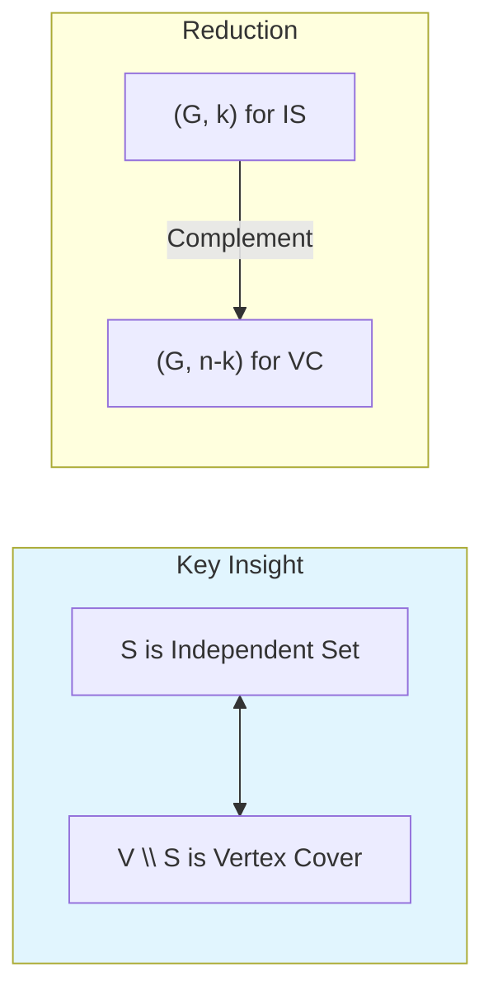

**Key Insight:** $S$ is an independent set in $G$ $\iff$ $V \setminus S$ is a vertex cover.

**Reduction:** $(G, k)$ is a YES-instance of INDEPENDENT-SET $\iff$ $(G, n-k)$ is a YES-instance of VERTEX-COVER (where $n = |V|$).

**Proof ($\Rightarrow$):**  
Suppose $S$, $|S| \geq k$, is an independent set. For any edge $(u,v) \in E$: since $S$ is independent, at least one of $u, v \notin S$, so at least one of them is in $V \setminus S$. Thus $V \setminus S$ is a vertex cover of size $\leq n - k$. ✅

**Proof ($\Leftarrow$):**  
Suppose $S$, $|S| \leq n-k$, is a vertex cover. If $u, v \in V \setminus S$ and $(u,v) \in E$, then neither endpoint is in $S$, contradicting $S$ being a vertex cover. So $V \setminus S$ is an independent set of size $\geq k$. ✅

---

### 7.2 VERTEX-COVER $\leq_P$ SET-COVER

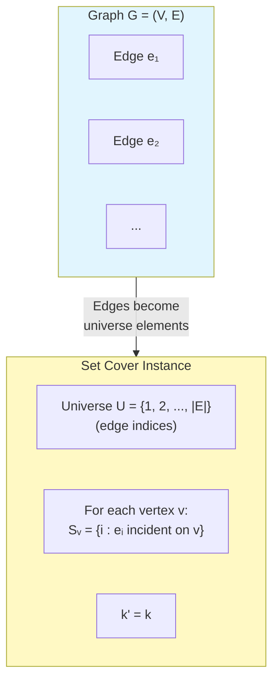

**Reduction:** Given $(G, k)$ for VERTEX-COVER, construct:

- Universe $U = \{1, \ldots, |E|\}$ (label edges $e_1, \ldots, e_m$)
- For each vertex $v \in V$: $S_v = \{i : e_i \text{ is incident on } v\}$
- Set $k' = k$

**Intuition:** Each vertex "covers" the edges incident to it. Choosing a vertex cover of size $k$ corresponds to choosing $k$ sets that together cover all edge indices.

**Proof ($\Rightarrow$):**  
If $U \subseteq V$ is a vertex cover of size $\leq k$, then every edge has an endpoint in $U$, so $\bigcup_{u \in U} S_u = \{1, \ldots, m\}$. ✅

**Proof ($\Leftarrow$):**  
If $\{S_{v_1}, \ldots, S_{v_t}\}$ ($t \leq k$) form a set cover, then every edge index is covered, meaning every edge has an endpoint in $\{v_1, \ldots, v_t\}$ — a vertex cover of size $\leq k$. ✅

---

### 7.3 3-SAT $\leq_P$ INDEPENDENT-SET

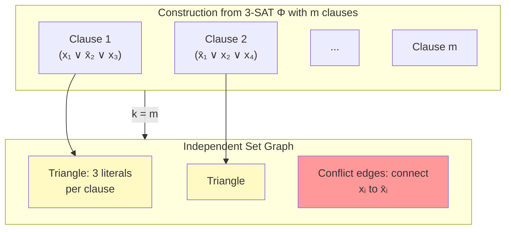

**Reduction:** Given 3-SAT instance $\Phi$ with $m$ clauses:

1. Create 3 vertices per clause (one per literal) — label them with the literal
2. Connect the 3 literals in each clause in a **triangle** (intra-clause edges)
3. Connect each literal to all occurrences of its **negation** in other clauses (conflict edges)
4. Set $k = m$ (number of clauses)

**Why triangles?** An independent set can pick at most 1 vertex from each triangle — forcing us to pick exactly one literal per clause to satisfy.

**Why conflict edges?** These prevent us from picking $x_i$ from one clause and $\bar{x}_i$ from another — they can't both be true!

**Proof ($\Rightarrow$):**  
Given a satisfying assignment, pick one true literal per clause. These $m$ vertices form an independent set:
- No two are in the same triangle (one per clause) ✅
- No two are connected by a conflict edge (can't have $x_i$ and $\bar{x}_i$ both true) ✅

**Proof ($\Leftarrow$):**  
Given an independent set $S$ of size $k = m$: exactly one vertex from each triangle is in $S$. Set those literals to true. This is consistent (conflict edges prevent $x_i$ and $\bar{x}_i$ both being chosen), and every clause is satisfied. ✅

---

### ⚠️ Common Pitfalls

> [!danger] 3-SAT → IS: Forgetting conflict edges
> Without conflict edges, you could pick $x_1$ from one triangle and $\bar{x}_1$ from another — a contradiction. The conflict edges are essential for correctness.

> [!danger] IS → VC: Thinking the complement has size exactly $n-k$
> If $|S| \geq k$, then $|V \setminus S| \leq n-k$. The inequality goes the right way — don't flip it!

> [!danger] VC → Set Cover: The universe is the set of EDGES, not vertices
> Students often confuse what the universe $U$ represents. It encodes edges, not vertices.

---

## 8. NP-Completeness (Preview)

### 🧠 Core Concept

All the problems seen (3-SAT, INDEPENDENT-SET, VERTEX-COVER, SET-COVER, KNAPSACK, etc.) are **NP-complete**:

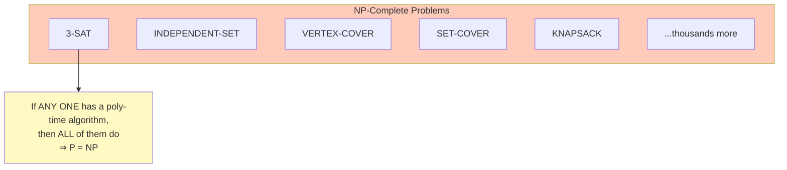

> If **any one** of these NP-complete problems has a polynomial-time algorithm, then **all of them** do — and we would have $P = NP$.

No polynomial-time algorithm is known for any of them. Most computer scientists believe $P \neq NP$, meaning these problems are genuinely intractable. 💀

The web of reductions you've seen (Dick Karp's famous 1972 paper!) shows that these seemingly unrelated problems from graph theory, logic, and combinatorics are all equivalent in hardness.

---
## 🔗 Connections

| 📚 Lecture | 🔗 Connection                             |
| :--------- | :---------------------------------------- |
| [[L10]]    | Using reductions to prove NP-completeness |

> [!quote] The Key Insight
> Reductions let us **stand on the shoulders of giants**. We don't need to prove hardness from scratch — we just show our problem is "at least as hard" as a known-hard problem. The entire NP-completeness web rests on this powerful idea. 🕸️

---

## 9. Mock Exam Questions

### 📝 Multiple Choice

> [!question] Q1: Reduction Implication
> Suppose $A \leq_P B$. Which of the following statements is definitely true?
> 

Answer

>
> **Answer: (b) If $B$ can be solved in polynomial time, then so can $A$.**
>
> $A \leq_P B$ means "if $B$ is easy, then $A$ is easy." It does NOT imply the reverse.
> 

> [!question] Q2: KNAPSACK Classification
> The dynamic programming algorithm for KNAPSACK runs in $O(nW)$ time. The input is encoded using $O(n \log W + \log W)$ bits. Which correctly classifies this algorithm?
> 

Answer

>
> **Answer: (c) Pseudo-polynomial, because it is polynomial in the numeric value of $W$ but exponential in the bit length of $W$.**
>
> $W = O(2^{\log W})$, so $O(nW) = O(n \cdot 2^{(\text{bits for } W)})$ is exponential in the encoding length.
> 

> [!question] Q3: Conflict Edges Purpose
> In the 3-SAT $\leq_P$ INDEPENDENT-SET reduction, what is the purpose of connecting a literal vertex to its negation vertex in another clause?
> 

Answer

>
> **Answer: (b) To ensure we don't simultaneously set a variable to both TRUE and FALSE.**
>
> Intra-clause triangles enforce "at most one per clause." Conflict edges enforce consistency of the truth assignment across clauses.
> 

---

### ✍️ Open-Ended Practice Problems

> [!question] P1: SUBSET-SUM ≤_P ZERO-SUBSET-SUM
> Let SUBSET-SUM be: Given set $S = \{s_1, \ldots, s_n\}$ and target $T$, does there exist a subset $S' \subseteq S$ such that $\sum_{i \in S'} s_i = T$?
> 
> Define ZERO-SUBSET-SUM: Given a set of integers $S = \{s_1, \ldots, s_n\}$, does there exist a non-empty subset $S' \subseteq S$ such that $\sum_{i \in S'} s_i = 0$?
> 
> Show that SUBSET-SUM $\leq_P$ ZERO-SUBSET-SUM. Clearly describe the reduction and prove correctness in both directions.
> 

Answer

>
> **Reduction:** Given $(S, T)$ for SUBSET-SUM, construct $S' = S \cup \{-T\}$ for ZERO-SUBSET-SUM.
>
> **Runtime:** $O(1)$ — clearly polynomial time. ✅
>
> **Correctness ($\Rightarrow$):** If $(S, T)$ is YES, there exists $S^* \subseteq S$ with $\sum_{i \in S^*} s_i = T$. Then $S^* \cup \{-T\} \subseteq S'$ has sum $T - T = 0$. ✅
>
> **Correctness ($\Leftarrow$):** If $S'$ is YES for ZERO-SUBSET-SUM, there exists non-empty $S^{**} \subseteq S'$ with sum 0.
> - If $-T \in S^{**}$: Then $S^* = S^{**} \setminus \{-T\} \subseteq S$ has sum $T$. ✅
> - If $-T \notin S^{**}$: Then $S^{**} \subseteq S$ has sum 0, meaning $T = 0$ (trivially YES for SUBSET-SUM). ✅
> 

> [!question] P2: INDEPENDENT-SET → VERTEX-COVER
> (a) Given a graph $G$ with 8 vertices and an independent set $S$ of size 5, what is the minimum size of a vertex cover guaranteed by the reduction?
> 
> (b) Suppose someone claims: "If $A \leq_P B$ and $A$ can be solved in polynomial time, then $B$ can be solved in polynomial time." Is this TRUE or FALSE? Justify.
> 
> (c) In the VERTEX-COVER $\leq_P$ SET-COVER reduction, what does the universe $U$ represent, and why is it defined this way?
> 

Answer

>
> **(a)** Vertex cover size $\leq n - k = 8 - 5 = 3$. The complement $V \setminus S$ has size at most **3** and forms a vertex cover.
>
> **(b)** **FALSE.** $A \leq_P B$ means "if $B$ is easy, then $A$ is easy." It says nothing about what happens when $A$ is easy. Counterexample: Let $A$ be any trivial problem (solvable in $O(1)$), and $B$ be any hard problem. We can reduce $A$ to $B$, but $B$ might not be polynomial-time solvable.
>
> **(c)** The universe $U = \{1, 2, \ldots, |E|\}$ represents the **edges** of the graph $G$. Each edge is labeled $e_1, \ldots, e_m$. A vertex cover must "touch" every edge. By encoding edges as universe elements, "covering the universe" corresponds exactly to "every edge being touched by some chosen vertex."
> 
